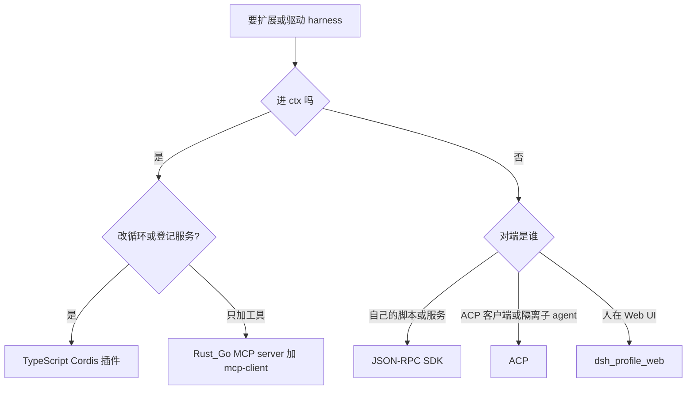
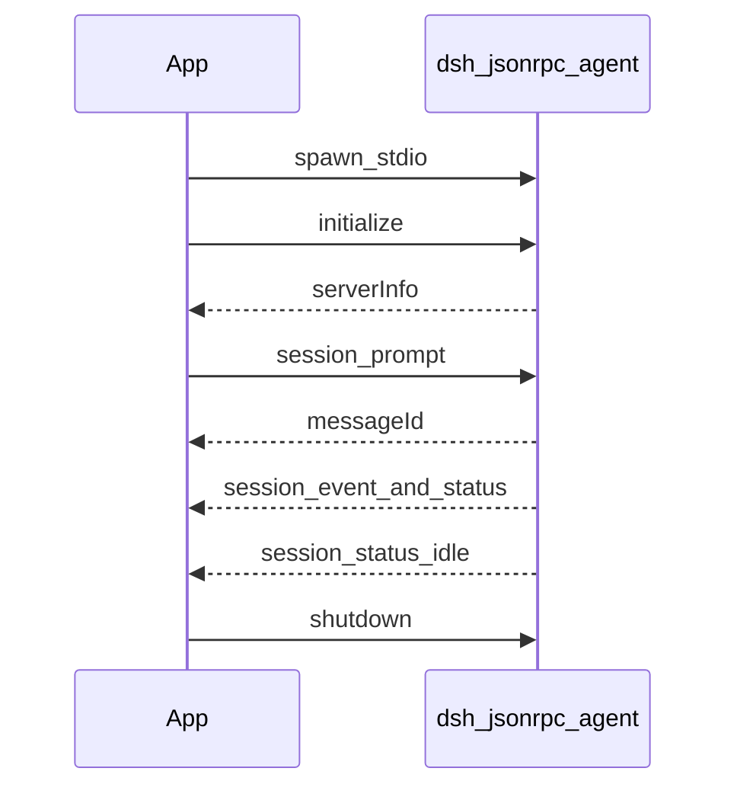

# 扩展路径：插件语言、MCP、JSON-RPC SDK 与 ACP

学习笔记，非正式产品文档。权威合同见 [architecture.md](../architecture.md)、[extension-cookbook.md](../cookbook/extension-cookbook.md)、各包 README，以及 [Python SDK 教程](../user/guide/python-sdk.zh.md)。包内控制流见 [sdk.md](packages/sdk.md)、[acp.md](packages/acp.md)、[mcp.md](packages/mcp.md)。

本页回答四件事：Cordis 插件能不能用 Rust / Go 写；为什么编排层是 TypeScript；从进程外驱动 agent 时 JSON-RPC SDK 怎么走；ACP 是什么、和 SDK 怎么选。



## 先选路

| 处境 | 走哪条 |
|---|---|
| 对端已经会讲 ACP（Zed、其它 ACP agent），或要把子任务丢到另一台独立进程 | [ACP](#acp) |
| 自己写宿主（CI、Python / TypeScript 脚本、以后的 Go 服务），要续聊或完整事件 | [JSON-RPC SDK](#json-rpc-sdk) |
| 给模型加能力，实现可用任意语言 | [MCP](#用其他语言贡献工具) 或薄 TypeScript 插件再 spawn 二进制 |
| 改审批、超时、提示词、UI、Cordis 服务 | [TypeScript 插件](#cordis-插件只能是-typescript) |
| 人在浏览器里聊 | `dsh --profile web`，不是协议客户端 |
| 一次性命令行任务、不需要协议客户端 | `dsh --profile headless` |
| 给 Zed / Buzz 当 ACP agent | `dsh --profile acp` |

默认：自己驱动选 SDK；对接生态或隔离子 agent 选 ACP；进 `ctx` 选 TypeScript 插件。

## Cordis 插件只能是 TypeScript

Harness 的插件是进程内 ESM 模块：Loader 加载后调用 `apply(ctx)`，通过 `ctx` 登记服务、事件和工具。教程见 [第一个插件](../user/develop/basic/index.zh.md)。

仓库没有 WASM 插件宿主，也没有 Rust / Go 插件 ABI。`native/` 里的 Landlock 是给 TypeScript 插件调用的 Node addon，本身不是插件运行时。

这些必须走 TypeScript，因为它们依赖同进程的 `ctx`、声明合并的事件，以及 waterfall 的 `next()`：

- 登记 Cordis 服务（`ctx.xxx`）
- 监听或改写 `agent/*`、`tools/*`、`session/event`
- 系统提示词 section、preset、Conversation Node
- 完整的审批 / 超时 / 策略瀑布
- 热重载时的 effect 清理

hooks 桥写明：原生 Cordis 插件能做的事更多、有类型、没有序列化边界；桥只是兼容路径。见 [dsh-hooks-claude-code](../../packages/hooks/hooks-claude-code/README.md)。

## 为什么编排层是 TypeScript

仓库没有单独的「语言选型」Agent Note。实际路径是产品建立在已有的 TypeScript 框架 [Cordis](../cordis-primer.md) 上，并把框架源码 vendored 进仓库，因为 fiber 生命周期、effect 卸载、waterfall 派发直接关系到 loop 的正确性。见 [vendor Cordis](../../.agents/notes/implemented/process/2026-06-11-vendor-cordis-as-source.md) 与 [微内核事件分类](../../.agents/notes/implemented/architecture/2026-06-11-microkernel-event-taxonomy.md)。

Harness 是编排层：等模型流式输出、等工具、等用户、在插件之间派发类型化事件。一次 turn 的墙钟时间几乎都花在 LLM HTTP 和子进程上。把 agent loop 改成 Rust / Go，模型不会更快，工具也不会更快。

TypeScript 在这里买到的是同进程插件 ABI，而不是更快的运行时：

- 插件直接拿 live 对象：`ctx.tools`、`agent.followup()`、waterfall 的 `next()`。同进程类型化边界上信任 TypeScript，不额外做运行时校验。
- Host（Node）和浏览器 Client 共享一份类型：Conversation Node、Typert、session 投影。Rust / Go 当 Host 语言，浏览器插件仍然得是 JS / TS。
- 插件可以是几十行 `defineTool`；`dsh web --dev` 下改源码即热加载。仓库还有 agent 检查并挂载自己插件的路径。

性能敏感的部分本来就不是 TypeScript：Linux 沙箱走 `native/` 的 Landlock C addon；Windows 文件夹对话框用 koffi，并放到子进程以免堵 event loop；真正的工具实现可以是子进程或 MCP server。Service Provider 可以独立换实现来提升性能和安全性，Consumer 和 Definition 不用动。见 [三角色能力](../user/develop/practice/index.zh.md)。

用 Rust / Go 重写内核，主要成本是自己实现一套 Cordis（fiber、inject、HMR、四种事件派发、可逆注册），插件作者失去热加载，Host / Client 类型无法共享，每个扩展点都要跨语言编解码。省下的 CPU 不在关键路径上。

## 用其他语言贡献工具

| 目标 | 做法 | 适合 |
|---|---|---|
| 给模型加工具 | Rust / Go 写 MCP server，挂 [`@deepseek-ai/dsh-mcp-client`](../../packages/mcp/mcp-client/README.md) | 最省事，官方支持 |
| 要自定义工具名、卡片、策略 | 薄 TypeScript 插件，`execute()` 里 spawn 二进制 | 比 MCP 更可控 |
| 拦截工具 / 回合 | Claude Code / Codex 的 `type: command` hook，命令可以是任意可执行文件 | 兼容已有 hook，能力比原生插件弱 |
| 从外面驱动整个 agent | [JSON-RPC SDK](#json-rpc-sdk) 或 [ACP](#acp) | 这是调用 harness，不是当插件 |
| 同进程高性能计算 | Rust 编成 napi-rs addon，仍由 TypeScript 插件加载并登记到 `ctx` | 热路径，不是通用插件模型 |

MCP 是目前最贴近「用其他语言写插件」的官方路径。一个 `cordis.yml` 实例对应一台 MCP server，stdio 或 HTTP 都行。模型看到的工具名是 `mcp__<serverName>__<原始名>`。走读见 [mcp.md](packages/mcp.md)。

```yaml
- id: mcp-my-rust-tools
  name: '@deepseek-ai/dsh-mcp-client'
  config:
    serverName: rusttools
    transport: stdio
    command: /path/to/my-rust-mcp-server
    args: []
```

MCP 只贡献工具（以及 MCP 协议本身能表达的东西）。它不能登记 Cordis 服务，也不能当 waterfall 监听器。

## JSON-RPC SDK

你的程序当父进程，Harness 当子进程。你不写插件、不进 Cordis，只通过 stdin / stdout 上的换行 JSON-RPC 投喂任务、收事件。协议是本仓库自有的，官方客户端是 [Python SDK](../../python/sdk/README.md) 与 [`@deepseek-ai/dsh-sdk-client`](../../packages/sdk/client/README.md)。线类型见 [`dsh-sdk-protocol`](../../packages/sdk/protocol/README.md)；服务端是 [`dsh-sdk-jsonrpc-server`](../../packages/sdk/server/README.md)。走读见 [sdk.md](packages/sdk.md)。



运行时里真正干活的是 jsonrpc 插件：`inject: ['agents']`，按 `sessionId` 取或创建 agent，把 `session/prompt` 转成 `agent.followup()`。工具、模型、持久化、压缩都来自旁边的 `cordis.yml`。stdout 只能走协议帧，诊断走 stderr。

Python 装 `deepseek-harness-sdk` 时会带上同版本的 `deepseek-harness-runtime-bin`，目标机不用装 Node。TypeScript 客户端要调用方给出启动命令。

### 线上只有 3 个请求和 4 个通知

传输是 JSON-RPC 2.0，一行一个紧凑 JSON，`\n` 结尾。有 `id` 又有 `method` 是请求；只有 `id` 是响应；只有 `method` 是通知；解不开的行忽略。

| 方向 | 方法 | 含义 |
|---|---|---|
| 客户端 → | `initialize` | `cwd`、`provider`、`model`、可选 `maxTokens`；回 `serverInfo.name = deepseek-harness-sdk-runtime` |
| 客户端 → | `session/prompt` | `sessionId` + `contentBlocks`；立刻回 `{ messageId }` |
| 客户端 → | `shutdown` | 回 `{}`，然后 dispose 并 `exit(0)` |
| 运行时 → | `session.event` | 一条完整会话日志；进程里所有 session 都推，不过滤 |
| 运行时 → | `session.status` | 整个 agent 在 `running` / `idle` 之间切换 |
| 运行时 → | `subagent.started` | 运行时里生出了子 session |
| 运行时 → | `subagent.finished` | 仅进程内子 agent 结束 |

`cwd` 在握手前必须收成绝对路径。未知 `sessionId` 会在第一次 `session/prompt` 时懒创建 agent + session。`serverInfo.name` 是线稳定标识。预发布，没有协议版本协商。

### `prompt` 只表示入队

`messageId` 只标识刚入队的那条用户消息，不标识之后的 assistant 消息或 `turn/end`，更不是「这次任务的结果」。一个 session 上可以继续 steer、inject、再排队。运行时不会把某次 assistant 输出因果绑定到某次 prompt。

| 层 | 做什么 |
|---|---|
| `HarnessClient` | `start` / `initialize` / `prompt` / `subscribe` / `close`。`prompt()` 入队即返回 |
| `DeepSeekHarness` / `Session.run()` | 入队 → 等到这条 `messageId` 出现在耐久的 `agent/inbox/spliced` → 收集到下一次整 agent `idle` |

`run()` 返回的 `finalResponse` 是这段区间里根 session 最后一条已提交的 assistant 文本，不是因果上属于这条 prompt。Python 还有 `finishReason`：区间内最后一次根 `turn/end` 的 `kind`。`events` 只有根 session；`notifications` 含从 `subagent.started` 发现的子孙。

复用同一个 harness + 同一个 `sessionId`，会延续那段对话，以及该 session 拥有的持久 Bash。独立任务换新 id。

### 组合是运行时的事

协议不管有哪些工具。[`examples/jsonrpc-agent`](../../examples/jsonrpc-agent/README.zh.md) 是无人值守组合：不挂终端 UI、控制台 logger、审批、交互工具。完整版带 `bash`、文件系统、进程内 `subagent`、`todo_write`、JSONL、自动压缩。`minimal.cordis.yml` 只有持久 `bash` 和 `str_replace_editor`。自定义组合必须保留 `@deepseek-ai/dsh-sdk-jsonrpc-server` 这一行。

教程用法见 [Python SDK 快速上手](../user/guide/python-sdk.zh.md)。

### 用 Go / Rust 自己当客户端

官方客户端只有 Python 和 TypeScript。线协议是语言无关的：spawn 运行时、按行读写 JSON、有 `id` 的配对到未决请求、只有 `method` 的进通知队列。服务端对所有 session 广播，按 `subagent.started` 在客户端本地收窄。关掉时先协议 `shutdown`，再 stdin EOF → SIGTERM → SIGKILL。凭据由子进程继承 `DEEPSEEK_API_KEY` / `DEEPSEEK_BASE_URL`。

没有 handler 回 `-32601`，handler 抛错回 `-32603`。

当前做不到的：没有中途取消、没有按 session 关闭；没有 per-prompt 结果；没有协议版本协商；服务端不会向你发请求（传输层能承载，留给以后的审批流）。

## ACP

ACP 是行业协议 [Agent Client Protocol](https://agentclientprotocol.com)，不是本仓库自造的 SDK。Harness 在这条路上当 Agent 端：stdin / stdout 上讲 ACP，让 Zed、父 harness、其它 ACP 客户端来驱动它。实现是自动化子集，不是完整编辑器集成。合同见 [`@deepseek-ai/dsh-acp`](../../packages/acp/acp/README.md)。走读见 [acp.md](packages/acp.md)。

和 JSON-RPC SDK 一样走 stdio + 换行 JSON-RPC，但方法名、等待语义、线上能看到的东西都不一样。

| 包 | 身份 | 干什么 |
|---|---|---|
| `@deepseek-ai/dsh-acp` | 服务端 | 把 harness 暴露成一台 ACP agent |
| `@deepseek-ai/dsh-subagent-acp` | 客户端 | 父 agent 每跑一个子任务就 spawn 一台新 ACP 进程 |

`dsh --profile acp` 是产品 ACP 入口。`pnpm run demo:acp` 仍启动示例／快照组合。这是传输适配器，不是能力 seam，也不是 UI。编辑器导航、回放、斜杠命令、推理展示、计划、标题、工具卡片都不走这条线。

### 这台服务器实际讲的方法

`initialize` 只协商版本。图片提示词仅在有附件存储且路由声明 image 时公布。不公布 session 管理、编辑器、终端、文件系统。`authenticate` 是空操作。`session/new` 会挂载客户端给的 stdio `mcpServers`（Buzz CLI），即使不广告 MCP 能力。

| 方法 | 方向 | 行为 |
|---|---|---|
| `initialize` | 客户端 → | 版本 + 很瘦的能力广告 |
| `authenticate` | 客户端 → | no-op |
| `session/new` | 客户端 → | 用绝对 `cwd` 新建 agent；挂载 stdio `mcpServers`；非空 `additionalDirectories` 拒绝 |
| `session/prompt` | 客户端 → | 拼文本块，卡住直到整个 agent idle，回 `stopReason` |
| `session/cancel` | 客户端 → | 只取消这个 agent；未知 id 当没看见 |
| `session/update` | 服务端 → | 每段已提交 assistant 文本一块 `agent_message_chunk` |
| `session/request_permission` | 服务端 → | 一次性 allow / reject；客户端可自动答 |

一个连接可以挂多个 session。每个 session 同时只允许一条 in-flight prompt。只新建：没有 load / list / resume / delete / fork。

`session/prompt` 把文本块原样拼成一条用户消息。基线 `resource_link` 收成 `[resource_link name=… uri=…]`，模型自己用工具去开。空输入、图片、音频、超出基线的块一律拒绝。

`stopReason` 不是「这一轮 turn 的因果结局」。桥等到整 agent 停稳。正常停稳报 `end_turn`；显式 `session/cancel`、拆除、或这条 prompt 根本没被准入报 `cancelled`。token 上限结束也报 `end_turn`。关联轮次上的模型错误会立刻 reject 这条 prompt。

### 线上几乎只有最终文本

上线的是已提交 `assistant/message` 里的非空文本块。不上线的是原始 `assistant/chunk`、reasoning、工具调用、计划、标题、用量、未提交的重试碎片。推理和工具活动仍在 session 日志里，Web / JSON-RPC SDK / 持久化能看见。

沙箱要升权时，服务端发 `session/request_permission`。客户端不答或放弃按拒绝。结果只对这一次重试有效，走普通工具结果，不持久化客户端策略。

连接拆了，这个连接拥有的 session 全拆。没有 per-session close。stdout 只走协议。

### 仓库里的主用法：隔离子 agent

父 harness 不想和子任务共享进程时，挂 [`dsh-subagent-acp`](../../packages/subagent/subagent-acp/README.md)。每次 `start()`：`spawn` → ACP `initialize` → `session/new`，成功才把所有权交给调用方。然后发 prompt，把 `agent_message_chunk` 收成 `SubagentResult.output`。

子进程是全新 runtime：自己的模型、工具、session。父对话不跨进程（`inheritsParentContext: false`），只继承解析后的绝对 `cwd`。这个 provider 不广告 persona、工具过滤、深度上限、结构化输出——远程进程里执行不了这些，要了就拒绝。

拆进程走 `disposeAcpChild`：先关 stdin 等 EOF，再 SIGTERM → SIGKILL。每次 run 一台新进程，没有进程池。

ACP 完整规范比这台服务器广告的能力大得多。Harness 这台实现只做自动化核心；拿 Zed 连上能建 session、发文本、收最终回复、处理权限，但不是完整 IDE 体验。示例组合见 [acp-agent](../../examples/acp-agent/README.zh.md)。

## ACP 和 JSON-RPC SDK 怎么选

| 问题 | ACP | JSON-RPC SDK |
|---|---|---|
| 协议归属 | 外部标准，Zed 等编辑器也讲 | 本仓库自有 |
| 对端是谁 | 已有 ACP 客户端，或父 harness 的 subagent 后端 | 你自己写的宿主 |
| `session/prompt` | 阻塞到 idle，带 `stopReason` | 立刻回 `messageId` |
| 能不能取消这一轮 | 能（`session/cancel`） | 不能（只能杀整个运行时） |
| 能不能恢复 session | 不能 | 能（同 id） |
| 线上能看见什么 | 最终 assistant 文本 + 权限请求 | 全量 session 日志 |
| 权限怎么处理 | 向客户端要一次性决定 | 线协议暂无 |
| 官方客户端 | ACP 生态 + `dsh-subagent-acp` | Python、TypeScript |
| 子 agent 隔离 | 仓库主路径 | 也能 spawn，但不是主路径 |

落地对照：

- 写内部流水线、Python 里跑「修测试」→ SDK（`DeepSeekHarness.run`）
- 父 agent 的 `subagent` 工具要隔离子进程 → ACP（挂 `dsh-subagent-acp`）
- 给 Zed / Buzz 当 agent → ACP（`dsh --profile acp`）
- Go 服务要驱动 agent 且要事件流 / 续 session → 自己实现 SDK 客户端
- Go 服务只是「丢任务、等结束、能取消」且愿意每次新 session → 实现 ACP 客户端，能跟其它 ACP agent 互换

## 权威页

| 主题 | 合同页 |
|---|---|
| 插件与扩展点地图 | [architecture.md](../architecture.md)、[extension-cookbook.md](../cookbook/extension-cookbook.md) |
| 写第一个插件 / 工具 | [第一个插件](../user/develop/basic/index.zh.md)、[开发一个工具](../user/develop/basic/tool.zh.md) |
| MCP | [dsh-mcp-client](../../packages/mcp/mcp-client/README.md) |
| JSON-RPC 线协议 / 客户端 / 服务端 | [protocol](../../packages/sdk/protocol/README.md)、[client](../../packages/sdk/client/README.md)、[server](../../packages/sdk/server/README.md) |
| Python 上手 | [python-sdk.zh.md](../user/guide/python-sdk.zh.md)、[jsonrpc-agent](../../examples/jsonrpc-agent/README.zh.md) |
| ACP 服务端 / 子 agent 客户端 | [dsh-acp](../../packages/acp/acp/README.md)、[dsh-subagent-acp](../../packages/subagent/subagent-acp/README.md)、[acp-agent](../../examples/acp-agent/README.zh.md) |
