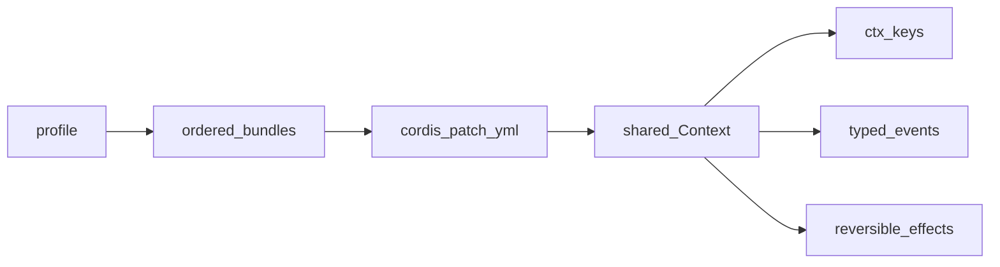
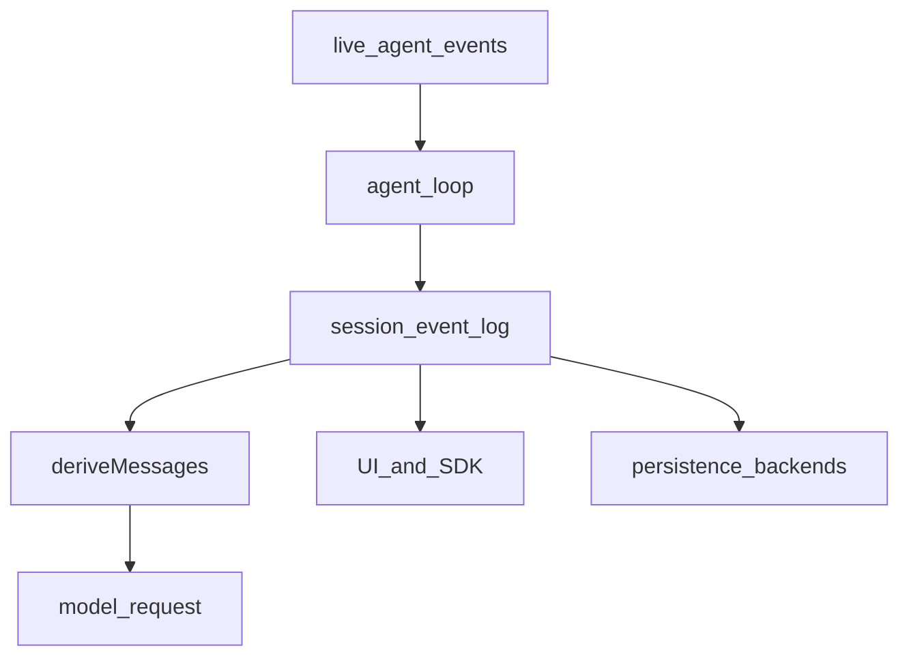
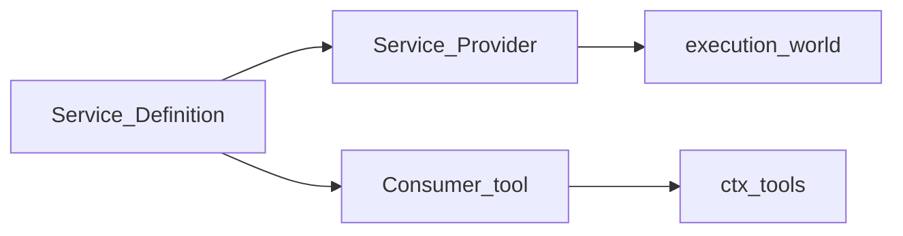

# 读包之前：Cordis、日志与 seam

学习笔记，非正式产品文档。概念合同见 [cordis-primer.md](../../cordis-primer.md) 与 [architecture.md](../../architecture.md)。

## 一切都是插件

运行中的 `dsh` 没有不可替换的内核。Loader 按 profile 叠 bundle，再叠 `cordis.patch.yml`，把插件挂进一棵共享 `Context`。插件贡献三类东西：`ctx.<key>` 上的 Service、带 `@mode` 的类型化事件、以及通过 `ctx.effect()` / `ctx.on()` 登记、卸载时自动撤回的注册。

函数插件导出 `name` / `inject` / `Config` / `apply`，且没有 default export。Service 子类 default-export 自己。两种形式混在同一模块时，Loader 会丢掉函数插件的命名空间；见 [postmortem 0001](../../postmortem/0001-acp-default-export-drops-inject.md)。

## 四种事件派发

| 模式 | 谁必须做什么 | 典型用途 |
|---|---|---|
| `emit` | 只观察 | `session/event`、`agent/status` |
| `waterfall` | 监听器必须调用 `next()` 才能交给下游；不调用即短路 | `agent/pre-step`、`llm/stream`、`tools/execute` |
| `parallel` | 全部并行等待 | 扇出通知 |
| `serial` | 按注册序等待，无 `next()` | `agent/turn-stopping` |

waterfall 是 around-middleware：参数末尾是 `next`。改共享对象后委托，或直接返回替换结果。政策监听器可以短路；只做标注的监听器必须 `next()`。

## 模型可见等于已入日志

`Session` 是只追加的事件日志加内存索引。`deriveMessages()` 从日志投影模型历史。任何进入模型请求的内容都必须能从日志重建；新的模型可见输入必须新增 `SessionEventMap` 成员。运行时不变式会检查这条关系。

分清两套事件：`session/*`、`user/message`、`assistant/*`、`tool/*` 是耐久事实；`agent/*`、`tools/*`、`llm/*` 是飞行中的扩展点。细节见 [session.md](../../subsystems/session.md) 与 [core.md](../../subsystems/core.md)。

## 能力 seam 的三角

一个可替换能力由三个角色组成，缺一不可：

- **Service Definition**：声明 `ctx` 键与方法，通常是 Cordis `Service` 子类。
- **Service Provider**：实现该接口（本地磁盘、E2B、SQLite……）。
- **Consumer**：使用该接口，常见是面向模型的工具。

扩展插件只依赖 Definition，不依赖具体 Provider。把 `ctx.fs` 和 `ctx.subprocess` 指到同一远程沙箱，Bash、PTY、LSP 会一起走过去。官方图见 [capability-seams.md](../../capability-seams.md)。

## 作用域与 initiator

`dsh-scope` 提供按 agent 收窄的注册。工具、提示词段落、命令可以挂在 `agent.ctx` 上，只对那个 agent 可见。跨 fiber 的编排入口用 `ctx.agents.withInitiator()` 恢复当前 Agent，再从 `agent.session` 往下走；不要为了少传一个参数就把叶子 helper 从 `Session` 放宽到 `Context`。

## 配置与密钥

部署会变的旋钮是插件 `Config` 字段，从 `cordis.yml` 写入；`DEFAULT_*` 常量不是可配置性。`!!js`（不是 `!js`）只出现在插件 `config` 和 entry `disabled`。密钥走 `ctx.credentials`，值为引用而不是明文。

## 下一步

从 [core.md](core.md) 读会话、提示词、工具管道和默认 agent loop，再读 [llm.md](llm.md) 看请求如何变成 token 流。
