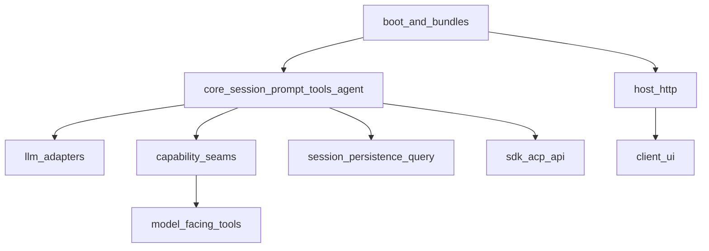
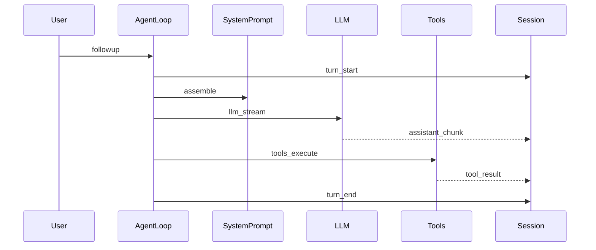

# packages 全量学习走读

学习笔记，非正式产品文档。权威合同见各包 README 与 [docs/subsystems/](../../subsystems/README.md)。本树排除双语配对，理由见 [unpaired study docs Agent Note](../../../.agents/notes/implemented/process/2026-08-14-unpaired-study-docs.md)。

DeepSeek Harness 把产品拆成 Cordis 插件：会话日志、提示词、工具管道、LLM 适配器、文件系统、沙箱、Web UI 都是可卸载的注册。读包之前先看 [00-concepts.md](00-concepts.md)；改 `packages/` 之前仍以 [architecture.md](../../architecture.md) 为准。插件语言、MCP、JSON-RPC SDK 与 ACP 的选型见 [extension-paths.md](../extension-paths.md)。

## 总架构

一次用户输入会打开一个 turn，turn 里零个或多个 step；每个 step 组装 system prompt、走 `llm/stream`，再经 `tools/execute` 跑工具。完整时序见已生成的 [agent-lifecycle.md](../../agent-lifecycle.md)。

## 阅读路线

按依赖读，不要按字母序。每组一页，页内按包展开。

1. 概念与主干：[00-concepts.md](00-concepts.md) → [core.md](core.md) → [llm.md](llm.md)
2. 执行世界：[subprocess.md](subprocess.md) → [sandbox.md](sandbox.md) → [shell.md](shell.md) → [terminal.md](terminal.md) → [fs.md](fs.md) → [lsp.md](lsp.md) → [code-runtime.md](code-runtime.md) → [e2b.md](e2b.md)
3. 模型外围：[context.md](context.md) → [skill.md](skill.md) → [web.md](web.md) → [compaction.md](compaction.md) → [guard.md](guard.md) → [todo.md](todo.md) → [plan.md](plan.md) → [preset.md](preset.md) → [goal.md](goal.md) → [schedule.md](schedule.md) → [feedback.md](feedback.md)
4. 数据平面：[session.md](session.md) → [session-query.md](session-query.md) → [attachment.md](attachment.md) → [spill.md](spill.md) → [settings.md](settings.md) → [credentials.md](credentials.md) → [storage.md](storage.md) → [workspace.md](workspace.md) → [identity.md](identity.md)
5. 协作与编排：[interaction.md](interaction.md) → [jobs.md](jobs.md) → [workflow.md](workflow.md) → [subagent.md](subagent.md) → [hooks.md](hooks.md) → [extensions.md](extensions.md)
6. 装配与对外：[bundle.md](bundle.md) → [boot.md](boot.md) → [host.md](host.md) → [client.md](client.md) → [sdk.md](sdk.md) → [acp.md](acp.md) → [api.md](api.md) → [typert.md](typert.md) → [mcp.md](mcp.md)
7. 支持：[util.md](util.md) → [examples.md](examples.md) → [test-support.md](test-support.md) → [runtime-diagnostics.md](runtime-diagnostics.md)

组清单以各目录下的 `package.json` 为准，含组 README 未列出的包。依赖全图见生成页 [module-graph.md](../../module-graph.md)；能力三角见 [capability-seams.md](../../capability-seams.md)。

## 每包小节怎么读

每个包固定写：角色（Service Definition / Provider / Consumer / library / bundle）、`ctx` 键、入口文件、主流程 mermaid、4–8 步控制流、2–5 个核心符号。类型细节链到对应 [subsystems](../../subsystems/README.md) 页，不在这里复述合同原文。
