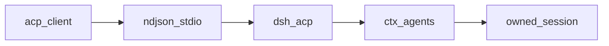
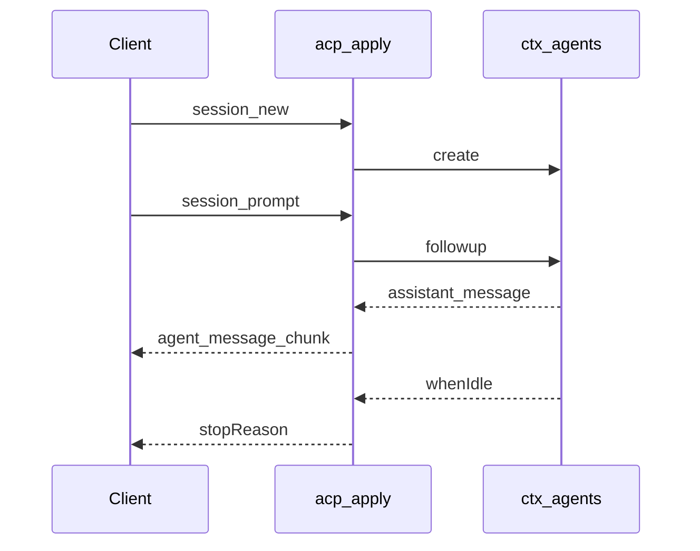

# acp/ — Agent Client Protocol 自动化桥

学习笔记，非正式产品文档。组映射见 [packages/acp/README.md](../../../packages/acp/README.md)。这是互操作传输，不是 UI；对端的进程外 subagent 客户端在 [subagent-acp](../../../packages/subagent/subagent-acp/README.md)。

桥只带提示词文本、已提交 assistant 文本、取消、一次性权限决定。展示与人机交互留在 harness UI。

## `@deepseek-ai/dsh-acp` — 自动化 ACP 服务端

- 角色：Consumer
- ctx：无自有键；`inject: ['agents']`
- 入口：[packages/acp/acp/src/index.ts](../../../packages/acp/acp/src/index.ts)、[codec.ts](../../../packages/acp/acp/src/codec.ts)
- 关键类型：`AcpConfig`、`SessionRecord`
- 监听：`session/event`、`agent/inbox/claimed`、`agent/error`、`approval/request`（waterfall）

实现逻辑：

1. `apply` 捕获 `ctx.agents`，用 `@agentclientprotocol/sdk` 的 `AgentSideConnection` + `ndJsonStream(stdout, stdin)`（测试可注入 `config.stream`）。
2. `initialize` 回本服务器唯一 `PROTOCOL_VERSION`；`promptCapabilities` 全关（无 image/audio/embeddedContext）；`authMethods` 空，`authenticate` 空实现。
3. `newSession` 要求绝对 `cwd`；拒绝 `additionalDirectories` 与 `mcpServers`。`agents.create` 后记入 `sessions` Map。
4. `prompt` 每 session 同时只允许一条 in-flight；只接受 text / `resource_link`。先占槽再 `followup`，避免同步 turn 错过关联。
5. `session/event` 只转发已提交 assistant 文本（及 image 的占位说明）；chunk/reasoning/tools 不上线。`turn/end` 的 error 立刻 reject；其它 ending 等到 `whenIdle`。
6. `approval/request` 对桥拥有的 agent 问客户端一次性 allow/reject；未知客户端响应不推断耐久授权。
7. `cancel` 调 `agent.cancel({ kind: 'user' })` 并 settle `cancelled`。
8. 拆除：先 cancel 自有工作，再结构读取 `ctx.subagents.drainContinuableDescendants`，最后 dispose 顶层 agent。

源码走读：`codec.ts` 把 `resource_link` 收成括号引用文本；`turnEndToStopReason` 里 hook abort 报 `end_turn`，`cancelled` 留给显式 `session/cancel`。无 preset 时模型行在 host 平面。
