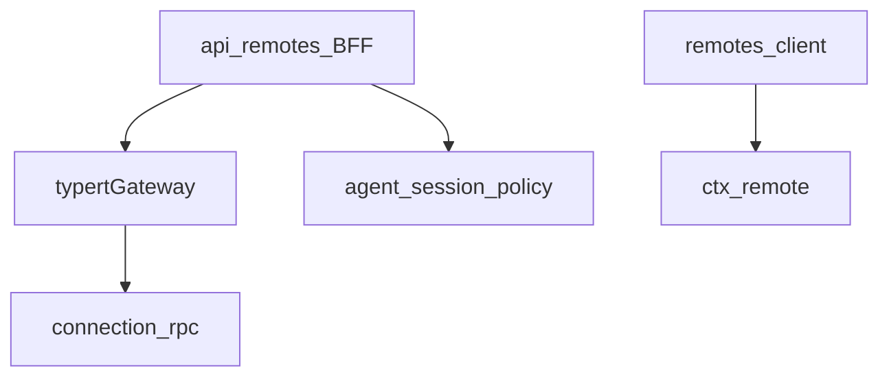
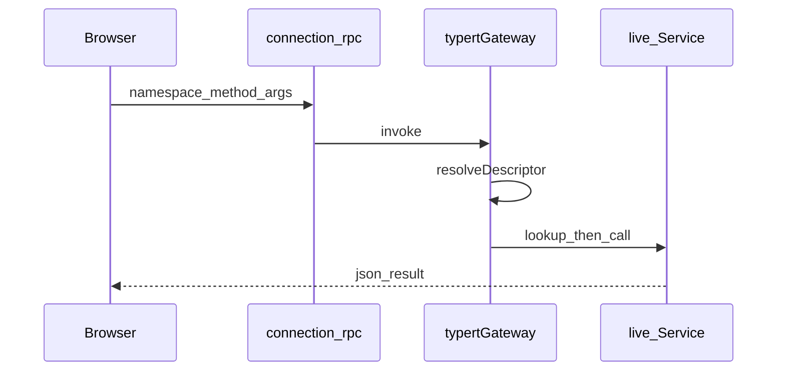
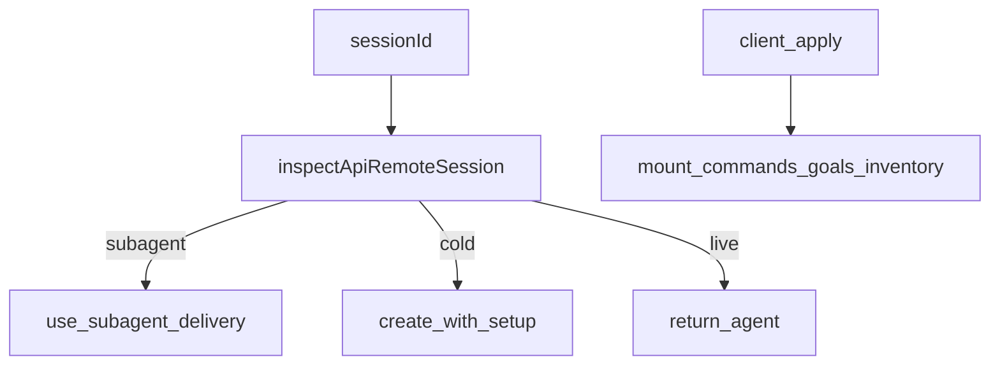

# api/ — Remote BFF 与网关

学习笔记，非正式产品文档。类型合同见 [typert.md](../../subsystems/typert.md)。组映射见 [packages/api/README.md](../../../packages/api/README.md)。运行时依赖方向：`remotes → gateway → connection → webserver`。

## `@deepseek-ai/dsh-api-gateway` — Host 分发与 Client Remote 座

- 角色：Service（Host `ctx.typertGateway`；Client `ctx.remote`）
- ctx：Host `inject: ['typert']`，再 inject `connection` 拦截 `/api`；Client `inject: ['typert', 'connection']`
- 入口：[packages/api/gateway/src/index.ts](../../../packages/api/gateway/src/index.ts)、[client/index.ts](../../../packages/api/gateway/src/client/index.ts)
- 关键类型：`InvokeRemoteRequest`、`TypertGatewayError`、`TypertClientRemote`

实现逻辑：

1. Host `invoke` 先找严格生成描述符；描述符曾登记又撤回则禁止 SRC 回退。
2. 无严格描述符时扫活 Service 的 `typertRemote` + `@Remote` 标记，拼 SRC 描述符；零命中 `invocation-unavailable`，多命中 `ambiguous-endpoint`。
3. `args` 必须正好是描述符的 wire 字段；lookup id 不可省略；JSON 字段在 SRC 下可缺。
4. lookup / Context 经 `ctx.typert.lookups` / `contexts` 解析；`TypertLookupFailure` 原样过承运适配器。
5. 取消是承运 `AbortSignal`，不进 `args`；业务已 abort 则收成 `cancelled`。
6. 结果与入参都过 JSON-safe 检查（有限数字、无环、无 symbol、无稀疏数组）。
7. Client `ClientRemoteService` 提供 `ctx.remote`：`$mount` 装生成贡献，`$on` / `$dispatch` 转发 Host 事件，方法走同一 RPC 承运。

源码走读：传输、相关、信封归 Connection。Gateway 不认业务身份；身份政策在 remotes。

## `@deepseek-ai/dsh-api-remotes` — BFF 政策与 Client 装配

- 角色：Host 政策库 + Client 装配插件
- ctx：Host 无服务（`apply` 空）；Client `inject: ['remote']`，往 `ctx.remote` `$mount` 选中的命名空间
- 入口：[packages/api/remotes/src/index.ts](../../../packages/api/remotes/src/index.ts)、[agent-lookup.ts](../../../packages/api/remotes/src/agent-lookup.ts)、[client/index.ts](../../../packages/api/remotes/src/client/index.ts)
- 关键类型：`ApiRemoteAgentResult`、`ApiRemoteLookupError`、`API_REMOTE_FORWARDED_EVENTS`

实现逻辑：

1. Host `apply` 为空；本包配置 `ctx.typert` 查找并被 Gateway / 遗留 apiproxy 调用。
2. `createApiRemoteAgentResolver`：活 agent 直接返回；冷身份按 header+日志 `setup` 再 `agents.create`（preset 必须复原当时工具集）。
3. 子 agent 会话身份留给 subagent 投递；通用 Remote / 遗留 API 拒绝。
4. 查找失败变成 `TypertLookupFailure`（`agent-busy` / `session-not-found` / `internal`），Gateway 不拆成基础设施错。
5. `API_REMOTE_FORWARDED_EVENTS` 编译期卡住：必须是已声明事件、不绑 Scope、单向（非 waterfall）。
6. Client `apply` 按序 `$mount` commands、goals、dynamic cordis、pluginInventory、messageFeedback；失败按反序卸。
7. Client 再导出 Connection 的线类型，让业务包只依赖本装配，不直接 import Host 包。

源码走读：Cordis inject 与 `dsh.client` 元数据保持 `remotes → gateway → connection`，装配不 import 具体 Gateway 实现。
