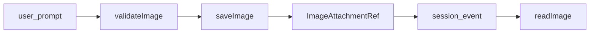
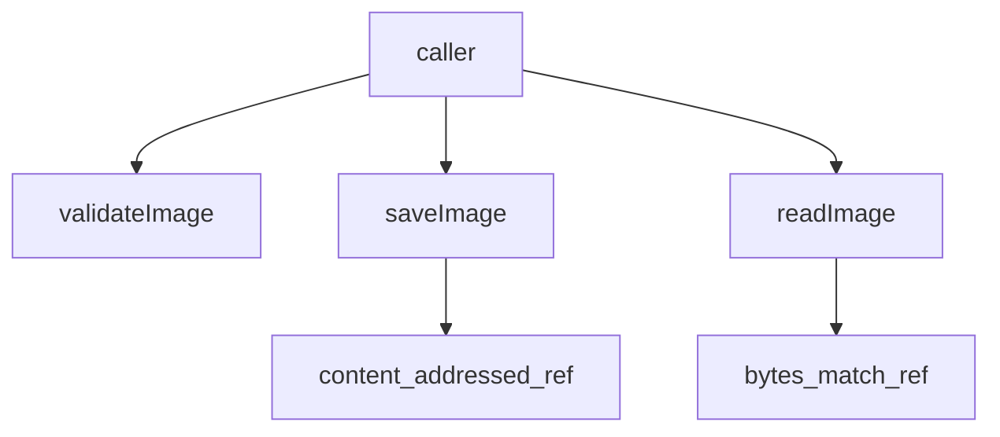

# attachment/ — 耐久附件

学习笔记，非正式产品文档。类型合同见 [attachment.md](../../subsystems/attachment.md)。组映射见 [packages/attachment/README.md](../../../packages/attachment/README.md)。

未发送的浏览器草稿不在本能力内；字节只在用户提交提示词或适配器提交结构化模型输出时进入耐久存储。

## `@deepseek-ai/dsh-attachment` — 附件存储 seam

- 角色：Service Definition
- ctx：`ctx.attachments`
- 入口：[packages/attachment/attachment/src/index.ts](../../../packages/attachment/attachment/src/index.ts)、[types.ts](../../../packages/attachment/attachment/src/types.ts)
- 关键类型：`AttachmentStore`、`AttachmentId`、`ImageAttachmentRef`、`ImageAttachmentLimits`、`AttachmentError`

实现逻辑：

1. 抽象服务占住 `ctx.attachments`；实现必须在发布引用前校验字节。
2. `imageLimits` 是部署解析后的图像政策，权威校验和快路径都读它。
3. `validateImage` 完整解码光栅但不持久化；批量调用方先校验每个成员再保存任何一个。
4. `saveImage` 在所属 session 事件追加前耐久提交，返回内容寻址引用。
5. `readImage` 读回字节并核对仍匹配记录的引用；abort 抛 signal reason。
6. `AttachmentId` 是 branded 内容哈希；`AttachmentError` 带稳定 code。

源码走读：seam 只谈图像。引用进 session 日志；存储后端拥有字节，日志只拥有身份。

## `@deepseek-ai/dsh-attachment-local` — `DSH_HOME` 下的内容寻址存储

- 角色：Service Provider
- ctx：占住 `ctx.attachments`
- 入口：[packages/attachment/attachment-local/src/index.ts](../../../packages/attachment/attachment-local/src/index.ts)、[store.ts](../../../packages/attachment/attachment-local/src/store.ts)、[image.ts](../../../packages/attachment/attachment-local/src/image.ts)
- Config：`dshHome`、`maxImageBytes`（默认 5MiB）、`maxImagesPerMessage`、`maxMessageImageBytes`、`maxImagePixels`

实现逻辑：

1. root 是 `<DSH_HOME>/attachments/v1`；limits 冻结，媒体类型固定为 png/jpeg/webp/gif。
2. `validateImageFile` 先查编码字节上限，再探测类型与像素。
3. 声明的 media type 必须匹配探测结果，否则 `IMAGE_TYPE_MISMATCH`。
4. 对象路径是 `objects/<前两位>/<sha256>`；id 是 `sha256:<hex>`。
5. 显示名剥掉任意风格的路径分隔符，避免 Windows 本地路径漏进日志。
6. 发布后 fsync 目录（POSIX），再报告耐久引用。
7. `readImage` 按 id 打开文件，再哈希核对。

源码走读：相同字节收敛到同一对象。Provider 不解释 session 事件；调用方在 `append` 之前 `saveImage`。
