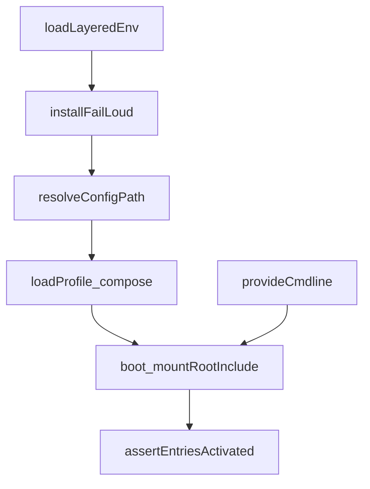
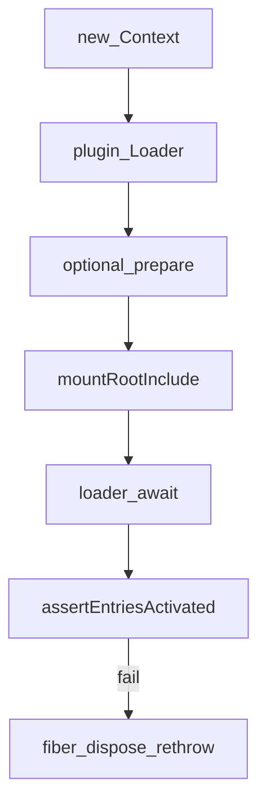
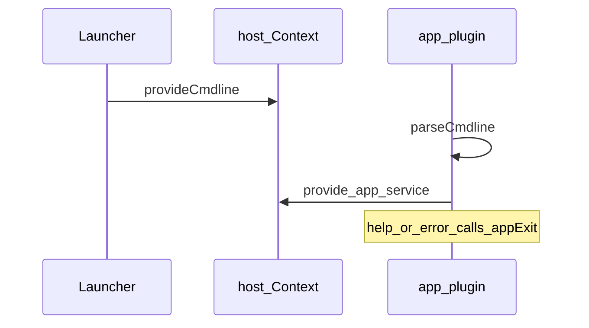

# boot/ — 应用 bin 启动胶水

学习笔记，非正式产品文档。组映射见 [packages/boot/README.md](../../../packages/boot/README.md)。profile 叠层后的 Web 宿主见 [web-server.md](../../subsystems/web-server.md)。

`apps/cli` 与 examples bin 共用这套库：加载 `.env`、fail-loud、解析 snapshot 感知的 `cordis.yml`、叠 `$DSH_HOME` 用户补丁，再把 Loader 跑到整树 settle。命令行本身不归 launcher 认全套 flag，而交给树内 app 插件。

## `@deepseek-ai/dsh-app-boot` — settle 整树的 boot 序列

- 角色：library（bin 调用，不是 Loader 行）
- ctx：`boot()` 新建根 `Context`，`provide('dshHomePath')`，再挂 Loader
- 入口：[packages/boot/app-boot/src/index.ts](../../../packages/boot/app-boot/src/index.ts)、[profile.ts](../../../packages/boot/app-boot/src/profile.ts)
- 关键类型：`Profile`、`ProfileLayer`、`ConfigDumpLayer`、`UserPatchWatchOptions`

实现逻辑：

1. `loadLayeredEnv`：继承环境 > 调用目录 `.env` > Harness home `.env`；两文件先解析再落地，不覆盖已有名。`PATH` / `DSH_*` / 代理等 bootstrap 名只能来自启动环境，写进 `.env` 即抛。
2. `resolveConfigPath`：`$DSH_SNAPSHOT=replay` 时把 `cordis.yml` 换成同目录 `cordis.snapshot.yml`。
3. `boot` 装 Loader，可选 `prepare`（launcher 在此 `provideCmdline`），再 `mountRootInclude` 把绝对配置当 `cordis:include` 挂上，patches 一次 flattened 应用。
4. 相对名相对配置目录；裸包名可走 `bareModuleBaseUrl`（打包运行时由宿主拥有插件集）。
5. settle 后 `assertEntriesActivated`：无 fiber 且未 disabled 算加载失败；FAILED 追原栈；PENDING 点名缺的 service。
6. `installFailLoud` 把未处理的插件 init rejection 收成一行 stderr + `exit(1)`；可等终端 `release` 最多 2s，避免 raw mode 残留。
7. `watchUserPatches` 经 Cordis HMR 盯 profile 的 `cordis.patch.yml`，事务性 `entry.update` 整表 patches。
8. `renderConfigDump` 用与 boot 同一套 `applyEntryPatches` 打出带 `# ==` 来源注释的 YAML。

源码走读：profile 在 `$DSH_HOME/profiles/<name>`，`dsh.profile.bundles` 顺序叠 bundle 补丁，再叠用户补丁，再叠 `--patch`。模板：`web` = base + web-app，`headless` = base + headless。`$DSH_HOME/profiles/node_modules` 扁平回退让 inbox 包从任意 profile 可解析。

## `@deepseek-ai/dsh-cmdline` — launcher 交给 app 的 argv

- 角色：library
- ctx：`ctx.cmdlineArgs`、`ctx.appExit`（launcher 在树挂上之前 provide）
- 入口：[packages/boot/cmdline/src/index.ts](../../../packages/boot/cmdline/src/index.ts)
- 关键类型：`CmdlineArgs`、`AppExit`、`CmdlineHost`

实现逻辑：

1. launcher 只认自己的 `--profile` / `--patch` / dump；其后 argv 原样冻结进 `cmdlineArgs.get()`。
2. `provideCmdline` 同时提供 `appExit`，绑定 launcher 的 shutdown。
3. app 插件 `inject: ['cmdlineArgs']`，用自己的 commander program 调 `parseCmdline`。
4. 成功解析跑 program 的 action；action 里 `provide` 自己的服务（如 `webStartup`），下游行用 `!!js ctx.webStartup.port`。
5. help / version / 语法错 / `program.error` 都经 `exitOverride` 变成 CommanderError，helper 调 `appExit`，不直接 `process.exit`。
6. 用结构探测 CommanderError（`code` 以 `commander.` 开头），避免树外 commander 副本的 `instanceof` 失败把已打印的 help 当成 fatal load。
7. 每个子命令都配置 output/exit，避免只改 root 时子命令绕过 `appExit`。

源码走读：没有 action 的 program 会解析成功却不 provide，下游永远 PENDING；helper 因此要求树上至少有一个 action。
