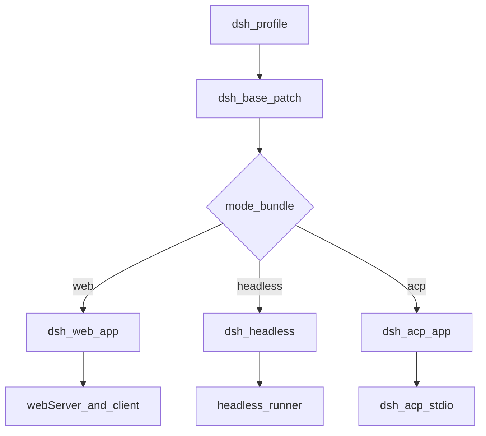
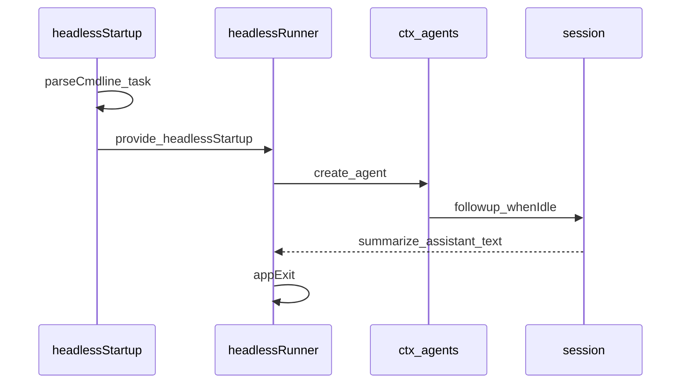
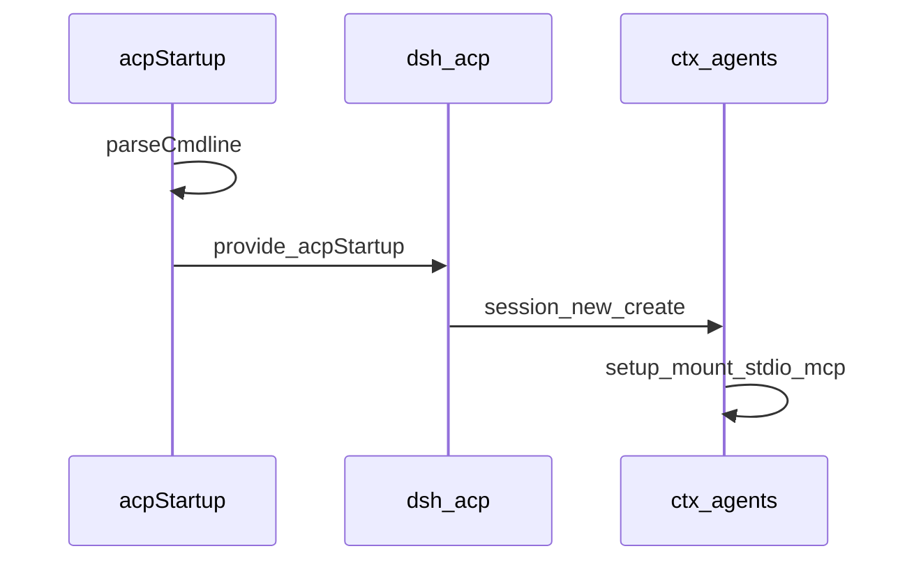
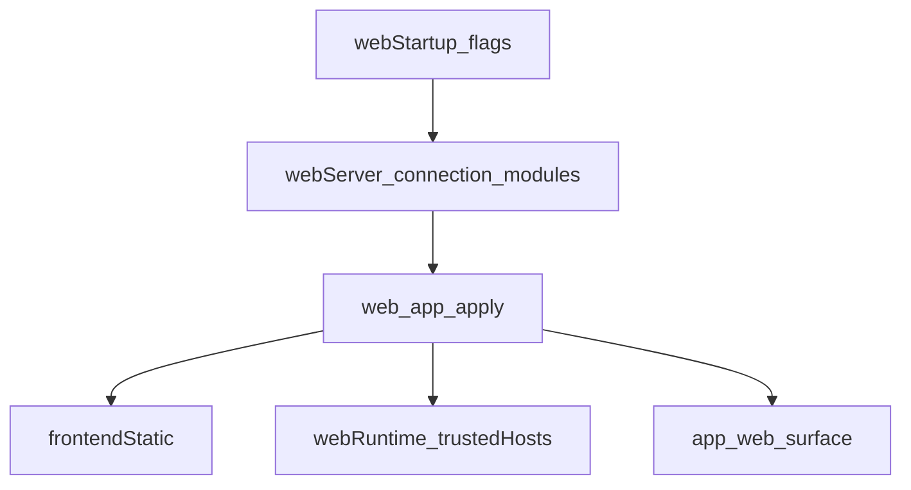

# bundle/ — profile 补丁层

学习笔记，非正式产品文档。装配合同见 [packages/bundle/README.md](../../../packages/bundle/README.md)；Web 宿主见 [web-server.md](../../subsystems/web-server.md)。

bundle 是可安装的 `cordis.patch.yml` 层：`package.json` 声明 `"dsh": { "bundle": { "patch": "./cordis.patch.yml" } }`，由 `dsh --profile` 按序叠在空入口表上。实质是补丁列表；有的包再带运行时胶水插件。

inbox bundle 从 dsh 安装解析；树外 bundle 用 `dsh plugin --profile <name> add <package>` 装进 profile。补丁按 id 整行替换 `config`，不合并字段。

## `@deepseek-ai/dsh-base` — 每个 profile 先叠的共享核

- 角色：bundle（纯补丁，无运行时 API）
- ctx：无键
- 入口：[packages/bundle/base/src/index.ts](../../../packages/bundle/base/src/index.ts)、[cordis.patch.yml](../../../packages/bundle/base/cordis.patch.yml)
- 关键类型：无；模块只 `export {}`

实现逻辑：

1. `src/index.ts` 不导出运行时；Loader 认的是 manifest 的 `dsh.bundle.patch`。
2. 补丁对空根做一次 `insert`，挂上 timer、HMR、llm、session、typert 注册表/loader/gateway、agent、jobs、settings、tools 等共享行。
3. 按模式会变的整行 `config` 不写在这里，留给 mode bundle 整行重述，避免一层补丁只改半个对象。
4. 行序不决定加载；激活仍由 service inject 驱动。
5. 后续 web-app / headless / acp-app / 用户 `cordis.patch.yml` 按 id 覆盖或再 insert。

源码走读：这是 profile 的地板，不是可执行入口。改共享默认值改这份 yml，不要在 mode bundle 里偷偷再插一套核。

## `@deepseek-ai/dsh-headless` — 一次性任务驱动

- 角色：bundle + Consumer（`headless-startup` 解析 argv，`headless-runner` 跑一轮）
- ctx：无自有键；`inject: ['cmdlineArgs']` / `['agentDefaultModel', 'agents', 'sessions']`；读 `ctx.headlessStartup`、`ctx.appExit`
- 入口：[packages/bundle/headless/src/index.ts](../../../packages/bundle/headless/src/index.ts)、[startup.ts](../../../packages/bundle/headless/src/startup.ts)、[cordis.patch.yml](../../../packages/bundle/headless/cordis.patch.yml)
- 关键类型：`HeadlessStartupValues`、`Config.task`

实现逻辑：

1. 补丁叠在 base 上：关 HMR、设 persona、insert `code-runtime`、`headless-startup`、`headless-runner`。不挂 Host / HTTP / 浏览器行。
2. `headless-startup` 用 commander 解析位置参数 `[task...]`；空任务是 usage error，`--help` 不 provide 服务。
3. runner 的 `task: !!js ctx.headlessStartup.task` 等服务出现后才求值。
4. `apply` 必须先有 `ctx.appExit`；缺了直接抛，避免树挂上却无法退出。
5. `run` 先 `loader.await()`，再 `agents.create`，装默认模型选择，`followup` 一条用户消息，等到 idle，`sessions.flush`。
6. `summarize` 从本轮 `turn/start` 之后取最后一条 assistant 文本和 `turn/end.reason`。
7. stdout 打文本；`reason.kind === 'error'` 再写 stderr；exit 0 仅当 `completed`。

源码走读：这是直接驱动 Agent，不是 HTTP 客户端。无 preset roster 时模型行在 host 平面，agent 读全局层。

## `@deepseek-ai/dsh-acp-app` — stdio ACP

- 角色：bundle + Consumer（`acp-startup` 解析 argv，`dsh-acp` 占 stdio）
- ctx：无自有键；`inject: ['cmdlineArgs']`；ACP 行额外 inject `acpStartup`、`agentDefaultModel`
- 入口：[packages/bundle/acp-app/src/index.ts](../../../packages/bundle/acp-app/src/index.ts)、[startup.ts](../../../packages/bundle/acp-app/src/startup.ts)、[cordis.patch.yml](../../../packages/bundle/acp-app/cordis.patch.yml)
- 关键类型：`AcpStartupValues`

实现逻辑：

1. 补丁叠在 base 上：关 HMR、设 persona、insert `code-runtime`、`acp-startup`、`acp`。不挂 Host / HTTP / 浏览器行。
2. `acp-startup` 用 commander 解析 `dsh --profile acp`；无位置参数，多余 token 是 usage error，`--help` 不 provide 服务。
3. ACP 行 `inject: [acpStartup, agentDefaultModel]`，所以 help 不会占用 stdout。
4. 产品命令是 `dsh --profile acp`。Buzz 自定义 harness：`command = dsh`，`args = --profile acp`。不要把 DSH 写进 Buzz `PRESET_HARNESSES`。
5. `session/new` 把客户端 stdio `mcpServers` 挂到该座席的 scoped tools（Buzz CLI）。

源码走读：这是协议服务器，不是 demo 叶子。`demo:acp` / `acp-demo` 仍给 examples/snapshot。

## `@deepseek-ai/dsh-web-app` — 浏览器面胶水

- 角色：bundle + 运行时胶水
- ctx：提供 `webRuntime`；`inject: ['webServer']`；startup 提供 `webStartup`
- 入口：[packages/bundle/web-app/src/index.ts](../../../packages/bundle/web-app/src/index.ts)、[startup.ts](../../../packages/bundle/web-app/src/startup.ts)、[cordis.patch.yml](../../../packages/bundle/web-app/cordis.patch.yml)
- 关键类型：`WebStartupValues`、`WebRuntimeValues`、`Config`

实现逻辑：

1. `web-startup` 解析 `--host` / `--port` / `--trusted-host`；`--host 0.0.0.0` 拒绝（安全：会把 RCE 暴露到网）；非数字 `--port` 拒绝。
2. 补丁 insert storage、workspace、webserver、connection、client-modules、HMR、整表 `dsh.client` 浏览器名册。
3. `apply` 用当前 bind host 采样 LAN IPv4，拼 `trustedHosts`，`provide('webRuntime')` 给 `/api` 信任篱。
4. 经 frontend 包 exports 解析 dist `index.html`，`ctx.plugin(FrontendStatic, { distIndex })`；未构建则抛。
5. `surfaceContext` 为真时挂 `app:web-surface` 提示词段和 bash `DSH_WEB_URL`。
6. `printUrl` 等 Loader settle 再打 `dsh web: http://127.0.0.1:<port>`；树已拆则不打。

源码走读：dist 路径是 workspace 知识，不是用户配置。`window.__DSH_BOOT__` 只由 `dsh web` 注入；单独起 Vite 不是产品。
