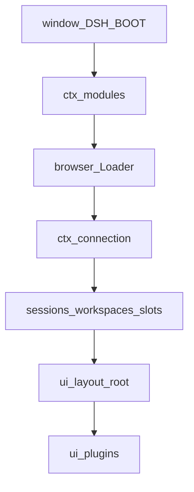
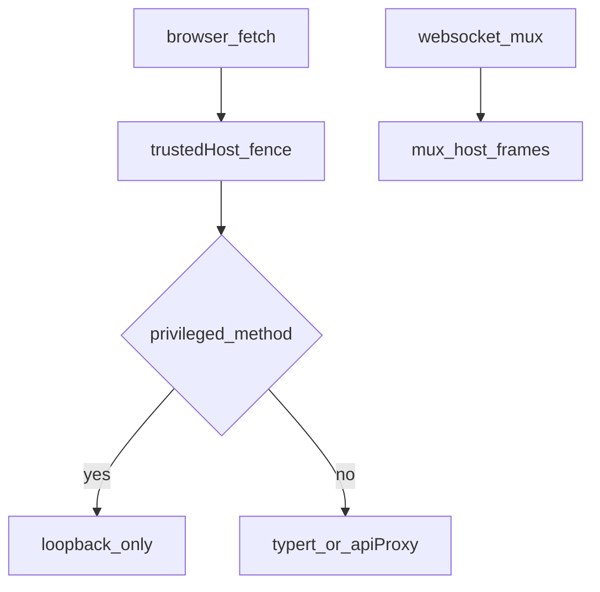
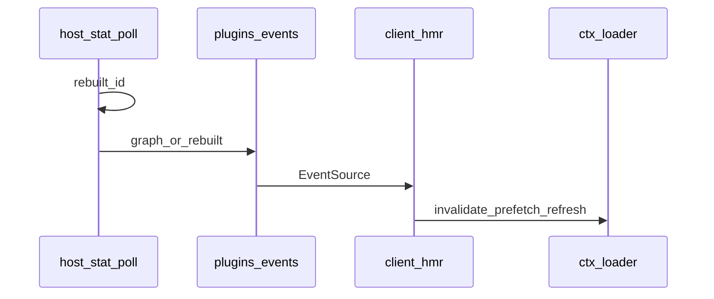
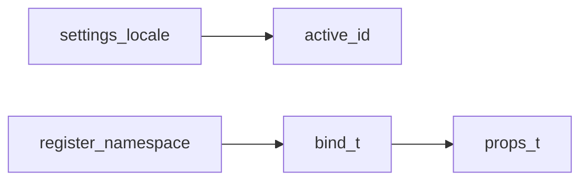
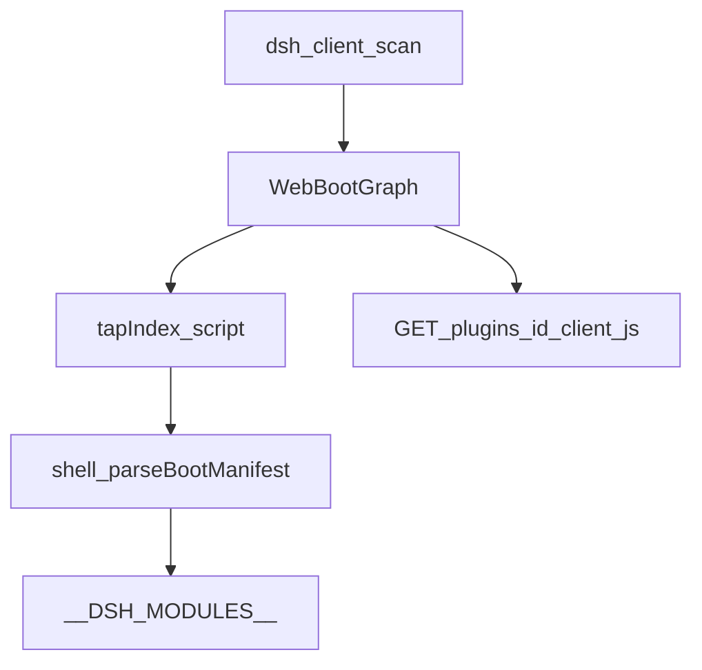
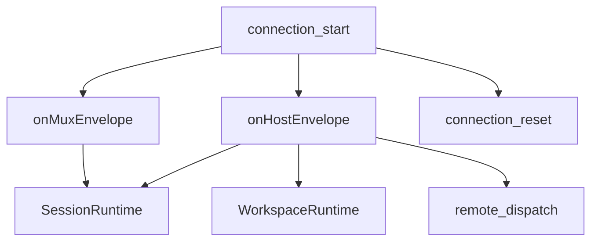
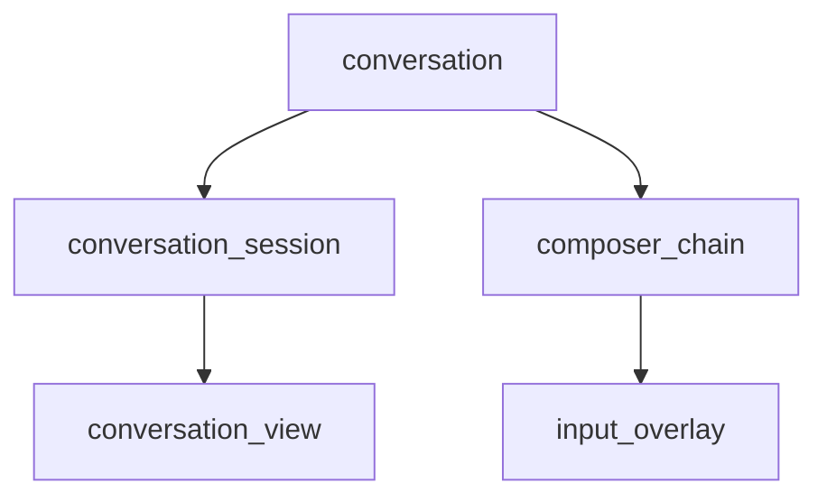
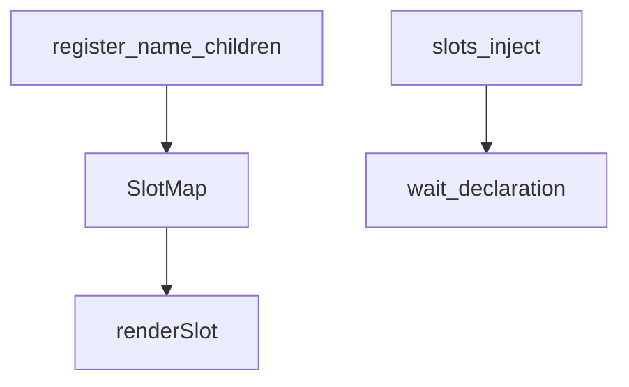
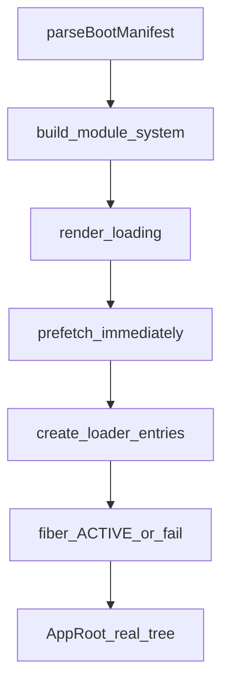
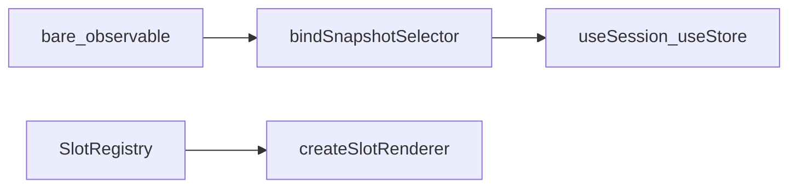

# client/ — Web GUI 浏览器半边

学习笔记，非正式产品文档。模块表与 `__DSH_BOOT__` 合同见 [client-modules.md](../../subsystems/client-modules.md)；HTTP 承运见 [web-server.md](../../subsystems/web-server.md)。组映射见 [packages/client/README.md](../../../packages/client/README.md)。

浏览器壳先解析宿主注入的入口图，再挂 Cordis Loader；业务 UI 只经 `ctx.slots.register` 组合。对象层（connection / runtime）零 React；web-react 只做钩子绑定。

非 UI 包用完整走读；`ui-*` 只写槽位、监听的服务/事件、用户看见什么。

## `@deepseek-ai/dsh-client-connection` — 浏览器↔宿主 RPC

- 角色：Host 承运 + Client 线根
- ctx：Host 提供 `ctx.connection`（`HostConnectionService`），`inject: ['webServer']`；浏览器半边 `inject: []`，提供 `ctx.connection`（`ConnectionHandle`）
- 入口：[packages/client/connection/src/index.ts](../../../packages/client/connection/src/index.ts)、[http-bridge.ts](../../../packages/client/connection/src/http-bridge.ts)、[client/index.ts](../../../packages/client/connection/src/client/index.ts)
- 关键类型：`ConnectionHandle`、`IApiClient`、`HostConnectionRpc`

实现逻辑：

1. Host `apply` 在 `/api` 前先过 DNS-rebinding 篱；`trustedHosts` 非法条目启动即抛。
2. 特权方法（settings/credentials/`host.pickDirectory`/`llm.discoverModels` 等）再用空信任表，钉死回环。
3. 模型目录故意不钉：LAN 选择器需要 provider/model 列表，不含密钥。
4. 有 `apiProxy` 时校验 `maxRequestBodyBytes` 能装下附件的 base64 上限。
5. GET `/api/events` 与 mux 路径回 426，要求 WebSocket upgrade。
6. 浏览器半边按页面 URL 选 fixture 或 HTTP 客户端；`start(sinks)` 只能被一个消费者（runtime）调用。
7. `rpc.intercept` 让 Gateway 认领 `<namespace>/<method>`；其余回落 apiproxy。

源码走读：`trustedHosts` 是篱不是鉴权。rpcId 由承运铸造，业务签名只见 `RpcRequest`。

## `@deepseek-ai/dsh-client-hmr` — 开发期热换插件

- 角色：Host 轮询 + Client 换 fiber
- ctx：Host `inject: ['clientModules', 'webServer']`；Client `inject: ['loader', 'modules']`
- 入口：[packages/client/hmr/src/index.ts](../../../packages/client/hmr/src/index.ts)、[client/index.ts](../../../packages/client/hmr/src/client/index.ts)
- 关键类型：`PluginsEventFrame`

实现逻辑：

1. Host 按 `pollIntervalMs`（默认 500）stat 每个图行的 client bundle；mtime/size 变则 `clientModules.rebuilt(id)`。
2. `/plugins/events` SSE 广播 graph/rebuilt 帧。
3. 浏览器收到 `rebuilt`：先 invalidate 旧 factory，再 prefetch 新 bundle，再 registry-first 拆除、清 `<style data-plugin>`，最后 `entry.refresh()`。
4. 不能 `fiber.dispose()` 再 `refresh()`：Loader 会把条目标 `disabled`。
5. prefetch 失败则旧 fiber 继续跑，下一帧重试；无回滚。
6. 壳与普通库不是图行，改它们仍要整页刷新。

源码走读：无 `pnpm run dev:web` 时轮询看不到新字节，链空转。级联靠 Cordis fiber uid，HMR 不记账。

## `@deepseek-ai/dsh-client-locale` — 语言偏好与词典

- 角色：Host 登记 settings 段 + Client `ctx.locale`
- ctx：Client `inject: ['slots', 'connection', 'remote', 'settingsScope']`
- 入口：[packages/client/locale/src/index.ts](../../../packages/client/locale/src/index.ts)、[client/index.ts](../../../packages/client/locale/src/client/index.ts)
- 关键类型：`LocaleRuntime`、`LocaleSnapshot`、`TranslateNS`

实现逻辑：

1. Host `apply` 在有 `settings` 时登记 `LOCALE_SETTINGS_NAMESPACE`。
2. Client 提供 `ctx.locale`：`register(ns, { zh, en })`，`bind(ns)` 返回稳定 `t`。
3. 查找链：条目自己的命名空间未命中再查 `common`。
4. 切语言 emit 事件；词典登记不 emit（避免 boot 时槽位重注册风暴）。
5. 在 `settings.general.item` 挂 Language 行，写回 settings 文档。

源码走读：`t` 是框架座，组件不自己订阅读词典。产品文案中文；代码注释英文。

## `@deepseek-ai/dsh-client-modules` — 入口图与懒 CJS 表

- 角色：Host `ctx.clientModules` + 浏览器 `ctx.modules`
- ctx：Host 扫 Loader；浏览器 enroll `window.__DSH_MODULES__`
- 入口：[packages/client/modules/src/index.ts](../../../packages/client/modules/src/index.ts)、[client/index.ts](../../../packages/client/modules/src/client/index.ts)、[client/manifest.ts](../../../packages/client/modules/src/client/manifest.ts)
- 关键类型：`WebBootGraph`、`WebBootEntry`、`ClientModuleSystem`

实现逻辑：

1. 扫 `dsh.client`（`platform: 'web'`、可选 `inject`/`immediately`），解析 `exports["./client"]`。
2. 增量：`internal/plugin` 标脏，microtask flush；激活期坏包聚成 `AggregateError`，稳态只 warn。
3. 行 `rev` 是 bundle 内容哈希；图 `rev` 哈希整表。
4. `GET/HEAD /plugins/<id>/client.js` 带 `no-cache`；未知 id 或未构建回 404，不让 SPA fallback 把 HTML 当 JS。
5. index tap 在 `<head>` 注入 `window.__DSH_BOOT__`，`<` 转义。
6. 浏览器半边只 `provide('modules', window.__DSH_MODULES__)`；缺槽说明壳内核顺序坏了。

源码走读：`immediately` 只影响预取，不影响激活序。激活序是 fiber inject 等服务。

## `@deepseek-ai/dsh-client-runtime` — 会话/工作区/槽对象层

- 角色：Client 共享服务（Host `apply` 空）
- ctx：`ctx.slots`、`ctx.sessions`、`ctx.workspaces`、`ctx.conversationEvents`、`ctx.conversationViews`；`inject: ['connection', 'typert', 'remote', 'remote.commands']`
- 入口：[packages/client/runtime/src/index.ts](../../../packages/client/runtime/src/index.ts)、[client/index.ts](../../../packages/client/runtime/src/client/index.ts)
- 关键类型：`SessionRuntime`、`WorkspaceRuntime`、`ConversationSnapshot`、`SlotRegistry`

实现逻辑：

1. 挂 `SlotRegistry`、会话/工作区运行时、Conversation Node/View 注册表。
2. `connection.start` 把 mux/host 帧送进 sessions/workspaces；`host/remote-event` 交给 `ctx.remote.$dispatch`。
3. 连上 emit `connection/reset`；`reconnecting` 丢掉世代作用域交互态。
4. `typert.contexts.registerClient('agent', …)` 用 session scope 当 Remote Context 身份。
5. `workspaces.startInitialSelection` 在 effect 里启动。
6. 业务状态（事件窗、流式累积、重连）在对象层，不进 slot store。

源码走读：零 React。store 只承载选择/草稿/栏宽。`notifyNow` 仅用户手势回声；结构更新 `markDirty`；流式块 `markFrameDirty`。

## `@deepseek-ai/dsh-client-schema-form` — settings 草稿模型

- 角色：library
- ctx：无
- 入口：[packages/client/schema-form/src/index.ts](../../../packages/client/schema-form/src/index.ts)、[model.ts](../../../packages/client/schema-form/src/model.ts)
- 关键类型：`SchemaNode`

实现逻辑：

1. `rehydrateSchema` 把线上序列化 envelope 收成可走的节点树。
2. `nodeAtPath` / `getPath` / `setPath` / `deletePath` / `hasPath` 按 settings 路径不可变编辑。
3. `validateDraft` 用同一棵树校验。
4. 编辑器自己画控件（Models 页手写布局），本包不渲染。

源码走读：纯函数，无 Cordis。

## `@deepseek-ai/dsh-client-ui-agent-preset` — 预设选择与名册

- 角色：UI Consumer
- 槽：`conversation.session.header.actions`（只读标签）、hero chip、`settings.general.item`（默认预设）、`settings.section`（名册）
- 监听：`ctx.connection.api`、`ctx.remote` 转发的 settings 失效；`AgentPresetSettingsController` / seat / section store
- 用户可见：新会话选预设；跑着的会话只显示开局时的组成（宿主拒绝中途换预设）

## `@deepseek-ai/dsh-client-ui-attachment` — 附件原子

- 角色：library（零 Cordis）
- 槽：无；被 conversation 当原子引用
- 监听：无；文案由调用方 locale 传入
- 用户可见：待发图片轨、历史图廊、原图灯箱、全页拖放遮罩

## `@deepseek-ai/dsh-client-ui-commands` — `/` 命令目录与弹层

- 角色：UI Service + Consumer
- 槽：`conversation.input.overlay`（`command-popup`）
- 监听：`ctx.inputTriggers`、`ctx.sessions`、`ctx.remote.commands`；`ctx.commandUi` 缓存目录
- 用户可见：输入 `/` 出命令列表；选中经 `commands.execute` 下发

## `@deepseek-ai/dsh-client-ui-conversation` — 对话骨架

- 角色：UI 组合根
- 槽：占 `conversation`；声明 `conversation.session` / `header` / `composer` / `view` / `details` 及 input 诸座
- 监听：`ctx.sessions`、`ctx.workspaces`、`ctx.layout`、`ctx.connection`、`ctx.remote`、`ctx.settingsScope`、`conversationEvents` / `conversationViews`
- 用户可见：无会话 hero、聊天流、输入栏、审批链、todo/queue dock、右侧详情；回车行为写 General 设置

源码走读：composer 是选择器链（审批、提问、只读子代理）；Chat Node 由各特征包 `conversationEvents.register` + keyed `conversation.chat.node` 渲染，不进中心 switch。

## `@deepseek-ai/dsh-client-ui-deliverables` — 本轮产出文件

- 角色：UI Consumer；Host 半边 `inject: ['systemPrompt']`
- 槽：`conversation.chat.turnTail`
- 监听：`conversationEvents`（deliverables definition）、`ctx.connection.hostDescription`
- 用户可见：回合尾芯片列表；收束散文里的文件提及可点开（回环才 `openPath`）

## `@deepseek-ai/dsh-client-ui-directory-picker-browse` — 应用内选目录

- 角色：UI Provider（browse 面）
- 槽：`sidebar.workspaces.directoryFlow`、`conversation.hero.workspace.directoryFlow`
- 监听：`ctx.workspaces.listDirectory` / `createDirectory`
- 用户可见：面包屑、子目录表、新建文件夹、截断提示、显示隐藏项

## `@deepseek-ai/dsh-client-ui-directory-picker-native` — 无渲染 OS 选择

- 角色：UI Provider（native 面）
- 槽：同上两个 `directoryFlow`
- 监听：`ctx.workspaces.pickDirectory`
- 用户可见：点「打开」弹出宿主系统对话框；取消/失败经 owner 回话

## `@deepseek-ai/dsh-client-ui-goal` — 当前目标条

- 角色：UI Consumer
- 槽：`conversation.input.dock`（GoalBar）、`conversation.chat.node` key `command-input`
- 监听：`useProjection('goal')`、`ctx.remote.goals` 四个变更动词；`conversationEvents` 登记 command-input 节点
- 用户可见：输入区上方目标条；创建仍走 `/goal`

## `@deepseek-ai/dsh-client-ui-input-trigger` — `/` `@` 触发菜单

- 角色：UI Service
- 槽：`conversation.input.overlay`（候选菜单）
- 监听：`ctx.sessions`；源经 `ctx.inputTriggers.register`
- 用户可见：触发字符后的分组候选；挑选插入字面文本（芯片由词表扫描派生）

## `@deepseek-ai/dsh-client-ui-jobs` — 会话后台任务

- 角色：UI Consumer
- 槽：`conversation.session.header.actions`（`job-list`，order 20）
- 监听：`ctx.sessions` 的 `jobsBySession` 镜像；无自有 RPC
- 用户可见：标题栏任务列表弹出层

## `@deepseek-ai/dsh-client-ui-layout` — 三栏框架

- 角色：UI 壳
- 槽：占运行时内建 `root`；声明 `sidebar` / `conversation` / `details` / 浮动层
- 监听：`ctx.theme`（`ThemePresenter` 写 `document.body`）；`ctx.layout` 面板动作
- 用户可见：可折叠侧栏、中间对话、可开详情列；几何在 layout store

## `@deepseek-ai/dsh-client-ui-message-feedback` — 赞踩

- 角色：UI Consumer
- 槽：`conversation.chat.assistant-actions`（`feedback`）
- 监听：`ctx.remote.messageFeedback`；`connection/reset` 时对已读 session `resync`
- 用户可见：助手消息旁赞/踩与备注；Host 做 per-item CAS

## `@deepseek-ai/dsh-client-ui-model-selection` — 模型选择

- 角色：UI Consumer
- 槽：`conversation.input.model`；另向 `ctx.commandUi` 挂 `/model` popupSelect
- 监听：`ctx.modelDirectories`（每会话一份 `session.models`）、`session.selectModel`
- 用户可见：输入栏模型座与 `/model` 列表同一事实；子代理会话两入口都不露

## `@deepseek-ai/dsh-client-ui-permission-presets` — 权限预设

- 角色：UI Consumer
- 槽：`settings.general.item`；装饰 `/permission` popupSelect（另有 composer chip `permission`）
- 监听：session `permissions` 投影、`ctx.commandUi`、`ctx.connection` settings
- 用户可见：当前会话权限切换（经 `/permission <preset>`）；General 里写日后新会话默认值；Full access 有风险确认

## `@deepseek-ai/dsh-client-ui-plan` — 计划模式芯片

- 角色：UI Consumer
- 槽：`conversation.input.plan`
- 监听：`useProjection('plan')`；退出走 `ctx.remote.commands.execute(sessionId, '/plan off')`
- 用户可见：有效目标是 plan 时显示芯片；否则座位空

## `@deepseek-ai/dsh-client-ui-primitives` — 共享控件

- 角色：library（零 Cordis）
- 槽：无
- 监听：无
- 用户可见：Button/Modal/Markdown/Diff/Terminal 等原子；只吃 `--dsw-*` token

## `@deepseek-ai/dsh-client-ui-settings` — settings 作用域与槽合同

- 角色：Client Service
- 槽：声明 settings 槽类型（section/tab/item/onboarding），自己不占壳
- 监听：无；`ctx.settingsScope.bind` 时才碰运输
- 用户可见：无独立画面；给各特征行提供命名空间 Host 运输

源码走读：壳在 ui-settings-general，避免经 sidebar/layout/theme 成环。

## `@deepseek-ai/dsh-client-ui-settings-general` — 设置壳与 General

- 角色：UI 壳
- 槽：占 `sidebar.settings`；填 `settings.trigger` / `header` / `close` / `action`；声明 `settings.section` 与 onboarding
- 监听：`ctx.connection`（打开本地 settings 文档）
- 用户可见：侧栏齿轮、分区导航、无人认领的 General 段、引导层

## `@deepseek-ai/dsh-client-ui-settings-models` — 模型页与入门

- 角色：UI Consumer
- 槽：`settings.section`（Models）、`settings.onboarding`（welcome + DeepSeek）
- 监听：`ctx.connection` settings/credentials、`ctx.remote` 失效转发；未打开的页不因后台失效去拉
- 用户可见：provider 卡片、探测模型、官方 DeepSeek 引导对话框

## `@deepseek-ai/dsh-client-ui-settings-plugin-inventory` — Loader 库存页

- 角色：UI Consumer
- 槽：`settings.plugins.tab`（`all`）
- 监听：`ctx.remote.pluginInventory.list`
- 用户可见：只读插件表（模块名、启用、fiber 相位）

## `@deepseek-ai/dsh-client-ui-settings-plugins` — Plugins 段与可配置卡

- 角色：UI Consumer
- 槽：`settings.section`（Plugins）；声明 `settings.plugins.tab` 与 `settings.plugin.item`
- 监听：`ctx.settingsScope` 绑 agent-loop / bash / web-search 命名空间；`ctx.remote` 失效
- 用户可见：可配置宿主插件卡 + 其它包贡献的 tab

## `@deepseek-ai/dsh-client-ui-sidebar` — 导航列

- 角色：UI 壳
- 槽：占 `sidebar`；声明 `sidebar.workspaces` / `sidebar.settings` / `sidebar.footer.action`
- 监听：`ctx.layout.toggleSidebar`、`ctx.workspaces.startSession`
- 用户可见：折叠轨、新会话按钮、工作区区与设置齿轮的座位

## `@deepseek-ai/dsh-client-ui-skill` — 技能引用与工具行

- 角色：UI Consumer
- 槽：`tool.call.toolview` key `skill`；向 `ctx.inputTriggers` 登记 `/` 源
- 监听：`connection.api.skills`（每会话缓存）；`connection/reset` 与预设切换使缓存失效
- 用户可见：`/技能名` 候选；技能工具调用的强调行。提示词里仍是字面 `/name`，宿主 pre-step 注入正文

## `@deepseek-ai/dsh-client-ui-slots` — 槽注册表核心

- 角色：library（runtime 的 `SlotRegistry` 包一层）
- ctx：类型合同在本包；运行时服务在 runtime
- 入口：[packages/client/ui-slots/src/index.ts](../../../packages/client/ui-slots/src/index.ts)
- 关键类型：`SlotMap`、`PropsRuntime`、`PropsRenderSlots`、`PropsStore`

实现逻辑：

1. 一个 API：`register({ name, children?, store?, inject? }, Component)`。
2. `children` 既是声明也是授权；渲染未声明槽或抢别人声明的槽，加载失败。
3. 组件 props 四份派生：runtime / renderSlots / store / inject，禁止手写已派生成员。
4. `slots.inject(name, factory)` 等声明出现，声明塌了就撤，重声明再跑。
5. `LocaleNamespaceMap` 与 `SlotMap` 一样 declaration-merge。

源码走读：壳只渲染 `root`。跨包不 import 对方组件，只经槽与 ctx。

## `@deepseek-ai/dsh-client-ui-subagent` — 子代理导航

- 角色：UI Consumer
- 槽：`conversation.session.header.actions`（目录）、`conversation.composer`（只读接管）；`@` 源挂 `inputTriggers`
- 监听：`ctx.sessions` 列表快照（`parentId` + `running`），零 RPC
- 用户可见：标题栏子会话目录；`@标签` 插入；one-shot 或父不可用时只读 composer（运行中且父离线仍留主 Stop）

## `@deepseek-ai/dsh-client-ui-theme` — 配色偏好

- 角色：UI Service
- 槽：`settings.general.item`（Appearance）
- 监听：`ctx.settingsScope` 读写主题段；`prefers-color-scheme` 解析 `system`
- 用户可见：浅/深/跟随系统；真正改 DOM 的是 layout 的 presenter

## `@deepseek-ai/dsh-client-ui-tool` — 工具树与按键视图

- 角色：UI Consumer
- 槽：`conversation.chat.node` key `tool-call`（声明 `tool.call.toolview`）；`conversation.details.tool`
- 监听：会话快照里的 tool 切片；内建 bash/read/edit/write/grep/glob/web/todo/ask-question 各挂 keyed toolview
- 用户可见：嵌套工具树、右侧详情、按工具名的专用行（否则 generic）

## `@deepseek-ai/dsh-client-ui-trajectory` — 轨迹视图

- 角色：UI Consumer
- 槽：`conversation.view`（`trajectory`）
- 监听：`conversationEvents` / `conversationViews` 登记 message/header/assistant/tool/compaction 定义；`ctx.sessions` 分页
- 用户可见：对话旁的轨迹页签，按时间看请求与工具，不是聊天气泡

## `@deepseek-ai/dsh-client-ui-user-questions` — 智能体提问

- 角色：UI Consumer
- 槽：`conversation.composer`（`selectQuestion`）
- 监听：owner `interactions` 里的 `question` 等待；无自有服务
- 用户可见：通用问答流，或 `plan-review` 决策卡；同一条目内切形状，避免两条链抢同一载体

## `@deepseek-ai/dsh-client-ui-workflow-run` — 工作流回放

- 角色：UI Consumer
- 槽：`conversation.chat.node` key `workflow-run`
- 监听：`conversationEvents` 的 workflow definition；`ctx.sessions.open` 打开子会话
- 用户可见：耐久 workflow run 的嵌套 Chat 披露；仅直播子导航

## `@deepseek-ai/dsh-client-ui-workspace` — 工作区浏览与创建

- 角色：UI Consumer
- 槽：`sidebar.workspaces`、`conversation.hero.workspace`；各声明一个 `directoryFlow` 子孔
- 监听：`useWorkspaces`、`ctx.sessions.search` / `open` / rename、`ctx.workspaces.startSession`
- 用户可见：侧栏工作区+会话列表、hero 选择器；选目录孔由 auto 挂上的 browse/native 面填充

## `@deepseek-ai/dsh-client-web` — 浏览器壳内核

- 角色：library（apps/web Vite 入口调用，不是 Loader 行）
- ctx：内核在 Cordis 之前建 `ClientModuleSystem`
- 入口：[packages/client/web/src/index.ts](../../../packages/client/web/src/index.ts)、[boot.tsx](../../../packages/client/web/src/boot.tsx)
- 关键类型：`AppWebEntry`、`BootSeams`

实现逻辑：

1. `AppWebEntry.run`：解析 `__DSH_BOOT__` → 建模块表 → 画 loading → 并行预取 `immediately` 行并挂 vendored Loader（先注入 `internal`，禁止浏览器走裸 import 回退）。
2. 等预取后再 adopt modules 条目、为每个插件行 + app-shell 建 Loader 条目。
3. `loader.await()` + 全 fiber 扫描，非 ACTIVE 则列出谁在等哪个服务。
4. 翻 settled 信号，`AppRoot` 一次切到真 UI。
5. 单行预取失败静默，创建侧 import 再响；不因一个坏包 fail-fast 整 boot。
6. 壳不 value-import 特征包；loading 页在插件失败时仍能画。

源码走读：`window.__DSH_BOOT__` 只由 `dsh web` 注入。composition 在宿主图里，壳不做组合决定。

## `@deepseek-ai/dsh-client-web-react` — 槽到 React 的胶水

- 角色：library（仅壳用）
- ctx：无服务
- 入口：[packages/client/web-react/src/index.ts](../../../packages/client/web-react/src/index.ts)
- 关键类型：`SlotRenderer`、`SessionProvider`、`UseSession`

实现逻辑：

1. `createSlotRenderer` 把授权过的子槽渲成 React。
2. `SessionProvider` 给 session 作用域钩子。
3. `bindSnapshotSelector` / `useInvoke` 在绑定点从裸源合成钩子。
4. 特征包禁止依赖本包；组件不看见 ctx。

源码走读：这是「渲染机械」层。业务状态若漏进这里，就是分层红线。
