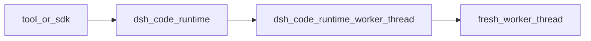
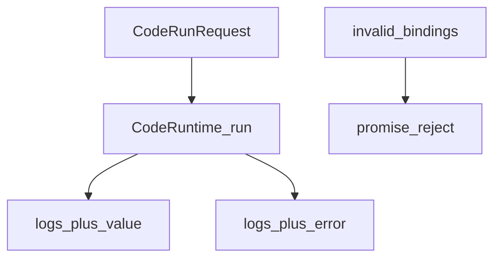
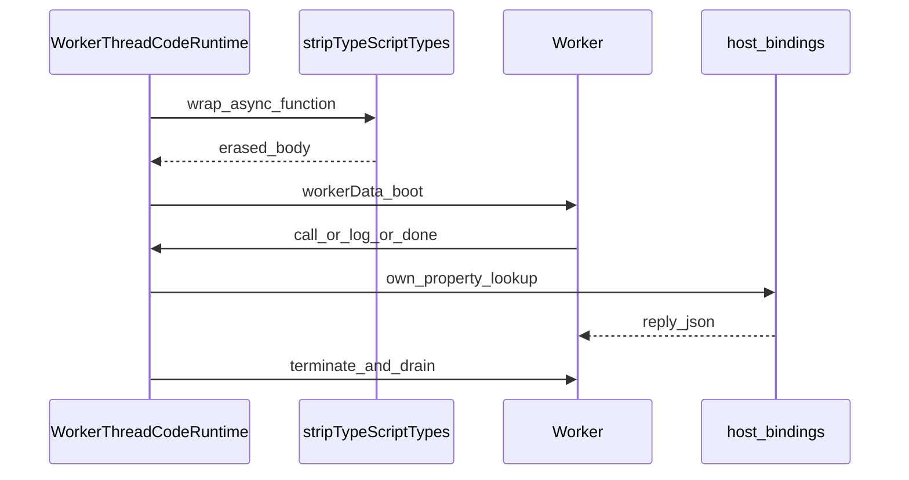

# code-runtime/ — 跑一段模型写的程序

学习笔记，非正式产品文档。权威合同见各包 README 与 [subsystems/code-runtime.md](../../subsystems/code-runtime.md)。组映射见 [packages/code-runtime/README.md](../../../packages/code-runtime/README.md)。

运行时不知道工具或会话。程序当敌对对等体。绑定必须是无损 JSON。这是遏制，不是安全边界：模型代码的信任级别与 bash 相当。

## `@deepseek-ai/dsh-code-runtime` — `ctx.codeRuntime` 合同

- 角色：Service Definition
- ctx：`ctx.codeRuntime`
- 入口：[packages/code-runtime/code-runtime/src/index.ts](../../../packages/code-runtime/code-runtime/src/index.ts)、[types.ts](../../../packages/code-runtime/code-runtime/src/types.ts)
- 关键类型：`CodeRunRequest`、`CodeRunResult`、`CodeBindingNamespace`、`CodeRunFailure`
- 共享集合：`RESERVED_BINDING_GLOBALS`、`RESERVED_ERROR_MEMBERS`、`PORTABLE_RESERVED_WORDS`

实现逻辑：

1. `CodeRuntime` 以 `super(ctx, 'codeRuntime')` 占键。子类声明 `language` 与 `isolation`（信息性，不门控）。
2. `run(request)`：程序结果（含失败）resolve 在 `CodeRunResult`；只有合同误用（已拆除、非法绑定名）才 reject。
3. `program` 当异步函数体：顶层 `await`/`return` 合法，返回值成为 `value`（须可传输）。
4. 绑定全局必须是可移植标识符 `[A-Za-z_][A-Za-z0-9_]*`，且不在 ECMAScript∪Python 保留字里。`$tools` 这种 JS-only 拼写被拒。
5. `RESERVED_BINDING_GLOBALS`（`console`、`__dsh_main__`、`__builtins__`、`__name__`、`__debug__`）所有后端都拒，避免一份命名空间在 worker 能过、在 Python 撞车。
6. 错误类成员拒 `RESERVED_ERROR_MEMBERS` 与全部 dunder 形。实现必须隔离各次 run，拆除时终止并等待飞行中的 run。

源码走读：请求不带可选调参；时间与输出上限是实现的已校验 Config。`CodeJsonValue` 是无损 JSON 闭包。

## `@deepseek-ai/dsh-code-runtime-worker-thread` — 每次 run 一台新 Worker

- 角色：Service Provider
- ctx：占住 `ctx.codeRuntime`
- 入口：[packages/code-runtime/code-runtime-worker-thread/src/index.ts](../../../packages/code-runtime/code-runtime-worker-thread/src/index.ts)、[worker.ts](../../../packages/code-runtime/code-runtime-worker-thread/src/worker.ts)、[protocol.ts](../../../packages/code-runtime/code-runtime-worker-thread/src/protocol.ts)
- 关键类型：`WorkerThreadCodeRuntime`、`OutputLedger`、`WorkerToHost`
- 配置：`computeMs=60s`、`maxWallMs=600s`、`maxOutputBytes=64MiB`、`maxOldGenerationSizeMb=512`
- `language: 'typescript'`；`isolation: 'worker-thread'`

实现逻辑：

1. 构造校验所有 cap 为正；`maxOutputBytes` 至少 4；`maxWallMs` 不得超过 `MAX_TIMER_DELAY_MS`（否则 `setTimeout` 会钳成 1ms）。
2. `validateBindings` 检查标识符、保留字、保留全局、重复全局、错误类成员。失败是合同 reject。
3. 用 `async function __dsh_program__() { ... }` 包一层再 `stripTypeScriptTypes`（位置保持）。剥类型失败（语法、`enum` 等）resolve 成 `exception`，不建 worker。
4. Worker：`env: {}`、`execArgv: []`、`resourceLimits.maxOldGenerationSizeMb`。模型代码拿不到宿主环境或 loader hook。
5. 端口消息经 `parseWorkerMessage` 逐字段重建；垃圾丢弃。`call` 只 `Object.hasOwn` 查找，重复 id 忽略。绑定返回经 `snapshotJsonValue`，有损则程序侧失败。
6. `OutputLedger` 合计 logs + completion/failure 的 JSON 字节；超 cap 变 `output-limit` 并保留能放下的前缀。stdout/stderr 管道是兜底捕获。
7. `computeMs` 读 `worker.performance.eventLoopUtilization().active`（热循环算、等慢绑定不算）。`maxWallMs` 是墙钟。abort/拆除 `terminate` 并等管道排空。同一时刻只有一条结算路径。

源码走读：这不是安全边界——空环境与堆上限挡不住等价于 bash 的敌意。`WORKER_PATH` 在源码树走 `worker.ts`，构建后走 `worker.cjs`。
