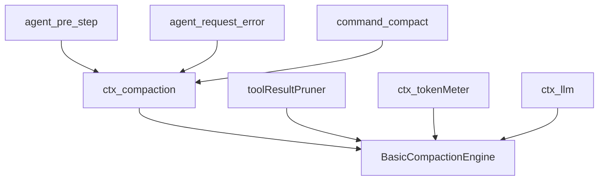
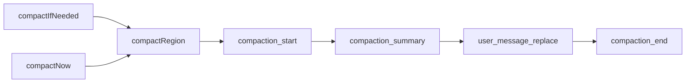
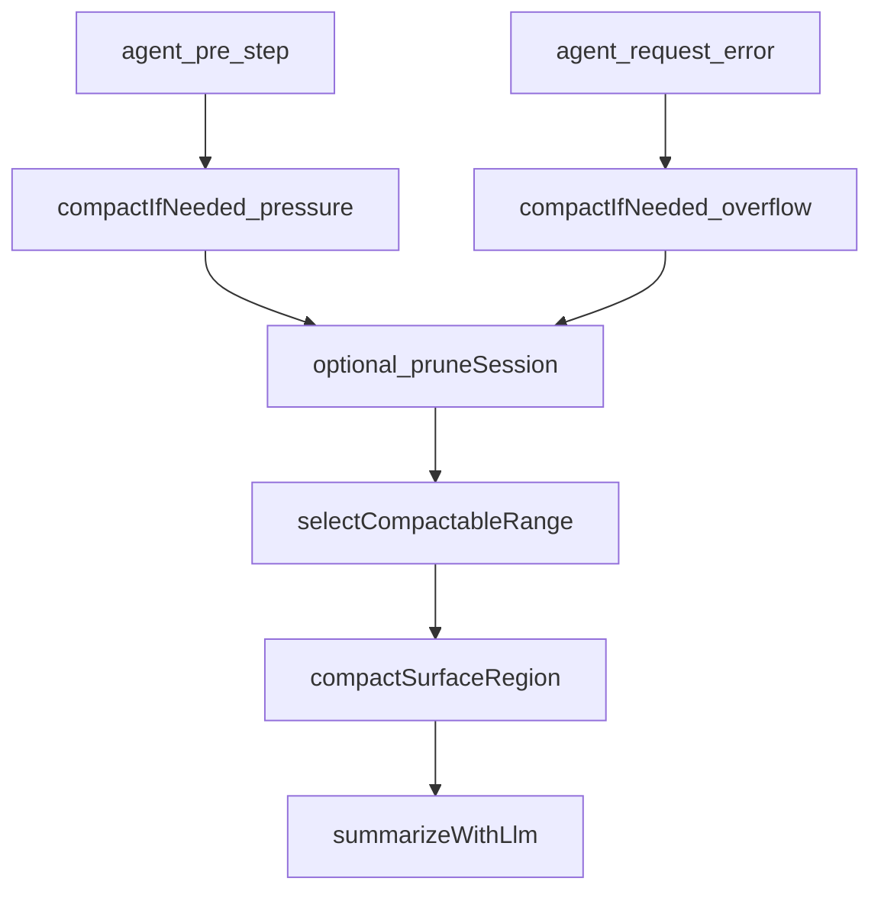
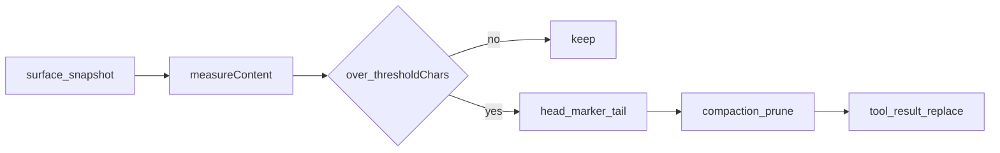
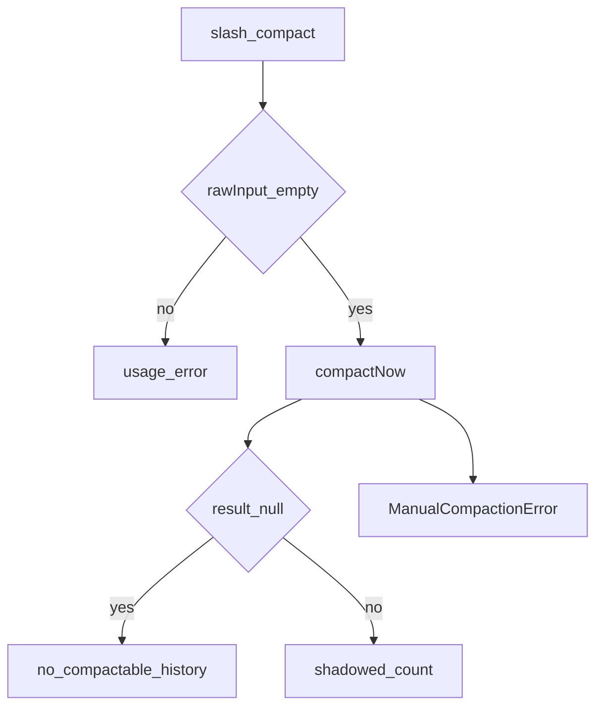

# compaction/ — 历史压缩

学习笔记，非正式产品文档。`compaction/*` 事件与 `CompactionResult` 见 [compaction.md](../../subsystems/compaction.md)。组映射见 [packages/compaction/README.md](../../../packages/compaction/README.md)。

Definition 声明何时压、如何换 span；basic 实现压力与摘要；pruner 是无模型的可选前置；`/compact` 是人工入口。

## `@deepseek-ai/dsh-compaction` — 压缩 seam

- 角色：Service Definition
- ctx：`ctx.compaction`
- 入口：[packages/compaction/compaction/src/index.ts](../../../packages/compaction/compaction/src/index.ts)、[types.ts](../../../packages/compaction/compaction/src/types.ts)、[checkpoint.ts](../../../packages/compaction/compaction/src/checkpoint.ts)
- 关键类型：`CompactionEngine`、`CompactionResult`、`CompactionTrigger`、`ManualCompactionError`
- 日志事件：`compaction/start`、`compaction/summary`、`compaction/end`、`compaction/prune`

实现逻辑：

1. `CompactionEngine` 是抽象 Service，子类实现三个入口。
2. `compactIfNeeded(agent, 'pressure' | 'context-overflow', signal)`：无安全 range 返回 `null`。
3. `compactNow` 必须先同步进入 `runMaintenance`，再选 range、写独立 `compaction/start`，摘要期间后到的 waking prompt FIFO 排队。
4. `compactRegion(start, end)` 的起止是 **surface 位置** 不是 seq 数值序；两端必须 tool-pairing 平衡。
5. 替换 user message 必须用 `compactCheckpointSource` 带上本次 `CompactionId`。
6. `ManualCompactionError.code`：`busy` / `cancelled` / `changed` / `summary` / `commit` / `persistence`。

源码走读：`compaction/summary` 与紧随其后的 replace `user/message` 相邻是合同——前者是后者的 shadow price。`toolPairingBalancedBefore` / `After` 是边检查。

## `@deepseek-ai/dsh-compaction-basic` — 计量 + 摘要后端

- 角色：Service Provider
- ctx：占住 `ctx.compaction`；`inject: ['llm', 'tokenMeter', 'sessions']`
- 入口：[packages/compaction/compaction-basic/src/index.ts](../../../packages/compaction/compaction-basic/src/index.ts)、[region.ts](../../../packages/compaction/compaction-basic/src/region.ts)、[summarizer.ts](../../../packages/compaction/compaction-basic/src/summarizer.ts)
- 关键类型：`BasicCompactionEngine`、`ResolvedConfig`、`ModelCompactPolicyConfig`

实现逻辑：

1. `auto: true` 时挂 pre-step 压力压缩，以及 `CONTEXT_WINDOW_EXCEEDED` 上的 overflow 恢复。
2. 两次自动路径都先看最新耐久 routed `request/header` 的 provider/model；没有路由则 `null`。
3. overflow：可选 `ctx.get('toolResultPruner')` 先剪，再 `retainTokens = 0` 选一段有用的平衡 range。
4. pressure：解析模型 `contextWindow`，算 threshold；够压才 prune 并重测；仍超再循环 `compactRegion`，最多 `compactionRetries + 1` 次。
5. `summarize` 是唯一子类钩子：默认 `ctx.llm.stream()` 一次，前缀复用对话自己的 system/tools/messages，避免打爆 KV cache。
6. `compactNow` 包在 `runMaintenance` 里，stability 只锁 selected-span，成功后 `sessions.flush`。
7. overflow 成功（或 prune 已推进 `replaceGeneration`）返回 `{ kind: 'retry' }`；idle / 成功 assistant message 清重试计数。

源码走读：`compactSurfaceRegion` 写 start → 摘要 → summary 事件 → replace → end。摘要期间 surface 变了抛 `changed`。缺 contextWindow 抛 `TargetPressureConfigError`，同一 target 只 warn 一次。

## `@deepseek-ai/dsh-compaction-tool-result-pruner` — 无模型剪枝

- 角色：Service（可选伴侣）
- ctx：`ctx.toolResultPruner`（`inject: ['tokenMeter']`）
- 入口：[packages/compaction/compaction-tool-result-pruner/src/index.ts](../../../packages/compaction/compaction-tool-result-pruner/src/index.ts)
- 关键类型：`PruneResult`、`PrunedEntry`、`ToolResultPruneConfig`

实现逻辑：

1. 构造时冻结 `thresholdChars` / `headChars` / `tailChars`（Unicode code point）。
2. `pruneSession` 快照当前 surface 上所有 `tool/result`。
3. 超阈值则保留头尾文本，中间插入 `PRUNE_MARKER`；非 text block 原样留下。
4. 先 `append('compaction/prune', { shadowedSeqs, shadowedTokenCount })`，再同步 `replace` 那条 tool/result。
5. 替换必须更短且仍低于阈值，否则抛错；已提交的替换保留。

源码走读：basic 在够压或 overflow 时 `ctx.get('toolResultPruner')`，缺省不依赖本包。shadow-price 协议与 `compaction/summary` 相同：计量事件必须紧挨替换。

## `@deepseek-ai/dsh-command-compact` — `/compact`

- 角色：Consumer
- ctx：无自有键；`inject: ['commands', 'compaction']`
- 入口：[packages/compaction/command-compact/src/index.ts](../../../packages/compaction/command-compact/src/index.ts)
- 命令：`compact`（无参数）

实现逻辑：

1. 有参数直接 usage error。
2. `ctx.compaction.compactNow(agent, signal, commandId)`。
3. `null` → “No compactable history yet.”；成功报告 shadowed 条数和估算 token。
4. `ManualCompactionError` 按 code 收成人类句子；其它错误上抛。
5. 进行中的 handler Promise 记入 Set；teardown 先 `allSettled` 再卸命令。

源码走读：命令不碰 retention 数字，只走 seam。`sourceEventSeq` 指到 `summarySeq`，方便 UI 对齐 checkpoint。
