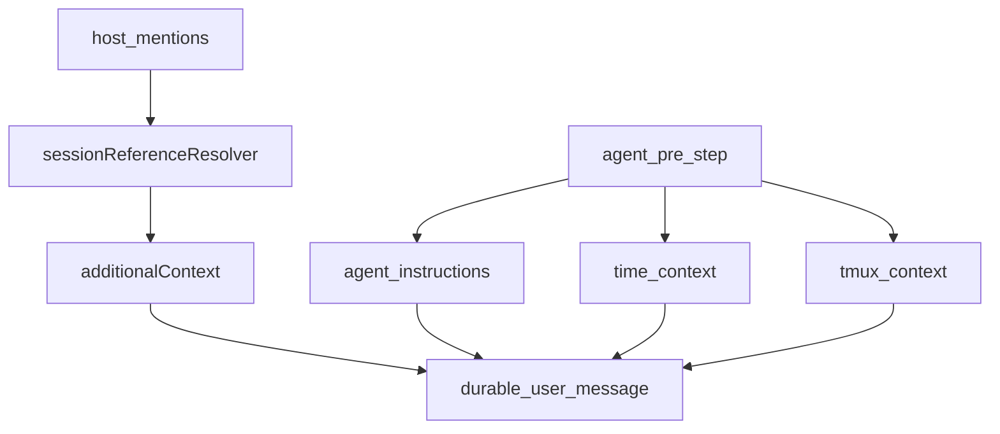
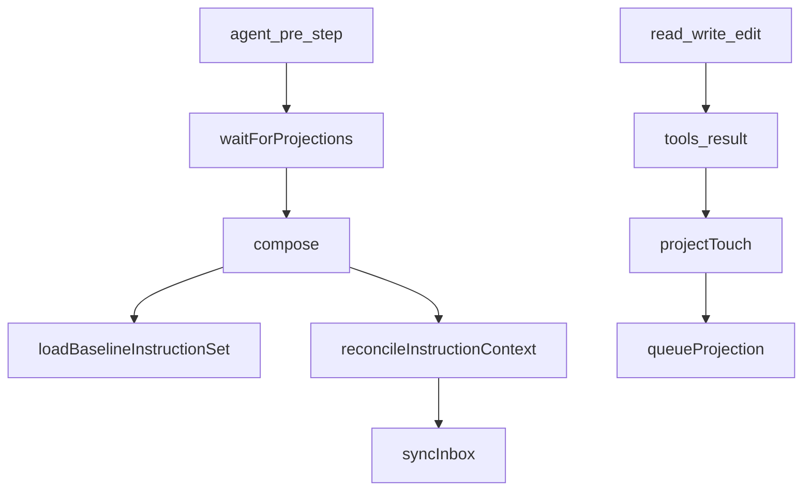
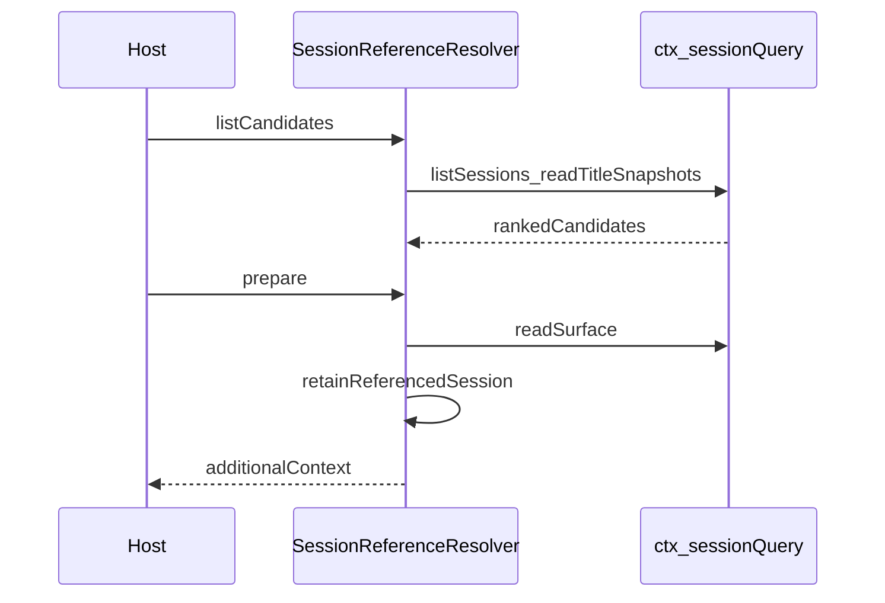
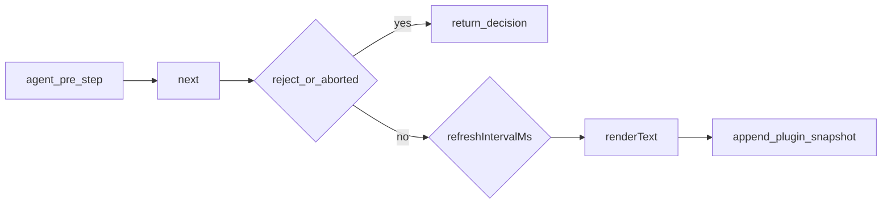
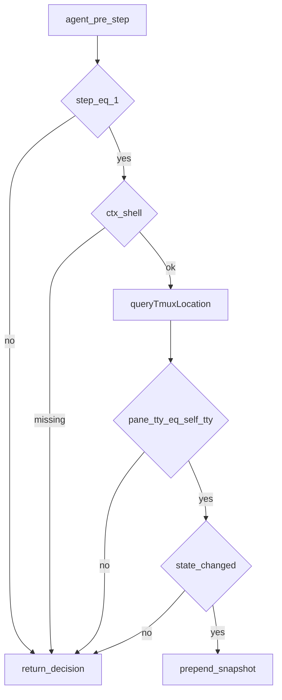

# context/ — 请求上下文插件

学习笔记，非正式产品文档。类型合同见 [session-reference.md](../../subsystems/session-reference.md)、[system-prompt.md](../../subsystems/system-prompt.md)、[session.md](../../subsystems/session.md)。组映射见 [packages/context/README.md](../../../packages/context/README.md)。

这组插件不定义工具，只在请求装配前注入模型可见上下文。`agent-instructions` 默认进 spine；其余三个 opt-in。

## `@deepseek-ai/dsh-agent-instructions` — 工作区指令

- 角色：Consumer
- ctx：无自有键；可选读 `ctx.get('fs')`
- 入口：[packages/context/agent-instructions/src/index.ts](../../../packages/context/agent-instructions/src/index.ts)、[state.ts](../../../packages/context/agent-instructions/src/state.ts)、[files.ts](../../../packages/context/agent-instructions/src/files.ts)
- 关键类型：`AgentInstructionSource`、`InstructionVersionCache`、`AgentInstructionChange`
- 监听：`agent/pre-step`（waterfall）、`tools/result`、`session/event`

实现逻辑：

1. `apply` 建 per-session 的版本缓存、baseline 准备态，以及按 agent 串行的 projection 队列。
2. `compose` 在 `maxBytes > 0` 且存在 `ctx.fs` 时工作；否则直接空返回。
3. 无可见 baseline 或 `baselineIdentity` 变了，就按 cwd / 项目根 / `dshHome` 重载 baseline，并把结果写成 `source.kind === 'agent-instructions'` 且 `baseline: true` 的 user message。
4. `reconcileInstructionContext` 再扫 touched 路径，产出嵌套 / 变更 / 删除的增量。
5. `agent/pre-step` 先等 projection 排空，再 compose；reject 或第一步空 batch 只同步 inbox，不把指令变成独立请求。
6. 进入 step 时把 desired 插到 claimed batch 之后，并清掉 inbox 里旧的 workspace context。
7. `read` / `write` / `edit` 的成功结果经 `tools/result` 收集路径；子执行先冒泡到 parent，根执行再 `projectTouch`。
8. 开着的 step 把 touch 攒到 `step/end` 再投影，避免异步 inbox 抢在当前 step 提交前突变。

源码走读：`compose` 是唯一装配入口；`syncInbox` 用深比较复用或替换 pending；`visibleBaselineSource` 先看本步 claimed，再扫 surface。无 `fs` 时整包是 no-op。

## `@deepseek-ai/dsh-session-reference` — 跨会话快照

- 角色：Service Definition
- ctx：`ctx.sessionReferenceResolver`（`inject: ['sessionQuery']`）
- 入口：[packages/context/session-reference/src/index.ts](../../../packages/context/session-reference/src/index.ts)、[projection.ts](../../../packages/context/session-reference/src/projection.ts)、[uri.ts](../../../packages/context/session-reference/src/uri.ts)
- 关键类型：`SessionReferenceInput`、`SessionReferenceCandidate`、`PreparedReferencedMessage`、`SessionReferenceError`

实现逻辑：

1. 构造时校验 `maxReferences` / `candidateLimit` / `maxReferenceBytes` 为正安全整数，且引用数不超过 `MAX_REFERENCES`。
2. `listCandidates` 排除自身，按 cwd 亲和排序；有 query 时再按 id / cwd / title 子串过滤。
3. `prepare` 规范化引用：拒自引用、去重、超上限抛 `SESSION_REFERENCE_TOO_MANY`。
4. 并行 `sessionQuery.readSurface`，失败收成 `SESSION_REFERENCE_READ_FAILED`；取消走 `SESSION_REFERENCE_CANCELLED`。
5. `retainReferencedSession` 按字节预算裁剪；塞不下抛 `SESSION_REFERENCE_BUDGET_EXCEEDED`。
6. 渲染成带警告前缀的 `<referenced-sessions>` JSON，source 为 `kind: 'session-reference'`、`form: 'recall'`。

源码走读：Host 负责把 mention 收成结构化 `SessionReferenceInput`；本服务只做精确读、预算和耐久上下文。`stringifyTagSafeJson` 防止快照逃出标签。快照是不可信背景，模型不得把其中的指令当成本会话授权。

## `@deepseek-ai/dsh-time-context` — 当前时间快照

- 角色：Consumer
- ctx：无自有键；`inject: ['agents']`
- 入口：[packages/context/time-context/src/index.ts](../../../packages/context/time-context/src/index.ts)、[timestamp.ts](../../../packages/context/time-context/src/timestamp.ts)、[request-zone.ts](../../../packages/context/time-context/src/request-zone.ts)
- 关键类型：`Config`（`timeZone`、`refreshIntervalMs`）
- 监听：`agent/pre-step`（prepend waterfall）

实现逻辑：

1. 加载时解析 fallback IANA 时区；非法 `refreshIntervalMs` 或无法解析的时区直接 fail-loud。
2. prepend 监听器先 `next()`，reject / abort 原样返回。
3. `refreshIntervalMs > 0` 且距上次本插件注入不足间隔则跳过。
4. step 1 用最近一条模型可见消息时间算 elapsed；后续 step 用本 turn 内上一次 time-context。
5. `deriveBrowserTimeZoneContext` 从本 turn 已进入 + 本步 proposed 消息里取浏览器时区；解析成功则覆盖 fallback。
6. 追加 `source.kind === 'plugin'`、`plugin: 'time-context'`、`form: 'snapshot'` 的 user message。

源码走读：`precedingMessageTime` 只认 `user/message`、`assistant/message`、`tool/result`。prepend 让它先于多数后置注入跑完 `next()`，再把时钟贴到 decision 末尾。

## `@deepseek-ai/dsh-tmux-context` — tmux 位置

- 角色：Consumer
- ctx：无自有键；`inject: ['agents']`；可选 `ctx.get('shell')`
- 入口：[packages/context/tmux-context/src/index.ts](../../../packages/context/tmux-context/src/index.ts)
- 关键类型：`TmuxLocation`、`Config.refreshIntervalMs`
- 监听：`agent/pre-step`（prepend waterfall）

实现逻辑：

1. 只在 `step === 1` 且存在 `ctx.shell` 时查询；缺 shell、查询失败、非零退出都是 no-op，只打 warning。
2. 命令先确认 `$TMUX_PANE`，再用 `ps -o tty=` 对 `#{pane_tty}`；只继承了环境变量的终端（如 VS Code）读成“不在 tmux”。
3. 一次 `tmux display-message` 取出 session / window / pane / layout。
4. `latestInjectedState` 扫原始日志里本插件上次注入的稳定 state 块（去掉 turn 前缀），所以 resume / compaction 后仍能比变化。
5. state 没变，或未过 `refreshIntervalMs`，不注入。
6. 变化则把 snapshot **前置**到 decision.messages，source 为 `plugin: 'tmux-context'`。

源码走读：`queryTmuxLocation` 把 executor 拒绝收成 warning，不让 turn 失败。`renderState` 才是抑制重注的比较键；`renderReading` 另加 turn 前缀给模型看。
