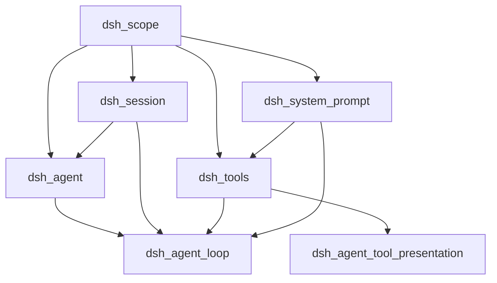
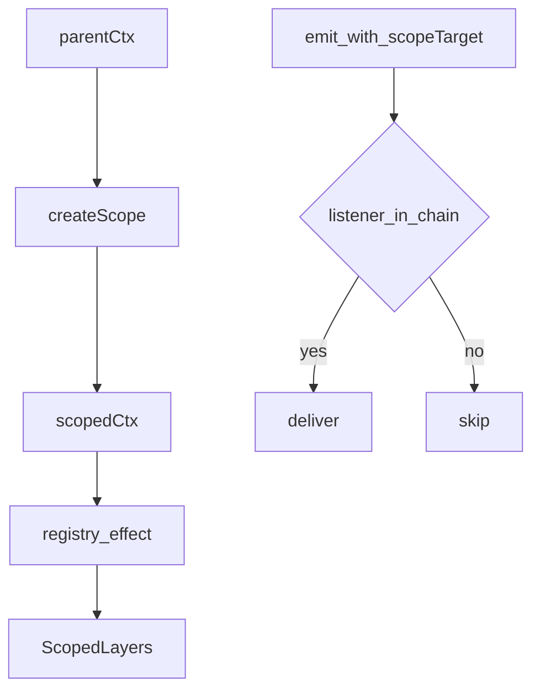
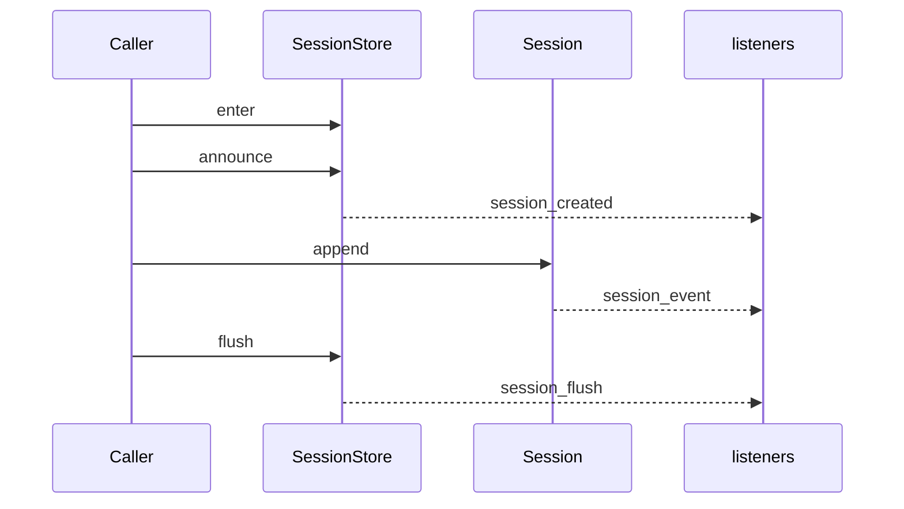
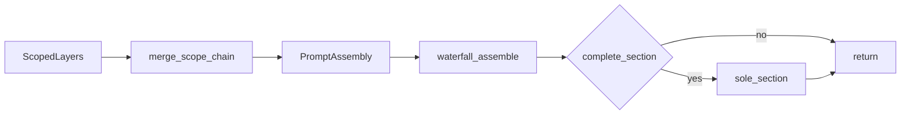
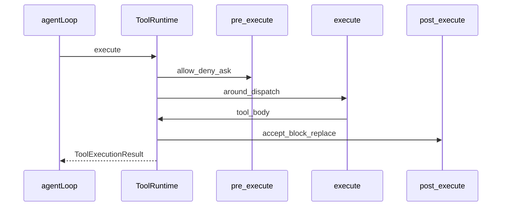
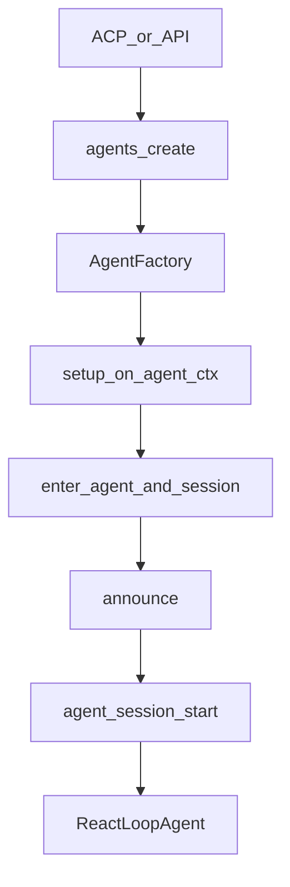
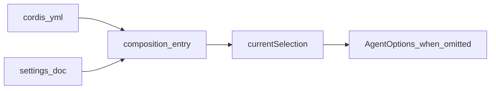
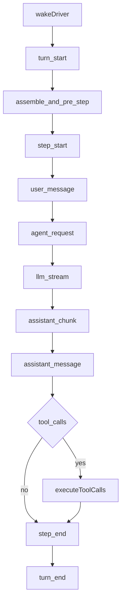
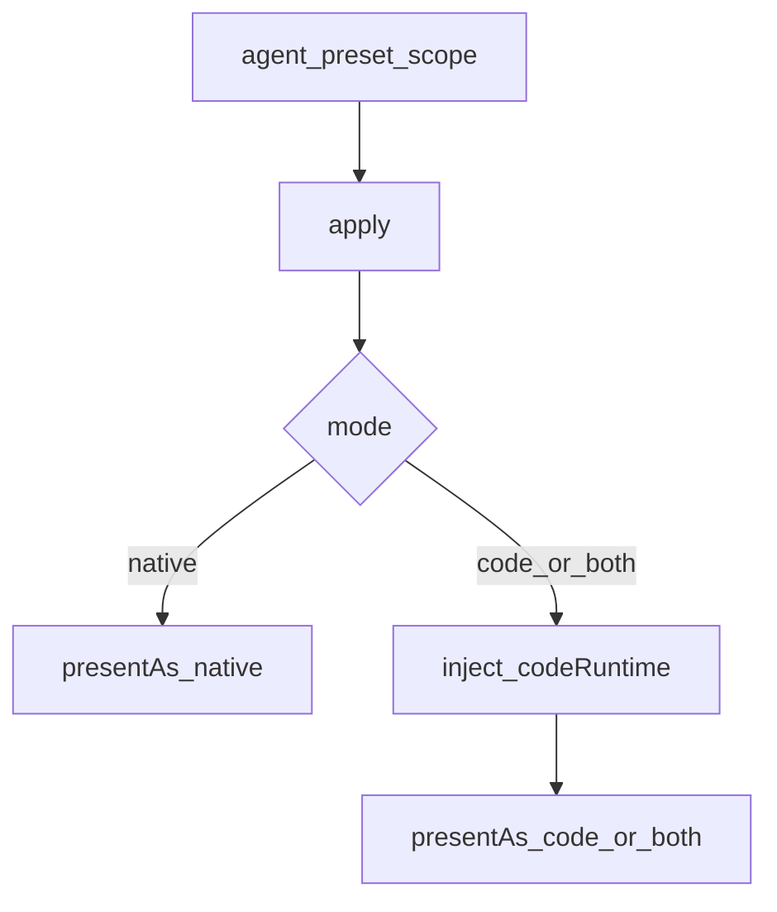

# core/ — 产品 API 主干

学习笔记，非正式产品文档。类型与事件合同见 [subsystems/core.md](../../subsystems/core.md)、[session.md](../../subsystems/session.md)、[system-prompt.md](../../subsystems/system-prompt.md)、[tools.md](../../subsystems/tools.md)、[scope.md](../../subsystems/scope.md)。组映射见 [packages/core/README.md](../../../packages/core/README.md)。

`agent` 只声明接口与事件；`agent-loop` 是默认可替换驱动。扩展插件依赖 `dsh-agent`，不依赖 loop。

## `@deepseek-ai/dsh-scope` — 按 agent 收窄注册

- 角色：library
- ctx：无键；`createScope` 在子 context 上打 `scopeKey`，`scopeOf(ctx)` 读取
- 入口：[packages/core/scope/src/index.ts](../../../packages/core/scope/src/index.ts)、[store.ts](../../../packages/core/scope/src/store.ts)
- 关键类型：`ScopeKey`、`Scope`、`Scoped<T>`、`ScopedLayers`

实现逻辑：

1. `createScope(parentCtx, key)` 开子 fiber，并给子 context 打 scope tag。
2. 可选 `bindScopeParent` 建父子链，禁止成环。
3. Registry 用 `scopeOf(registrationCtx)` 决定写入 global 还是 scoped layer。
4. 分发时 `scopeTarget(subject, key)` 做 carrier；监听器沿链向上匹配。
5. `ScopedLayers.effect()` 登记，dispose 时回收空 layer。
6. `scope.dispose()` 卸掉该 scope 下全部注册。

源码走读：`createScope` 是 mint 边界；`ScopedLayers` 是 global + per-scope 的所有权表；`scopeTarget` 让事件只送到链上的监听器。工具、提示词、命令都复用这套原语。

## `@deepseek-ai/dsh-session` — 只追加日志与内存店

- 角色：Service Definition
- ctx：`ctx.sessions`
- 入口：[packages/core/session/src/index.ts](../../../packages/core/session/src/index.ts)、[types.ts](../../../packages/core/session/src/types.ts)、[surface.ts](../../../packages/core/session/src/surface.ts)
- 关键类型：`Session`、`SessionEvent`、`SessionEventMap`、`SurfaceOp`
- 事件：`session/created`、`session/disposed`、`session/event`（emit）；`session/flush`（parallel）

实现逻辑：

1. `prepare(id, { seed, meta })` 构造未入店的 `Session`，校验连续 seq、JSON、surface。
2. `enter(session)` 装入 store 与 attachments WeakMap，返回 detach。
3. `announce(session)` 同步 emit `session/created`；监听器抛错会 veto 并回滚。
4. `Session.append` 是唯一耐久写：快照 → surface 校验 → push → emit `session/event`。
5. `deriveMessages()` 沿 `surface.nodes` 增量投影模型历史。
6. `requestHeader()` / `requestContext()` 折叠 `request/header` 与 `request/context`。
7. `flush(session)` 并行等待 `session/flush`（持久化入口）。
8. `fork(source, boundary)` 复制 prefix seed 开子 session。

源码走读：`append` 深冻结事件；`SurfaceManager` 是派生历史的单一来源。loop 写入的 `turn/*`、`step/*`、`user/message`、`assistant/*`、`tool/*` 都经这条路径。

## `@deepseek-ai/dsh-system-prompt` — 每步请求前的装配

- 角色：Service Definition
- ctx：`ctx.systemPrompt`
- 入口：[packages/core/system-prompt/src/index.ts](../../../packages/core/system-prompt/src/index.ts)
- 关键类型：`PromptSection`、`PromptAssembly`、`ToolProviderResult`
- waterfall：`system-prompt/assemble`；emit：`system-prompt/change`

实现逻辑：

1. 构造时按 Config 注册 `harness:identity`、`deployment:persona`。
2. 插件经 `section` / `context` / `tools` / `variable` 写入 `ScopedLayers`。
3. `assemble({ scope, signal, agent })` 合并 global 与 scope 链，scoped 覆盖 global。
4. 收集 tool providers，按 `toolOrder` 排序，建成 `PromptAssembly`。
5. `system-prompt/assemble` waterfall 允许专家改写。
6. 若存在 `complete` section，waterfall 后强制恢复为唯一 prompt section。
7. `renderPrompt` 做严格 `{{var}}` 插值，不属于 assembly 本身。

源码走读：`SystemPrompt.assemble` 是 loop 每步的输入装配；`orderTools` 处理 `<unlisted-tools>`。模型看见的段落只来自这次装配结果。

## `@deepseek-ai/dsh-tools` — 工具注册与守卫管道

- 角色：Service Definition
- ctx：`ctx.tools`（`inject: ['systemPrompt']`）
- 入口：[packages/core/tools/src/index.ts](../../../packages/core/tools/src/index.ts)、[code-mode.ts](../../../packages/core/tools/src/code-mode.ts)、[schema.ts](../../../packages/core/tools/src/schema.ts)
- 关键类型：`ToolDefinition`、`ToolExecution`、`PreToolDecision`、`PostToolDecision`
- waterfall：`tools/pre-execute`、`tools/execute`、`tools/post-execute`

实现逻辑：

1. 构造时向 `systemPrompt.tools` 提供按 scope 的 schema；code/both 模式再挂 SDK/collapse 段落。
2. `register` / `restrict` / `guard` / `presentAs` 写入 scoped `ToolLayer`。
3. `view(scope)` 一次遍历：继承 + restrict + 自有工具，必要时插入 `run_code`。
4. `execute` 先走 `tools/pre-execute` 与 guards，得到 allow / deny / ask。
5. `tools/execute` waterfall 包住 tool body，并融合 AbortSignal。
6. `tools/post-execute` 之后 materialize，再 emit `tools/result`。
7. Code mode 拒绝模型直接打非 `run_code` 的 native 工具；SDK 子分发仍可走 native。
8. `executionMode()` 读 `isConcurrencySafe`，供 loop 做并行池与互斥屏障。

源码走读：`ToolRuntime.execute` 是完整管道；本包不写 session 事件，`tool/call` 与 `tool/result` 由 agent-loop 在分发后追加。timeout-policy、approval、repeat-reminder 都挂在这三条 waterfall 上。

## `@deepseek-ai/dsh-agent` — Agent 接口与事件词表

- 角色：Service Definition
- ctx：`ctx.agents`；`ctx.agent` 是 DX 访问器，只在 `Agent.ctx` 上有值
- 入口：[packages/core/agent/src/index.ts](../../../packages/core/agent/src/index.ts)、[inbox.ts](../../../packages/core/agent/src/inbox.ts)、[dispatch.ts](../../../packages/core/agent/src/dispatch.ts)
- 关键类型：`Agent`、`AgentHandle`、`AgentFactory`、`InboxTarget`、`PreStepDecision`
- waterfall：`agent/pre-step`、`agent/request`、`agent/request-error`；serial：`agent/turn-stopping`

实现逻辑：

1. loop 构造时 `setFactory(this)`，把 `AgentFactory` 交给 registry。
2. 外部 `ctx.agents.create` / `resume` 委托给 factory，并把 caller ctx 记入 trace。
3. factory `enter` + `announce` 后 emit `agent/created`，scope carrier 是 agent 自身。
4. 具体 `Agent`（默认 `ReactLoopAgent`）实现 `send` / `followup` / `steer` / `inject` / `cancel`。
5. `Inbox` 突变写耐久 `agent/inbox/spliced`，并 emit 飞行中的 inbox 通知。
6. `withInitiator(agent, fn)` 用 AsyncLocalStorage 传递因果 agent，供 tool 分发恢复。
7. `installModelSelection` 把模型选择耦到 prompt assembly 与 `agent/request`。

源码走读：本包不跑 turn。`agentEvents` 保证派发时 agent 与 scope 不分离。UI、ACP、hooks 都对这套事件编程。

## `@deepseek-ai/dsh-agent-default-model` — 部署默认模型

- 角色：Service Definition
- ctx：`ctx.agentDefaultModel`
- 入口：[packages/core/agent-default-model/src/index.ts](../../../packages/core/agent-default-model/src/index.ts)
- 关键类型：`ModelSelection`、`AgentDefaultModelSettings`

实现逻辑：

1. 从 cordis.yml `Config` 读默认 `provider` / `model`。
2. `installSettingsSection` 挂用户可改的 settings 文档，用户层覆盖 composition。
3. `currentSelection()` 投影为 `ModelSelection`（含可选 `reasoningEffort`）。
4. `saveSelection()` 可选写入 `ctx.settings.replace`。
5. ACP 等入口只在 Agent 自己没选模型时读这个服务。

源码走读：这是部署选择，不是会话内选择。会话一旦写下自己的 selection，入口点不再回落到这里。

## `@deepseek-ai/dsh-agent-loop` — 默认 turn/step 驱动

- 角色：Service Provider（实现 `AgentFactory`）
- ctx：`ctx.agentLoop`（inject：`agents`、`sessions`、`llm`、`tools`、`systemPrompt`）
- 入口：[packages/core/agent-loop/src/index.ts](../../../packages/core/agent-loop/src/index.ts)、[agent.ts](../../../packages/core/agent-loop/src/agent.ts)、[tool-calls.ts](../../../packages/core/agent-loop/src/tool-calls.ts)
- 写入的 session 事件：`turn/start|end`、`step/start|end`、`user/message`、`request/header`、`request/context`、`assistant/chunk`、`assistant/message`、`tool/call`、`tool/result`

实现逻辑：

1. 构造时 `setFactory(this)`，注册 prompt 变量 `provider` / `model` / `cwd`，并启动 config 里的常驻 agent。
2. `prepare()`：`createScope` → `ReactLoopAgent`，融合 factory/owner abort，memoize `dispose`。
3. `setupAndPublish`：等 `setup(agentCtx)` → 可选 `commit()` → enter/announce session 与 agent → `agent/session-start`。
4. `kick()` 进入 `turn()`：`turn/start` → 领取 inbox + `systemPrompt.assemble` + `agent/pre-step`。
5. 拒绝或空的首次 claim 仍关闭一个没花 step 的 turn，日志留下这次尝试。
6. 通过则 `step/start`，追加 `user/message`，`agent/request` 后写 `request/header` 与 `request/context`。
7. `llm.stream` 写成 `assistant/chunk` 再收成 `assistant/message`；`executeToolCalls` 按 `isConcurrencySafe` 做并行池与互斥屏障。
8. `step/end`；无 steering 时 `agent/turn-stopping` 再 `turn/end`。卸载路径：`cancel` → `whenIdle` → `scope.dispose`。

源码走读：`ReactLoopAgent` 是状态机；`executeToolCalls` 在每批开始前重新分类。完整时序图见 [agent-lifecycle.md](../../agent-lifecycle.md)。换 loop 只换这个 Provider，UI 与工具不用改。

## `@deepseek-ai/dsh-agent-tool-presentation` — 按 preset 切换 native/code

- 角色：Consumer（函数插件 `tool-presentation`）
- ctx：无自有键；消费 `ctx.tools`
- 入口：[packages/core/agent-tool-presentation/src/index.ts](../../../packages/core/agent-tool-presentation/src/index.ts)
- 关键类型：`Config.mode`（`native` / `code` / `both`，必填无默认）

实现逻辑：

1. Agent preset 在 standing scope 挂上这个函数插件。
2. `native` 立刻 `ctx.tools.presentAs('native')`。
3. `code` / `both` 等 `codeRuntime` 就绪后再 `presentAs`。
4. disposer 随 preset scope 卸载，恢复部署默认呈现。

源码走读：组 README 未列出此包。它不实现 Code Mode，只把 preset 的选择落到 `ToolRuntime.presentAs`。
