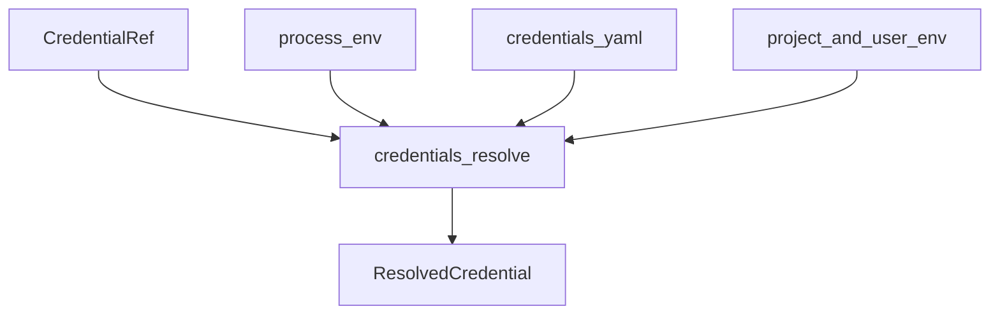
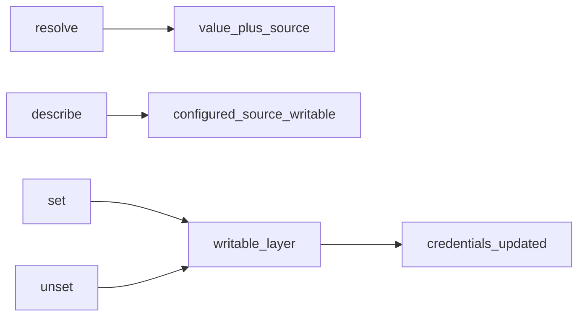
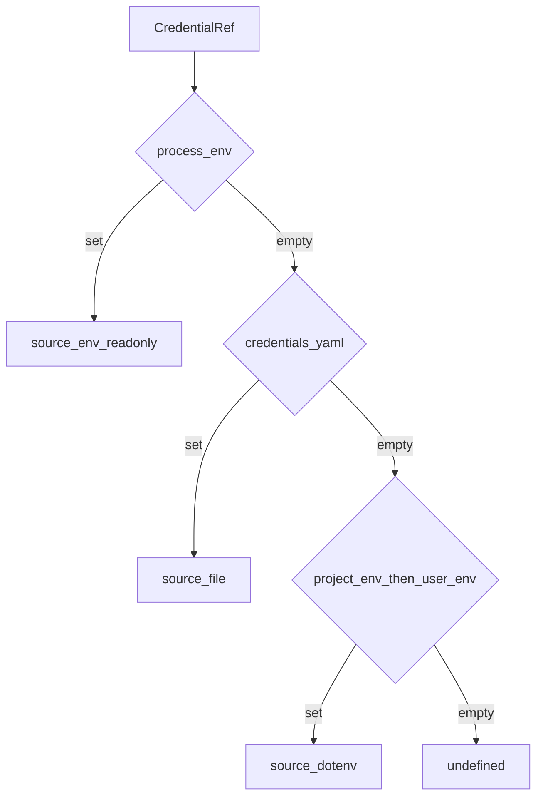

# credentials/ — 凭证引用

学习笔记，非正式产品文档。类型合同见 [credentials.md](../../subsystems/credentials.md)。组映射见 [packages/credentials/README.md](../../../packages/credentials/README.md)。

配置携带引用（环境变量名），不携带密文；消费者在每次操作边界重新 resolve。

## `@deepseek-ai/dsh-credentials` — 引用 seam

- 角色：Service Definition
- ctx：`ctx.credentials`
- 入口：[packages/credentials/credentials/src/index.ts](../../../packages/credentials/credentials/src/index.ts)、[types.ts](../../../packages/credentials/credentials/src/types.ts)
- 关键类型：`CredentialProvider`、`CredentialRef`、`ResolvedCredential`、`CredentialInfo`
- 事件：`credentials/updated`

实现逻辑：

1. `credentialRef` 把 POSIX 标识符（如 `DEEPSEEK_API_KEY`）打成 branded 引用。
2. Provider 实现 `resolve` / `describe` / `set` / `unset`。
3. 空存储值处处视为缺席：`resolve` 跳过，`describe` 报未配置。
4. `resolve` 按次调用；消费者不得跨操作缓存。
5. `describe` 永不返回密文，只报 configured / source / writable。
6. `set` 拒绝空值（用 `unset`）；只读层挡住引用时写也拒绝。
7. `notifyUpdated` 在提交后扇出；监听器失败被包住，除 `INVARIANT` 外不改变写结果。

源码走读：设置页和 composition 文件只存引用。UI 用 `describe` 渲染，密文永远不离开 Provider。

## `@deepseek-ai/dsh-credentials-local` — env 压过文件

- 角色：Service Provider
- ctx：占住 `ctx.credentials`
- 入口：[packages/credentials/credentials-local/src/index.ts](../../../packages/credentials/credentials-local/src/index.ts)
- Config：`path`（默认 `<DSH_HOME>/.credentials.yaml`）、`dshHome`、`watch`、`debounceMs`

实现逻辑：

1. 层序：继承进程环境（只读，胜出）> `$DSH_HOME/.credentials.yaml`（可写）> `<cwd>/.env` > `$DSH_HOME/.env`。
2. 启动时 POSIX 上拒绝 group/other 可读的凭证文件；Windows 跳过 mode 检查。
3. 文档是严格的 `CredentialRef → 非空字符串` 映射，不是 dotenv；重复键、空值、非字符串都拒绝。
4. `set`/`unset` 在继承环境挡住该引用时拒绝，避免「写成功但 resolve 仍返回旧值」。
5. 写走跨进程锁：reconcile、只打补丁自己的键、原子写 `0600`。
6. watcher 热发布；reload 失败 warn 并保留上次快照；写路径上不可解析则失败。
7. 每次 reload 整表替换内存 Map，删除的键不会残留。

源码走读：Harness 自有的 store 不能兼作用户环境层，否则会挡住非密钥条目。Models 页写入立刻压过 checkout 里的 `.env`。
