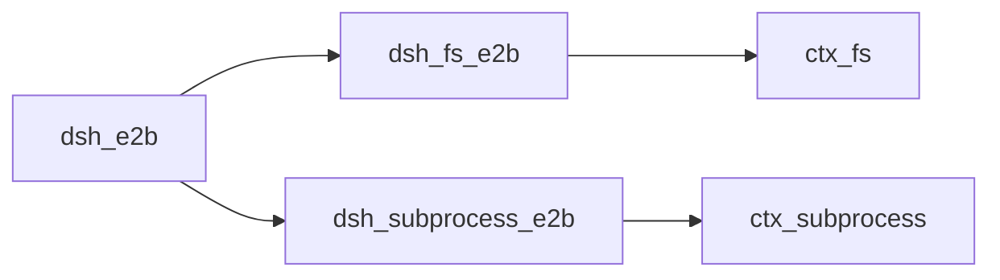
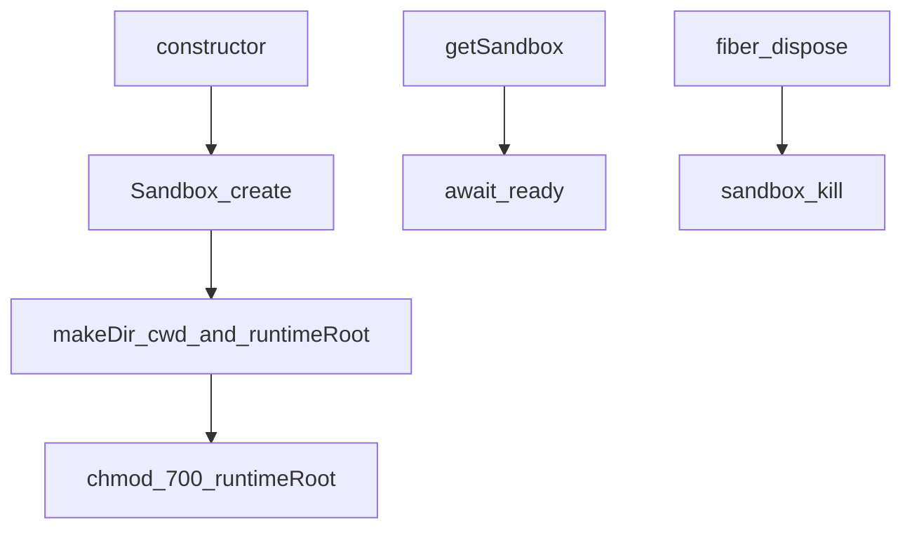
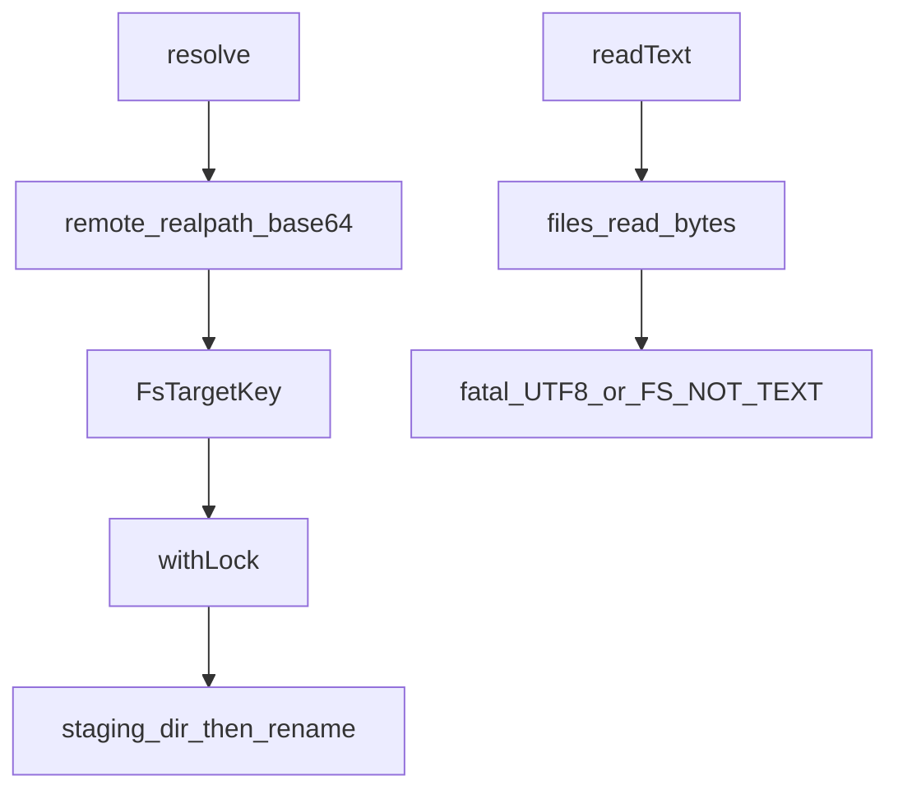
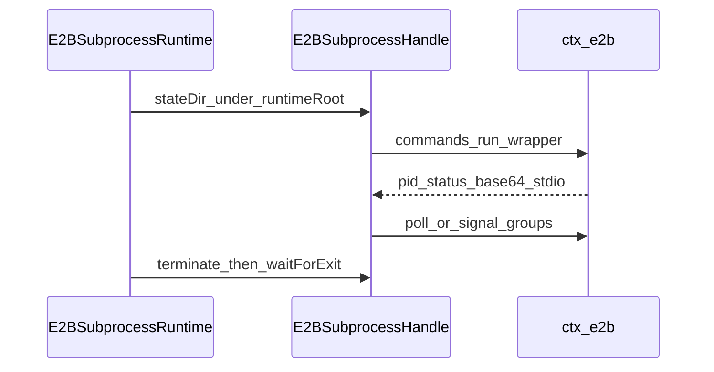

# e2b/ — 共享远程 Linux 世界

学习笔记，非正式产品文档。权威合同见各包 README 与 [subsystems/filesystem.md](../../subsystems/filesystem.md)、[subsystems/subprocess.md](../../subsystems/subprocess.md)。组映射见 [packages/e2b/README.md](../../../packages/e2b/README.md)。

`ctx.e2b` 不是第三套能力缝，而是一块共享 SDK 句柄。把 `ctx.fs` 与 `ctx.subprocess` 同时指到这个沙箱，Bash、PTY、LSP 会一起走过去。

## `@deepseek-ai/dsh-e2b` — 懒创建、超时即杀的沙箱主人

- 角色：共享所有权 Service
- ctx：`ctx.e2b`
- 入口：[packages/e2b/e2b/src/index.ts](../../../packages/e2b/e2b/src/index.ts)
- 关键类型：`E2BRuntime`、`Sandbox`（SDK）
- 配置：`apiKey`（否则 `E2B_API_KEY`）、`cwd` 默认 `/home/user/workspace`、`timeoutMs` 默认 300s

实现逻辑：

1. 构造即开始 `open()`，适配器第一次操作前 `await getSandbox()`。密钥绝不转发进沙箱。
2. `cwd` 必须是绝对 Linux 路径。创建后 `makeDir(cwd)` 与 `makeDir(runtimeRoot)`（`cwd/.dsh-e2b`），并确认 runtime 根是真目录、非符号链接，再 `chmod 700`。
3. E2B 内部命令走硬编码 `/bin/bash -l -c`。`e2bControlEnvs` 把 `HOME` 指到 `/.dsh-e2b-control-<uuid>`，隔离 login shell。`quoteE2BShellArg` 用单引号包不透明参数。
4. SDK `lifecycle.onTimeout: 'kill'`。服务拆除 `sandbox.kill()`；`SandboxNotFoundError` 视为已无。
5. `getSandbox` 在拆除后或等待就绪期间被拆都会抛。创建失败会尝试 `kill` 回滚。
6. 适配器把进程/终端状态放在 `runtimeRoot` 下，不与用户工作区文件混放。

源码走读：`void this.ready.catch(() => {})` 只为观察急切连接失败；`getSandbox()` 仍返回同一错误。这是 POC 所有权层，不是通用沙箱缝。

## `@deepseek-ai/dsh-fs-e2b` — 远程 `ctx.fs`

- 角色：Service Provider
- ctx：占住 `ctx.fs`；`inject: ['e2b']`
- 入口：[packages/e2b/fs-e2b/src/index.ts](../../../packages/e2b/fs-e2b/src/index.ts)
- 关键类型：`E2BFileSystem`
- 版本：元数据键 `dsh-version` + path/type/size/mode/mtime/symlink 的 sha256

实现逻辑：

1. `resolve` 相对 `opts.cwd ?? ctx.e2b.cwd` 做 posix resolve，再在沙箱里 `realpath -mz | base64 -w0`，用 NUL 分帧校验后当 `targetKey`。
2. `fileUrl` 按 posix 段 `encodeURIComponent` 拼 `file://`，不假设宿主是 Windows。
3. `readText`/`streamText` 拒 NUL 样本与非 UTF-8。`readBytes` 先看 stat size，再对流累加，超 `maxBytes` 立刻 `FS_TOO_LARGE` 并 cancel reader。
4. `writeText`/`editText` 每 key 一把锁，守卫语义与 `fs-local` 对齐。原子写：在目标旁建 `.dsh-<uuid>.tmp`，写 `content`，带版本元数据，再替换到目标路径。
5. `editText` 本地做字面替换（LF 规范化、CRLF 写回），再走同一原子写。缺席目标 `FS_STALE_VERSION`。
6. `listDir` depth 1；符号链接子项再 canonical。错误映射：`FileNotFoundError` → `FS_NOT_FOUND`，权限文案 → `FS_PERMISSION_DENIED`。

源码走读：控制面命令用 `e2bControlEnvs()`，避免 login 配置污染 realpath。空文件的 SDK stream 重载可能返回 `''`，`openReadStream` 补成空 `ReadableStream`。

## `@deepseek-ai/dsh-subprocess-e2b` — 远程 `ctx.subprocess`

- 角色：Service Provider
- ctx：占住 `ctx.subprocess`；`inject: ['e2b']`
- 入口：[packages/e2b/subprocess-e2b/src/index.ts](../../../packages/e2b/subprocess-e2b/src/index.ts)、[process.ts](../../../packages/e2b/subprocess-e2b/src/process.ts)、[terminal.ts](../../../packages/e2b/subprocess-e2b/src/terminal.ts)、[output.ts](../../../packages/e2b/subprocess-e2b/src/output.ts)
- 配置：`pollMs` 默认 20（每 tick 一次控制面请求）
- 关键类型：`E2BSubprocessRuntime`、`E2BSubprocessHandle`

实现逻辑：

1. `resolveExecutable`：绝对路径在沙箱 `test -f -a -x`；裸名 `command -v`（可覆盖 PATH）；相对带 `/` 拒绝。结果必须是一条绝对路径。
2. `spawn` 在 `runtimeRoot/processes/<uuid>` 放 pid/status/environment/stdout/stderr。包装脚本记录 pgid、用 `env -i` 灌序列化环境、把 stdout/stderr 经 node base64 行编码器送回（spill 时先 `head -c` 截到远程文件）。
3. `graceMs` 与本地相同：正有限且不超过一个 Node timer。已 abort 的 signal 在 spawn 前抛。
4. 句柄轮询远程 status/liveness；`terminate` 对远程进程组发信号并按 grace 升级。`waitForExit` 看整组，不是只看 SDK command handle。
5. `spawnTerminal` 在 `runtimeRoot/terminals/<uuid>` 分配；设置期有独立 AbortController，服务拆除会取消未完成分配。
6. 拆除：先 abort 终端设置，再 terminate 所有活句柄与终端并等待。失败聚合成 `AggregateError`。

源码走读：E2B 命令层不可避免地套一层 bash；包装脚本把调用方 argv 当 `"$@"`，不经第二层 shell 展开。`inherit` 把远程解码后的字节写到宿主 `process.stdout`/`stderr`；`pipe` 暴露 `PassThrough`。
