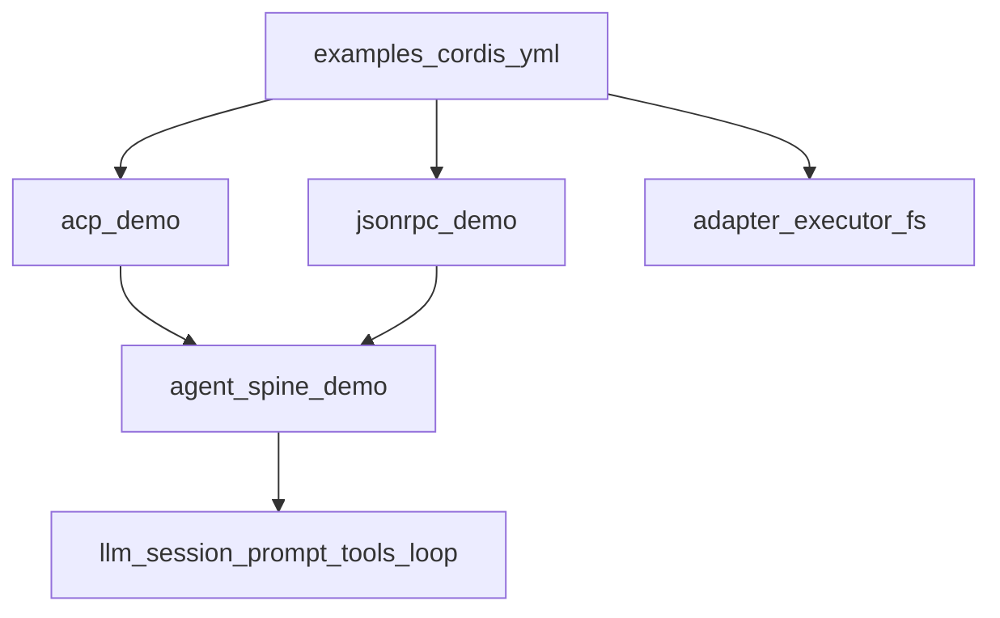
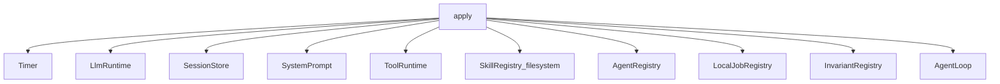
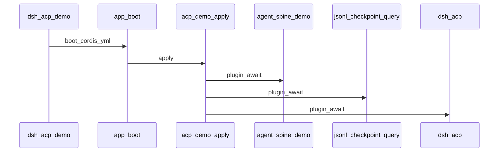
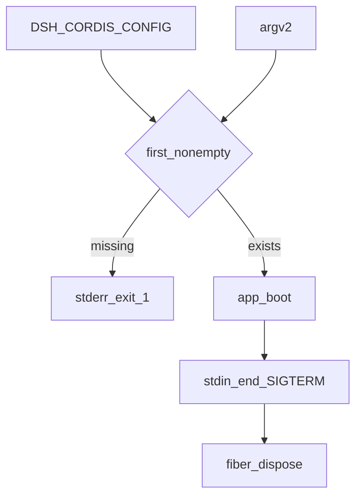

# examples/ — 可运行演示 bundle

学习笔记，非正式产品文档。本组不是产品 API。组映射见 [packages/examples/README.md](../../../packages/examples/README.md)。仓库根 [`examples/`](../../../examples/AGENTS.md) 是可跑的 `cordis.yml` 叶子；本组是那些叶子加载的 bundle。

`agent-spine-demo` 是共用脊柱；`acp-demo` 加上自动化入口；`jsonrpc-demo` 只引导外部配置。一次性产品执行走 `dsh --profile headless`。产品 ACP 走 `dsh --profile acp`。

## `@deepseek-ai/dsh-agent-spine-demo` — 无执行器、无 UI 的共用脊柱

- 角色：bundle
- ctx：无自有键；子插件分别占 `ctx.llm`、`ctx.sessions`、`ctx.tools`、`ctx.agents` 等
- 入口：[packages/examples/agent-spine-demo/src/index.ts](../../../packages/examples/agent-spine-demo/src/index.ts)
- 关键类型：`Config`、`SkillConfig`、`GoalConfig`、`pickSpineConfig`

实现逻辑：

1. 只 named export（`name` / `Config` / `apply`），避免 Loader 解开 default 丢掉 schema，见 [postmortem 0001](../../postmortem/0001-acp-default-export-drops-inject.md)。
2. `dshHome` 与 `skills.filesystem.dshHome` 必须解析到同一目录，否则组合期抛错。
3. 固定挂上 timer、llm、session、title、system-prompt、tools、agent、llm-retry、jobs-local、invariants，以及 session/agent/scope/agent-loop 四个 companion。
4. skills、tool-bash、workspace-context、tool-jobs、goals 可用 config 关掉或省略；关 skills 时 registry、filesystem、tool-skill 一起不挂。
5. workspace 指令必须先于 skill catalog 注册，因为两者都往 session-prefix 前插，顺序就是渲染顺序。
6. `pickSpineConfig` 只拷本 bundle 拥有的字段，避免入口点设置漏进脊柱。
7. `workspaceContext` 必须显式给字节预算或 `false`；它会改模型可见输入，不能靠隐式默认。

源码走读：叶子仍要自己挂 LLM 适配器、`ctx.shell` 执行器、入口与 stdout 纪律。`invariants.enabled: false` 只压制检查，不卸服务和 companion 注册。

## `@deepseek-ai/dsh-acp-demo` — ACP 自动化应用

- 角色：bundle / app
- ctx：无自有键；`apply` 用一个有序 `ctx.effect` 拥有子插件生命周期
- 入口：[packages/examples/acp-demo/src/index.ts](../../../packages/examples/acp-demo/src/index.ts)、[bin.ts](../../../packages/examples/acp-demo/src/bin.ts)
- 关键类型：`Config`（必填 `provider` / `model` / `workspaceContext`）

实现逻辑：

1. `apply` 里 `ctx.effect(async function* () { ... }, 'acp-demo.composition')` 按序挂脊柱、JSONL persistence、checkpoint policy、SQLite query、ACP 桥；yield 各自 `dispose`，卸载反向进行。
2. 脊柱不预创建 agent（`agents` 默认 `[]`）；ACP 在 `session/new` 用 `provider`/`model` 各建一个。
3. `persistenceRoot` 默认 `./.sessions`；query 库是同目录下的 `session-query.db`，必须在 ACP 接活之前打开。
4. 不装 logger、不装 `hmr`：stdout 只给 JSON-RPC。
5. bin 走 `dsh-app-boot`：`dsh-acp-demo [--config path]`，默认 `./cordis.yml`。
6. `DSH_SNAPSHOT=replay` 不读 `.env`，改选兄弟 `cordis.snapshot.yml`，避免 stray key 打到真模型。
7. snapshot 模式下 stdin EOF 会 `dispose` 再 `exit(0)`，好让 persistence flush。

源码走读：叶子仍要提供适配器、执行器、沙箱、审批、文件系统和模型可见工具。本包不做人机 UI、不恢复旧会话。sibling 插件若往 stdout 写非协议字节，本包拦不住。

## `@deepseek-ai/dsh-sdk-jsonrpc-demo` — 外部配置的 JSON-RPC bin

- 角色：bin
- ctx：无键；`index.ts` 不导出组合插件
- 入口：[packages/examples/jsonrpc-demo/src/index.ts](../../../packages/examples/jsonrpc-demo/src/index.ts)、[runner.ts](../../../packages/examples/jsonrpc-demo/src/runner.ts)、[bin.ts](../../../packages/examples/jsonrpc-demo/src/bin.ts)、[packaged-bin.ts](../../../packages/examples/jsonrpc-demo/src/packaged-bin.ts)
- 关键类型：无产品 Config；进程生命周期在 `runJsonrpcAgent`

实现逻辑：

1. 包入口是 `export {}`：配置自己决定要不要挂 `dsh-sdk-jsonrpc-server`。
2. `runJsonrpcAgent` 里 `$DSH_CORDIS_CONFIG` 优先于位置参数；两者都空或文件不存在则 stderr 一行用法并 `exit(1)`，没有 cwd / 内置回退。
3. 通用 bin `dsh-jsonrpc-agent` 从配置工程解析 bare 插件；`packaged-bin` 把 `import.meta.url` 交给 runner，让已安装运行时闭包解析 bare 插件。
4. stdin EOF 与 `SIGTERM` dispose 后 `exit(0)`；`SIGINT` 同样 dispose 后 `exit(130)`。
5. 退出路径幂等，可与协议层 `shutdown` 竞态。
6. 本协议不用 `DSH_SNAPSHOT`。

源码走读：没有 server 插件的合法配置会成功启动但什么也不服务。stdout 只承载 JSON-RPC 帧；诊断走 stderr。EOF 会切断进行中的 turn，需要有序收尾的调用方走协议 `shutdown`。
