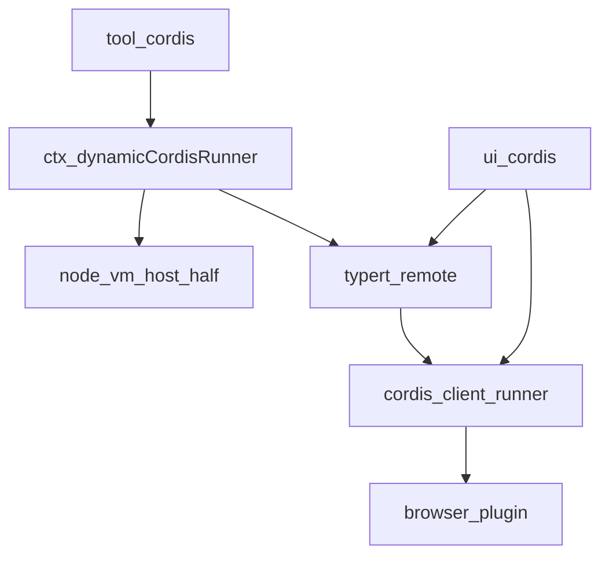
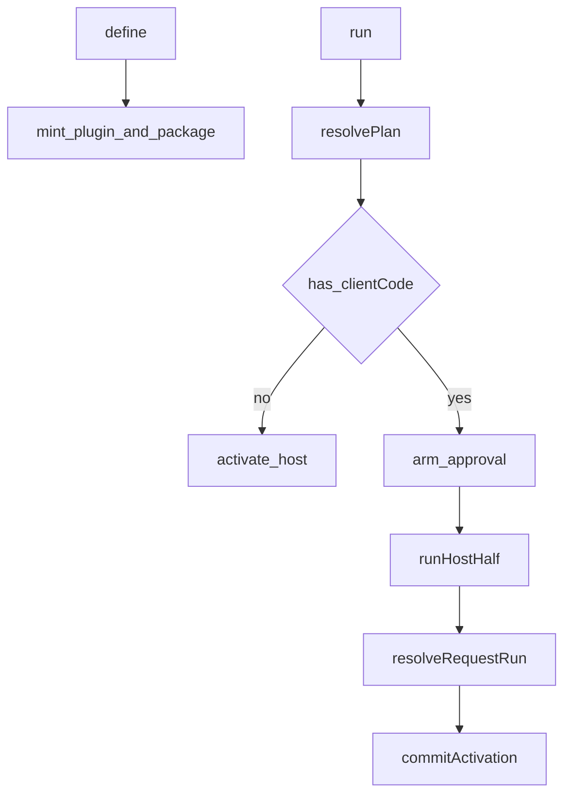
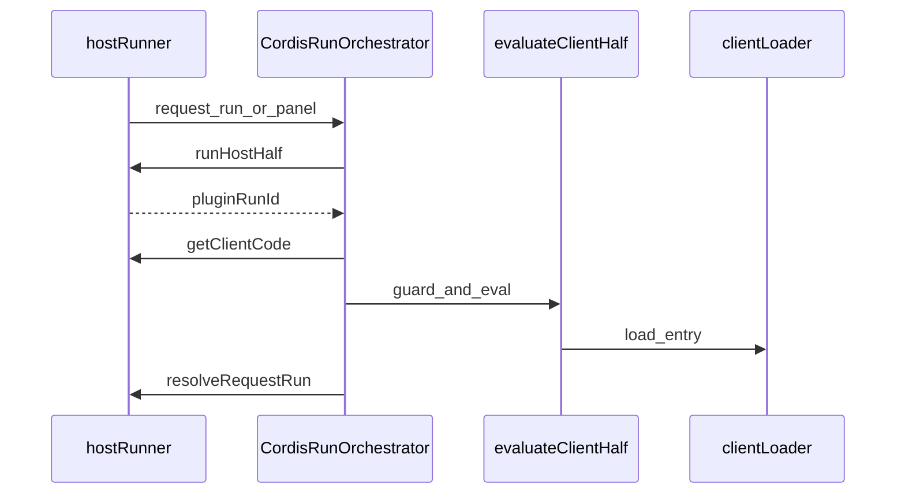
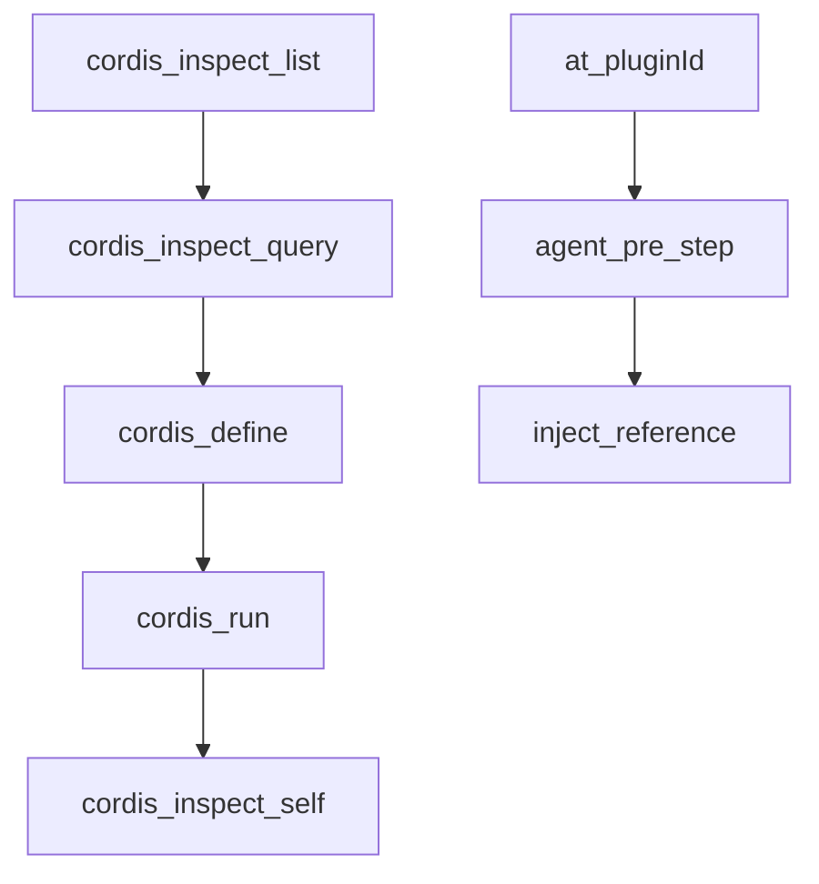
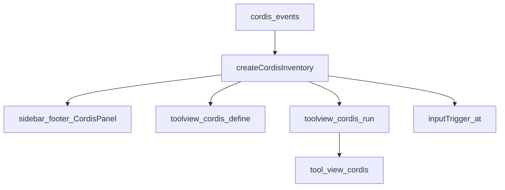

# extensions/ — 模型改自己的 Cordis 运行时

学习笔记，非正式产品文档。类型合同见 [extensions.md](../../subsystems/extensions.md)。组映射见 [packages/extensions/README.md](../../../packages/extensions/README.md)。

Plugin 是稳定身份；Package 是不可变版本。`cordis_define` 只记账，`cordis_run` 才激活。带 Client 半的激活要人批；`currentPackageId` 只在两侧都成功后前进。

## `@deepseek-ai/dsh-cordis-host-runner` — 宿主登记与生命周期

- 角色：Service（`TypertRemoteService`）
- ctx：`ctx.dynamicCordisRunner`；`inject: ['tools']`
- 入口：[packages/extensions/cordis-host-runner/src/index.ts](../../../packages/extensions/cordis-host-runner/src/index.ts)、[registry.ts](../../../packages/extensions/cordis-host-runner/src/registry.ts)、[lifecycle.ts](../../../packages/extensions/cordis-host-runner/src/lifecycle.ts)、[sandbox.ts](../../../packages/extensions/cordis-host-runner/src/sandbox.ts)
- 关键类型：`DynamicCordisPlugin`、`DynamicCordisDefinition`、`DynamicCordisRunAttempt`、`CordisDynamicPluginId`
- emit：`cordis/request-run`、`cordis/request-run-resolved`、`cordis/dynamic-package`、`cordis/dynamic-retract`

实现逻辑：

1. `define`：`kind: 'new'` 用 3–6 位小写前缀铸 `pluginId`；`kind: 'existing'` 在同一 Plugin 上追加 Package。至少要有 host 或 client 代码，并 `precheckCode`。
2. `run` 校验 `run` / `update` 模式：无 current 不能 update；current 已是该 Package 不能 update；换版本必须 update。
3. 纯 Host Package 立刻 `activate`；有 Client 则铸 `ApprovalRequestId`，未授权则 `awaiting-approval`。
4. `runHostHalf`：vm 评 Host 代码，必须返回 Plugin 函数或 `{ apply }`；`startHostHalf` 挂到 `cordis-dynamic` 组 fiber，启动失败先 dispose 再抛。
5. Client 结算走 `resolveRequestRun`（模型批）或 `settleUserRun`（面板手势）；失败 `retract`，current 不动。
6. `invoke` 按 `pluginRunId` 调活 Host handler；过期 run 返回 `stale-run`。
7. 渲染/guard/handler 失败 `steer` 模型去 inspect、改同一 Plugin、`mode: "update"` 重试。
8. `undefine` 停 run、取消 pending、删全部 Package；`stop` 只停 run，版本留下。

源码走读：`DynamicCordisRunnerService.define`、`run`、`activate`。所有权按 session id；Remote 方法给浏览器面。

## `@deepseek-ai/dsh-cordis-client-runner` — 浏览器半加载器

- 角色：Client 插件（宿主 `apply` 为空，占 Loader 行）
- ctx：浏览器 `ctx.dynamicCordisRunner`（`CordisRunnerFace`）；`inject: ['loader', 'modules', 'slots', 'remote', 'remote.dynamicCordisRunner']`
- 入口：[packages/extensions/cordis-client-runner/src/index.ts](../../../packages/extensions/cordis-client-runner/src/index.ts)、[client/index.ts](../../../packages/extensions/cordis-client-runner/src/client/index.ts)、[client/orchestrator.ts](../../../packages/extensions/cordis-client-runner/src/client/orchestrator.ts)、[client/runtime.ts](../../../packages/extensions/cordis-client-runner/src/client/runtime.ts)
- 关键类型：`CordisRunOrchestrator`、`DynamicCordisPackageRunner`、`CordisRunActivity`

实现逻辑：

1. 宿主半的空 `apply` 只为出现在 host `cordis.yml`；真逻辑在 `exports["./client"]`。
2. 页面激活时不装任何动态包；只有 `cordis_run` 或面板手势才加载。刷新从干净页开始，定义仍在宿主内存。
3. `CordisRunOrchestrator`：先 Host 半，再取 Client 源，再评、再结算。活动表按 Plugin 键，remount 不丢审批。
4. `evaluateClientHalf` + guard：闭包 → 守卫 → 模块表 → loader entry。
5. `host.call` 经 Remote `invoke`；codec 拒收时补上“哪一次 call”的说明。
6. 渲染崩溃 fire-and-forget `reportRenderFailure`，不把一次崩溃变成两次。
7. Client inspect provider 同步到宿主 `cordisInspect`，供 `cordis_inspect_query` 等页回答。
8. `connection/reset` 重发 inspect manifest。

源码走读：`apply`（client）、`CordisRunOrchestrator`、`DynamicCordisPackageRunner`。`isLoaded` 是页本地事实，不是宿主的“在跑”。

## `@deepseek-ai/dsh-tool-cordis` — 模型工具面

- 角色：Consumer
- ctx：无自有键；`inject: ['tools', 'systemPrompt', 'dynamicCordisRunner', 'cordisInspect']`
- 入口：[packages/extensions/tool-cordis/src/index.ts](../../../packages/extensions/tool-cordis/src/index.ts)、[prompt.ts](../../../packages/extensions/tool-cordis/src/prompt.ts)、[inspect.ts](../../../packages/extensions/tool-cordis/src/inspect.ts)
- 工具：`cordis_inspect_list`、`cordis_inspect_query`、`cordis_inspect_self`、`cordis_define`、`cordis_run`、`cordis_stop`、`cordis_undefine`

实现逻辑：

1. 登记 Host inspect provider，并挂长 `tool:cordis` 段（怎么查、怎么定义、怎么激活）。
2. `cordis_inspect_list` / `query`：先目录再按 schema 查；Client 查询等到有页回答或取消。
3. `cordis_inspect_self`：无 id 列 Plugin；只有 pluginId 看指针与摘要；两个 id 才给源码。
4. `cordis_define` 只校验并记账，不批、不 apply、不改 current。
5. `cordis_run` 返回 `awaiting-approval` / `starting` / `running`，不等最终结局；异步结果靠 steer。
6. `cordis_stop` 对已停幂等成功；`cordis_undefine` 永久删除。
7. `agent/pre-step` 扫用户消息里的 `@pluginId`，注入 `<cordis_dynamic_plugin_context>`，要求 existing + 正确 mode。
8. 所有工具要 `exec.agent`。

源码走读：`cordis_run.execute`、`referencedPluginIds`、`CORDIS_SYSTEM_PROMPT`。Inspect 方法不是会话里能调的业务 Service。

## `@deepseek-ai/dsh-ui-cordis` — 面板与卡片

- 角色：Client UI 插件（宿主 `apply` 为空）
- ctx：无自有宿主键；client `inject: ['slots', 'locale', 'inputTriggers', 'remote', 'remote.dynamicCordisRunner', 'dynamicCordisRunner']`
- 入口：[packages/extensions/ui-cordis/src/index.ts](../../../packages/extensions/ui-cordis/src/index.ts)、[client/index.ts](../../../packages/extensions/ui-cordis/src/client/index.ts)、[client/slots.ts](../../../packages/extensions/ui-cordis/src/client/slots.ts)
- 关键类型：`CordisPanelFace`、`CordisRunCardFace`、`CordisInventory`

实现逻辑：

1. 宿主半同样是占位；浏览器半挂槽位与 `@` 源。
2. `CordisDynamicPort` 把面板手势打到 Remote：`stopFromPanel` / `undefineFromPanel` / `inventory`。
3. 侧栏 footer 登记 `CordisPanel`：批、拒、手跑、停、删、刷新。
4. `cordis_define` 只读卡；`cordis_run` 卡声明子槽 `tool.view.cordis`（Package 自己的业务 UI，key `self`）。
5. `cordis_stop` / `cordis_undefine` 用共享 `CordisActionRow`。
6. `@` trigger 按当前 session 的 Plugin 出候选；挑中插入 `@pluginId `。
7. 订 `cordis/dynamic-package`、`dynamic-retract`、`request-run`、`request-run-resolved` 刷新库存；`connection/reset` 重置再拉。
8. 库存变化时 `reconcileApprovals`，避免漏事件丢审批。

源码走读：`apply`（client）、`createCordisInventory`、`tool.view.cordis`。页本地 `loaded` / `renderFailures` 与宿主“最近一次跨页失败”分属不同寿命。
