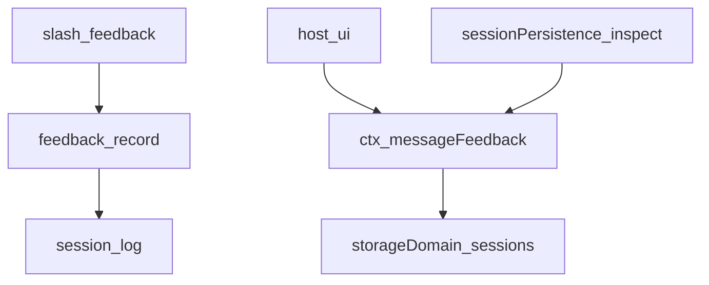
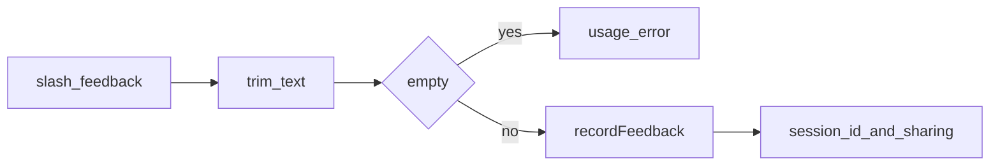
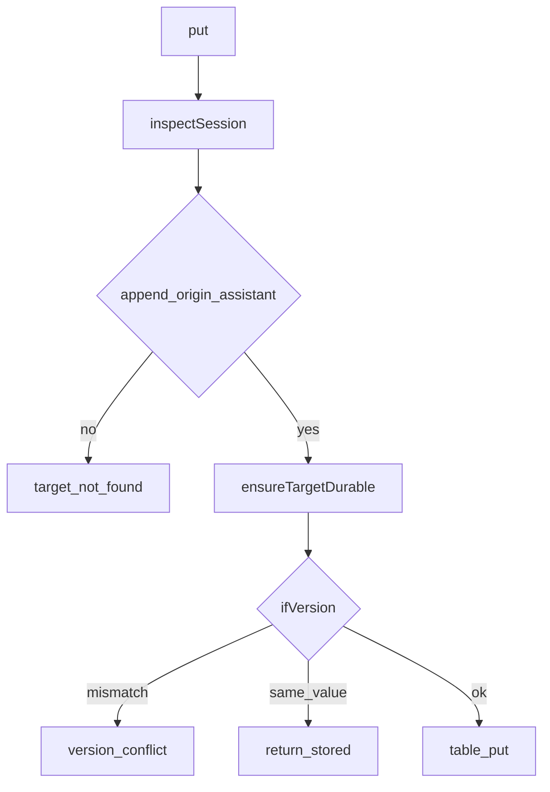

# feedback/ — 人类反馈

学习笔记，非正式产品文档。sidecar 与 Host Remote 见 [feedback.md](../../subsystems/feedback.md)；`feedback/record` 见 [session.md](../../subsystems/session.md)。组映射见 [packages/feedback/README.md](../../../packages/feedback/README.md)。

两种合同刻意分开：会话级不可变备注在 canonical 日志里；按助手消息的可编辑评分在本地 sidecar。两种都不进模型对话。

## `@deepseek-ai/dsh-command-feedback` — `/feedback` 与日志事件

- 角色：Consumer
- ctx：无自有键；`inject: ['commands']`；可选 `ctx.get('sessionTelemetry')`
- 入口：[packages/feedback/command-feedback/src/index.ts](../../../packages/feedback/command-feedback/src/index.ts)
- 事件：`feedback/record` `{ text: string }`（log-only，非 surface）
- 命令：`feedback`（`recordInput: false`）

实现逻辑：

1. `recordFeedback(session, text)` trim 后拒空，append `feedback/record`。与 UI 触发解耦，可供其它入口复用。
2. `/feedback` 无文本返回 usage error，不写事件。
3. 成功回执含 session id、匿名用户 id，以及 telemetry 披露：`full` / `feedback-only` / `disabled`，或“未配置”。
4. append 急切但不 flush：回执只保证已入日志，不保证落盘。
5. 不启动模型工作；`deriveMessages` 看不到这条。

源码走读：`recordFeedback` 是唯一写入。sharing 句子按封闭 `SessionTelemetrySharingStatus` 切换，未来新状态必须在此加臂。telemetry 插件若在，可观察该事件放行前缀；采集本身不依赖该策略。

## `@deepseek-ai/dsh-message-feedback` — 消息 sidecar

- 角色：Service Definition（Typert Remote）
- ctx：`ctx.messageFeedback`（`inject: ['storageDomain', 'sessionPersistence', 'sessions']`）
- 入口：[packages/feedback/message-feedback/src/index.ts](../../../packages/feedback/message-feedback/src/index.ts)、[spec.ts](../../../packages/feedback/message-feedback/src/spec.ts)、[types.ts](../../../packages/feedback/message-feedback/src/types.ts)
- 关键类型：`MessageFeedbackItem`、`MessageFeedbackVersion`、`MessageFeedbackRating`
- Remote：`list` / `put` / `delete`
- Config：必填 `maxNoteBytes`

实现逻辑：

1. `Service.init` 打开 `messageFeedbackDomainSpec` 的 KV 表 `sessions`；dispose 先停接纳、排空 per-session 队列，再关 domain。
2. 从不 create/resume Agent 或 Session。先看 live store，再看 persistence catalog；目录里有的 inspect 失败保持基础设施错误，不猜成 `session-not-found`。
3. 目标必须是 finalized、append-origin 的 `assistant/message`（`deriveEventMessage`）。
4. `put` 前对 live owner `sessions.flush`，再 `readFrom(0)` 核对 header 身份与目标仍在。
5. `ifVersion` 必须等于现有 item 的 version（新建则为 `null`）。值未变则不升 version。
6. note：缺省合法；空白 → `note-blank`；UTF-8 字节超 `maxNoteBytes` → `note-too-large`。
7. `delete`：不存在即成功；存在则要精确 version。行用 `createdAt`+`cwd` 绑定生命周期，重用的 session id 看不见旧行。
8. 同一 SessionId 的突变经 `operationTails` 串行。返回值全部 freeze。

源码走读：`inspectSession` / `hasFeedbackTarget` / `enqueue` 是三条边界。这不是 Session 事件或 projection，也不做 telemetry 交接。Host Remote 随服务走；客户端 UI 另属。
