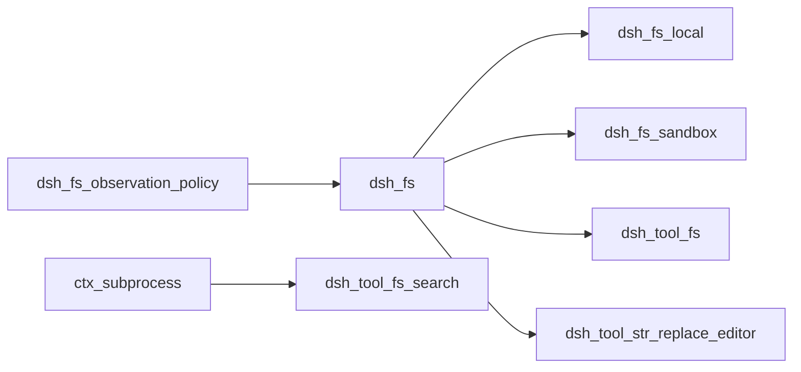
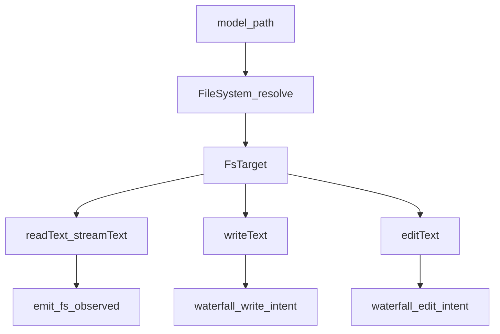
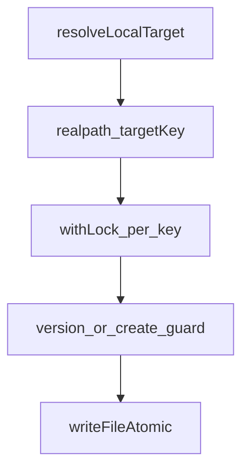
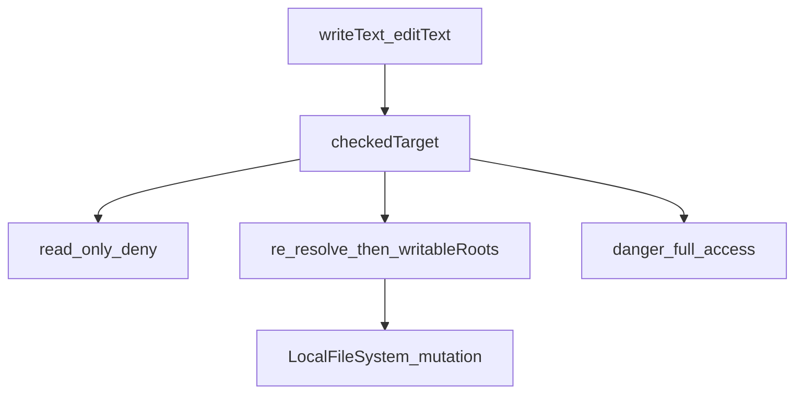
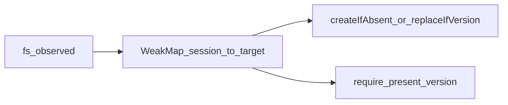
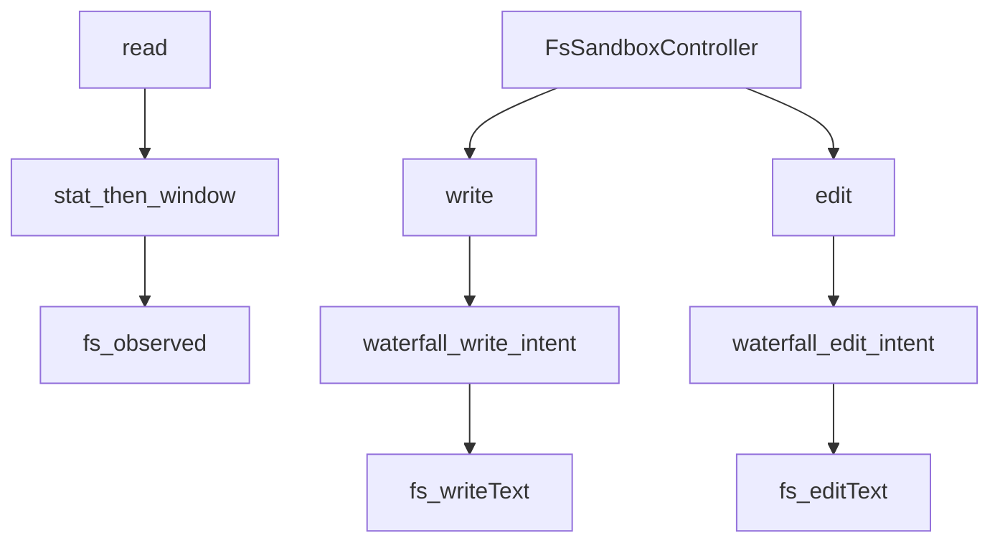
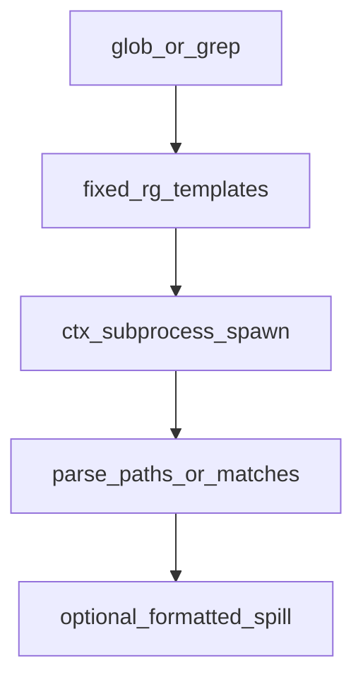
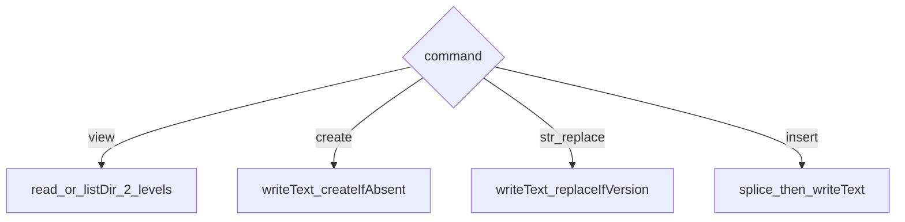

# fs/ — 一个执行世界的文件系统

学习笔记，非正式产品文档。权威合同见各包 README 与 [subsystems/filesystem.md](../../subsystems/filesystem.md)。组映射见 [packages/fs/README.md](../../../packages/fs/README.md)。沙箱政策见 [sandbox.md](sandbox.md)。

后端拥有稳定目标身份、进程路径、`file:` URI、包含关系、文本读、解码、拒绝二进制、原子突变。读窗口与观察态政策在 Consumer / 政策插件。`editText` 留在缝上，让版本检查、字面匹配、重写共享同一临界区。

## `@deepseek-ai/dsh-fs` — `ctx.fs` 与观察事件

- 角色：Service Definition
- ctx：`ctx.fs`
- 入口：[packages/fs/fs/src/index.ts](../../../packages/fs/fs/src/index.ts)、[types.ts](../../../packages/fs/fs/src/types.ts)
- 关键类型：`FsTarget`、`FsVersion`、`FsWriteIntent`、`FsEditRequest`、`FsError`
- 事件：waterfall `fs/write-intent`、`fs/edit-intent`；emit `fs/observed`

实现逻辑：

1. `resolve` 把路径收成稳定 `FsTarget`（`targetKey` 不透明，`displayPath` 给人看）。同一文件经别名必须同一 key。
2. `processPath` / `fileUrl` / `contains` 由后端拥有，因为宿主平台可能不同于执行平台。消费者不得解析 `targetKey`。
3. `stat` 只给元数据；缺席返回 `undefined`。`lstat` 是路径形、不跟随最后一段符号链接。
4. `readText`/`streamText` 必须是正规 UTF-8；`readBytes` 在缝上封 `maxBytes`，超限 `FS_TOO_LARGE`，不截断返回。
5. `writeText`/`editText` 可选 `expected` 守卫；可选 `sandboxPolicy` 给禁闭后端。无政策插件时是无条件原子写。
6. 两个 intent waterfall 是单槽：第一个返回的守卫赢，不与同伴组合。`fs/observed` 必须同步记录，抛错会使工具失败，返回的 Promise 不等待。
7. `sandboxMode` 基类 `undefined`；`fs-sandbox` 覆盖为部署默认，供工具广告升级字段。

源码走读：`FsWriteIntent` 只有 `createIfAbsent` 与 `replaceIfVersion`；省略 intent 才是无条件覆盖。`FsErrorCode` 含 `FS_SANDBOX_DENIED`、`FS_STALE_VERSION`、`FS_NOT_OBSERVED`、`FS_AMBIGUOUS_EDIT`。

## `@deepseek-ai/dsh-fs-local` — 宿主 realpath 后端

- 角色：Service Provider
- ctx：占住 `ctx.fs`
- 入口：[packages/fs/fs-local/src/index.ts](../../../packages/fs/fs-local/src/index.ts)、[fsio.ts](../../../packages/fs/fs-local/src/fsio.ts)
- 关键类型：`LocalFileSystem`
- 配置：`cwd`（解析默认，不是包含边界）、`diffBasisMaxBytes`（默认 10MiB）

实现逻辑：

1. `resolve` 对 `cwd`（或配置 cwd）做规范化 + realpath；别名共享 stale 守卫，经符号链接的写更新目标而不替换链接。
2. `processPath` 就是 `String(targetKey)`；`fileUrl` 用 `pathToFileURL`。
3. 每个 `targetKey` 一条 FIFO 锁：并发写/编辑确定性排序，输家看到新版本后 `FS_STALE_VERSION`。
4. `writeText`：`replaceIfVersion` 要求仍在且版本相同；`createIfAbsent` 碰上已存在则 `FS_NOT_OBSERVED`；无 expectation 仍原子写。
5. 覆盖差基：打开文件本身做有界读，任一侧达到 `diffBasisMaxBytes` 则 `before: null`。`after` 与 `before` 都 LF 规范化。
6. `editText` 先版本守卫再字面匹配，避免对更新内容报 `FS_EDIT_NOT_FOUND`。缺席目标在有守卫和无守卫路径都用 `FS_STALE_VERSION`。匹配后按原文件换行写回。
7. `listDir` 只给名字、类型、子 target、廉价元数据，不读内容。

源码走读：`cwd` 不是沙箱。包含边界要靠更严后端或 `tools/execute` 权限插件。

## `@deepseek-ai/dsh-fs-sandbox` — 突变上的进程内政策篱

- 角色：Service Provider（替换 `fs-local`）
- ctx：占住 `ctx.fs`；`inject: ['sandboxPolicy']`
- 入口：[packages/fs/fs-sandbox/src/index.ts](../../../packages/fs/fs-sandbox/src/index.ts)、[containment.ts](../../../packages/fs/fs-sandbox/src/containment.ts)
- 配置：与 `fs-local` 相同

实现逻辑：

1. 读全部放行。篱只挡 `writeText`/`editText`，且是受信代码对模型路径的政策检查，不是内核边界。
2. `sandboxMode` 暴露 `ctx.sandboxPolicy.defaultMode`。
3. `checkedTarget`：`danger-full-access` 用调用方 target；`read-only` 抛 `FS_SANDBOX_DENIED`；`workspace-write` 立刻 `resolve(displayPath)` 再对 `writableRoots(policy)` 做包含，返回这份新鲜 target，避免 check-here-write-there。
4. 拒绝是结构化 `FS_SANDBOX_DENIED`，不靠 stderr 推断。升级重试在 `tool-fs`。
5. 祖先符号链接在包含复查与 syscall 之间被换掉的 TOCTOU 被接受；本威胁模型不把它当安全边界。

源码走读：可写根与 Seatbelt 共用 `writableRoots`，避免 bash 与 write 工具漂移。

## `@deepseek-ai/dsh-fs-observation-policy` — 先读后写的观察态

- 角色：事件插件（无服务）
- ctx：无；不 `inject`
- 入口：[packages/fs/fs-observation-policy/src/index.ts](../../../packages/fs/fs-observation-policy/src/index.ts)
- 关键类型：`ObservedStateGate`、`FsObservationActor`
- 事件：占据 `fs/write-intent`、`fs/edit-intent`；记录 `fs/observed`

实现逻辑：

1. 状态按 owner（通常 `actor.agent.session`）弱持有，再按 `targetKey`。无 owner 的直接调用能读，不能满足写/编辑的先观察政策。
2. `writeIntent`：未见或确认缺席 → `createIfAbsent`；确认存在 → `replaceIfVersion`。
3. `editIntent`：未见 → `FS_NOT_OBSERVED`；确认缺席 → `FS_NOT_FOUND`；存在则给出版本。
4. 两个 waterfall **不**调用 `next()`，单槽占满。经 `Promise.resolve().then` 让抛错变成 reject。
5. `fs/observed` 同步 `WeakMap.set`。卸载 `clear()`，HMR 干净。
6. 不装本插件时，工具走裸 Provider 的无条件突变。

源码走读：owner 是 session 对象，不是 agent id 字符串，所以会话回收即释放观察态。

## `@deepseek-ai/dsh-tool-fs` — `read`/`write`/`edit`/`read_image`

- 角色：Consumer
- ctx：无自有键；`inject: ['tools','fs','systemPrompt']`；`read_image` 另需 `attachments`
- 入口：[packages/fs/tool-fs/src/index.ts](../../../packages/fs/tool-fs/src/index.ts)、[read.ts](../../../packages/fs/tool-fs/src/read.ts)、[write.ts](../../../packages/fs/tool-fs/src/write.ts)、[edit.ts](../../../packages/fs/tool-fs/src/edit.ts)、[sandbox.ts](../../../packages/fs/tool-fs/src/sandbox.ts)
- 工具：`read`、`write`、`edit`；有附件库时 `read_image`

实现逻辑：

1. `read` 先 stat 判类型与版本，大文件或未知大小走 `streamText`，按 `offset`/`limit`/`readMaxBytes`/`readMaxLineLength` 开窗，再 `fs/observed` present。
2. `write`/`edit` 不先 stat；从 waterfall 取守卫（无监听器则无条件），再把 `FsSandboxController` 解析的政策传给后端。
3. `FsSandboxController` 与 bash 共用 `approveEscalation` / `sandboxDenialMarker`。禁闭后端缺少 `sandboxPolicy` 则加载失败。
4. `FS_SANDBOX_DENIED` 映射成模型可见 `[sandbox: …]` 加同轮升级提示。
5. `read_image` 只在 `attachments` 挂上时登记，把字节提交进附件库。
6. write/edit 的 UI 是 diff 卡；read 是 read 卡。

源码走读：读窗口与观察事件在工具层，不在 Provider。`sessionResolveOptions` 把相对路径接到会话 cwd。

## `@deepseek-ai/dsh-tool-fs-search` — 打包 ripgrep 的 `glob`/`grep`

- 角色：Consumer（消费 `ctx.subprocess`，**不**消费 `ctx.fs`）
- ctx：无自有键；`inject: ['tools','systemPrompt','subprocess']`；`spillStore` 可选
- 入口：[packages/fs/tool-fs-search/src/index.ts](../../../packages/fs/tool-fs-search/src/index.ts)、[search-core.ts](../../../packages/fs/tool-fs-search/src/search-core.ts)、[glob.ts](../../../packages/fs/tool-fs-search/src/glob.ts)、[grep.ts](../../../packages/fs/tool-fs-search/src/grep.ts)
- 工具：`glob`、`grep`

实现逻辑：

1. 二进制来自 `@vscode/ripgrep`，不经 `ctx.shell`，不建模型可见后台作业。
2. 工具层拥有 schema、校验、argv、解析、留存、格式化 spill、超时声明；subprocess 拥有树终止与环境 scrub。
3. `sampleOverCapGlobResults` 无默认，必须显式配置。其余 cap 有默认；`graceMs` 不得超过 `MAX_TIMER_DELAY_MS`。
4. 返回路径相对解析后的 workdir。后续 `read` 只在 workdir 与 fs 根是同一工作区时可读——v1 部署要求，运行时不校验。
5. 超时由 `dsh-tool-call-timeout-policy` 经 `exec.signal` 执行。

源码走读：`runRipgrep` 是唯一 spawn 入口。超 cap 的原文失败码是 `SEARCH_RAW_OUTPUT_OVERFLOW`。

## `@deepseek-ai/dsh-tool-str-replace-editor` — 单工具多命令编辑器

- 角色：Consumer
- ctx：无自有键；`inject: ['tools','fs']`
- 入口：[packages/fs/tool-str-replace-editor/src/index.ts](../../../packages/fs/tool-str-replace-editor/src/index.ts)
- 工具名：`str_replace_editor`
- 命令：`view`、`create`、`str_replace`、`insert`

实现逻辑：

1. `path` 必须绝对（以 `/` 开头）；相对路径被拒绝并提示补 `/`。
2. `view`：目录列出两层、排除点文件/`node_modules`/`__pycache__`；文件按 `cat -n` 加可选 `view_range`。成功读后 `fs/observed` present。
3. `create` 拒绝已存在文件；经 `fs/write-intent`（默认 `createIfAbsent`）再 `writeText`，带会话沙箱政策。
4. `str_replace` 在工具内做字面唯一性检查（多处命中列出行号），再 `writeText(..., replaceIfVersion)`——不走 `editText`。无政策监听器时用当前 `stat` 版本。
5. `insert` 把 `new_str` 插到 `insert_line` 之后（行号从 0），同样 `writeText` + 版本守卫。
6. `MutationPolicy`：禁闭后端必须有 `sandboxPolicy`；`FS_SANDBOX_DENIED` 换成共享 marker。超长输出夹 `<response clipped>`。

源码走读：这是给习惯 Anthropic `str_replace_editor` 表面的组合用的，不是 `edit` 工具的别名；突变统一走 `writeText`，观察态仍走 `fs/*` 事件。
