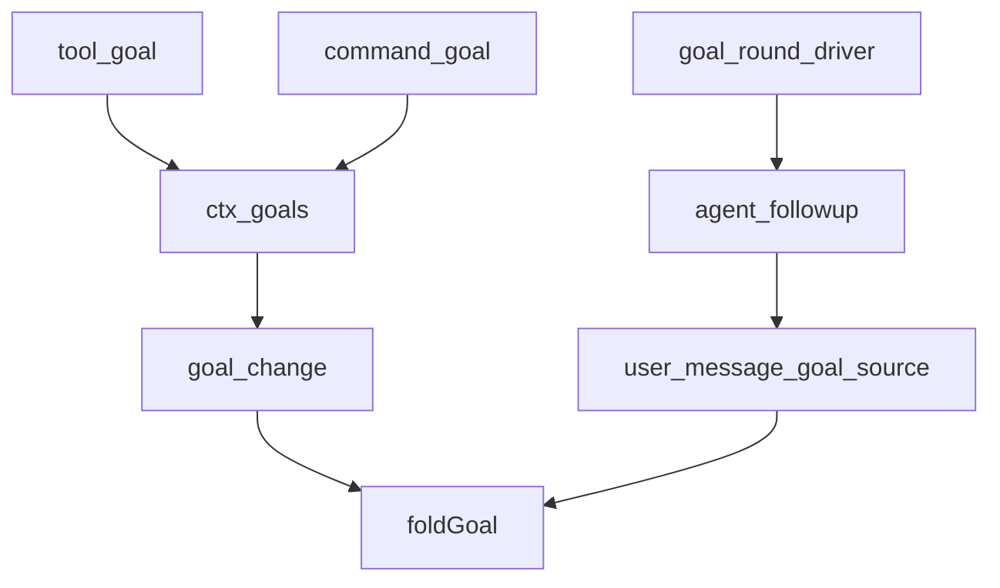
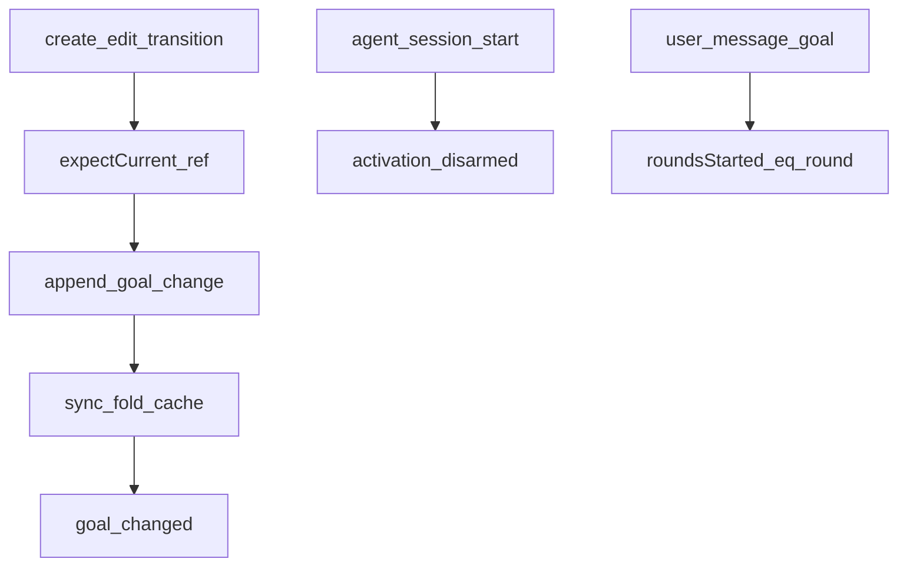
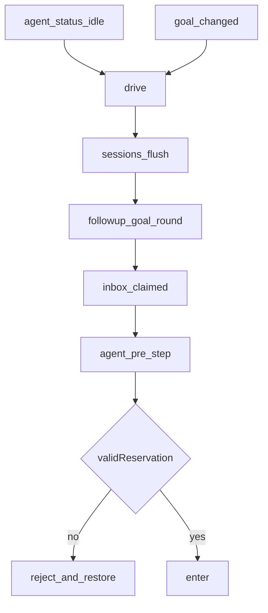
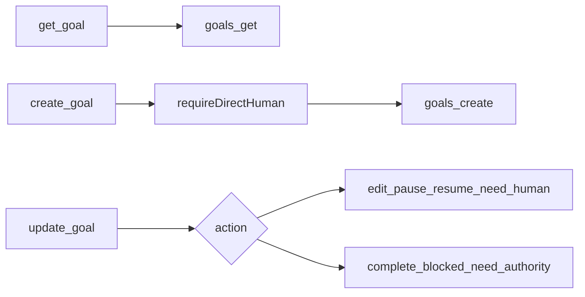
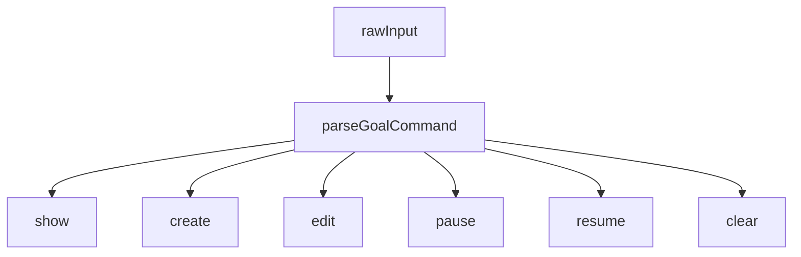

# goal/ — 同会话目标

学习笔记，非正式产品文档。身份、生命周期与激活见 [goal.md](../../subsystems/goal.md)。组映射见 [packages/goal/README.md](../../../packages/goal/README.md)。

`dsh-goal` 拥有耐久状态；driver / tools / command 都依赖它，不依赖具体 loop。

## `@deepseek-ai/dsh-goal` — 事件源状态

- 角色：Service Definition
- ctx：`ctx.goals`（`inject: ['agents']`）；可选 `sessionProjections`
- 入口：[packages/goal/goal/src/index.ts](../../../packages/goal/goal/src/index.ts)、[fold.ts](../../../packages/goal/goal/src/fold.ts)、[runtime.ts](../../../packages/goal/goal/src/runtime.ts)
- 关键类型：`GoalSnapshot`、`GoalView`、`GoalRef`、`GoalActivation`、`GoalError`
- 事件：`goal/change`；飞行中 `goal/changed`
- Remote：`create` / `edit` / `pause` / `resume` / `complete` / `clear`

实现逻辑：

1. 状态只存在 owning session 日志。`GoalService` 用 per-session 缓存增量 `applyGoalEvent`。
2. 突变是 compare-and-set：`GoalRef` 必须匹配当前 id+revision，否则 `GOAL_STALE_REVISION`。
3. `create` 在无目标或已 complete 时武装新目标；其它 phase 必须先 clear / resume。
4. `pause` / `block` / `complete` / `clear` 卸下自动续跑（`disarmed`）；`resume` 在预算未耗尽时重新 `armed`。
5. `agent/session-start` 把 activation 置 `disarmed`，不改 durable phase——resume/fork 后要人再授权。
6. `commit` 先把 pendingActivation 绑到即将写入的 seq，append 后再 sync；外来 `goal/change` 视为 disarmed。
7. 严格折里，匹配的 `user/message`（`source.kind === 'goal'` 且 round === `roundsStarted + 1`）把 `roundsStarted` 推进到该 round。
8. 投影 `goal` 是 last-wins 的宽松折，畸形事件保持原引用。

源码走读：`assertLive` 要求 `ctx.agents.get(id) === agent`，不只比 id。`disarm` 只动进程内 activation。`GoalId` 是 branded。默认 `defaultMaxGoalRounds` 256。

## `@deepseek-ai/dsh-goal-round-driver` — 同会话续跑

- 角色：Consumer
- ctx：无自有键；`inject: ['agents', 'goals', 'sessions']`
- 入口：[packages/goal/goal-round-driver/src/index.ts](../../../packages/goal/goal-round-driver/src/index.ts)、[prompt.ts](../../../packages/goal/goal-round-driver/src/prompt.ts)
- 关键类型：`RoundAttempt`、`DriverState`、`GoalMessageSource`

实现逻辑：

1. 每 live agent 一份 `DriverState`。加载时对已有 agent `disarm`，不继承上一实例的自动权。
2. idle / `goal/changed` 触发串行 `drive`（`withoutInitiator`）。先过 durability checkpoint。
3. 已有 attempt 在本轮只清预约并要求下次再 checkpoint，避免刚入队就立刻再预约。
4. active+armed 且未到 cap：`renderGoalRoundPrompt`，`followup` 一条 `source.kind === 'goal'`、`round = roundsStarted + 1` 的消息。
5. 入队失败 → `block` `queue-failed`；到 cap → `block` `round-limit`。
6. 竞争的 next-turn 插入把 queued attempt 标 stale。claimed / discarded / `user/message` 推进 phase。abort 的 turn 取消 claimed/admitted；`max-tokens` 直接 disarm。
7. `agent/pre-step` 看到 goal-round 源时，`validReservation` 必须仍是 claimed、未 stale、revision 仍对、round 恰好是下一个。失败则 reject 并 `restoreOtherClaimed`。
8. 下游 reject → `block` `prompt-rejected`。teardown 先 stopping+disarm，必要时 `cancel` 并等 idle。

源码走读：`validReservation` 是准入栅栏。`roundsStarted` 只在消息真正 append 进日志时由 fold 前进，不在 followup 时预支。idle 时若 queued/claimed 被取消，driver 会 `pause` 该目标。

## `@deepseek-ai/dsh-tool-goal` — 模型工具

- 角色：Consumer
- ctx：无自有键；`inject: ['agents', 'goals', 'tools', 'systemPrompt']`
- 入口：[packages/goal/tool-goal/src/index.ts](../../../packages/goal/tool-goal/src/index.ts)、[authority.ts](../../../packages/goal/tool-goal/src/authority.ts)、[wrapup.ts](../../../packages/goal/tool-goal/src/wrapup.ts)
- 工具：`get_goal`、`create_goal`、`update_goal`
- Config：`blockedAfterConsecutiveRounds`（默认 3）

实现逻辑：

1. `tool:goal` section（order 114）写入部署选定的 blocked 阈值。
2. `get_goal` 无参，返回当前快照或 `{ goal: null }`。
3. `create_goal` 必须 `requireDirectHuman`：只要顶层人类请求，不要子 agent / 自动 round。
4. `update_goal` 带精确 `goal_id` + `revision`。`edit` / `pause` / `resume` 同样要直接人类。
5. `complete` / `blocked` 在 goal-round 续跑里也允许；`blocked` 在 `roundsStarted < blockedAfter` 时拒（`GOAL_TOOL_BLOCK_THRESHOLD`）。
6. 续跑里 complete/blocked 成功后 `deferContext` 一条 wrapup notice，让本步收尾而不是立刻再续。
7. `blocked_reason` 只与 `blocked` 一起合法；模型报告的 code 固定为 `model-reported`。

源码走读：`goalToolExecution` 恢复 initiator agent。`completionAuthority` 区分 human vs goal-round。输出是紧凑 JSON，activation 是观察值不是 replay 状态。

## `@deepseek-ai/dsh-command-goal` — `/goal`

- 角色：Consumer
- ctx：无自有键；`inject: ['commands', 'goals']`
- 入口：[packages/goal/command-goal/src/index.ts](../../../packages/goal/command-goal/src/index.ts)
- 语法：`/goal [<objective>|clear|edit <objective>|pause|resume]`

实现逻辑：

1. 空输入 show；`clear` / `pause` / `resume` 是控制词；`edit <objective>` 改目标；其余整段当 create 的 objective。
2. 已有非 complete 目标时 create 报错，指引 edit/clear。
3. 对 complete 做 edit 会改成 create 新目标。
4. 成功输出 phase、blocker、objective、rounds、activation 和可用命令，不暴露 CAS 内部。
5. `GoalError` 收成“对当前状态无效，先 /goal 查看”。

源码走读：命令自己读当前 ref 再调 service，模型工具则要求模型抄 id/revision。`parseGoalCommand` 是唯一语法。
