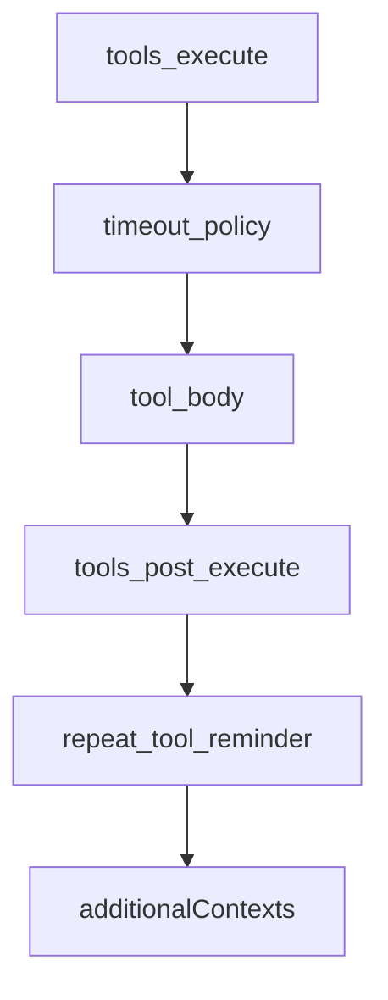
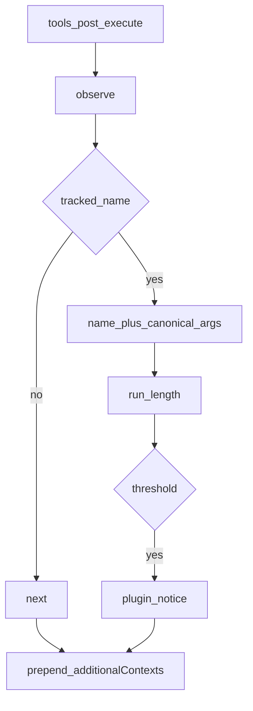
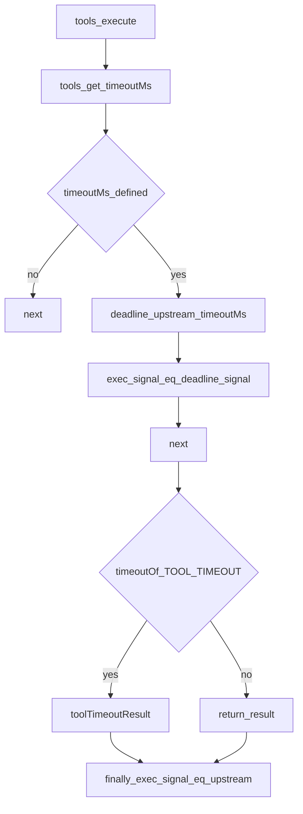

# guard/ — 循环卫生

学习笔记，非正式产品文档。工具管道见 [tools.md](../../subsystems/tools.md)。组映射见 [packages/guard/README.md](../../../packages/guard/README.md)。

Guard 不是可替换 seam，而是挂在核心扩展点上的自包含 Consumer。

## `@deepseek-ai/dsh-repeat-tool-reminder` — 重复调用提醒

- 角色：Consumer
- ctx：无自有键
- 入口：[packages/guard/repeat-tool-reminder/src/index.ts](../../../packages/guard/repeat-tool-reminder/src/index.ts)
- 关键类型：`Config`（`thresholds`、`include`、`exclude`、`argumentsPreviewChars`）、`Chain`
- 监听：`tools/post-execute`、`agent/pre-step`

实现逻辑：

1. 加载时 fail-loud：`thresholds` 非空、整数 ≥ 2、无重复；`argumentsPreviewChars` 整数 ≥ 1。默认阈值 `[3, 5, 8]`。
2. `include` / `exclude` 是调用时的 `*` 通配，不要求工具已登记。
3. 只统计带 `exec.agent` 的调用；直接 `ctx.tools.execute()` 不参与。
4. 参数深排序后 `JSON.stringify` 成 canonical；链键是 `[name, canonical]`。
5. 命中 `thresholds[0]` 用温和文案；更高阈值用带工具名、次数、截断参数的详细文案。检测始终用完整 canonical，截断只限模型可见预览。
6. 先 `observe` 再 `next()`：deny 也走同一 post-execute，所以锤拒绝调用也会计数。
7. 提醒 prepend 进 `additionalContexts`，block / accept 都带上，从不 veto。
8. `agent/pre-step` 若 claimed batch 含 `source.kind === 'user'`，清掉该 agent 的链。

源码走读：`canonicalize` / `observe` / `prependContext` 是三条主符号。exclude 匹配的工具对链透明：既不计数也不重置。

## `@deepseek-ai/dsh-tool-call-timeout-policy` — 单次工具截止

- 角色：Consumer
- ctx：无自有键；`inject: ['tools']`
- 入口：[packages/guard/timeout-policy/src/index.ts](../../../packages/guard/timeout-policy/src/index.ts)
- 常量：`TOOL_TIMEOUT`（内部 deadline 分类码 **且** 替换结果的 `error.code`）
- 监听：`tools/execute`（waterfall）

实现逻辑：

1. 监听 `tools/execute`。用 `ctx.tools.get(exec.name, exec.agent)?.timeoutMs` 读**调用方可见**的工具定义。
2. 未声明预算则原样 `next()`，不武装 deadline。
3. `using d = deadline(exec.signal, timeoutMs, TOOL_TIMEOUT)` 从上游 signal 派生截止。
4. 把 `exec.signal` **换成** `d.signal`，再 `await next()`，让 tool body / 能力层看到这个 abort。
5. `next()` 返回后，只有 `timeoutOf(d.signal, TOOL_TIMEOUT)` 有值（本包装自己的计时器响了）才用 `toolTimeoutResult(timeoutMs)` 替换结果。
6. 外层另一个 `tools/execute` 包装先响，`timeoutOf(..., TOOL_TIMEOUT)` 为 `undefined`，读成普通上游取消，不误报本插件超时。
7. `finally` **恢复** `exec.signal = upstream`，post-execute 监听器看不到这个可能已 abort 的 timeout signal。
8. 替换结果是 `isError`，文案 `tool call timed out after ${timeoutMs}ms`，`error.info.code === 'TOOL_TIMEOUT'`。

源码走读：`deadline` 武装、`exec.signal` 交换、`next()` 委托、`timeoutOf` 判定、`finally` 还原，五步缺一不可。本包装不 race、不丢弃 tool promise；工具必须自己尊重 `exec.signal` 并安静退出，然后结果才被换成结构化超时。
