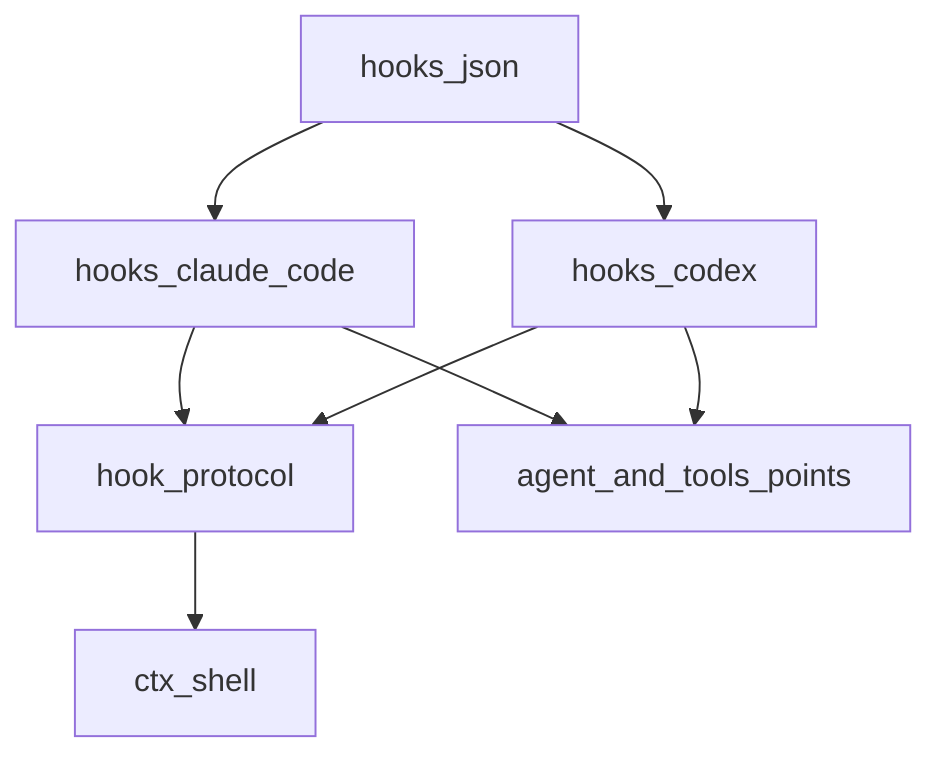
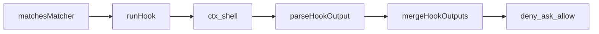
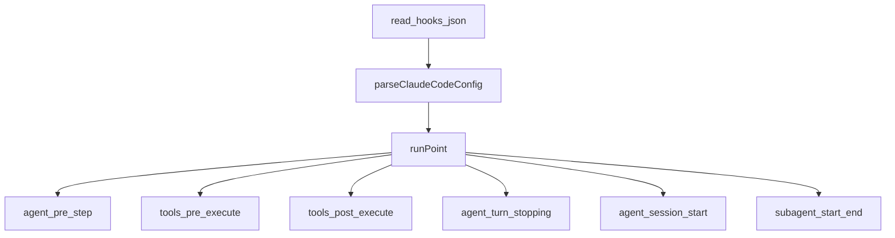
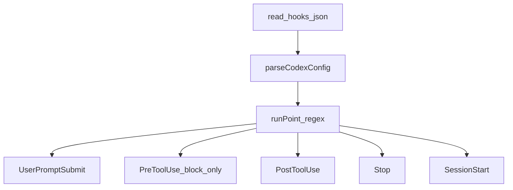

# hooks/ — 外部 hooks.json 桥

学习笔记，非正式产品文档。拦截点见 [tools.md](../../subsystems/tools.md)；`hook/*` 是 session 上的 log-only 对。组映射见 [packages/hooks/README.md](../../../packages/hooks/README.md)。

正规扩展面是 harness 自己的类型化拦截点；“原生 hook”就是挂在那些点上的 Cordis 插件。本组是把现成 `hooks.json` 翻到同一套点上的桥，外加共享协议库。

## `@deepseek-ai/dsh-hook-protocol` — 共享协议库

- 角色：library（非插件）
- ctx：无
- 入口：[packages/hooks/hook-protocol/src/index.ts](../../../packages/hooks/hook-protocol/src/index.ts)、[runner.ts](../../../packages/hooks/hook-protocol/src/runner.ts)、[merge.ts](../../../packages/hooks/hook-protocol/src/merge.ts)、[matcher.ts](../../../packages/hooks/hook-protocol/src/matcher.ts)、[codec.ts](../../../packages/hooks/hook-protocol/src/codec.ts)、[events.ts](../../../packages/hooks/hook-protocol/src/events.ts)
- 关键类型：`CommandHook`、`HookOutput`、`MergedHookOutcome`、`HookDialect`

实现逻辑：

1. `runHook` 经 `ctx.shell` 跑命令：stdin 是桥拼的 JSON，超时默认 600s，基础设施拒绝收成无 exit code 的 outcome，永不抛。
2. `parseHookOutput` 解 stdout；`hookSpecificOutput.hookEventName` 对不上当前事件则丢掉该块。
3. `mergeHookOutputs`：权限 `deny > ask > allow`；第一个 `continue:false` 粘住；理由只保留赢家档；context / systemMessage 按 hook 序累积。
4. `matchesMatcher`：缺 / 空 / `*` 全匹配。Claude 把纯字词+`|` 当字面选择，其余当正则；Codex 一律非锚定正则。坏正则运行时当不匹配。
5. `appendHookInvoked` / `appendHookResult` 写 turn 内 log-only 对；SessionStart 等 detached 点不写这对。
6. `createDetachedRuns` 跟踪 emit 形点的链，拆除时 abort 并排空。

源码走读：`runHook`、`mergeHookOutputs`、`matchesMatcher`。载荷、环境、替换、决策映射仍归各桥。

## `@deepseek-ai/dsh-hooks-claude-code` — Claude Code 方言

- 角色：Consumer / 桥
- ctx：无自有键；`inject: ['shell']`（其余点 `ctx.get`）
- 入口：[packages/hooks/hooks-claude-code/src/index.ts](../../../packages/hooks/hooks-claude-code/src/index.ts)、[config.ts](../../../packages/hooks/hooks-claude-code/src/config.ts)
- 配置：`configPath` 必填；可选 `pluginRoot` / `projectDir` / `defaultTimeoutMs`

实现逻辑：

1. load 时读一次 `configPath`；失败只 warn，登记零 hook。非 command 类型跳过并 warn。
2. `runPoint` 按 Claude matcher 筛组，在 session cwd 跑，stdin 带尾换行；`${CLAUDE_PLUGIN_ROOT}` / `${CLAUDE_PROJECT_DIR}` 做替换。
3. `CLAUDE_PROJECT_DIR`：配置优先，否则 session workspace。
4. `UserPromptSubmit` → `agent/pre-step`：`deny` 则 `reject`；否则 `next()`，再把 additionalContext 接到下游 `enter`。
5. `PreToolUse`：`deny` / `ask` 直接返回；`updatedInput` 只记日志不兑现。
6. `PostToolUse`：`deny` 则 `block`；否则委托后再叠 context。
7. `Stop`：`deny` 则 `steer` 强迫续跑。`SessionStart` / `SubagentStart|Stop` 走 detached；子 `agent_type` 固定 `general-purpose`。
8. 有开着的 turn 才写 `hook/invoked`+`hook/result`。

源码走读：`runPoint`、`preToolPayload`、`SUBAGENT_TYPE`。`systemMessage` 尚未上屏。

## `@deepseek-ai/dsh-hooks-codex` — Codex 方言

- 角色：Consumer / 桥
- ctx：无自有键；`inject: ['shell']`
- 入口：[packages/hooks/hooks-codex/src/index.ts](../../../packages/hooks/hooks-codex/src/index.ts)、[config.ts](../../../packages/hooks/hooks-codex/src/config.ts)
- 配置：`configPath` 必填；`model` 打进每条载荷

实现逻辑：

1. 只跑 sync command hook；matcher 全是正则，无字面快路径。
2. stdin **不**加尾换行；无 hook 环境、无命令替换。
3. 载荷 snake_case，每条带 `model` 与 `permission_mode: 'default'`；turn 作用域事件加 `turn_id`。
4. `PreToolUse` 只兑现 `deny`，不走 allow/ask。`tool_name` 是真工具名；`tool_input` 收成 `{ command }`。
5. `UserPromptSubmit` / `SessionStart` 可把干净非 JSON stdout 当 context（`plainStdoutAsContext`）。
6. `Stop` 的 `stop_hook_active` 恒 false：无条件 block 的 hook 会每步续跑，直到它自己收手。
7. 无 SubagentStart/Stop。SessionStart 是唯一 detached 点。
8. 读/解析失败同样零登记。

源码走读：`runPoint`、`preToolPayload`、`commandOf`。决策映射留在桥里，方言差一眼能看见。
