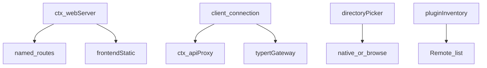
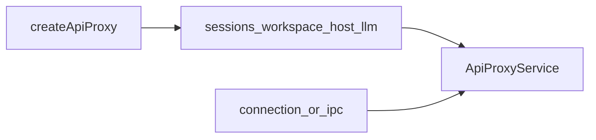
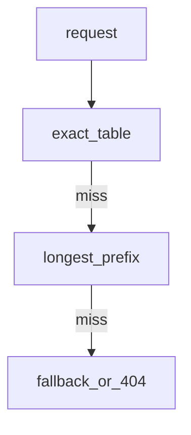
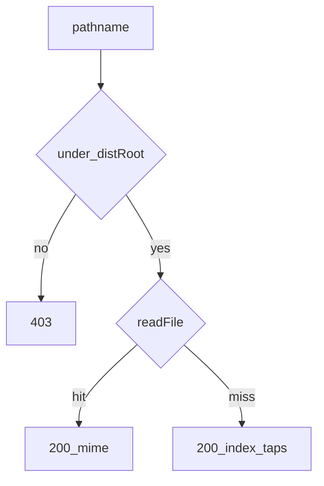
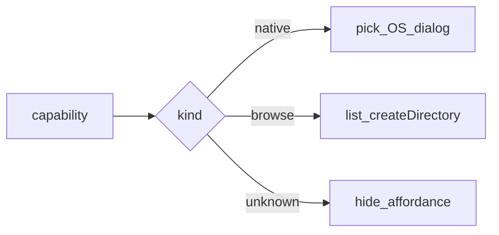
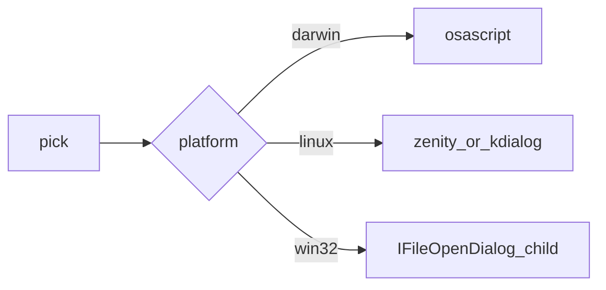
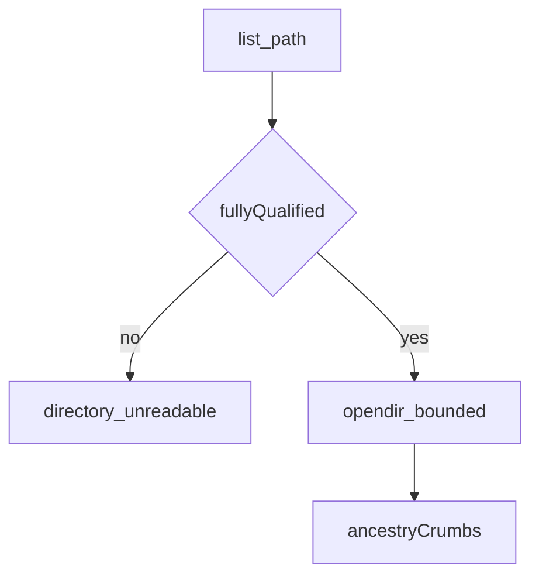
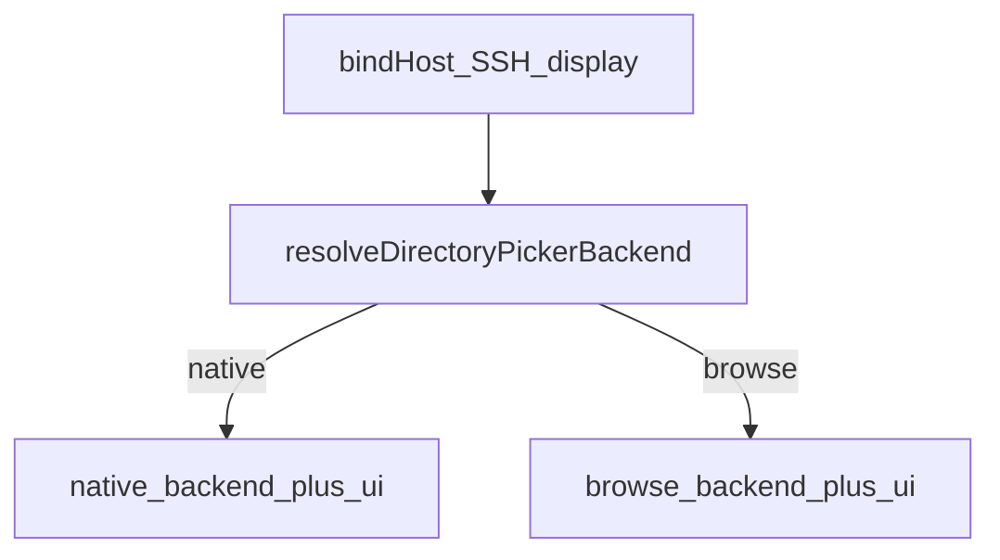

# host/ — Web GUI 宿主半边

学习笔记，非正式产品文档。HTTP 合同见 [web-server.md](../../subsystems/web-server.md)；选目录 seam 见 [workspace.md](../../subsystems/workspace.md)。组映射见 [packages/host/README.md](../../../packages/host/README.md)。浏览器半边见 [client.md](client.md)。

`apiproxy` 与传输无关；物理承运是 [client/connection](../../../packages/client/connection/README.md)。picker 实现在同一 seam 后互相替换。

## `@deepseek-ai/dsh-host-apiproxy` — 传输无关 API 网关

- 角色：Service
- ctx：`ctx.apiProxy`；`inject` 含 `agentDefaultModel`、`agents`、`attachments`、`directoryPicker`、`llm`、`sessions`、`subagents`、`sessionQuery`、`tools`、`userQuestions`、`workspaceRegistry`
- 入口：[packages/host/apiproxy/src/index.ts](../../../packages/host/apiproxy/src/index.ts)、[api-proxy.ts](../../../packages/host/apiproxy/src/api-proxy.ts)
- 关键类型：`ApiProxy`、`Config`

实现逻辑：

1. `ApiProxyService` 调 `createApiProxy(ctx, defaults)`，把返回的闭包面挂到自身字段。
2. 默认模型读写走 `ctx.agentDefaultModel`；已入日志的 session 选择不变。
3. `nativeOpen` 覆盖「能否把路径交给桌面打开」；未设则按平台探测。
4. session 导出 ZIP 的 DEFLATE 级别与冷空白探测上限是 Config。
5. 本包不注册 HTTP 路由；承运方自己包 `ctx.apiProxy`。
6. 未迁到 Typert Remote 的方法仍走这张脸；与 remotes 共用同一 Agent/Session 身份政策。

源码走读：`respond` 绑定到 `createApiProxy` 返回对象。这是遗留网关，新方法优先 Remote。

## `@deepseek-ai/dsh-host-webserver` — HTTP 路由承运

- 角色：Service
- ctx：`ctx.webServer`
- 入口：[packages/host/webserver/src/index.ts](../../../packages/host/webserver/src/index.ts)
- 关键类型：`WebRoute`、`WebUpgradeRoute`、`Config`

实现逻辑：

1. 激活即 `listen`；`EADDRINUSE` 等失败打回 fiber。
2. `host` 只许 `127.0.0.1` 或 `0.0.0.0`；无 TLS/鉴权，非回环即暴露到该网。
3. `register` 按 `(kind, path)` 去重，重复抛；顺序不影响匹配。
4. `tapIndex` 按登记序变换每份 index HTML（含 SPA fallback）。
5. `registerFallback` 只能一个主人；第二人抛。
6. handler 抛错：未出头则 400，已出头则毁 socket，不退出进程。
7. dispose 同时 `close()` 与 `closeAllConnections()`，否则 SSE 会挂住拆除。

源码走读：本包不打印 URL，也不懂 harness 概念。Electron 走 `file://` + IPC，不经此服务器。

## `@deepseek-ai/dsh-host-frontend-static` — SPA dist 占 fallback 座

- 角色：Consumer
- ctx：无自有键；`inject: ['webServer']`
- 入口：[packages/host/frontend-static/src/index.ts](../../../packages/host/frontend-static/src/index.ts)
- 配置：`distIndex`（index.html 绝对路径）

实现逻辑：

1. `apply` 认领 `registerFallback`。
2. 非 GET/HEAD 回 405。
3. 解析后的目标必须是 dist 根或其子路径，否则 403（Windows 用 `sep` 判断）。
4. `/` 与 `index.html` 走 `applyIndexTaps`。
5. 其它 miss（ENOENT/EISDIR）也回 index 200，给 SPA 路由。
6. 未知扩展名当 `application/octet-stream`。

源码走读：dist 位置由组装方（web-app）注入，本包不写死路径。

## `@deepseek-ai/dsh-host-directory-picker` — 选目录 seam

- 角色：Service Definition
- ctx：`ctx.directoryPicker`
- 入口：[packages/host/directory-picker/src/index.ts](../../../packages/host/directory-picker/src/index.ts)
- 关键类型：`DirectoryPickerCapability`、`DirectoryListing`、`DirectoryPickerError`

实现逻辑：

1. 抽象 `DirectoryPicker` 以 `super(ctx, 'directoryPicker')` 占键；第二实现按 Cordis 重复服务规则抛。
2. `capability()` 返回稳定对象，消费者可跨调用抓住。
3. `native`：宿主显示器上开一次 OS 选择器，`pick(signal)` 回路径或 `null`。
4. `browse`：`list` / `createDirectory`，给远程浏览器用，宿主屏幕不渲染。
5. 联合可 declaration-merge；未知 `kind` 的文档化默认是藏起选择入口，不失败。
6. browse 失败词汇：`directory-unreadable` / `directory-exists` / `directory-create-failed`。

源码走读：交互形状不同，不是同一组方法换后端。消费者必须 `switch`。

## `@deepseek-ai/dsh-host-directory-picker-native` — OS 选择器后端

- 角色：Service Provider
- ctx：占住 `ctx.directoryPicker`
- 入口：[packages/host/directory-picker-native/src/index.ts](../../../packages/host/directory-picker-native/src/index.ts)、[native-picker.ts](../../../packages/host/directory-picker-native/src/native-picker.ts)
- 关键类型：`NativeDirectoryPicker`

实现逻辑：

1. 子类实现 `capability()` 为稳定 `{ kind: 'native', pick }`。
2. macOS 走 `osascript`；Linux 先 Zenity 再 KDialog；Windows 在子进程主线程用 koffi 谈 `IFileOpenDialog`。
3. `signal` abort 终止选择器。
4. 只在操作员坐在宿主屏幕前可用。

源码走读：远程部署应组 browse，不要组这个。

## `@deepseek-ai/dsh-host-directory-picker-browse` — 应用内浏览后端

- 角色：Service Provider
- ctx：占住 `ctx.directoryPicker`
- 入口：[packages/host/directory-picker-browse/src/index.ts](../../../packages/host/directory-picker-browse/src/index.ts)
- 关键类型：`DirectoryListing`、`ListingCandidate`

实现逻辑：

1. `list` 缺 path 则列 home；path 必须 fully-qualified（Windows 要带盘符或完整 UNC），禁止相对宿主 cwd 解析。
2. 流式读目录，名称排序窗口有界，超限标 `truncated`，内存 O(keep)。
3. 隐藏项打标但仍返回；指向目录的符号链接计入。
4. `createDirectory` 的 `name` 必须是单段，不是 `.`/`..`。
5. `signal` abort 停扫描。

源码走读：政策（隐藏、跟随链接、整盘范围）记在 seam Agent Note，不在客户端拼路径。

## `@deepseek-ai/dsh-host-directory-picker-auto` — 按宿主事实选一对

- 角色：组合插件
- ctx：无自有键；`inject: ['webServer', 'loader']`
- 入口：[packages/host/directory-picker-auto/src/index.ts](../../../packages/host/directory-picker-auto/src/index.ts)、[resolve.ts](../../../packages/host/directory-picker-auto/src/resolve.ts)
- 关键类型：`DirectoryPickerHostFacts`、`DirectoryPickerBackendKind`

实现逻辑：

1. 启动采样一次：bind host、platform、SSH/DISPLAY、Linux 选择器二进制。
2. 非 `127.0.0.1`、有 SSH、非 darwin/win32/linux、Linux 无 DISPLAY/WAYLAND 或无 zenity/kdialog → `browse`。
3. `loader.create` 先后挂后端包与对应 `ui-directory-picker-*`；内存根树，不写回配置文件。
4. 卸载按反序 `loader.remove`，等两面 fiber 静默。
5. 创建中途失败会卸已挂条目，避免 `directoryPicker` 重复注册。

源码走读：钉死某交互应直接组那一对，不要走 auto。

## `@deepseek-ai/dsh-host-plugin-inventory` — Loader 只读投影

- 角色：Typert Remote Service
- ctx：`ctx.pluginInventory`；`inject: ['loader']`
- 入口：[packages/host/plugin-inventory/src/index.ts](../../../packages/host/plugin-inventory/src/index.ts)
- 关键类型：`PluginInventorySnapshot`、`PluginInventoryEntry`
- Remote：`pluginInventory/list`

实现逻辑：

1. `PluginInventoryGateway` 继承 `TypertRemoteService`，`@Remote('list')`。
2. 每次调用直读 Loader，不缓存；Cordis 已维护 `Entry.fiber`。
3. 跳过 `options.group` 行。
4. `fiberPhase` 映射 PENDING/LOADING/ACTIVE/FAILED/UNLOADING；DISPOSED 为 `null`。

源码走读：设置页的 Plugins 库存页消费这个 Remote，不另开事件流。
