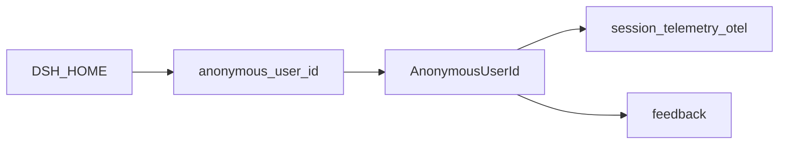
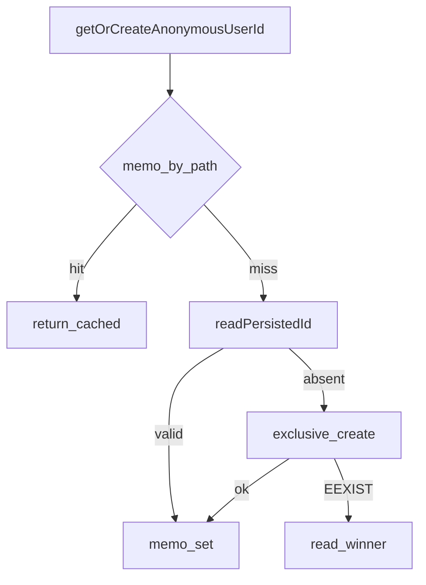

# identity/ — 匿名身份

学习笔记，非正式产品文档。本包无独立 subsystem 页；消费者合同见 [session-telemetry.md](../../subsystems/session-telemetry.md)。组映射见 [packages/identity/README.md](../../../packages/identity/README.md)。

这些值不是已认证账户。

## `@deepseek-ai/dsh-anonymous-user-id` — Harness home 级相关 id

- 角色：library
- ctx：无键
- 入口：[packages/identity/anonymous-user-id/src/index.ts](../../../packages/identity/anonymous-user-id/src/index.ts)
- 关键类型：`AnonymousUserId`、`getOrCreateAnonymousUserId`

实现逻辑：

1. 文件是 `resolveDshHome()` 下的 `.anonymous-user-id`，一行裸 UUID，无包装格式。
2. id 是随机 UUID，不从主机名、网络地址或 git remote 派生。
3. 作用域是 harness home，不是机器：共享 `$DSH_HOME` 的进程报同一 id；删文件则下次启动新铸。
4. 读写同步，按解析后的文件路径 memo：一进程碰盘一次，运行中删除文件仍保持本进程 id。
5. 首次启动用 `wx` 独占创建；输家重读赢家的 id。
6. 重读仍无效则 best-effort 覆盖；home 只读时仍返回内存 id，不挡住 telemetry/feedback。
7. 损坏的已有文件当作缺席，走同一铸造路径。

源码走读：OTel backend 把这个 id 放在 Resource 的 `user.id` 上，按批而不是按条。测试经 `env` / `randomUUID` 钩子换 home，避免共享 id。
