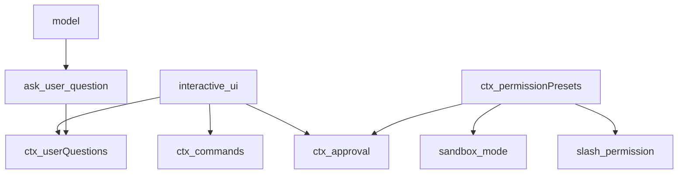
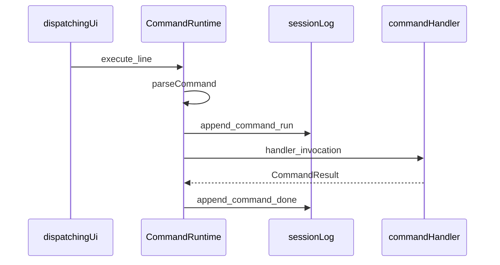
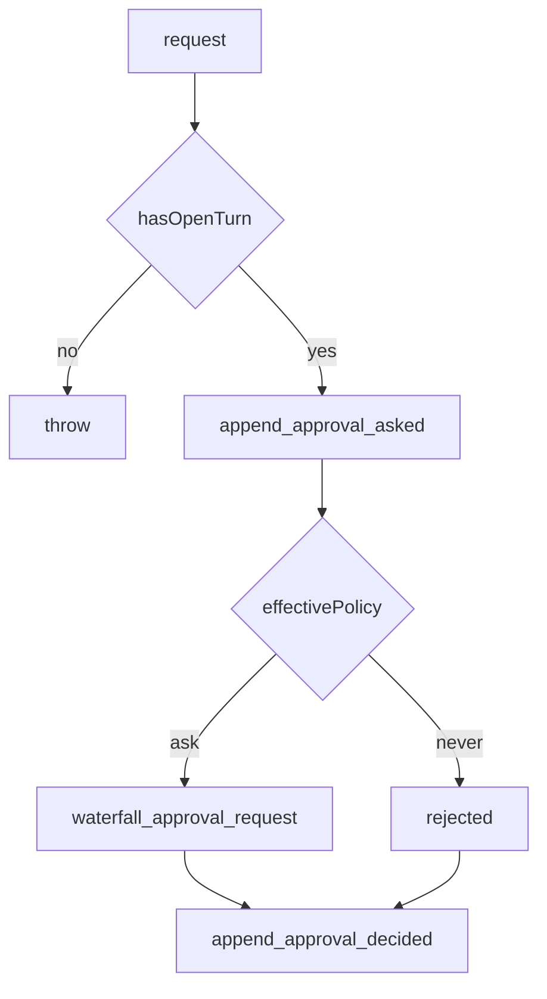
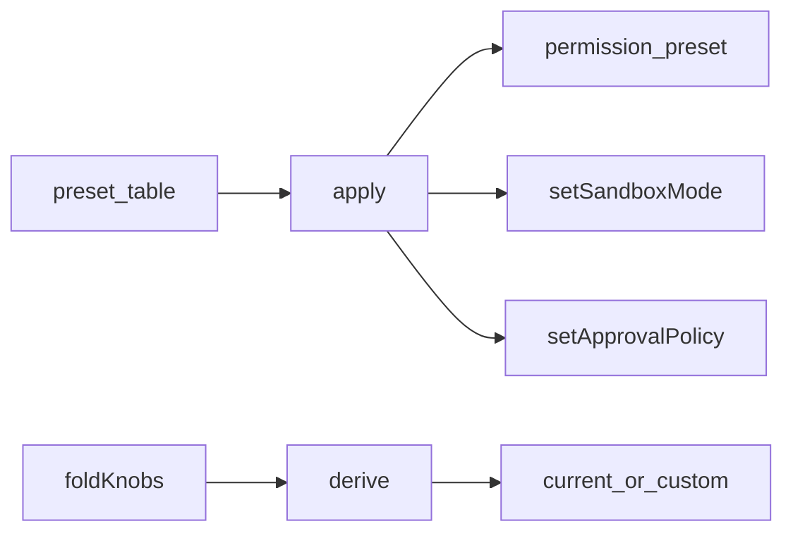
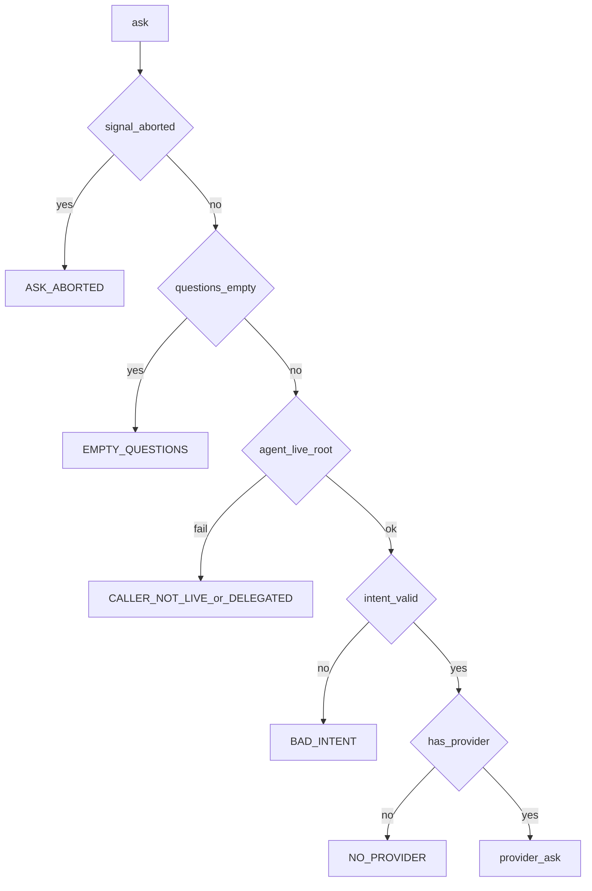
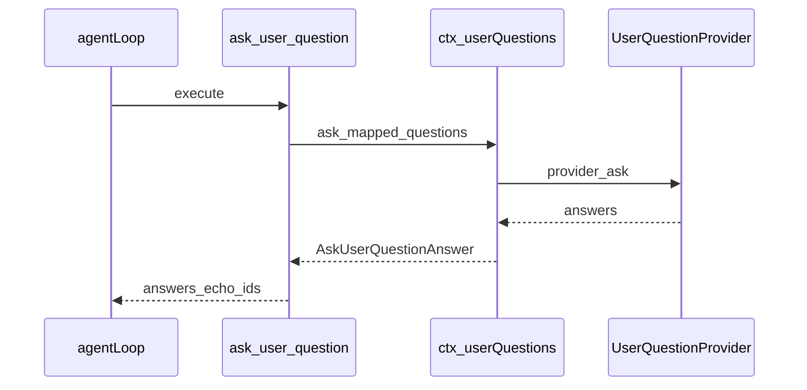

# interaction/ — 人机协作平面

学习笔记，非正式产品文档。类型合同见 [commands.md](../../subsystems/commands.md)、[approval.md](../../subsystems/approval.md)、[user-questions.md](../../subsystems/user-questions.md)、[permission-presets.md](../../subsystems/permission-presets.md)。组映射见 [packages/interaction/README.md](../../../packages/interaction/README.md)。

人写斜杠命令、答审批、答选择题；模型只通过 `ask_user_question` 提问。预设把 sandbox 与 approval 两个旋钮捆成一张表，执行仍读各自的 fold。

## `@deepseek-ai/dsh-commands` — 斜杠命令注册表

- 角色：Service Definition
- ctx：`ctx.commands`
- 入口：[packages/interaction/commands/src/index.ts](../../../packages/interaction/commands/src/index.ts)、[types.ts](../../../packages/interaction/commands/src/types.ts)、[brand.ts](../../../packages/interaction/commands/src/brand.ts)
- 关键类型：`CommandDefinition`、`CommandInvocation`、`CommandResult`、`CommandId`
- emit：`commands/change`；写入：`command/run`、`command/done`

实现逻辑：

1. `CommandRuntime` 以 `super(ctx, 'commands')` 占住键；全局层与 agent 作用域层用 `ScopedLayers` 合并，同名 scoped 盖掉 global。
2. `register` 先 `normalizeDefinition`：名字匹配 `^[a-z][a-z0-9_-]*$`，description 非空，handler 必须是函数。
3. `parseCommand` 只认 `/name` 后跟空白或行尾，不规范化 `rawInput`。
4. `execute` 语法或未知名返回 `undefined` 且不写日志；命中后铸 `CommandId`，先 `command/run` 再调 handler。
5. handler 用 `withAbort` 包住：UI 的 `signal` 取消时不再等不合作的 handler。
6. 抛错或 abort 记 `command/done` 的 `kind: 'error'`；`command/done` 追加失败只 warn，不盖住 handler 自己的错。
7. `recordInput: false` 时 `args` 不进日志，避免与领域事件重复。
8. `list` / `execute` 标 `@Remote`，给 UI 适配器发现与派发。

源码走读：`parseCommand`、`CommandRuntime.execute`、`mintCommandId`。命令不进模型；`command/run` 与 `command/done` 是 log-only，不包 turn。

## `@deepseek-ai/dsh-user-approval` — 一次性审批缝

- 角色：Service Definition
- ctx：`ctx.approval`
- 入口：[packages/interaction/user-approval/src/index.ts](../../../packages/interaction/user-approval/src/index.ts)、[types.ts](../../../packages/interaction/user-approval/src/types.ts)
- 关键类型：`ApprovalRequest`、`ApprovalOutcome`、`ApprovalPolicy`、`ApprovalRequestId`
- waterfall：`approval/request`；写入：`approval/asked`、`approval/decided`、`approval/policy`

实现逻辑：

1. `ApprovalService` 占住 `ctx.approval`；默认策略 `'ask'`，可配 `'never'`。
2. `request` 必须在开着的 turn 里：审计对要被 turn 包住，否则 reload 当崩溃尾巴丢掉。
3. 先写 `approval/asked`，再 `decide`，再写 `approval/decided`；缺一边提交就拒绝，避免无日志决策。
4. `'never'` 在 dispatch 之前就 `'rejected'`，防止 `prepend: true` 的监听器绕过。
5. waterfall 默认 `'unavailable'`（缺应答者 fail-closed）；非法返回值与抛错也收成 `'unavailable'`。
6. `signal` abort 立刻 `'cancelled'`，迟到的应答丢掉。
7. `setPolicy` 写 `approval/policy` 并用 `agent.inject` 通知模型；初始化用导出的 `setApprovalPolicy`，因为那时没有“上一策略”。
8. 有 `systemPrompt` 时挂 `approval:policy` 段：`'never'` 与 `'ask'` 各一句模型可见说明。

源码走读：`ApprovalService.request`、`effectiveApprovalPolicy`、`decide`。唯一授权是 `'allowed-once'`，只覆盖这一次被问的动作。

## `@deepseek-ai/dsh-permission-presets` — 权限预设表

- 角色：Service
- ctx：`ctx.permissionPresets`；`inject: ['shell', 'approval', 'sessions']`
- 入口：[packages/interaction/permission-presets/src/index.ts](../../../packages/interaction/permission-presets/src/index.ts)、[types.ts](../../../packages/interaction/permission-presets/src/types.ts)
- 关键类型：`PresetSpec`、`KnobState`、`PermissionSelect`、`CUSTOM_PRESET`
- 写入：`permission/preset`（再经 setter 写 `sandbox/mode`、`approval/policy`）

实现逻辑：

1. 表默认 `workspace-write`（workspace-write + ask）与 `danger-full-access`（danger-full-access + never）；`custom` 留给对不上的派生态，不能当表项。
2. 挂载要求 `ctx.shell.sandboxMode` 存在：预设捆了 sandbox，无约束执行器是配错。
3. `session/created` 与已有 session 走 `pinInitialPermission`：全新 session 钉用户默认；半初始化的只补缺的耐久事实。
4. `apply` 先写 `permission/preset`（当前已是该名则跳过），再只改真正变化的旋钮。
5. `current` / `derive`：上次选中且捆包仍匹配则赢平局，否则表里第一个匹配，再否则 `custom`。
6. 有 `sessionProjections` 时登记 `permissions`：`applyKnobEvent` 折三个旋钮，`view` 产出 `PermissionSelect`。
7. 有 `commands` 时登记 `/permission`：空输入报当前与可用名；`/permission <name>` 调 `approval.setPolicy`。
8. settings 命名空间 `permission` 的 `defaultPreset` 管未来新 session。

源码走读：`PermissionPresetService.apply`、`derive`、`pinInitialPermission`。执行与回放读旋钮 fold，不读预设事件；预设事件只保存“用户选的是哪一档”。

## `@deepseek-ai/dsh-user-questions` — 向人提问的缝

- 角色：Service Definition
- ctx：`ctx.userQuestions`
- 入口：[packages/interaction/user-questions/src/index.ts](../../../packages/interaction/user-questions/src/index.ts)、[types.ts](../../../packages/interaction/user-questions/src/types.ts)
- 关键类型：`AskUserQuestionRequest`、`AskUserQuestionItem`、`AskUserQuestionAnswer`、`UserQuestionProvider`、`UserQuestionError`

实现逻辑：

1. `UserQuestionService` 占住 `ctx.userQuestions`；同一 context 只许一个 provider。
2. `registerProvider` 走 `ctx.effect`；重复登记抛 `DUPLICATE_PROVIDER`。
3. `ask` 先看 abort 与空问题列表。
4. 带了 `agent` 则必须是注册表里那份活实例，且必须是 root：被拥有的 child 没有人类应答者。
5. `intent`（如 `plan-review`）要求 `approve` 标签是本题选项之一，且带 `detail`；错在提问方拦下，不让各 UI 各自猜。
6. 无 provider 抛 `NO_PROVIDER`。
7. 通过后把请求原样交给 `provider.ask`。

源码走读：`UserQuestionService.ask`、`registerProvider`、`UserQuestionError`。所有权看运行时 root，不看耐久谱系：resume 成新 root 的 session 可以再问。

## `@deepseek-ai/dsh-tool-ask-user` — 模型可见的提问工具

- 角色：Consumer
- ctx：无自有键；`inject: ['tools', 'userQuestions']`
- 入口：[packages/interaction/tool-ask-user/src/index.ts](../../../packages/interaction/tool-ask-user/src/index.ts)
- 工具名：`ask_user_question`

实现逻辑：

1. `apply` 登记 `ask_user_question`：一次可带多题，每题有稳定 `id`。
2. 参数含 `question`、可选 `header` / `options` / `multi_select`。
3. `execute` 把 snake_case 映成服务的 camelCase（`multiSelect`），并传入 `exec.agent` 与 `exec.signal`。
4. 返回 `{ answers: [{ id, selected, custom? }] }`，`id` 原样回显。
5. `presentCall` 未自定义，走 generic 卡。

源码走读：`apply` 里的 `defineTool` 与 `ctx.userQuestions.ask`。工具只做词汇翻译；活 root / 委派拒绝全在服务里。
