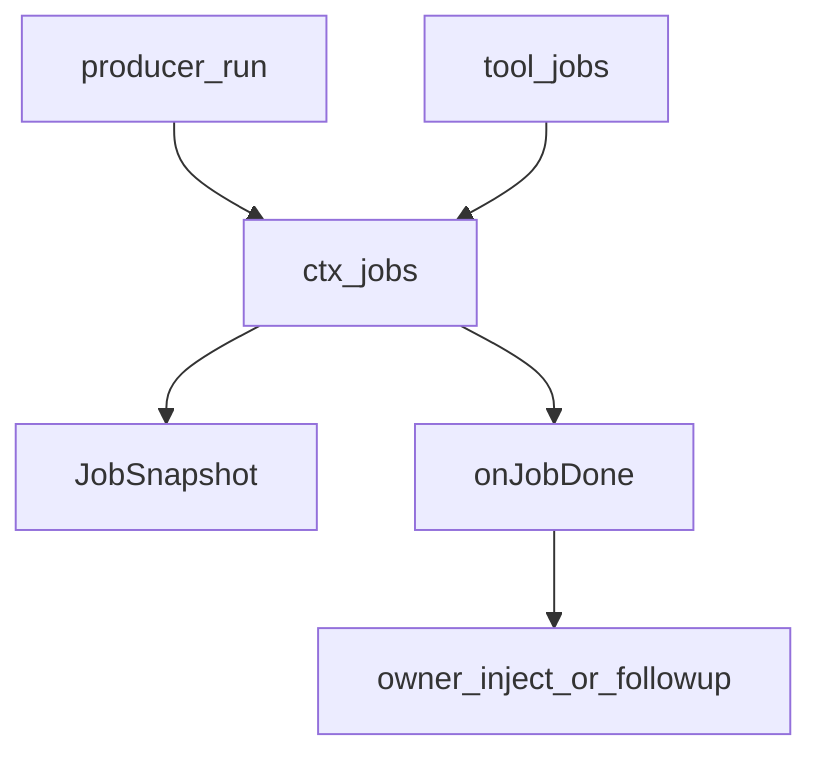
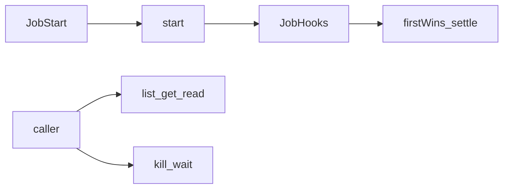
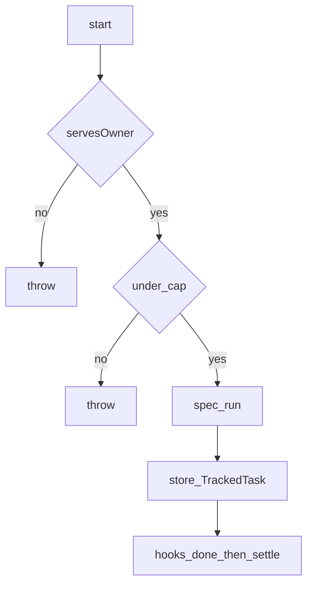
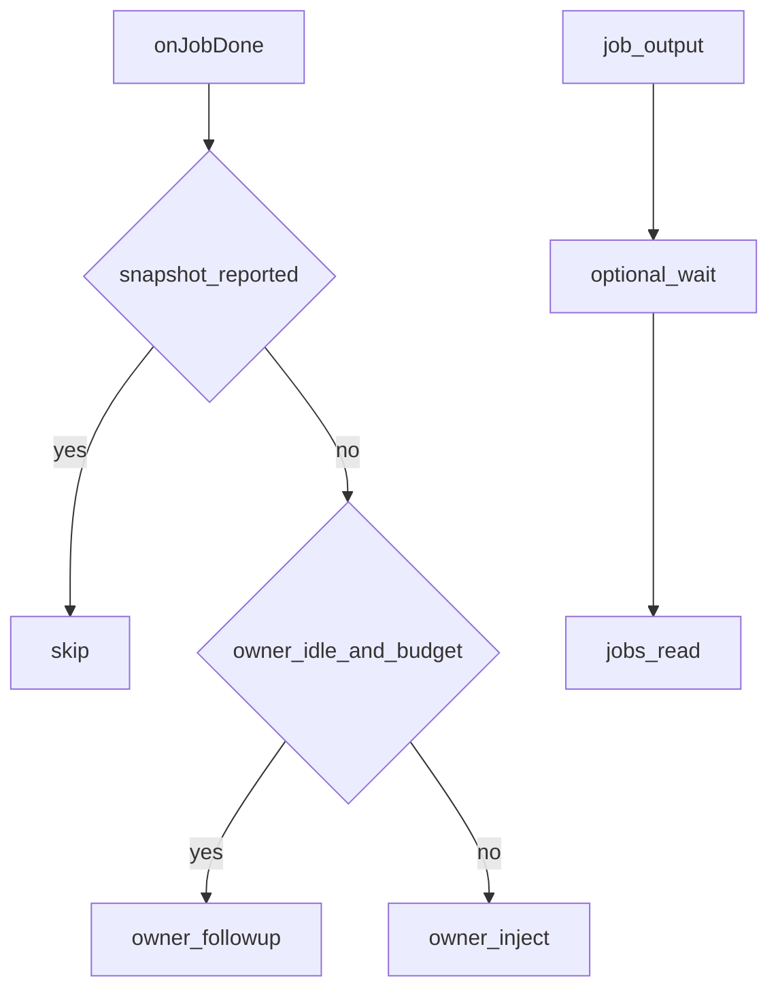

# jobs/ — 后台任务登记

学习笔记，非正式产品文档。类型合同见 [jobs.md](../../subsystems/jobs.md)。组映射见 [packages/jobs/README.md](../../../packages/jobs/README.md)。

Definition 只定合同；真正的内存表在 `jobs-local`。`tool-jobs` 挂上 controller，并负责把未报告的完成送到主人模型。

## `@deepseek-ai/dsh-jobs` — 抽象登记表

- 角色：Service Definition（抽象类，不能当插件加载）
- ctx：`ctx.jobs`
- 入口：[packages/jobs/jobs/src/index.ts](../../../packages/jobs/jobs/src/index.ts)、[types.ts](../../../packages/jobs/jobs/src/types.ts)、[brand.ts](../../../packages/jobs/jobs/src/brand.ts)
- 关键类型：`JobStart`、`JobHooks`、`JobSnapshot`、`JobId`、`JobKind`

实现逻辑：

1. `new.target === JobRegistry` 时构造即抛：组合行写这个包会得到没有实现的 `ctx.jobs`。
2. `start` 预检通过后才调 `run()`；starter 抛则什么都不登记。
3. 有 owner 的任务按 session id 隔离；id 可预测，边界是授权不是保密。
4. 结算 first-wins：一条终态、释放 waiter、一轮被包容的监听，晚到的 producer 结果丢掉。
5. `onJobDone` 最后宣布完成，因为 reporter 可能同步开 turn。
6. `attachController` 是 `start` 的前置：没有能服务该 owner 的 controller 就拒收。
7. 登记活过 producer / controller fiber；owner 或服务拆除取消活任务并等待合规 producer。

源码走读：`JobRegistry`、`JobStart`、`JobHooks`。`JobKindMap` 可 declaration merge（已有 `bash`、`subagent`）。

## `@deepseek-ai/dsh-jobs-local` — 进程内实现

- 角色：Service Provider
- ctx：占住 `ctx.jobs`
- 入口：[packages/jobs/jobs-local/src/index.ts](../../../packages/jobs/jobs-local/src/index.ts)
- 关键类型：`LocalJobRegistry`、`Config.maxConcurrentJobsPerOwner`
- 配置：每 owner（或无主桶）默认最多 10 个 `running`+`stopping`

实现逻辑：

1. `start` 检查 controller 层、kind/label 非空、`outputLimitBytes`，再 `run()` 拿 hooks，铸 `<kind>-N`。
2. `hooks.done` 兑现则 `settle`；拒绝收成 `failed`，避免 waiter 挂死。
3. `list` / `get` / `read` / `kill` / `wait` 都走 `assertAccess`：有主任务只给同 session 的 caller。
4. `read` 对流式任务吃 `readOutput` 游标；终态任务把 `reported` 标真。
5. `kill` 先 `cancel`（抛则状态不变），再标 `stopping` 且 `reported`。
6. `wait` 用 `deadline`；超时码 `TASK_WAIT_TIMEOUT` 与 caller abort 分开。结算时若有 waiter 先标 `reported`。
7. controller / listener 按 `ScopedLayers`：未作用域登记服务所有 owner，作用域登记只服务该链。
8. owner 拆除 `disposeOwned`：取消、等 `settled`、从 store 删掉并 `onJobsChanged`。

源码走读：`LocalJobRegistry.start`、`settle`、`servesOwner`。交出去的永远是新鲜 snapshot，不是活记录。

## `@deepseek-ai/dsh-tool-jobs` — 模型侧控制与完成通知

- 角色：Consumer
- ctx：无自有键；`inject: ['tools', 'jobs', 'systemPrompt']`
- 入口：[packages/jobs/tool-jobs/src/index.ts](../../../packages/jobs/tool-jobs/src/index.ts)
- 工具：`job_output`、`job_list`、`job_kill`
- 配置：`waitTimeoutMs`（30s）、`maxWaitTimeoutMs`（10min）、`completionDelivery`（`wakeup`）、`maxConsecutiveWakes`（3）

实现逻辑：

1. `apply` 调 `jobs.attachController('tool-jobs')`，否则 producer 无法 `start`。
2. 登记 `tool:jobs` prompt 段：不要忙等，完成会通知；收尾用 `job_output`，无用的 `job_kill`。
3. `onJobDone`：已 `reported` 或无 owner 则跳过；否则组一条 `form: 'notice'` 的 user 消息。
4. 空闲 owner 且未花完 wake 预算则 `followup`；否则 `inject`。用户输入（`agent/inbox/claimed` 且 `source.kind === 'user'`）清预算。
5. `job_output` 可选 `wait`；超时返回仍在跑的状态，不抛 `TOOL_TIMEOUT`。
6. `job_list` 只列 caller 可见任务，去掉所有权字段。
7. `job_kill` 立刻返回 `cancellation-requested` 或 `already-finished`。
8. `finalizeContent` 按任务的 `outputLimitBytes` 截断完整模型可见文本。

源码走读：`apply` 里的 `onJobDone`、`job_output.execute`、`fitCompletionNotice`。忙 owner 注入下一步 inbox，同批结算只花一步；拆除结算带着 `reported` 进来，避免给正在拆的 owner 再开模型请求。
