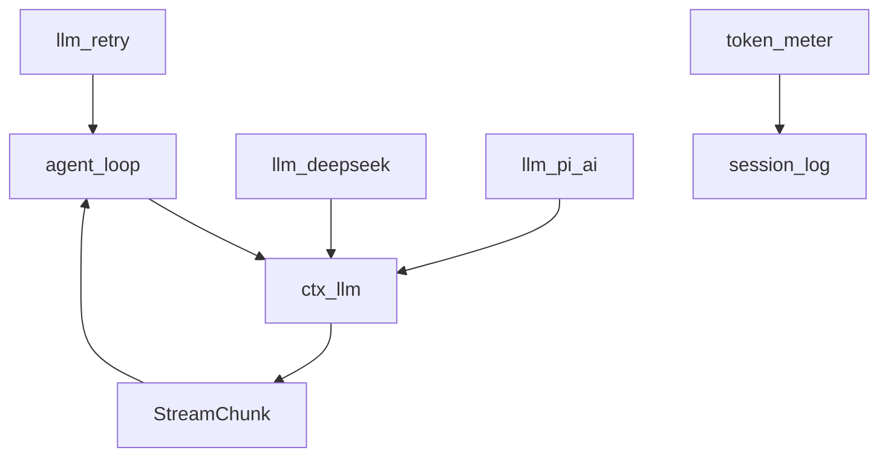
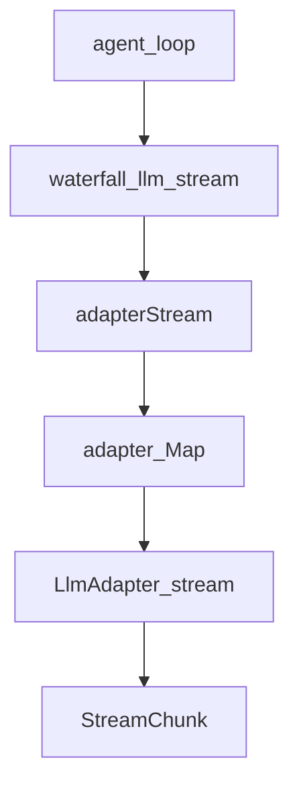
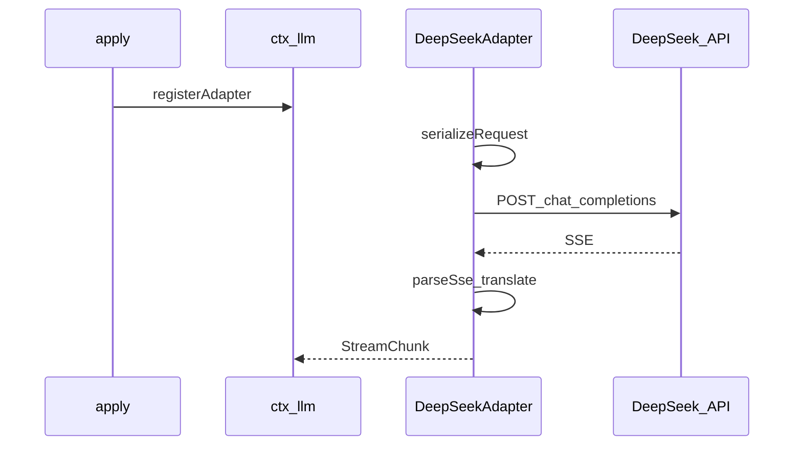
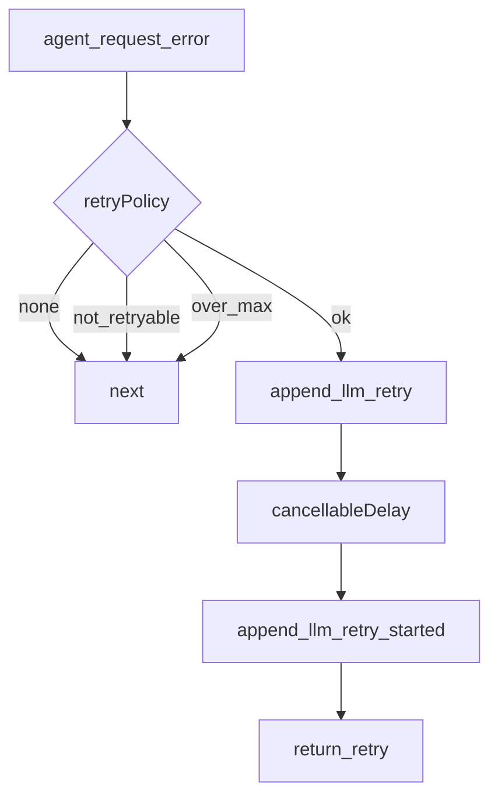
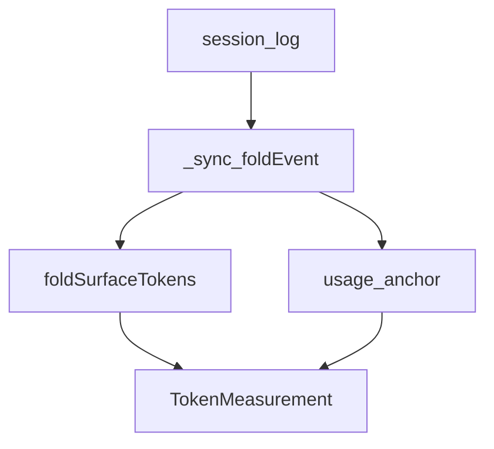

# llm/ — 模型适配与计量

学习笔记，非正式产品文档。类型合同见 [subsystems/llm-streaming.md](../../subsystems/llm-streaming.md)、[token-meter.md](../../subsystems/token-meter.md)。组映射见 [packages/llm/README.md](../../../packages/llm/README.md)。

`llm/stream` 只包住**单次**尝试。重试不挂在这条 waterfall 上，而挂在 `agent/request-error`。

## `@deepseek-ai/dsh-llm` — 适配器注册表与流协议

- 角色：Service Definition
- ctx：`ctx.llm`
- 入口：[packages/llm/llm/src/index.ts](../../../packages/llm/llm/src/index.ts)、[types.ts](../../../packages/llm/llm/src/types.ts)、[assembler.ts](../../../packages/llm/llm/src/assembler.ts)
- 关键类型：`LlmAdapter`、`GenerateOptions`、`StreamChunk`、`PreparedLlmCall`、`RetryPolicyConfig`
- waterfall：`llm/stream`；emit：`llm/adapters-updated`

实现逻辑：

1. `LlmRuntime` 以 `super(ctx, 'llm')` 占住 `ctx.llm`。
2. Provider 调 `registerAdapter(providers, adapter)`，`prepareRoutes` 校验后原子写入 Map，再 emit `llm/adapters-updated`。
3. 可选 `registerConfigurableProviders` / `registerModelDiscovery` 给设置页用。
4. loop 先 `prepareCall(config)`：校验 reasoning / maxTokens，得到一次性 `PreparedLlmCall.stream`。
5. `stream(options)` 走 `ctx.waterfall(..., 'llm/stream', ..., () => adapterStream(...))`。
6. `adapterStream` 按 `provider` 选适配器，把错误收成 terminal `finish` chunk。
7. invariant 伴侣在 `llm/stream` 前置检查 chunk 顺序（block-start / delta / block-end / usage / finish）。

源码走读：`LlmAdapter.stream` 是 Provider 唯一必须实现的方法。`BlockAssembler` 把 chunk 收成 assistant message，loop 与 token-meter 都用它。失败词汇是 `LlmError` / `LlmFailure`。

## `@deepseek-ai/dsh-llm-deepseek` — 官方 DeepSeek SSE 适配器

- 角色：Service Provider
- ctx：无自有键；`inject: ['llm']`
- 入口：[packages/llm/llm-deepseek/src/index.ts](../../../packages/llm/llm-deepseek/src/index.ts)、[adapter.ts](../../../packages/llm/llm-deepseek/src/adapter.ts)、[sse.ts](../../../packages/llm/llm-deepseek/src/sse.ts)、[translate.ts](../../../packages/llm/llm-deepseek/src/translate.ts)
- 路由名：`deepseek-official`

实现逻辑：

1. `apply` 解析连接事实与 retry policy，并 `installSettingsSection('llm-deepseek')`。
2. settings 的 retry policy 变化时 `registration.replace(['deepseek-official'])`。
3. `registerAdapter(['deepseek-official'], adapter)`，同时登记可配置 provider。
4. 每次 `stream` 快照 `options()`，`resolveApiKey`，再开 idle watchdog。
5. `serializeRequest` 后 `fetch(baseURL/chat/completions)`，带 attribution headers。
6. 非 2xx 变成带 `providerRetryAfterMs` / `requestId` 的 `LlmError`。
7. 2xx 走 `parseSse` → `translate`：维护 open blocks，拆 cache-read usage，`[DONE]` 时 emit finish。

源码走读：这是直接 fetch+SSE，不经 pi-ai。`httpErrorCode` 把 HTTP 状态收成稳定 `LlmFailure.code`，retry 插件按这个 code 决定是否重试。

## `@deepseek-ai/dsh-llm-pi-ai` — 多路由 pi-ai 适配器

- 角色：Service Provider
- ctx：无自有键；`inject: ['llm']`
- 入口：[packages/llm/llm-pi-ai/src/index.ts](../../../packages/llm/llm-pi-ai/src/index.ts)、[adapter.ts](../../../packages/llm/llm-pi-ai/src/adapter.ts)、[stream.ts](../../../packages/llm/llm-pi-ai/src/stream.ts)、[catalog.ts](../../../packages/llm/llm-pi-ai/src/catalog.ts)
- 关键类型：`PiAiProviderProfile`、`PiAiSnapshot`

实现逻辑：

1. `apply` 用 memoized `resolveProfiles(raw.providers)` 得到路由集。
2. `ensureDirectory` 把已安装 catalog 与已配置 routes 登记为可配置 provider。
3. `registerModelDiscovery('llm-pi-ai', discoverModels)` 给设置页探测 endpoint。
4. routes / retry / displayName 变化则 `registerAdapter.replace`；空 profiles 保持休眠。
5. `PiAiAdapter.current()` 在 profiles 引用变时重建不可变 `PiAiSnapshot`。
6. `stream` 在首个 await 前捕获 snapshot / model / reasoning，再 `resolveApiKey`。
7. `toPiContext` 把 Harness messages（含附件解引用）交给 `snapshot.models.streamSimple`。
8. `toStreamChunks` 翻译 pi-ai 事件，并做 error 分类与 usage 映射。

源码走读：一个适配器实例服务多条路由。`PiAiSnapshot` 冻结 `Models`，避免 stream 中途看到半更新的目录。

## `@deepseek-ai/dsh-llm-retry` — 在 request-error 上执行重试

- 角色：Consumer
- ctx：无自有键；`inject: ['agents']`
- 入口：[packages/llm/llm-retry/src/index.ts](../../../packages/llm/llm-retry/src/index.ts)、[history.ts](../../../packages/llm/llm-retry/src/history.ts)
- 监听：`agent/request-error`（waterfall）
- 写入：`llm/retry`、`llm/retry-started`

实现逻辑：

1. `apply` 注册 `agent/request-error` 监听器；dispose 时 abort 并排空进行中的 delay。
2. payload 带 `failure`、`retryPolicy`、`provider`、`turn` / `step`、`signal`。
3. 无 policy 则 `next()`。
4. `mode: 'always'` 先让下游说话；下游已决定 retry 则尊重，否则无限 backoff。
5. `mode: 'normal'` 检查 `failure.code` 是否在 `retryableCodes`，再按 session 历史数同 turn/step/provider/policyKey 的次数。
6. 超过 `maxRetries` 则 `next()`；否则算 delay（优先 `providerRetryAfterMs`，否则指数+抖动）。
7. 先 `session.append('llm/retry')`，可取消等待后再 `llm/retry-started`，返回 `{ kind: 'retry' }`。

源码走读：policy 在 adapter 注册时捕获，执行在这个 Consumer。不碰 `llm/stream`，避免把单次尝试与跨尝试恢复混在一层。

## `@deepseek-ai/dsh-token-meter` — 从日志重放 token 压力

- 角色：Service（消费 session 日志）
- ctx：`ctx.tokenMeter`
- 入口：[packages/llm/token-meter/src/index.ts](../../../packages/llm/token-meter/src/index.ts)、[estimate.ts](../../../packages/llm/token-meter/src/estimate.ts)、[surface-fold.ts](../../../packages/llm/token-meter/src/surface-fold.ts)
- 关键类型：`TokenMeasurement`、`TokenSurfaceNode`
- 监听：`session/event`；可选注册三条 session projection

实现逻辑：

1. 构造时校验空 Config；若有 `sessionProjections` 则注册 usage / pressure / breakdown 三条投影。
2. `measure(session, requestHeader?)` 先 `_sync` 追到耐久尾。
3. `_foldEvent` 处理 `request/header`、`step/start|end` 与 surface 事件。
4. `assistant/message` 若带 provider `usage` 且 header 匹配，则建 usage/estimated anchor。
5. header 对得上 anchor 时用 anchor + `surfaceDeltaTokens`；否则全量 heuristic 重估。
6. 返回冻结的 `TokenMeasurement`：`totalTokens`、`surfaceTokens`、`nodes`、`logRevision`。
7. `_estimateProviderAssistant` 用 `BlockAssembler` 重放 cited chunks，得到保守估价。

源码走读：计量是日志的纯函数，不在 stream 路径上累加。compaction 读这个服务决定剪什么。启发式密度固定为 4 chars/token，见 [token-meter.md](../../subsystems/token-meter.md)。
