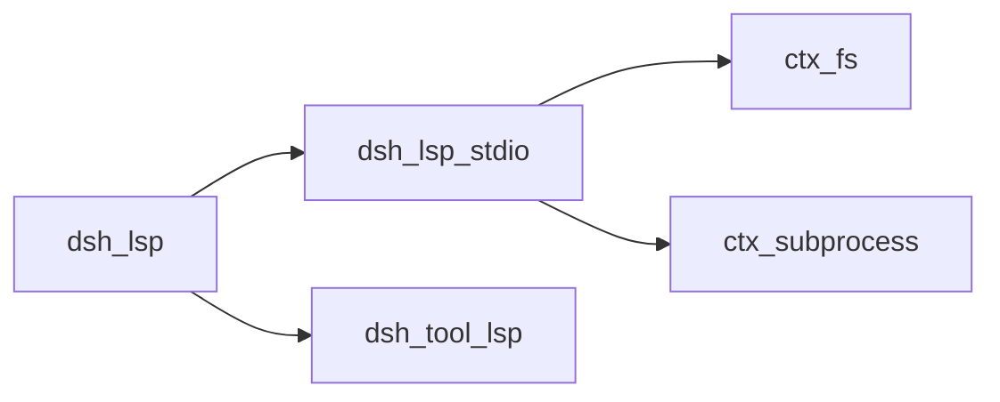
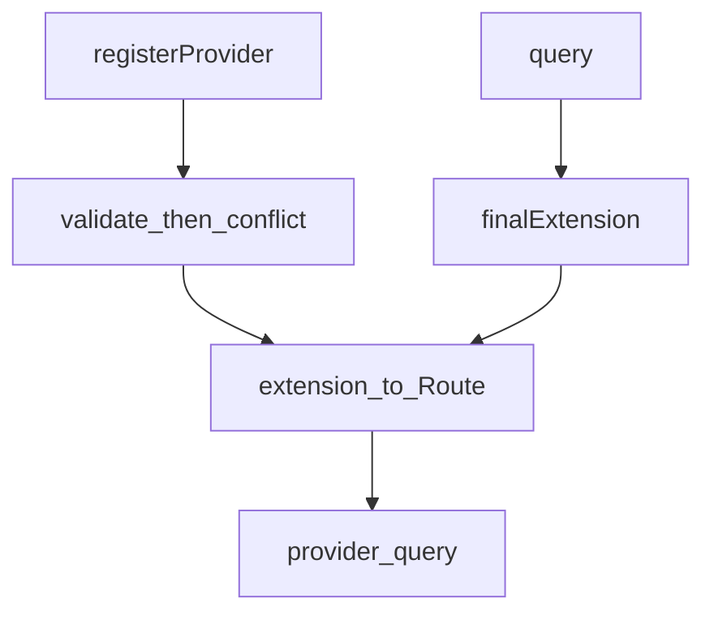
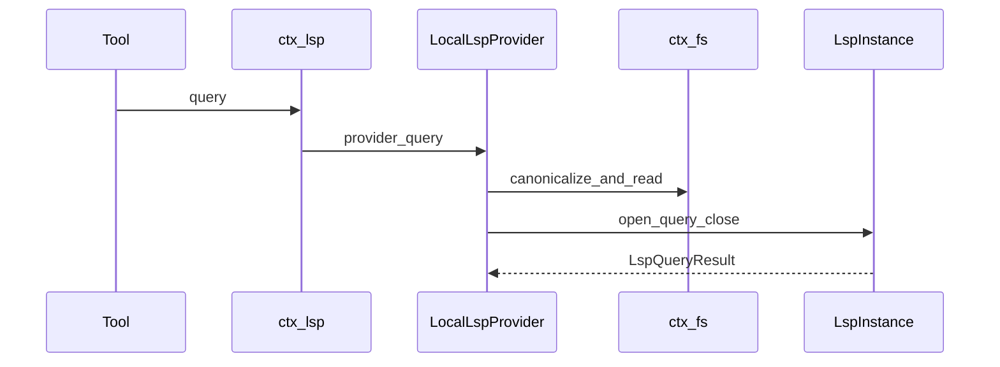
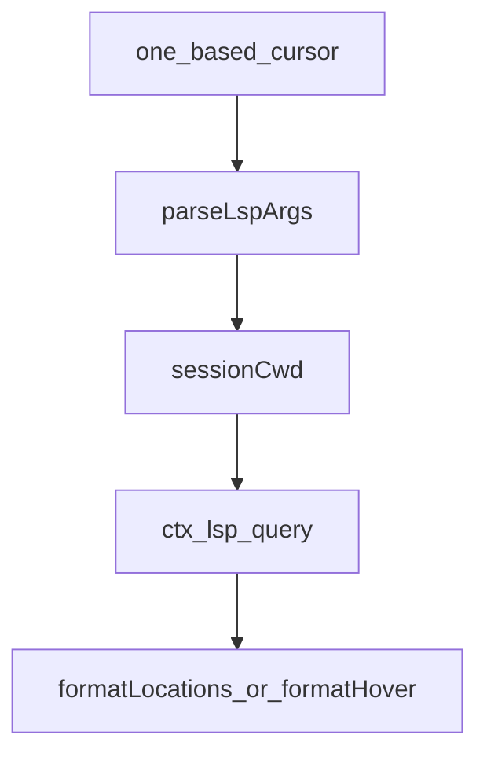

# lsp/ — 只读语言服务导航

学习笔记，非正式产品文档。权威合同见各包 README 与 [subsystems/lsp.md](../../subsystems/lsp.md)。组映射见 [packages/lsp/README.md](../../../packages/lsp/README.md)。

缝只暴露四个语义操作，没有 JSON-RPC 逃生舱。选择按文件最后一段扩展名，与登记顺序无关。

## `@deepseek-ai/dsh-lsp` — 扩展名路由表

- 角色：Service Definition
- ctx：`ctx.lsp`
- 入口：[packages/lsp/lsp/src/index.ts](../../../packages/lsp/lsp/src/index.ts)、[types.ts](../../../packages/lsp/lsp/src/types.ts)、[brand.ts](../../../packages/lsp/lsp/src/brand.ts)
- 关键类型：`LspProvider`、`LspQueryRequest`、`LspQueryResult`、`LspProviderId`
- 操作：`goToDefinition`、`findReferences`、`goToImplementation`、`hover`
- 错误：`LspError`（`LSP_INVALID_PROVIDER`、`LSP_CONFLICT`、`LSP_UNAVAILABLE`、…）

实现逻辑：

1. `Lsp` 以 `super(ctx, 'lsp')` 占键。`registerProvider` 在任何写入前校验：非空 id、至少一个扩展、扩展形如 `.foo`、languageId 非空、提供商内无重复、跨提供商无冲突。
2. 通过后 `ctx.effect` 同时写入 `providerIds` 与 `routes`；disposer 一起释放。失败发布为零。
3. `finalExtension` 取最后一段扩展并小写；无扩展或点文件（`.bashrc`）得 `''`，永远匹配不到。`/` 与 `\` 都当分隔。
4. `query` 按扩展选路，把登记的 `languageId` 填进 `LspProviderQuery` 再交给提供商。无路则 `LSP_UNAVAILABLE`。
5. 位置是零基 UTF-16，与协议一致。`workspaceRoot` 调用方必给，缝不做 `resolve()` 默认。
6. 结果是闭包联合：导航 → `locations`（带 `resolvedWorkspaceUri`）；`hover` → 文本或 `null`。

源码走读：`languageId` 只同步临时文档，不参与选择。符号与调用层次不是本缝操作。

## `@deepseek-ai/dsh-lsp-stdio` — 每工作区一个 stdio 服务器

- 角色：Service Provider（函数插件）
- ctx：无自有键；`inject: ['fs','lsp','subprocess']`
- 入口：[packages/lsp/lsp-stdio/src/index.ts](../../../packages/lsp/lsp-stdio/src/index.ts)、[instance.ts](../../../packages/lsp/lsp-stdio/src/instance.ts)、[connection.ts](../../../packages/lsp/lsp-stdio/src/connection.ts)、[host.ts](../../../packages/lsp/lsp-stdio/src/host.ts)
- 配置：`servers` 表（id → command / 扩展映射 / 字节与拆除预算）
- 插件名：`lsp-stdio`

实现逻辑：

1. `apply` 先解析每个 `command`（经 `ctx.subprocess.resolveExecutable` + 显式 env），校验 timer/字节 cap，全部成功才 `registerProvider`。空表或中途失败不发布先成功的项。
2. 每个 `LocalLspProvider` 按规范工作区 `targetKey` 池化一台 `LspInstance`。查询在该工作区队列上串行：读源 → 开临时文档 → 请求 → 关。
3. `canonicalizeWorkspace` / `readHostSource` 走 `ctx.fs`，所以远程 fs 与远程 subprocess 共用一个执行世界。
4. 传输在空闲或下次只读查询中途失败：dispose 旧实例、换一台、透明重试一次。非传输错误原样抛。
5. 卸载先撤路由，再 `disposeAll`：abort lifetime、拆实例、排空队列。失败聚合成 `AggregateError`。
6. 配置默认：消息 16MiB、stderr 尾 1MiB、文档 4MiB、shutdown 5s、kill grace 2s。非正 timer 会让 `deadline` 当成无超时，故加载期拒绝。

源码走读：`supportsTransientOpen` 决定能否用临时打开。`MessageDecoder` 做 Content-Length 分帧。初始化选项与 `workspace/configuration` 答案是静态配置。

## `@deepseek-ai/dsh-tool-lsp` — 一个四操作工具

- 角色：Consumer
- ctx：无自有键；`inject: ['tools','lsp','systemPrompt']`
- 入口：[packages/lsp/tool-lsp/src/index.ts](../../../packages/lsp/tool-lsp/src/index.ts)、[render.ts](../../../packages/lsp/tool-lsp/src/render.ts)、[session-cwd.ts](../../../packages/lsp/tool-lsp/src/session-cwd.ts)
- 工具名：`lsp`
- 提示：`systemPrompt.section('tool:lsp')`

实现逻辑：

1. 参数：`operation`、`file_path`、一基 `line`/`character`（UTF-16）。`parseLspArgs` 收成零基位置。
2. `workspaceRoot` 必须来自会话 cwd，无回退；缺则 `LSP_WORKSPACE_REQUIRED`。
3. `ctx.lsp.query(..., exec.signal)`。导航结果原样映射 locations + `resolvedWorkspaceUri`；hover 映射 contents/range 或 `null`。
4. 渲染封 `maxLocations`（默认 100）与 `maxResultChars`（默认 16000）。`timeoutMs` 默认 60s，交给 `dsh-tool-call-timeout-policy`。
5. 提示词把 LSP 定位成精确辅助：日常导航用 search/read；`findReferences` 含声明。

源码走读：本包不 import 任何 Provider。偏符号的位置可以合法地返回空结果。
