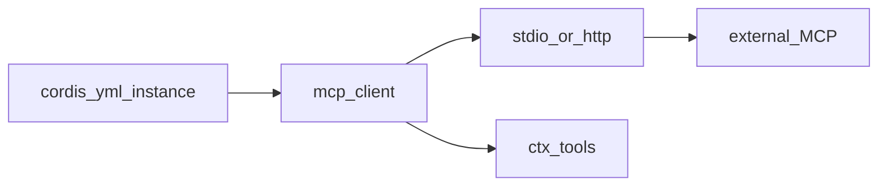
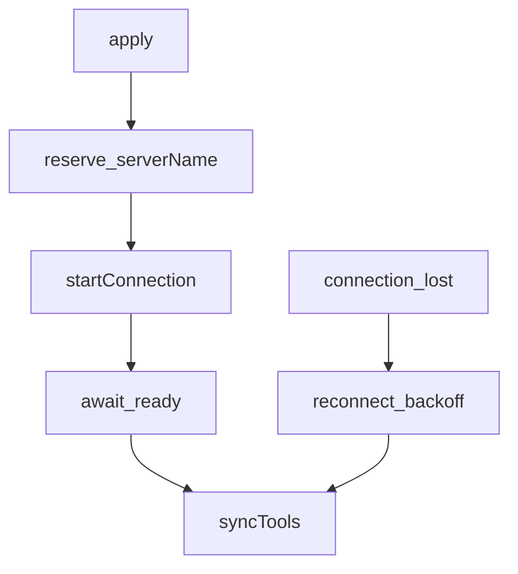

# mcp/ — Model Context Protocol 桥

学习笔记，非正式产品文档。组映射见 [packages/mcp/README.md](../../../packages/mcp/README.md)。每个实例连一台外部 MCP 服务器，把它的工具登记到 `ctx.tools`。

## `@deepseek-ai/dsh-mcp-client` — 外部工具登记到 `ctx.tools`

- 角色：Consumer
- ctx：无自有键；`inject: ['tools']`
- 入口：[packages/mcp/mcp-client/src/index.ts](../../../packages/mcp/mcp-client/src/index.ts)、[connection.ts](../../../packages/mcp/mcp-client/src/connection.ts)、[tools.ts](../../../packages/mcp/mcp-client/src/tools.ts)、[transport.ts](../../../packages/mcp/mcp-client/src/transport.ts)
- 关键类型：`StdioConfig`、`StreamableHttpConfig`、`ReconnectConfig`、`McpResult`

实现逻辑：

1. Config 是 `stdio` 或 `streamable-http` 联合；`serverName` 必须匹配 `[A-Za-z0-9_-]{1,32}`。
2. `apply` 先 `resolveReconnectPolicy`（绕过 schema 的程序构造也会在此失败），再 effect 预订 `serverName`（按 `ctx.root` 隔离，多 app 同进程不撞名）。
3. `startConnection` 拥有 client/transport 世代、重连环、活工具登记。
4. 激活阻塞在首次连接 + 工具发现；`failOnStartupError` 为真则失败打回 fiber，否则记日志并进重连。
5. 公开工具名是 `mcp__<serverName>__<rawName>`，按 DeepSeek 函数名约束规范化（最长 64、`[A-Za-z0-9_-]`）；超长或非法字符时追加 12 位 sha256。原始名只用于 `tools/call`，从不从公开名反解析。
6. 一次断线共享一份 `maxAttempts` 预算，延迟从 `initialDelayMs` 倍增到 `maxDelayMs`；稳住超过 `maxDelayMs` 后预算清零。耗尽则卸工具并停，只有 dispose/HMR 能回来。
7. `tools/list` 变更通知触发 `syncTools`：卸旧世代、登记新世代。冲突可 `contain` 或 `throw`。
8. 单次 `tools/call` 默认超时 60s；结果收成 `McpResult`（`content` + 可选 `structuredContent`）。

源码走读：多服务器 = 多实例，各有自己的 `serverName`。HMR 卸旧建新；同名则公开工具名不变。stdio 子进程 env 是擦洗后的环境再叠 `config.env`，argv 不经 shell。
