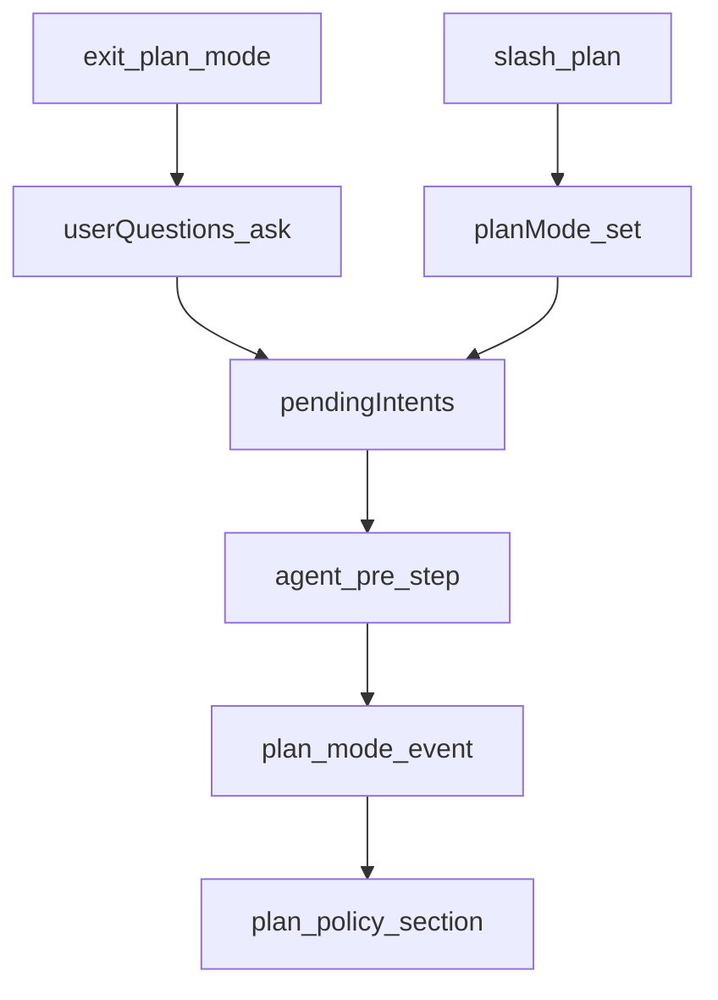
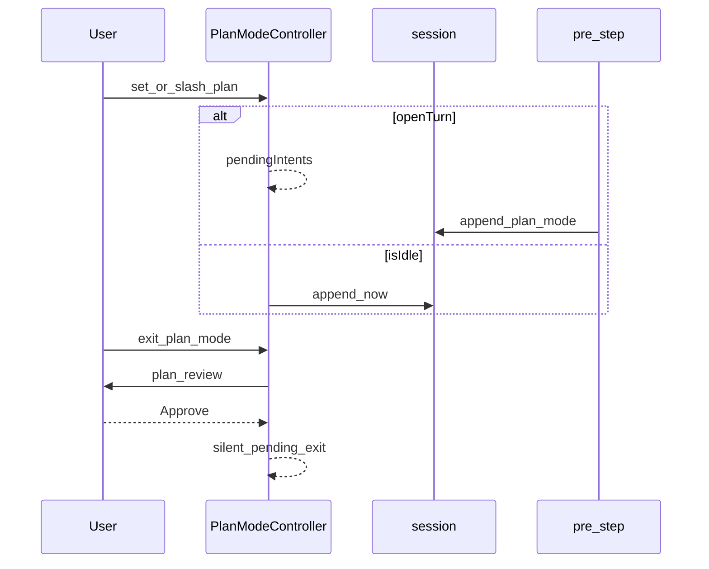

# plan/ — 计划协作状态

学习笔记，非正式产品文档。`plan/mode` 折与退出工具见 [plan.md](../../subsystems/plan.md)。组映射见 [packages/plan/README.md](../../../packages/plan/README.md)。

Plan mode 是按 agent 记在日志里的协作状态，不是通用 mode 注册表，也不是 capability seam。沙箱和审批各自执法，不读写 plan 状态。

## `@deepseek-ai/dsh-plan-mode` — 状态、命令、退出工具

- 角色：Service Definition
- ctx：`ctx.planMode`（`inject: ['tools', 'systemPrompt']`）；可选 `commands`、`sessionProjections`、`userQuestions`
- 入口：[packages/plan/plan-mode/src/index.ts](../../../packages/plan/plan-mode/src/index.ts)、[types.ts](../../../packages/plan/plan-mode/src/types.ts)
- 关键类型：`PlanModeConfig`、`PlanProjection`、`foldPlanMode`
- 事件：`plan/mode` `{ active: boolean }`（log-only，last-wins）
- 工具：`exit_plan_mode`（未激活时也保持登记，目录稳定）

实现逻辑：

1. `resolveConfig` 要求非空 `section`，未知键 fail-loud。
2. `foldPlanMode` 扫 `plan/mode`，最后一条赢；没有则 inactive。resume / fork 只靠日志，无 live mirror。
3. `set(agent, active)`：开着 turn 时写入 `pendingIntents`（`queued` / 反向则 `cancelled`）；turn 间隙立即 append 并 `inject` 叙述。
4. `agent/pre-step` 在 step 被接受后 `onBoundary` append；失败保持 pending。`narrate: true` 的用户切换才追加 notice。
5. `plan:policy` section 在 pending 或 folded active 时渲染部署文案，order 50。
6. `/plan`：`off` 离开；其它非空输入 `steer` 一条用户消息并进入 plan。
7. `exit_plan_mode` 仅当 folded active：计划须以 `#` 标题开头；经 `userQuestions.ask` 做 Approve / Keep planning。批准后静默 pending `active: false`，本批工具仍看得到 plan guidance。
8. 投影 `plan`：`command/run name=plan` 记 wanted，`plan/mode` 提交并清 pending。

源码走读：`foldPlanMode` 是权威折。`pendingIntents` 跨过 `Session.append` 的发布点，才能在开 turn 里写 log-only 事件。审查取消（`ASK_CANCELLED`）改写成“用户要说话，留在 plan mode”，避免模型看到 `ask_user_question` 这个它没调用的名字。
