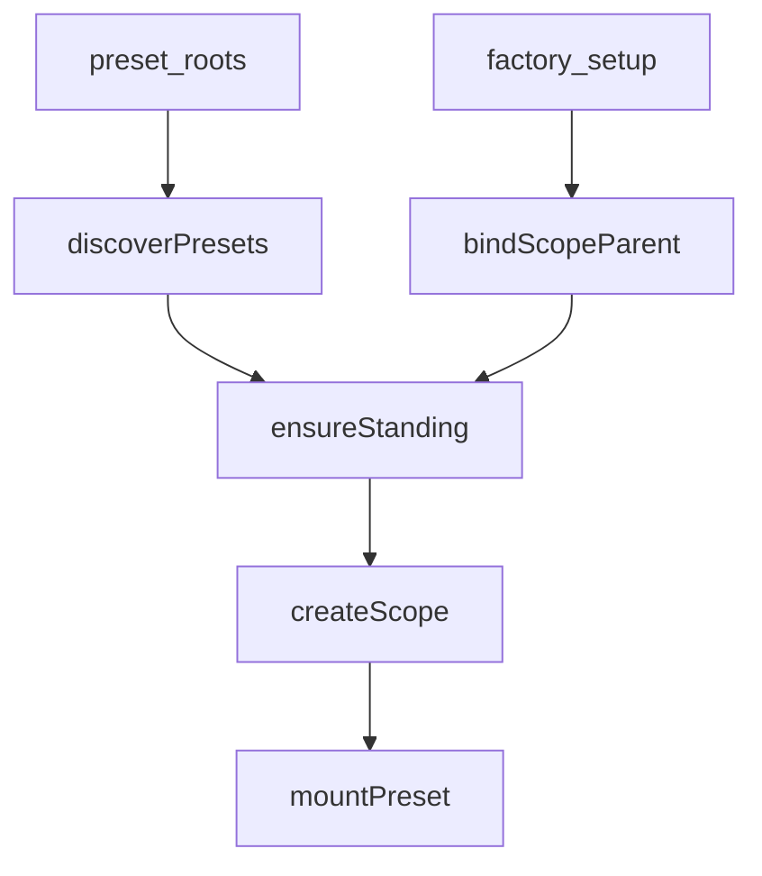
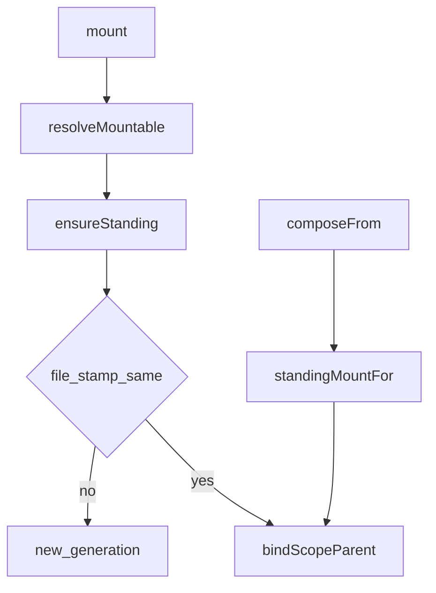
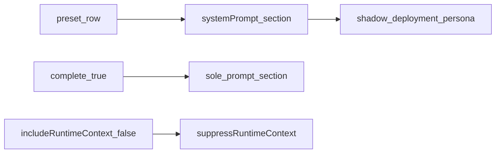

# preset/ — 每会话组合

学习笔记，非正式产品文档。作用域链见 [scope.md](../../subsystems/scope.md)；persona 段落见 [system-prompt.md](../../subsystems/system-prompt.md)。组映射见 [packages/preset/README.md](../../../packages/preset/README.md)。

一个 preset 是含 `agent.cordis.yml` 的目录。standing mount 按 preset 只组合一次；agent 把 scope parent 接到 mount 上，从而看见那份工具和段落。

## `@deepseek-ai/dsh-agent-presets` — 发现与 standing mount

- 角色：Service Definition
- ctx：`ctx.agentPresets`（`inject: ['loader']`）；可选 `settings`
- 入口：[packages/preset/agent-presets/src/index.ts](../../../packages/preset/agent-presets/src/index.ts)、[mount.ts](../../../packages/preset/agent-presets/src/mount.ts)、[discovery.ts](../../../packages/preset/agent-presets/src/discovery.ts)
- 关键类型：`AgentPreset`、`PresetRoot`、`PresetMountError`、`UnknownPresetError`
- emit：`agent-preset/selected`（由 `session/event` 上的 `agent-preset/selected` 转发）

实现逻辑：

1. `resolvedRoots` = 配置 roots（先到者赢重复 id）再追加用户 `~/.dsh` preset 目录（除非 `includeUserRoot: false`）。`list` / `resolve` 每次重读磁盘；broken 仍能 resolve，`resolveMountable` 才拒挂载。
2. `defaultId` 每次读 settings 覆盖，热更新只影响下一会话。
3. `mount(agentCtx, id)` 必须在 factory `setup`、agent 尚未 publish：失败整次创建回滚。
4. `ensureStanding` 单飞：`createScope(selfCtx, { agentPreset: id })` 后 `mountPreset`；stamp 是 composition 文件 mtime+size，变了给后续会话开下一代，已加入的保持旧代。发布到 ROOT realm 的行在审计时拒绝。
5. `composeFrom` 是 bind 不是重新 resolve：子 agent 拿到父正在跑的那一代实例。
6. `recompose` 只做 parent 重绑；调用方保证会话还没产出历史。未知 preset 抛错时 agent 原样不动。
7. `standingKeyFor` 给无 agent 的冷读确保 mount，不启动 turn。
8. `agent/created` 时未 join 且部署有 roots，只 warning，不 veto（bare agent 合法）。

源码走读：`selfCtx` 必须是未 trace 的原 context，否则 standing 子树会穿过 caller shadow。`copy` / `remove` 是仅有的写作 API，composition 正文不经过这个 seam。`serviceForAgent` 让 Host RPC 读 isolate realm 里的 per-agent 服务。

## `@deepseek-ai/dsh-persona` — 作用域身份行

- 角色：Consumer（preset 行）
- ctx：无自有键；`inject: ['systemPrompt']`
- 入口：[packages/preset/persona/src/index.ts](../../../packages/preset/persona/src/index.ts)
- 关键类型：`Config`（`text`、`complete`、`includeRuntimeContext`）
- 段落：`PERSONA_SECTION` / `PERSONA_ORDER`（从 `dsh-system-prompt` 导入，不复述）

实现逻辑：

1. `apply` 在**挂载 ctx 的 scope** 上登记与部署相同的 persona 槽位，从而覆盖全局 `deployment:persona`。
2. 挂到未 scoped 的全局 ctx 会与 registry 自己的登记冲突，fail-loud。
3. `complete: true` 让这段成为完整 system prompt，压制其它 section。
4. `includeRuntimeContext: false` 调用 `systemPrompt.suppressRuntimeContext()`。
5. 空 `text` 在渲染时丢掉该段，与 registry 行为一致。

源码走读：preset 不能挂 prompt registry 本身，所以需要这一行才能改身份而不只改工具。符号就是 `PERSONA_SECTION`、`section()`、`suppressRuntimeContext()`。
