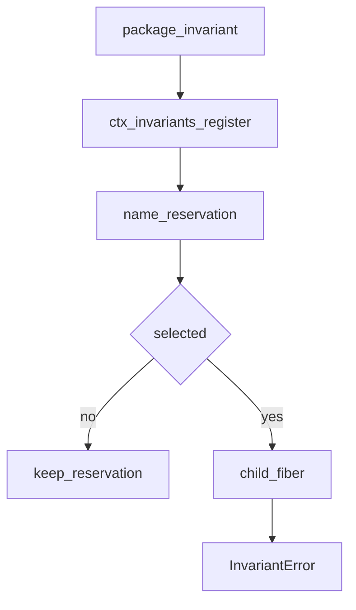
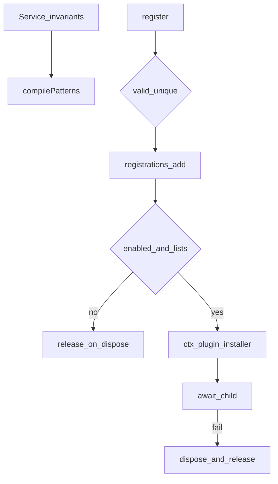

# runtime-diagnostics/ — 包自有运行时不变量

学习笔记，非正式产品文档。类型合同见 [invariants.md](../../subsystems/invariants.md)。包映射见 [packages/runtime-diagnostics/invariants/README.md](../../../packages/runtime-diagnostics/invariants/README.md)。本组目前只有这一包，不是三角能力缝，也不在 agent-loop 脊柱上。

注册表只做选择、占名、子 fiber 生命周期和按包归因的失败。每个工作区包发布 `./invariant` companion，用自己的完整 npm 名登记。检查只能盯权威事件流或可变数据，不能盯服务/方法是否存在，见 [AGENTS.md 约定](../../../AGENTS.md#conventions)。

## `@deepseek-ai/dsh-invariants` — 可配置注册表

- 角色：Service
- ctx：`ctx.invariants`
- 入口：[packages/runtime-diagnostics/invariants/src/index.ts](../../../packages/runtime-diagnostics/invariants/src/index.ts)、[invariant.ts](../../../packages/runtime-diagnostics/invariants/src/invariant.ts)
- 关键类型：`Config`、`InvariantInstaller`、`InvariantFailure`、`InvariantError`、`InvariantRegistry`
- Config：`enabled`（默认 `true`）、`package_allowlist`、`package_blocklist`

实现逻辑：

1. `super(ctx, 'invariants')` 占住服务；构造时编译 allow/block 列表，空白、两侧空白、重复、非法正则都在启动期抛，不跳过。
2. 选中规则：服务开启，且（allow 为空或至少一条匹配全名），且没有 block 命中；block 覆盖 allow。匹配是 `new RegExp(source)`，默认不锚定，不解析 `/pattern/flags`。
3. `register(packageName, installer)` 即使过滤器关掉检查也占住全名；空名、含空白、重复登记立刻抛。
4. 选中的 installer 跑在专用子 fiber；`installer.inject` 声明子 fiber 可碰的服务；同步或异步完成都 join 之后登记才成功。
5. `fail(message)` 抛 `InvariantError`：`code: 'INVARIANT'`、`packageName`、消息前缀 `invariant violated by "<package>":`。注册表不 import 任何产品包。
6. 服务拥有每条登记 fiber，返回的 disposer 也挂在 companion fiber 上；任一侧卸载都清 listener、trace 和占名，companion 才能再登记同名。
7. 本包自己的 companion 是空安装：占名和子生命周期就是服务自己的突变边界，再观察只会复制实现。

源码走读：标准脊柱挂服务和 session/agent/scope/agent-loop 四个 companion；其它包的检查由组合显式加。`pnpm run verify-package-invariants` 拒生成标记、无说明的空安装、不用 reporter 的非空安装、登记名不对、以及 export/依赖/bundle 接线不全。可执行 companion 目录在包 README；本页不复述那张表。
