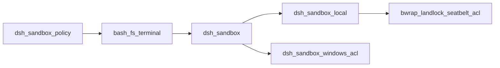
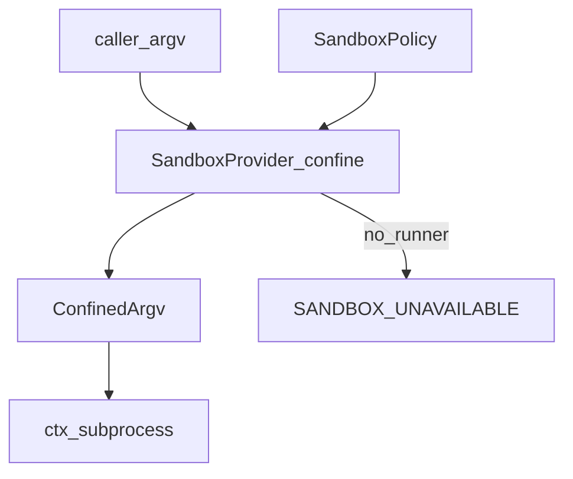
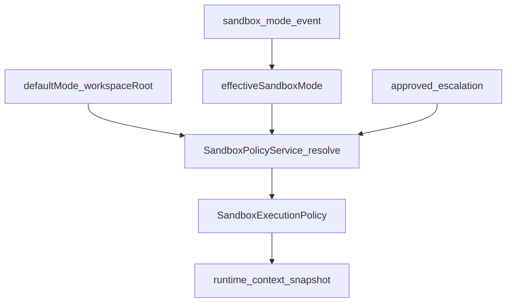
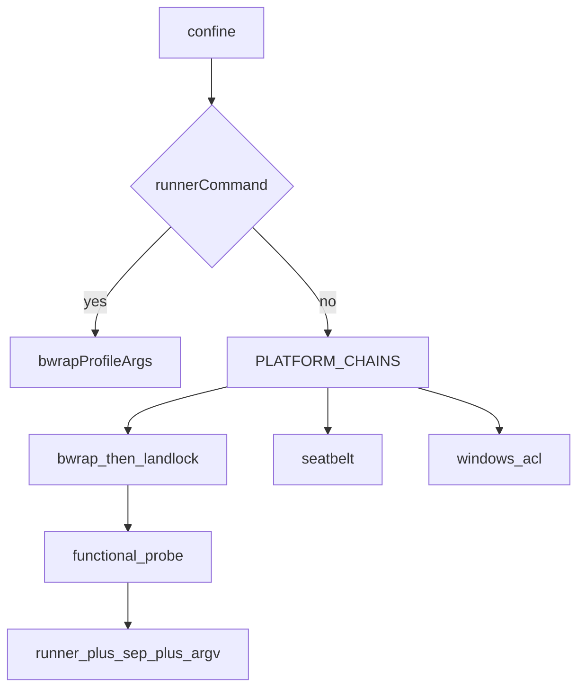
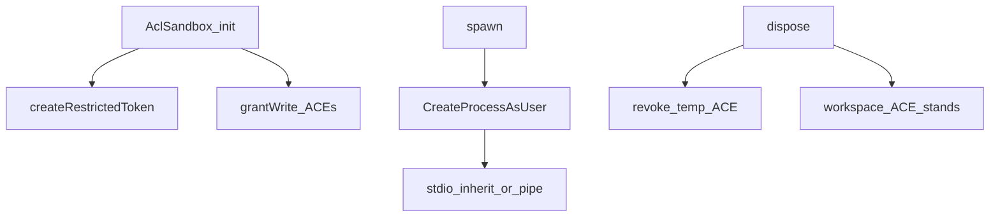

# sandbox/ — 同世界进程禁闭

学习笔记，非正式产品文档。权威合同见各包 README 与 [subsystems/sandbox.md](../../subsystems/sandbox.md)。组映射见 [packages/sandbox/README.md](../../../packages/sandbox/README.md)。

`ctx.sandbox` 只包一层精确 argv，不换执行世界。容器、微 VM、远程执行替换周围的能力缝。政策默认与会话覆盖在 `ctx.sandboxPolicy`，执行器与工具读同一份解析结果。

## `@deepseek-ai/dsh-sandbox` — 文件效果政策与 `confine`

- 角色：Service Definition
- ctx：`ctx.sandbox`
- 入口：[packages/sandbox/sandbox/src/index.ts](../../../packages/sandbox/sandbox/src/index.ts)、[escalation.ts](../../../packages/sandbox/sandbox/src/escalation.ts)、[roots.ts](../../../packages/sandbox/sandbox/src/roots.ts)
- 关键类型：`SandboxMode`、`SandboxPolicy`、`ConfinedArgv`、`RunnerFailureRule`、`SandboxUnavailableError`
- 事件：无；升级词汇（`approveEscalation`、`sandboxDenialMarker`）在此拥有，供 bash/fs 工具共用

实现逻辑：

1. `SandboxProvider` 以 `super(ctx, 'sandbox')` 占键。`confine(argv, policy)` 必须返回强制 argv，或在包装/runner 执行时失败关闭；禁止静默原样放行。
2. `SandboxMode` 是 `read-only` / `workspace-write` / `danger-full-access`。`SandboxPolicy` 只携带禁闭模式；`danger-full-access` 不进 `confine`。
3. 政策按调用携带，不钉在 Provider 上：同一瞬间 bash 可以 `read-only`，子 agent 状态目录可以可写。
4. `ConfinedArgv` 带回 `enforcement`（`full`/`partial`）、该后端自己的 `denialSignatures`，以及结构化 `runnerFailureRules`。跨后端并集会误认从未产生的拒绝方言。
5. 消费者先用 `allowedExitCodes` + 去掉 `informationalLines`，再匹配 `fatalSignatures`；仅靠退出码不能证明 runner 失败。
6. `writableRoots` 是 Seatbelt 与 `fs-sandbox` 共用的可写根推导，避免 bash 能写 `/tmp` 而 write 工具不能。
7. `WIDER_MODES` / `ESCALATION_TARGETS` / `approveEscalation` 是工具层升级的唯一家：严格变宽、参数成对、审批在执行前。

源码走读：`SandboxUnavailableError` 走 `HarnessError` 的 `SANDBOX_UNAVAILABLE`，经 `tool/result` 与命令失败区分。`sessionId` 给后端做每会话状态（Windows ACL 的私有临时目录）。

## `@deepseek-ai/dsh-sandbox-policy` — 部署默认与会话覆盖

- 角色：Service（政策家，不是 Provider）
- ctx：`ctx.sandboxPolicy`
- 入口：[packages/sandbox/sandbox-policy/src/index.ts](../../../packages/sandbox/sandbox-policy/src/index.ts)、[session-mode.ts](../../../packages/sandbox/sandbox-policy/src/session-mode.ts)
- 关键类型：`SandboxPolicyRequest`、`SandboxExecutionPolicy`
- 事件：写入 `sandbox/mode`（日志专用，不进模型转录）；可选注入 `systemPrompt.context('sandbox:policy')`

实现逻辑：

1. 配置默认 `mode: 'read-only'`；`workspaceRoot` 无 schema 默认，构造时落到绝对 `process.cwd()`。
2. `resolve({ session, mode })`：显式已批准 mode > 会话最后一条 `sandbox/mode` > 部署默认。工作区根是会话不可变 cwd，否则配置根。
3. 有会话时带上 `sessionId`，供 Windows ACL 等后端键状态。
4. `setSandboxMode` 只追加一条 `sandbox/mode`；状态就是日志，重启靠重放。
5. 注入 `systemPrompt` 时按当前解析政策渲染一段缓存安全的运行时上下文，不枚举已挂能力。
6. 执行器与 Provider 保持无会话；每次操作边界由工具层读一次政策。

源码走读：`effectiveSandboxMode` 从后往前扫事件，纯折叠。`source: 'delegation'` 标记委派进子会话的覆盖。

## `@deepseek-ai/dsh-sandbox-local` — 按平台选 runner 链

- 角色：Service Provider
- ctx：占住 `ctx.sandbox`；`inject` 无强制，Windows 路径用 `dsh-sandbox-windows-acl`
- 入口：[packages/sandbox/sandbox-local/src/index.ts](../../../packages/sandbox/sandbox-local/src/index.ts)、[profiles.ts](../../../packages/sandbox/sandbox-local/src/profiles.ts)
- 关键类型：`LocalSandboxProvider`、`SelectedRunner`、`AclTempCapability`
- 配置：`runnerCommand` + `runnerFailureSignatures`（必须成对）、`probeTimeoutMs`

实现逻辑：

1. 有 `runnerCommand` 则断言 full enforcement，跳过探测，用 bwrap 形 profile 参数，失败方言来自配置签名。
2. 否则按平台取链：Linux `bwrap`→`landlock`（多候选才探测）；darwin 只有 Seatbelt，不探测；win32 只有 windows-acl，不探测。无链或全不可用抛 `SandboxUnavailableError`。
3. 探测一次并缓存。`bwrap`/`seatbelt` 通过即 `full`；Landlock 由 launcher 报告 full/partial；windows-acl 永远 `partial`（Everyone + NTFS 硬链接边界）。
4. `bwrapProfileArgs`：只读绑定 `/`，workspace-write 再 bind 工作区并 tmpfs `/tmp`。Landlock 用 grant 列表。Seatbelt 用 `writableRoots` 生成 SBPL。
5. Windows workspace-write 且有 `sessionId`：工作区 SID 的 ACE 站立（跨会话复用缓存），每会话随机私有临时目录 + 独立 SID，卸载时撤销临时 ACE。无会话则 runner 自己建一次性临时子目录。
6. 每条 wrap 带该 runner 的 `denialSignatures` 与 `RUNNER_FAILURE_RULES`（Landlock 出口 125 + 信息行排除；windows-acl 出口 127 + `windows-acl-run:`）。

源码走读：`probeTimeoutMs` 必须为正有限——Node 把 `spawnSync({ timeout: 0 })` 当成无超时。`revokeAclGrants` 失败只打日志，不中断 Cordis 拆除。

## `@deepseek-ai/dsh-sandbox-windows-acl` — WRITE_RESTRICTED token 与 runner

- 角色：library + argv runner（被 `sandbox-local` 调用，不占 `ctx`）
- ctx：无
- 入口：[packages/sandbox/sandbox-windows-acl/src/index.ts](../../../packages/sandbox/sandbox-windows-acl/src/index.ts)、[runner.ts](../../../packages/sandbox/sandbox-windows-acl/src/runner.ts)、[token.ts](../../../packages/sandbox/sandbox-windows-acl/src/token.ts)
- 关键类型：`AclSandbox`、`AclWriteGrant`、`Win32Error`
- 事件：无

实现逻辑：

1. `AclSandbox` 构造校验：workspace-write 必须有 `writeSid` 和显式 `tempDir`（或 `null`）；read-only 禁止 SID 与临时目录；两 SID 必须不同。
2. `init()` 解析 SID、可选授予 DACL、建 WRITE_RESTRICTED token（限制 SID 含 logon + Everyone + 能力 SID），再给 token 默认 DACL 补一条限制 SID 的完全访问——否则子进程新建匿名管道会 EPERM。
3. 任何 Win32 失败 fail-closed：撤销可撤销（临时）授予并抛带 API 名与精确错误码的异常；子进程从不在未限制 token 下启动。
4. `spawn`：`inherit` 走 kill-on-close job；`pipe` 先排空管道再 `WaitForSingleObject`，避免管道缓冲死锁。
5. `dispose` 撤销临时 ACE，工作区 ACE 留下。`manageDacls: false` 时 caller（sandbox-local）已物化 ACE，runner 不授予也不撤销。
6. `runner.ts` 解析 `--workspace/--temp/--mode/[--write-sid --temp-write-sid]/-- argv`；失败打印 `windows-acl-run: <detail>` 并退出 127。

源码走读：`workspaceWriteSid` 由规范工作区路径确定性派生，所以工作区根 ACE 每机每工作区只物化一次。读取、网络、进程可见性不受 WRITE_RESTRICTED 限制。
