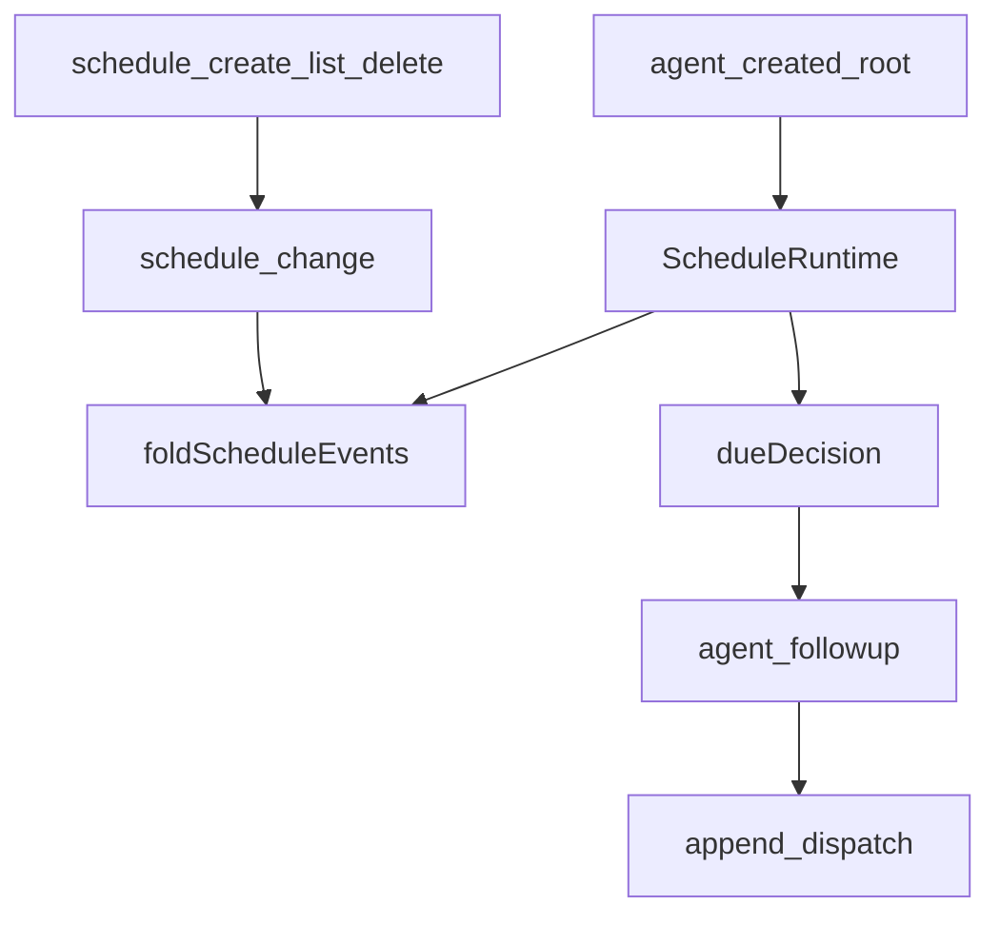
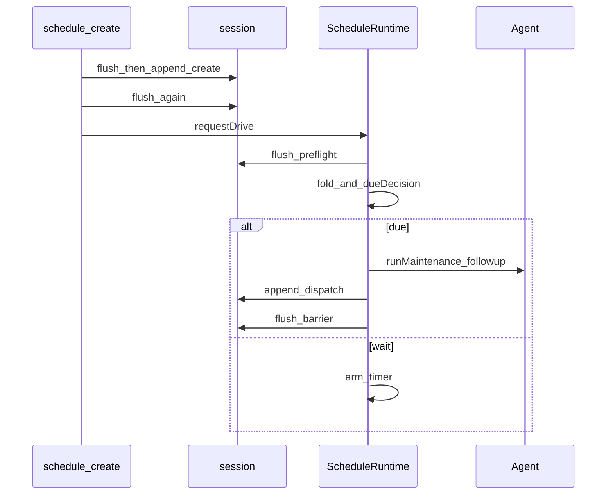

# schedule/ — 会话内提醒

学习笔记，非正式产品文档。耐久记录、转移与投递见 [schedule.md](../../subsystems/schedule.md)。组映射见 [packages/schedule/README.md](../../../packages/schedule/README.md)。

本包故意没有公开 Schedule 服务或可变库。工具和 runtime 只往 Session 流追加；到期工作走 Agent 普通 follow-up 队列。

## `@deepseek-ai/dsh-schedule` — 工具 + 根 Agent 定时器

- 角色：Consumer（函数插件；无 `ctx.schedule`）
- ctx：无自有键；`inject: ['agents', 'sessions', 'tools', 'sessionPersistence']`
- 入口：[packages/schedule/schedule/src/index.ts](../../../packages/schedule/schedule/src/index.ts)、[runtime.ts](../../../packages/schedule/schedule/src/runtime.ts)、[tools.ts](../../../packages/schedule/schedule/src/tools.ts)、[domain.ts](../../../packages/schedule/schedule/src/domain.ts)
- 关键类型：`ScheduleRecord`、`ScheduleId`、`ScheduleInputError`、`ScheduleLogError`
- 事件：`schedule/change`（versioned；create / delete / dispatch）
- 工具：`schedule_create`、`schedule_list`、`schedule_delete`（挂在 **该 root agent 的** `agent.ctx`）

实现逻辑：

1. `apply` 只对**本插件加载之后**发布的 root agent 建 `ScheduleRuntime`；不扫描冷 session、不收养已发布的根、teardown 不删耐久记录。
2. 工具登记在 `agent.ctx`，所以只对该 agent 可见。`execute` 要求 `exec.agent ===` 拥有者。
3. 读或决策前先 `sessions.flush`。create 与实际 delete 在 append 后再 flush 一次；屏障失败返回稳定的 uncertainty 结果，不从 live log 推断已耐久。
4. `schedule_create` 三选一：`after_seconds`、`every_seconds`（≥ `MIN_EVERY_INTERVAL_SECONDS`）、或 `at`（RFC 3339 / 带 IANA 的本地日期时间）。
5. `foldScheduleEvents` 从 `seedLength` 起折；fork 不继承父提醒。
6. `ScheduleRuntime.driveOnce`：preflight flush → fold → `dueDecision`（先到期 one-shot，否则整批 every，否则 arm 下一段 ≤ Node 最大 delay 的 timer）。
7. 到期经 `runMaintenance`：先重新对表、再拼完整 escaped framing、`followup` 成功后才 append `dispatch`；同步 framing/enqueue 失败不写 dispatch。随后再 flush，失败只记日志。
8. agent 忙则 `whenIdle` 再 drive。idle 且日志里已有 `schedule/change` 也会 `requestDrive`（冷变热时补过期项）。

源码走读：`foldScheduleEvents` 是唯一耐久投影。`dueDecision` 纯函数。`runScheduleTransaction` 串行化同一 agent 上的工具与 runtime。投递 source 是 `plugin: 'schedule'`，进入普通对话，不是外发通知信道。
