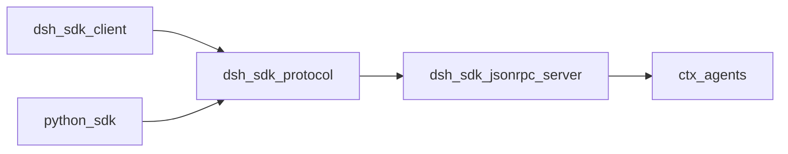
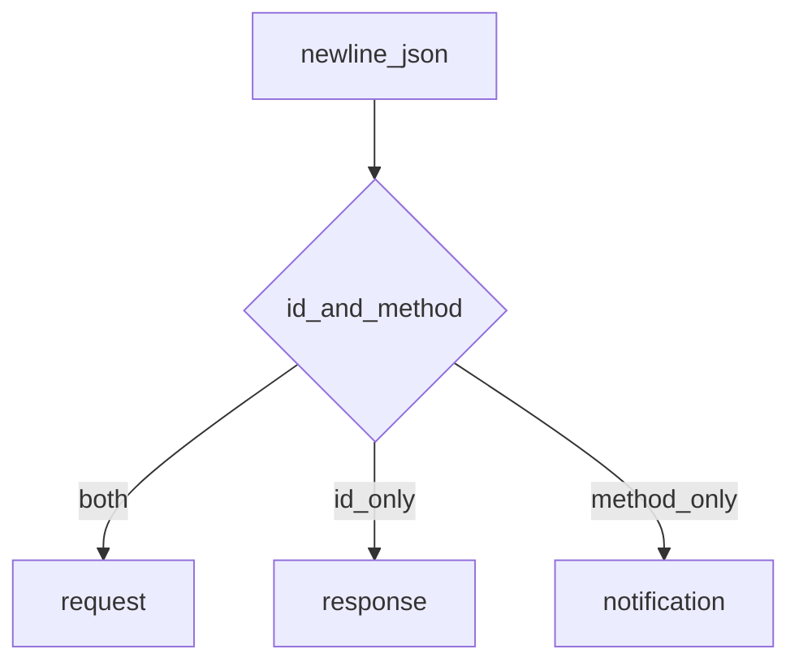
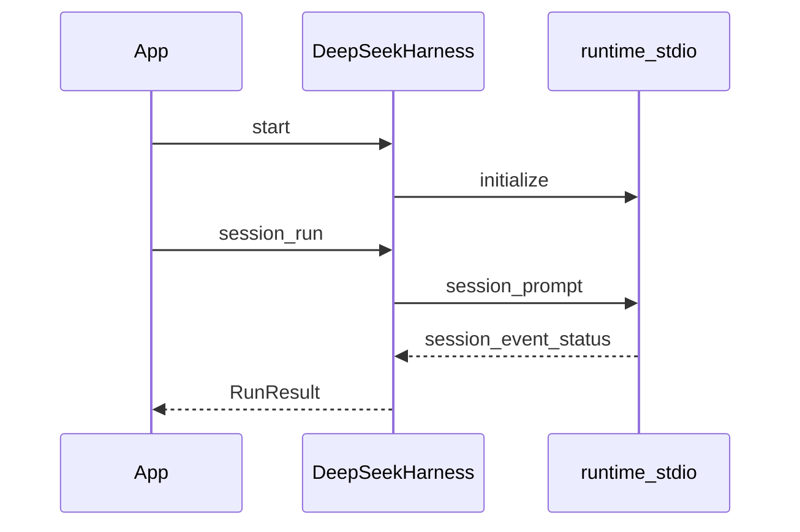
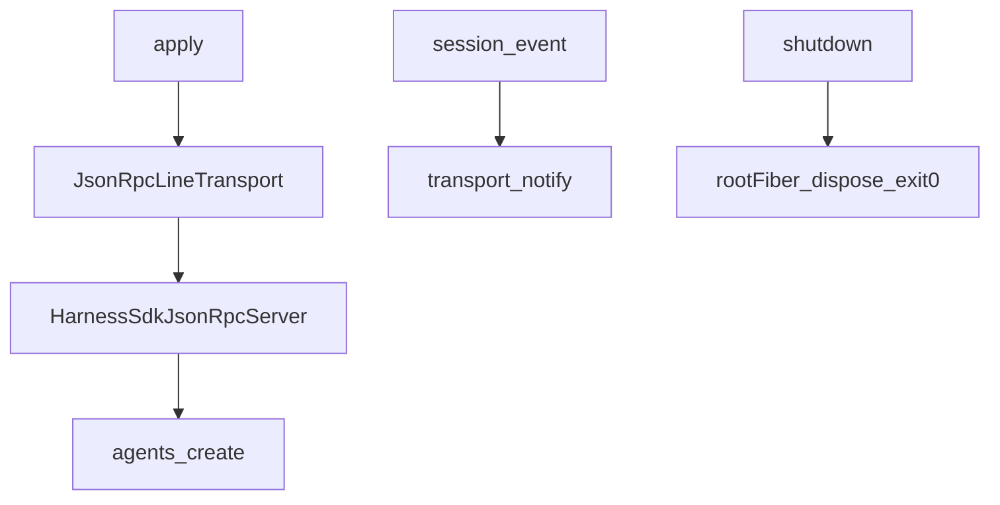

# sdk/ — 进程外驱动 Harness

学习笔记，非正式产品文档。组映射见 [packages/sdk/README.md](../../../packages/sdk/README.md)。调用方自带 runtime 可执行文件和它的 `cordis.yml`；本组不创建或启动开发者工程。

stdio 上是换行分隔的 JSON-RPC。stdout 留给协议帧，树里不能挂 stdout logger。

## `@deepseek-ai/dsh-sdk-protocol` — 线协议与传输

- 角色：library
- ctx：无
- 入口：[packages/sdk/protocol/src/index.ts](../../../packages/sdk/protocol/src/index.ts)、[types.ts](../../../packages/sdk/protocol/src/types.ts)、[transport.ts](../../../packages/sdk/protocol/src/transport.ts)
- 关键类型：`InitializeParams`、`SessionPromptParams`、`HarnessSdkRequestMap`、`HarnessSdkNotificationMap`、`JsonRpcLineTransport`

实现逻辑：

1. 请求：`initialize`（cwd/provider/model/可选 maxTokens）、`session/prompt`（sessionId + contentBlocks）、`shutdown`。
2. 通知：`session.event`、`session.status`（idle/running）、`subagent.started`、`subagent.finished`（仅 in-process 子会话）。
3. `serverInfo.name` 线稳定为 `deepseek-harness-sdk-runtime`。
4. `JsonRpcLineTransport` 挂调用方拥有的 Readable/Writable；`start` 装监听，`close` 卸监听并拒绝未决请求，不销毁流。
5. 畸形行忽略；无 handler 的请求回 `-32601`，handler 抛错回 `-32603`。
6. `JsonRpcResponseError` 保留线 `code` 与可选 `data`。

源码走读：协议包零 Cordis。TS 客户端与 Python SDK 说同一套形状。

## `@deepseek-ai/dsh-sdk-client` — TypeScript 客户端

- 角色：library（不注册 ctx）
- ctx：无；自己 spawn runtime 子进程
- 入口：[packages/sdk/client/src/index.ts](../../../packages/sdk/client/src/index.ts)、[api.ts](../../../packages/sdk/client/src/api.ts)、[client.ts](../../../packages/sdk/client/src/client.ts)
- 关键类型：`DeepSeekHarness`、`HarnessSession`、`HarnessClient`、`RunResult`

实现逻辑：

1. `DeepSeekHarness` 拥有一个 runtime 子进程，跨多个 session；`close` / `await using` 回收子进程。
2. `start` 做一次 `initialize` handshake；失败则 reap 并换新 `HarnessClient`，除非已经 `close`。
3. cwd 在 handshake 前 `resolve` 成绝对路径，避免子进程再相对解析叠一层。
4. `session(id?)` 只造句柄，不打线；runtime 在首个 prompt 时才建 agent+session。
5. `HarnessSession.run` 订阅该 session 树，`prompt` 后等到本 session `session.status=idle`，收集 events / notifications。
6. `HarnessClient` 用 EOF → SIGTERM → SIGKILL 梯子拆子进程；这是 `dsh-subprocess` seam 对 SDK 托管传输的文档化例外。
7. 失败词汇：`TransportClosedError`、`RequestTimeoutError`、`SdkProtocolError`。

源码走读：高层 API 镜像 Python 的 `DeepSeekHarness`/`Session`。`session/prompt` 若无 `accepted` 语义违规会变成 `SdkProtocolError`（服务端回执是 `messageId`）。

## `@deepseek-ai/dsh-sdk-jsonrpc-server` — stdio JSON-RPC 服务端

- 角色：Consumer
- ctx：无自有键；`inject: ['agents']`；`initialize` 用 `ctx.get('llm')`
- 入口：[packages/sdk/server/src/index.ts](../../../packages/sdk/server/src/index.ts)、[server.ts](../../../packages/sdk/server/src/server.ts)
- 关键类型：`HarnessSdkJsonRpcServer`、`JsonRpcConfig`

实现逻辑：

1. `apply` 用 stdin/stdout（测试可注入），构造 transport + server，`transport.start()`。
2. 构造即订阅 `session/event`、`agent/status`、`session/created`（有 parent 则 `subagent.started`）、`subagent/end`（仅 `info.local`）。
3. `initialize` 记下 cwd/provider/model/maxTokens；该 provider 无适配器时才挂 DeepSeek fallback。
4. `session/prompt` 对未知 id 懒创建 agent+session，把 contentBlocks 当用户消息 `followup`，回 `messageId`。
5. `maxTokensAsSuccess` 把 max-token 结束映射成 SDK `ok`。
6. `shutdown` 回空对象后 `setImmediate` 刷新、dispose 根 fiber、`exit(0)`；同一 `exitTask` 防竞态。
7. EOF/信号退出归 app bin，不归本插件。

源码走读：必须 named export、无 default，避免 Loader `unwrapExports` 丢掉 `inject`。见 [postmortem 0001](../../postmortem/0001-acp-default-export-drops-inject.md)。
