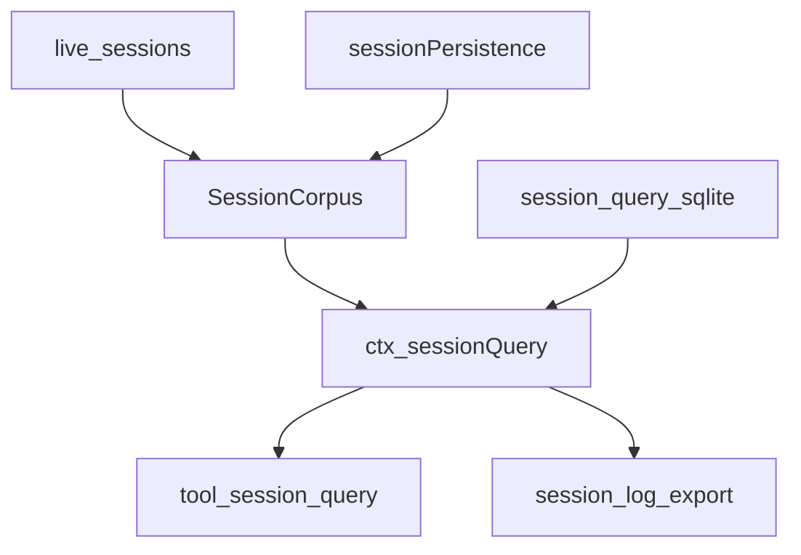
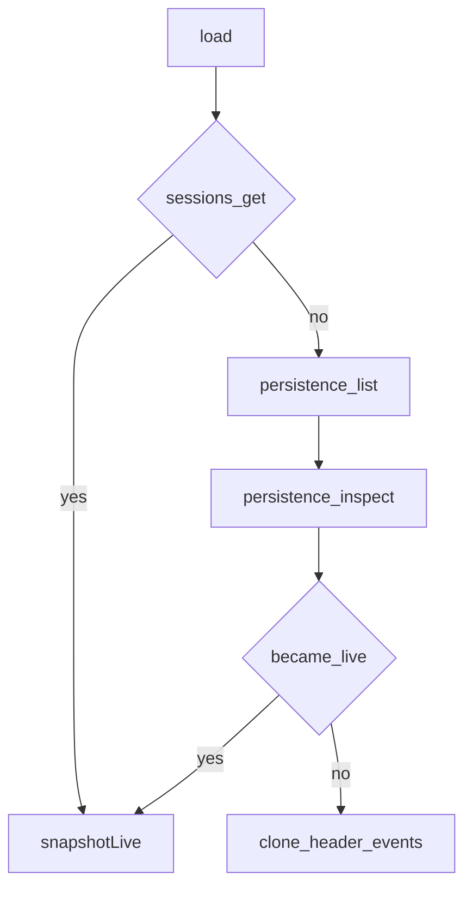
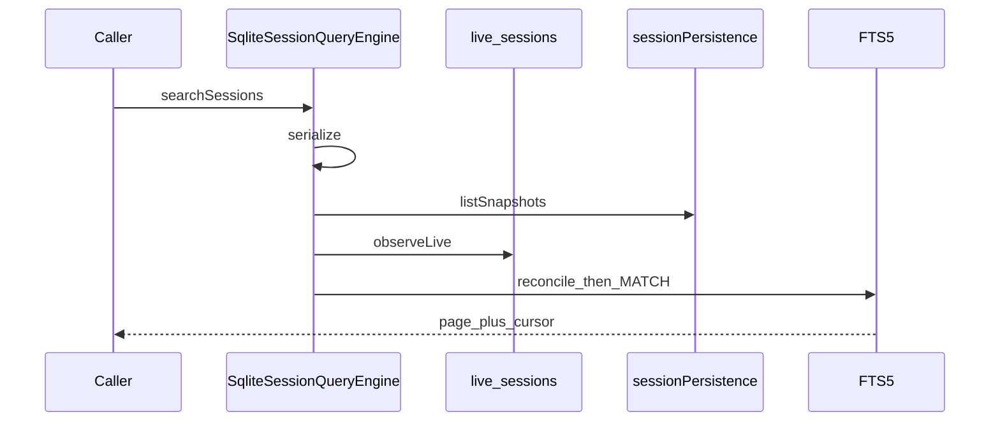
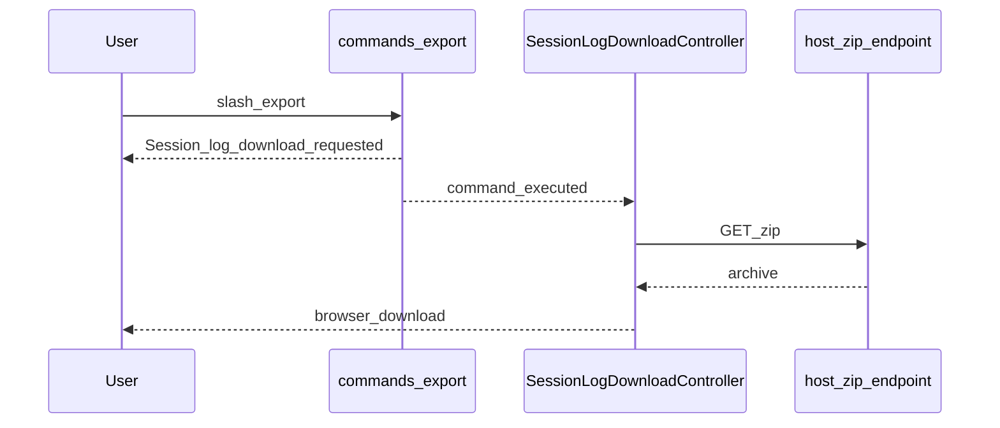
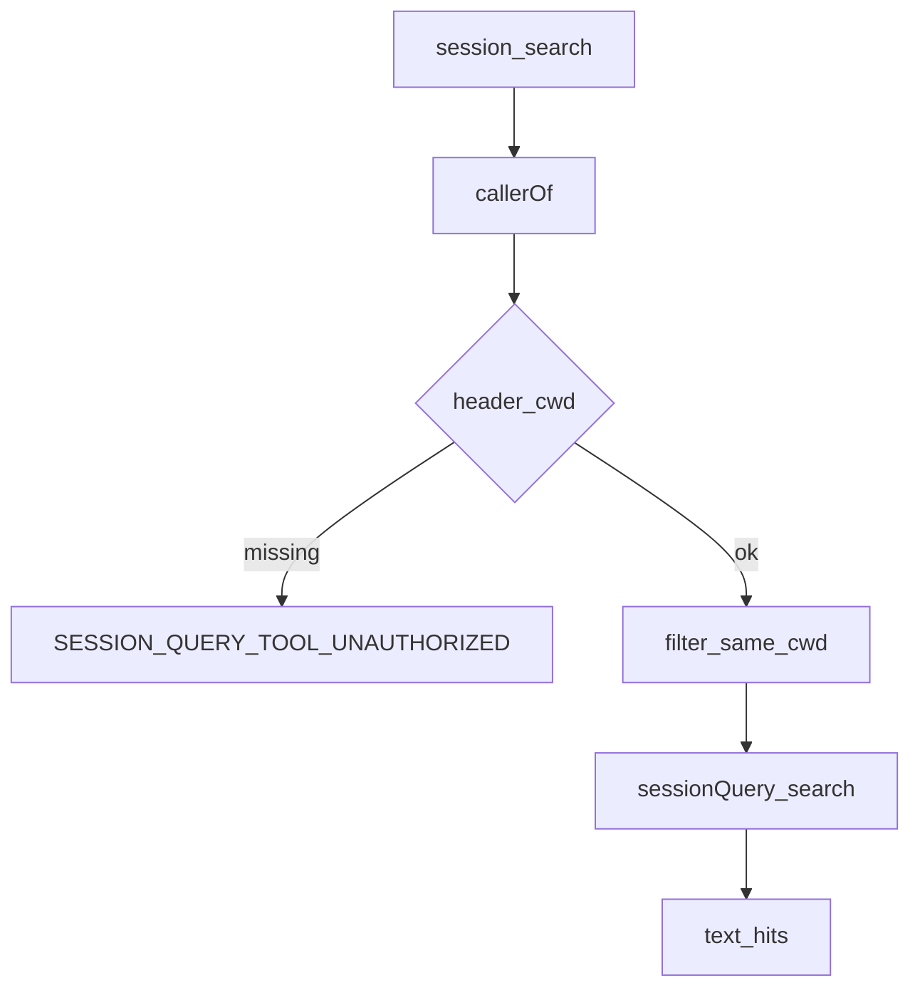

# session-query/ — 会话检索族

学习笔记，非正式产品文档。类型合同见 [session-query.md](../../subsystems/session-query.md)。组映射见 [packages/session-query/README.md](../../../packages/session-query/README.md)。

本族在 live 与耐久日志上做授权检索，独立于 persistence 内部和 compaction。

精确读、过滤、谱系是后端无关的具体行为；全文检索由 SQLite FTS5 Provider 实现。

## `@deepseek-ai/dsh-session-query` — 逻辑语料与精确读

- 角色：Service Definition
- ctx：`ctx.sessionQuery`；`inject: ['sessions']`
- 入口：[packages/session-query/session-query/src/index.ts](../../../packages/session-query/session-query/src/index.ts)、[corpus.ts](../../../packages/session-query/session-query/src/corpus.ts)、[types.ts](../../../packages/session-query/session-query/src/types.ts)
- 关键类型：`SessionQueryEngine`、`SessionCorpus`、`SessionRecord`、`SessionSearchRequest`

实现逻辑：

1. 抽象服务实现精确读；子类只实现 `searchSessions` / `searchEvents`。
2. `SessionCorpus` 可选注入 `sessionPersistence`；live 目标从不咨询 persistence。
3. `listSessions` 先列耐久再被 live 覆盖，newest-first，header 兼容性要一致。
4. `readSession` 用 `Session.create` 回放校验完整日志，不把 session 变 live。
5. `filterSessions` / `filterEvents` 是 provider 无关谓词；`readTitleSnapshots` 用 `foldSessionTitle`。
6. `readSurface` / `traceSession` / `traceEvent` / `readEvent` 都从同一次语料观察出发。
7. `readEvent` 的 before/after 受 `readWindowMax` 限制；缺事件抛 `SESSION_QUERY_EVENT_NOT_FOUND`。

源码走读：live 优先保证内存历史在可选后端失败时仍可读。`inspect` 不提交崩溃修复；标题折叠与 [session-title](session.md) 共用同一纯函数。

## `@deepseek-ai/dsh-session-query-sqlite` — FTS5 检索

- 角色：Service Provider
- ctx：占住 `ctx.sessionQuery`；`inject: ['sessions']`，可选 `sessionPersistence`
- 入口：[packages/session-query/session-query-sqlite/src/index.ts](../../../packages/session-query/session-query-sqlite/src/index.ts)、[query.ts](../../../packages/session-query/session-query-sqlite/src/query.ts)
- 关键类型：`SqliteSessionQueryEngine`、`OpenAt`、`SessionSearchCursor`
- Config：`path`（必填）、`openAt`（`startup` / `first-search` / `never`）、`journalMode`、分页与 snippet 上限

实现逻辑：

1. 继承精确读；`openAt: 'never'` 在任何 SQLite 工作前拒绝搜索（`SESSION_QUERY_SEARCH_DISABLED`）。
2. 搜索串在 `_tail` 上；打开失败收成 `SESSION_QUERY_INDEX_FAILED`。
3. `_reconcile` 观察 live fingerprint 与 persistence revision，稳定后再写派生索引。
4. 观察最多重试一次；持续抖动失败，避免垄断队列。
5. live 行进 `temp.live_*`；同 id 的 live 盖住 persisted 文档。
6. 游标绑定 instance / scope / fingerprint / generation；语料变了就是 `SESSION_QUERY_STALE_CURSOR`。
7. 会话命中按最强匹配事件排名；事件命中带 highlight snippet。

源码走读：索引是派生的、可丢的。Launcher 可通过 `ctx.launcherSessionQueryPath` 注入绝对路径。`openAt: 'never'` 的部署仍能做精确读、过滤和谱系。

## `@deepseek-ai/dsh-session-log-export` — Web `/export`

- 角色：Consumer（Host 命令 + browser 半包）
- ctx：Host 无自有键（`inject: ['commands']`）；browser 提供 `ctx.sessionLogDownload`
- 入口：[packages/session-query/session-log-export/src/index.ts](../../../packages/session-query/session-log-export/src/index.ts)、[client/index.ts](../../../packages/session-query/session-log-export/src/client/index.ts)、[client/controller.ts](../../../packages/session-query/session-log-export/src/client/controller.ts)

实现逻辑：

1. Host `apply` 登记 Web-only `/export`；带路径参数则报错。
2. 成功结果只是「已请求」；真正的 ZIP 由 Host `ApiProxy` 端点拥有。
3. Browser `apply` 提供 `SessionLogDownloadController`，订 `command/executed`。
4. `export` 成功则 `controller.download(sessionId)`，按 session 发布 modal 状态。
5. 文件名是 `dsh-session-<safeId>.zip`；通过同源 Host URL 触发浏览器下载。
6. Header utilities slot 挂同一控制器，按钮与斜杠命令共用一份状态。
7. dispose 等进行中的下载静默。

源码走读：本包不读 persistence，也不组 ZIP。它把命令、下载状态和 Host 端点接到一起。

## `@deepseek-ai/dsh-tool-session-query` — 模型可见检索工具

- 角色：Consumer
- ctx：无自有键；`inject: ['tools', 'systemPrompt', 'sessionQuery']`
- 入口：[packages/session-query/tool-session-query/src/index.ts](../../../packages/session-query/tool-session-query/src/index.ts)、[operations.ts](../../../packages/session-query/tool-session-query/src/operations.ts)、[workspace-access.ts](../../../packages/session-query/tool-session-query/src/workspace-access.ts)
- 工具：`session_search`、`session_event_search`、`session_trace`、`session_event_trace`、`session_event_read`
- Config：`maxSearchResults`（默认 100）、`searchTimeoutMs`（默认 30000）

实现逻辑：

1. 登记五件工具和一段 `tool:session-query` 提示词（order 113）。
2. 调用方必须是 agent-bound；跨会话搜索还要求 caller `cwd`。
3. 目标 session 必须与 caller 同 cwd，或就是 caller 自己。
4. 搜索无游标交给模型：服务侧翻页，结果截到 `maxSearchResults`。
5. `session_event_search` 排除当前 step 自己的事件。
6. trace / read 先授权再委托 `ctx.sessionQuery`；服务错误收成 `HarnessError`。
7. 搜索工具带 cooperative timeout；trace/read 标 `isConcurrencySafe`。

源码走读：授权在 Consumer，不在 query 服务。模型只看见 workspace 范围内的命中，再按需跟 `session_trace` / `session_event_read`。
