# session/ — 耐久会话数据平面

学习笔记，非正式产品文档。类型合同见 [persistence.md](../../subsystems/persistence.md)、[session-projection.md](../../subsystems/session-projection.md)、[session-title.md](../../subsystems/session-title.md)、[session-telemetry.md](../../subsystems/session-telemetry.md)。组映射见 [packages/session/README.md](../../../packages/session/README.md)。

这是 `packages/session/` 的耐久数据平面，不是 `packages/core/session` 的内存日志；后者见 [core.md](core.md) 的 session 节。

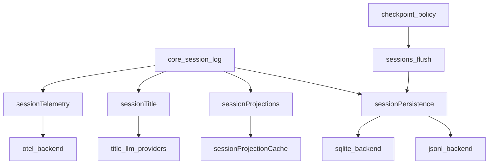

`core/session` 只追加内存事件；本族在 `session/flush` 上落盘，把日志折成投影、标题和出站遥测。检索与导出在兄弟组 [session-query.md](session-query.md)。

## `@deepseek-ai/dsh-session-persistence` — 耐久写协调

- 角色：Service Definition
- ctx：`ctx.sessionPersistence`
- 入口：[packages/session/session-persistence/src/index.ts](../../../packages/session/session-persistence/src/index.ts)、[coordinator.ts](../../../packages/session/session-persistence/src/coordinator.ts)、[write-behind.ts](../../../packages/session/session-persistence/src/write-behind.ts)
- 关键类型：`SessionPersistence`、`PersistenceCoordinator`、`PersistenceBackend`、`SessionInspection`、`SessionPersistenceRevision`

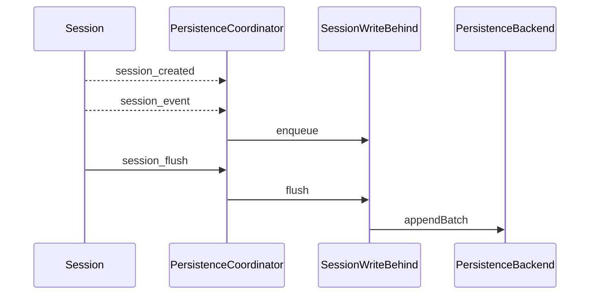

实现逻辑：

1. 抽象服务声明 `create` / `append` / `prepare` / `load` / `inspect` / `readFrom` / `list` / `listSnapshots`；JSONL 才实现 `readRaw`。
2. 一等后端构造 `PersistenceCoordinator`，只实现 `PersistenceBackend` 原语（`loadStored`、`appendBatch`、`commitRepair`）。
3. `session/created` 绑 live owner：新会话懒登记，HMR 只截断撕裂尾、不合成 closer。
4. `session/event` 入 write-behind 队列，默认最多等 200ms 再批写；`session/flush` 取消等待并排空。
5. 同一 session id 的读写串在一条 promise 链上，失败不毒化后续操作。
6. 冷读升级遗留事件形状，未知且未标 `ignorable` 的类型拒绝；中断 turn 只在 `load`/`prepare` 时合成 closer。
7. `inspect` 不提交修复；`prepare` 保留未发布 Session 供 resume；dispose 先 flush 再 `backend.close`。

源码走读：协调器拥有缓冲、采用、崩溃修复和销毁静默；后端只碰字节或行。`readFrom` 是投影缓存的尾读原语：SQLite 可按 seq 寻址，JSONL 仍解析整文件再切片。

## `@deepseek-ai/dsh-session-checkpoint-policy` — 语义检查点

- 角色：Consumer
- ctx：无自有键；`inject: ['llm', 'sessionPersistence', 'sessions', 'tools']`
- 入口：[packages/session/session-checkpoint-policy/src/index.ts](../../../packages/session/session-checkpoint-policy/src/index.ts)
- 监听：`llm/stream`、`tools/execute`、`agent/pre-step`

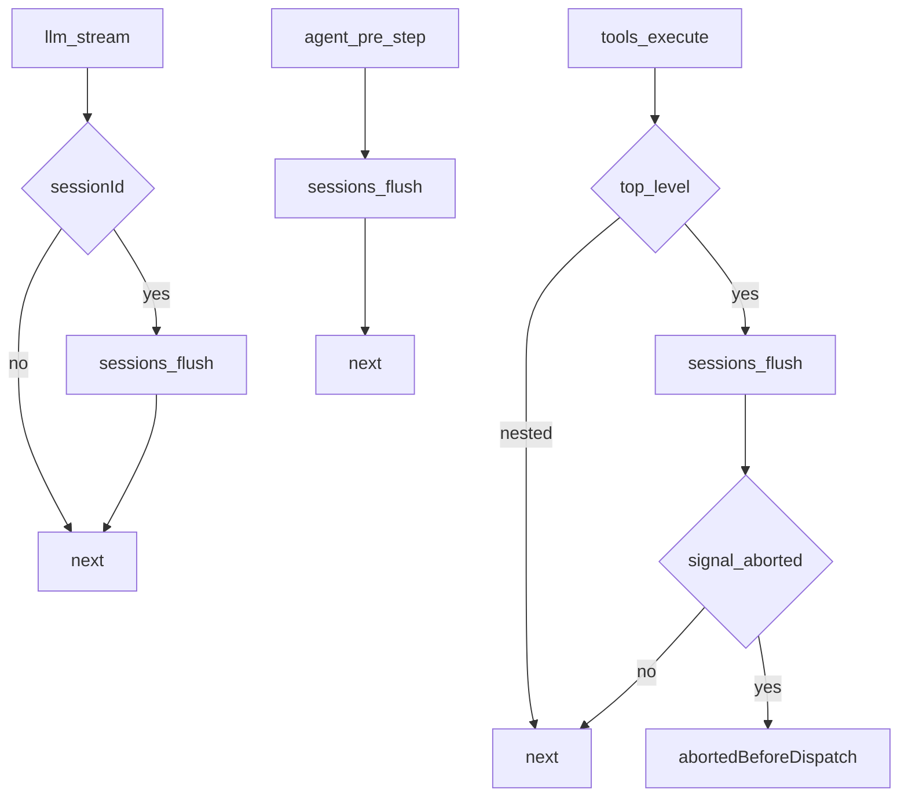

实现逻辑：

1. 带 `sessionId` 的 `llm/stream` 先 `flush` 再向适配器要第一个 chunk；拒绝则适配器不发请求。
2. 无 session 或 session 已消失则直接 `next()`。
3. 顶层 `tools/execute`（无 `parent`）先 flush 已记录的 `tool/call`。
4. flush 后若 signal 已 abort，返回 `TOOL_ABORTED_BEFORE_DISPATCH`，不跑 tool body。
5. 嵌套分发复用外层已耐久的 call，不再检查点。
6. 每个 `agent/pre-step` flush 上一步已提交的响应/结果；第一步对提示词摄入之外是空操作。

源码走读：检查点失败在模型和工具副作用边界 fail-closed。政策只调 `ctx.sessions.flush`，不碰后端。

## `@deepseek-ai/dsh-session-persistence-jsonl` — 每会话一个 JSONL 文件

- 角色：Service Provider
- ctx：占住 `ctx.sessionPersistence`；`inject: ['sessions']`
- 入口：[packages/session/session-persistence-jsonl/src/index.ts](../../../packages/session/session-persistence-jsonl/src/index.ts)、[format.ts](../../../packages/session/session-persistence-jsonl/src/format.ts)
- 关键类型：`JsonlSessionPersistence`、`JsonlCompression`、`JsonlTornMarker`
- Config：`root`（必填）、`packChunks`、`compression`（默认 `zstd`）、`preparedSessionCacheSize`、`writeBatchMaxDelayMs`

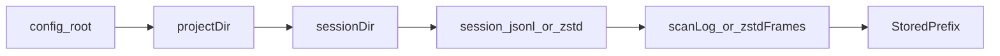

实现逻辑：

1. 构造时 `resolve(root)`，再建 coordinator；已有 root 必须是可读目录。
2. 路径是 `<root>/<project>/<id>/session.jsonl[.zstd]`；`locate` 不碰文件系统。
3. 首次 `appendBatch` 原子物化：写临时文件、fsync、POSIX `link` 发布（Win32 走独立发布路径）。
4. 后续追加 fsync；部分写失败先截回原 size 再抛，避免重复 seq。
5. zstd 第一帧只含 header；撕裂的末帧尽量回收完整 JSONL 行，marker 带 `truncateTo` 与 recovered events。
6. `readRaw` 解出后端写下的原文（含 packed chunk 行），不是从解析事件重建。
7. 根上混用另一种编码或旧扁平布局会大声失败；同一 id 出现在多个 project 目录也拒绝。

源码走读：`supportsRawArtifacts = true`。`readFrom` 无 seek hook，协调器解析整前缀再跳到 `fromSeq`。listing 只读 header 行。

## `@deepseek-ai/dsh-session-persistence-sqlite` — 行存储后端

- 角色：Service Provider
- ctx：占住 `ctx.sessionPersistence`；`inject: ['sessions']`
- 入口：[packages/session/session-persistence-sqlite/src/index.ts](../../../packages/session/session-persistence-sqlite/src/index.ts)、[schema.ts](../../../packages/session/session-persistence-sqlite/src/schema.ts)
- 关键类型：`SqliteSessionPersistence`、`SCHEMA_VERSION`
- Config：`path`（必填，`:memory:` 仅测试）、`journalMode`（默认 `wal`）

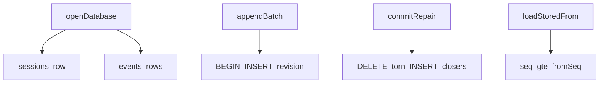

实现逻辑：

1. `Service` 构造立刻建 coordinator；`openDb` 异步，每个存储 hook 等同一 `ready`。
2. `locate` 恒为 `undefined`；`supportsRawArtifacts = false`。
3. `appendBatch` 在一笔事务里物化 sessions 行并 INSERT 事件，再 `revision + 1`。
4. torn marker 是「从此 seq 删除」；`commitRepair` 同样一笔事务。
5. `loadStoredFrom` 直接 `WHERE seq >= ?`，`readFrom` 随后缀增长而不是整日志。
6. revision 是 `storeIdentity:incarnation:revision`，跨库计数器不能相等。
7. dispose 等 coordinator 排空后再 `db.close()`。

源码走读：id 全局唯一，无需扫 project 目录。信封字段（`source_event_seqs`、`surface_op`、`ignorable`）是可空列。

## `@deepseek-ai/dsh-session-projection` — 投影驱动注册表

- 角色：Service Definition
- ctx：`ctx.sessionProjections`
- 入口：[packages/session/session-projection/src/index.ts](../../../packages/session/session-projection/src/index.ts)、[types.ts](../../../packages/session/session-projection/src/types.ts)
- 关键类型：`ProjectionDefinition`、`ProjectionSnapshot`、`ProjectionCheckpoint`、`SessionProjectionMap`

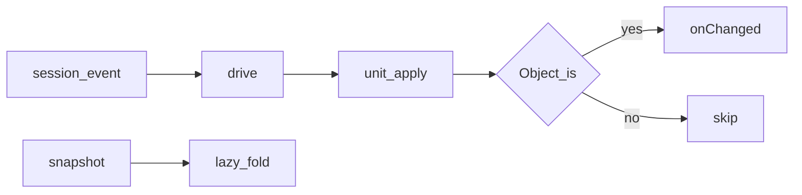

实现逻辑：

1. 构造时订一次 `session/event`；每个已提交事件过每个已注册 unit 的 `apply`。
2. Domain 插件只贡献纯函数 `init` / `apply` / `view` 和 `stateVersion`；框架拥有订阅与水位缓存。
3. `Object.is` 未变则零下游工作；变了才 schema 校验 `view` 并通知 change feed。
4. 同 key 多次注册按 `refs` 计数，避免一个 agent preset 卸掉就拆掉所有 session 的 unit。
5. 晚注册或晚碰到的 session 在首次 touch 时从 `init` 折完整内存日志。
6. `checkpoint` 交出 detached clone；`restore` / `restoreFloor` 给冷读梯子用。
7. 状态必须是普通 JSON；`stateVersion` 不匹配的缓存行整行丢弃。

源码走读：带状态的日志事件必须带完整新值，不能只带 delta。无 registry 的无头装配不受影响；domain 用 `ctx.inject(['sessionProjections'], …)` 注册。

## `@deepseek-ai/dsh-session-projection-cache` — 投影检查点

- 角色：Service
- ctx：`ctx.sessionProjectionCache`；`inject: ['storageDomain', 'sessionProjections', 'sessionPersistence', 'sessions']`
- 入口：[packages/session/session-projection-cache/src/index.ts](../../../packages/session/session-projection-cache/src/index.ts)、[spec.ts](../../../packages/session/session-projection-cache/src/spec.ts)
- 关键类型：`CheckpointRecord`、`CheckpointIdentity`
- Config：`writeEveryEvents`、`writeIntervalMs`（均必填）

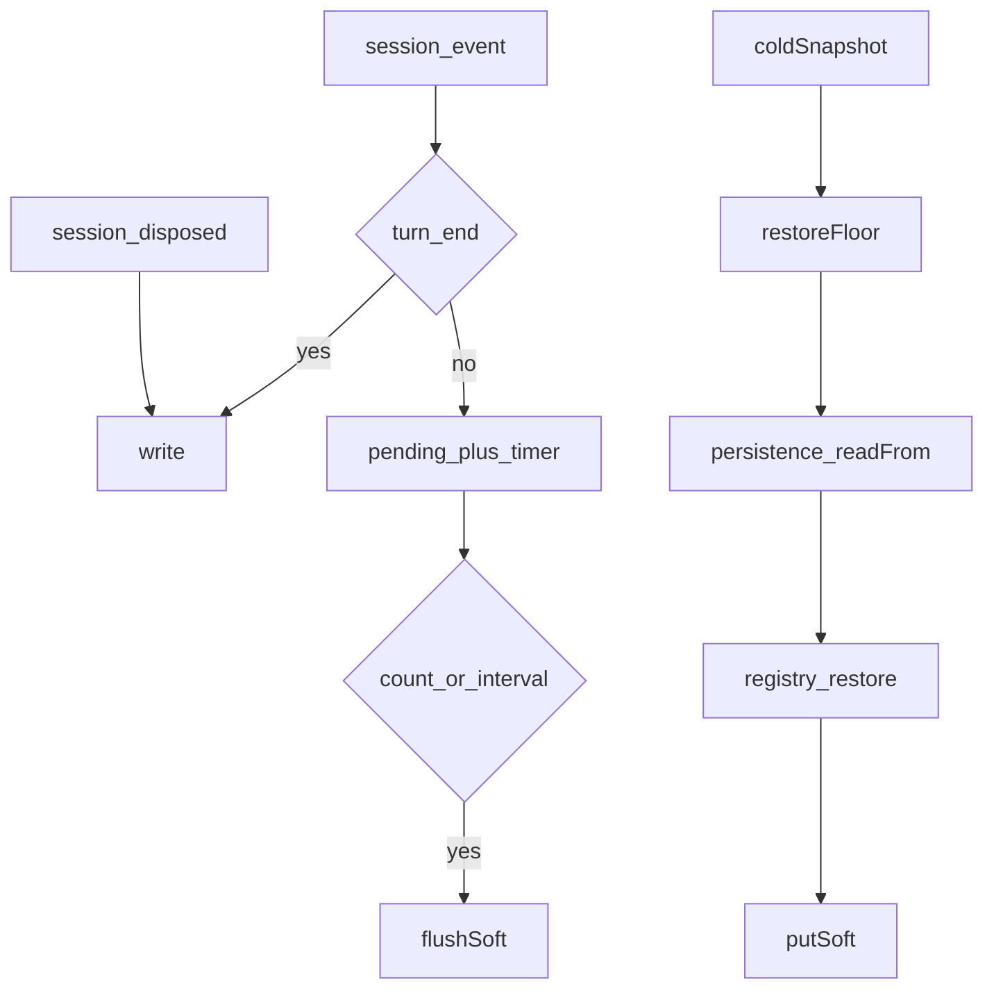

实现逻辑：

1. `Service.init` 打开 `session_projcache` domain，表键是 `SessionId`。
2. 缓存是折快捷方式，不是权威：写失败只 warn，下次冷读多折一段尾巴。
3. `turn/end` 与 `session/disposed` 强制写；其间按条数/间隔节流。
4. `write` 先 snapshot registry，再 `sessions.flush`，再 put，保证缓存永不超前日志。
5. 记录绑 `createdAt` + `cwd`；换 id 生命周期或换 persistence store 不能复用旧行。
6. `coldSnapshot`：`restoreFloor` → `readFrom` 尾巴 → `restore`；行越界则从 seq 0 重折。
7. `cachedSnapshot` 是零 I/O listing 读，只返回 version 匹配的行。

源码走读：json backend 把这张表落在 `workspace.json` 旁边。丢失一次写只让下次冷读更慢，不会给出错误值。

## `@deepseek-ai/dsh-session-stats` — 整日志计数投影

- 角色：Consumer（函数插件）
- ctx：无自有键；`inject: ['sessionProjections']`
- 入口：[packages/session/session-stats/src/index.ts](../../../packages/session/session-stats/src/index.ts)、[projection.ts](../../../packages/session/session-stats/src/projection.ts)
- 关键类型：`sessionStats`（`SessionProjectionMap` 成员）

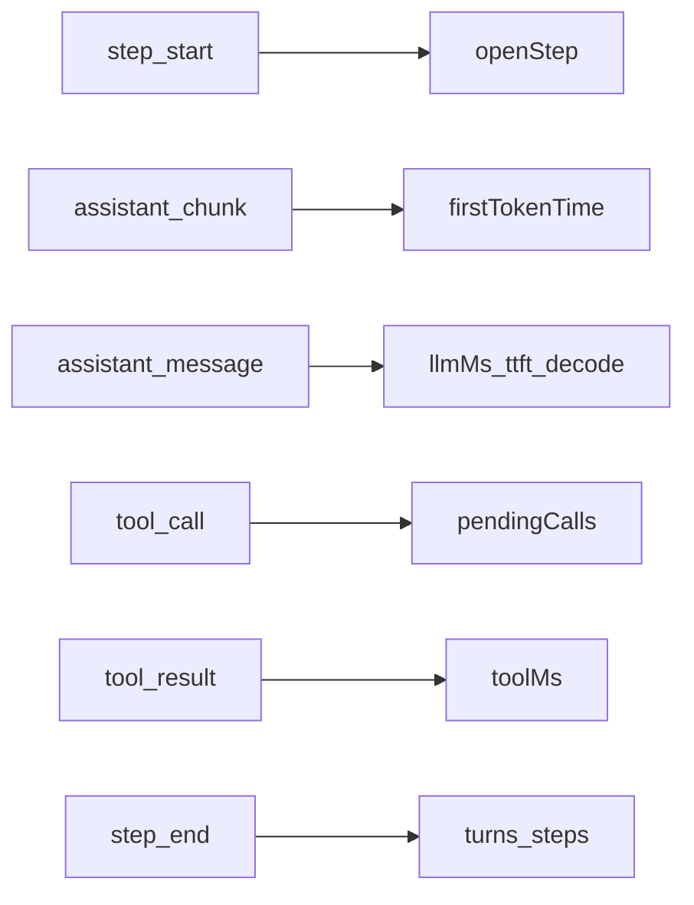

实现逻辑：

1. `apply` 只做 `sessionProjections.register(sessionStatsProjectionDefinition)`。
2. 计 step 用 `step/end`（loop 在 `finally` 里各写一条），不用 `assistant/message`。
3. 模型墙钟是 `step/start` → `assistant/message`；首 token 是第一步非空 delta，能活过 `llm/retry`。
4. decode 只在同时上报 output tokens 的 step 上从首 token 计到组装消息。
5. 工具时间按 `callId` 配对 `tool/call` → `tool/result`；`Object.hasOwn` 防原型键。
6. `turn/end` 丢掉未落地的 pending calls，避免取消 turn 撑大持久状态。
7. 不感兴趣的事件返回同一引用，change feed 不响。

源码走读：本包只拥有折；投递是 seam 的。取消的 step 没有组装消息，其部分流时间不计入任何墙钟。

## `@deepseek-ai/dsh-session-title` — 日志标题服务

- 角色：Service Definition
- ctx：`ctx.sessionTitle`；`inject: ['sessions']`
- 入口：[packages/session/session-title/src/index.ts](../../../packages/session/session-title/src/index.ts)、[normalize.ts](../../../packages/session/session-title/src/normalize.ts)
- 关键类型：`SessionTitleSnapshot`、`SessionTitleProvider`、`SessionTitleSource`
- 写入：`session/title`（log-only，不进模型 surface）

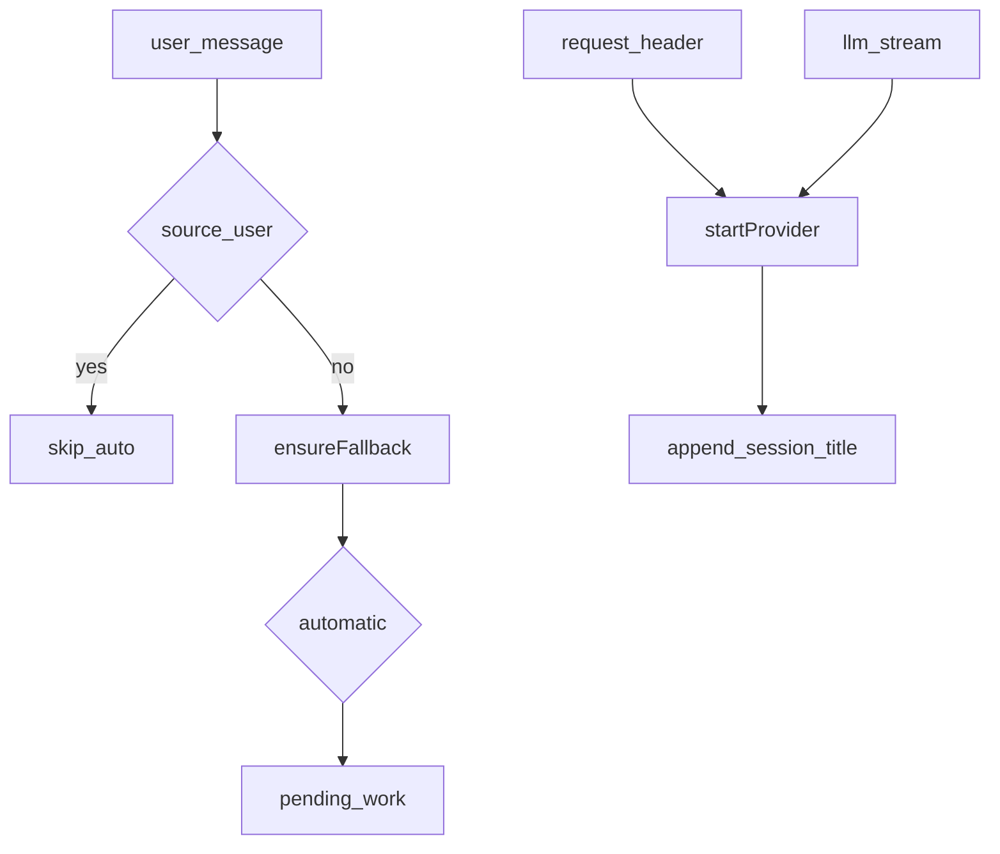

实现逻辑：

1. Config 三个正整数：`fallbackMaxWords` / `fallbackMaxBytes` / `maxTitleBytes`，且 fallback 字节不得大于标题上限。
2. 有 `sessionProjections` 时注册 `title` unit：last-wins 折 `session/title` 文本，否则 `null`。
3. 合格人类 `user/message` 先保证确定性 fallback；用户 `rename` 钉住标题，自动生成停止。
4. 至多一个 provider；`first-prompt` 只在根会话第一条消息且尚无标题时调度，`all-prompts` 每条合格消息都调度。
5. 自动工作等匹配的 `request/header`（或 loop 主请求）记下路由后才调用 provider。
6. 新消息、显式 `refresh`、用户改名会 abort 进行中的 revision。
7. provider 结果必须给出非空规范化标题和有序的源 `messageSeqs`。

源码走读：标题只从日志折，不读可变 metadata。`refresh` 是 unpin：即使没有 provider 也会用 fallback 盖掉用户钉住的标题。

## `@deepseek-ai/dsh-session-title-llm` — 模型标题共享策略

- 角色：library
- ctx：无键；被两个 provider 插件调用
- 入口：[packages/session/session-title-llm/src/index.ts](../../../packages/session/session-title-llm/src/index.ts)
- 关键类型：`SessionTitleLlmConfig`、`registerSessionTitleLlmProvider`
- 写入：`session/title-llm-request`（派发前的 log-only 记录）

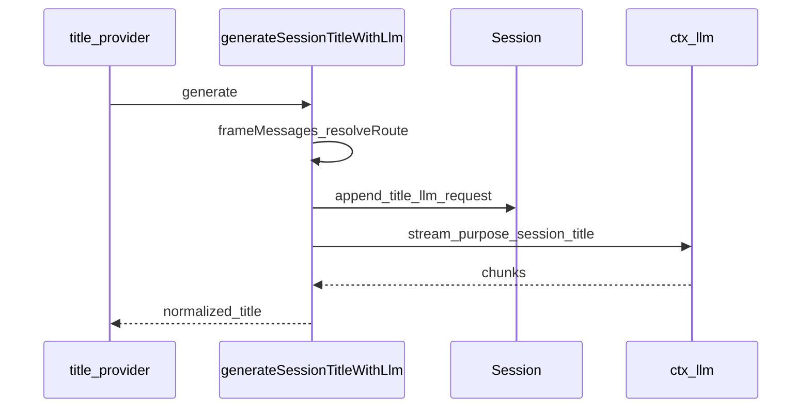

实现逻辑：

1. `resolveSessionTitleLlmConfig` 校验目标词/字、输入字节、输出 token、超时；`provider` 与 `model` 必须成对。
2. `registerSessionTitleLlmProvider` 向 `ctx.sessionTitle` 登记一个 `generate`。
3. 无显式路由则用 `request/header` 捕获的主请求路由。
4. 人类消息打成 JSON 数组，避免用户文本拆结构分隔符；超 `maxInputBytes` 拒绝。
5. 先追加 `session/title-llm-request`，再 `ctx.llm.stream`（`purpose: 'session-title'`），带 deadline。
6. `BlockAssembler` 收流；`max-tokens`、tool-call、空文本都失败。
7. 返回规范化标题、所用 seqs 和实际路由。

源码走读：这是辅助调用，不走 agent loop。两个 cadence 插件只差选哪些消息。

## `@deepseek-ai/dsh-session-title-first-prompt-llm` — 首条人类消息

- 角色：Service Provider
- ctx：无自有键；`inject: ['sessionTitle', 'llm', 'sessions']`
- 入口：[packages/session/session-title-first-prompt-llm/src/index.ts](../../../packages/session/session-title-first-prompt-llm/src/index.ts)
- Config：与 `SessionTitleLlmConfig` 相同，无库默认值

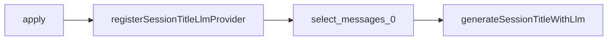

实现逻辑：

1. `apply` 以 `automatic: 'first-prompt'` 注册。
2. selector 只取 `messages[0]`；没有则抛错。
3. 之后的人类消息不再自动重标题（服务侧 cadence 已挡住）。
4. 部署必须写出全部 LLM 政策字段。

源码走读：同一时刻只能挂一个模型 provider；demo spine 默认不挂这两个。

## `@deepseek-ai/dsh-session-title-all-prompts-llm` — 全部人类消息

- 角色：Service Provider
- ctx：无自有键；`inject: ['sessionTitle', 'llm', 'sessions']`
- 入口：[packages/session/session-title-all-prompts-llm/src/index.ts](../../../packages/session/session-title-all-prompts-llm/src/index.ts)
- Config：与 first-prompt 插件相同

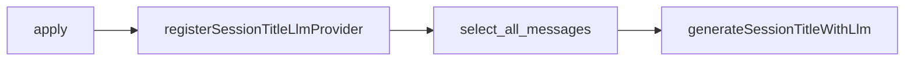

实现逻辑：

1. `apply` 以 `automatic: 'all-prompts'` 注册。
2. selector 原样返回全部合格人类消息。
3. 每条新合格消息都会调度一次（仍等主请求路由）。
4. 输入字节上限按整帧 JSON 计算，长会话可能拒绝。

源码走读：与 first-prompt 共享字段 schema；Loader 要求每个插件各自导出可静态走读的 `Config`。

## `@deepseek-ai/dsh-session-telemetry` — 出站遥测捕获

- 角色：Service Definition
- ctx：`ctx.sessionTelemetry`
- 入口：[packages/session/session-telemetry/src/index.ts](../../../packages/session/session-telemetry/src/index.ts)、[coordinator.ts](../../../packages/session/session-telemetry/src/coordinator.ts)
- 关键类型：`SessionTelemetryRecord`、`SessionTelemetrySink`、`SessionTelemetrySharingStatus`
- waterfall：`session-telemetry/record`

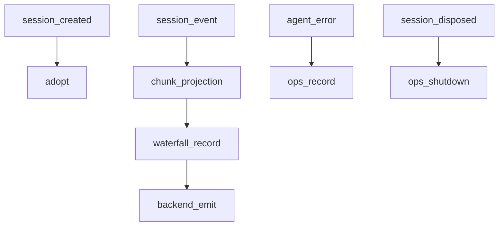

实现逻辑：

1. 后端子类 `SessionTelemetryBackend` 并在构造里组合 `SessionTelemetryCoordinator`。
2. live 捕获订 `session/created|event|flush|disposed` 和 `agent/error`；on-demand 不订连续监听。
3. ledger 记录一对一镜像日志事件；ops 记录（`agent-error`、`shutdown`）没有 `event.seq`。
4. `session-telemetry/record` 是脱敏扩展点，seam 自带零规则；抛错则扣下该条（fail-closed）。
5. `emit` 必须是非阻塞入队；协调器包住同步失败，不饿死其他订阅者、不碰 loop。
6. HMR 游标是模块级 `WeakMap<Session, seq>`，重挂 fiber 从上次交接处续，不重放历史。
7. `captureSession` 重放规范日志后缀；on-demand 不造 ops 记录。

源码走读：批处理、重试、丢弃政策是 SDK 的事。脱敏只改导出副本，从不改写规范日志。

## `@deepseek-ai/dsh-session-telemetry-otel` — OTel 投递

- 角色：Service Provider
- ctx：占住 `ctx.sessionTelemetry`；`inject: ['sessions']`
- 入口：[packages/session/session-telemetry-otel/src/index.ts](../../../packages/session/session-telemetry-otel/src/index.ts)
- 关键类型：`SessionTelemetryMode`（`FULL` / `FEEDBACK_ONLY` / `DISABLED`）
- Config：`mode`（默认 `DISABLED`）、`exporter`、`processor`、`shutdownTimeoutMillis`

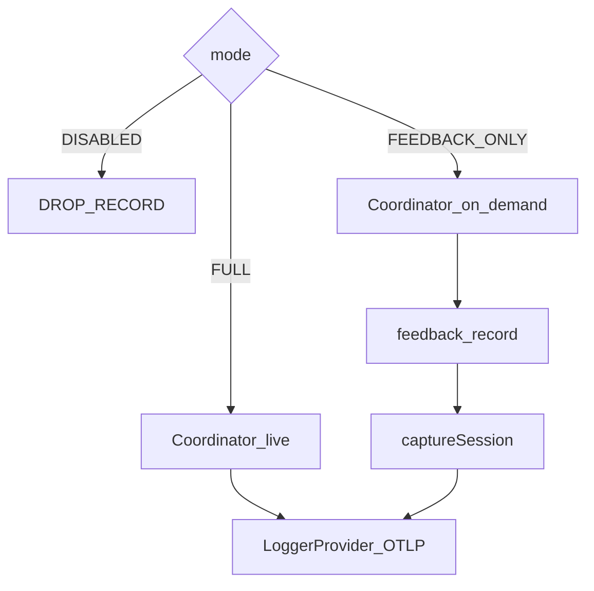

实现逻辑：

1. 三种 mode 都注册服务；`DISABLED` 不建 SDK，只在 `feedback/record` 时 warn「留在本地」。
2. 上传 mode 要求合法 `http(s)` `exporter.url`；`maxExportBatchSize` 必须为正，否则 shutdown 会挂死。
3. Resource 带 `service.name` / `service.version` 和 `user.id`（[anonymous-user-id](identity.md)）。
4. `FULL` 用 live 协调器，`emit` 直入 SDK；`FEEDBACK_ONLY` 的公开 `emit` 是 no-op。
5. `FEEDBACK_ONLY` 只在规范日志里的 `feedback/record` 上 `captureSession`；总线里没有对应日志事件则 warn。
6. 不实现 `flush()` hint，避免与 SDK shutdown drain 并发。
7. `shutdown` 用自有 deadline 包住 provider shutdown；超时后仍观察 SDK promise。

源码走读：`sharing` 把 mode 映射成 seam 的 `full` / `feedback-only` / `disabled`，给 `/feedback` 确认文案用。
