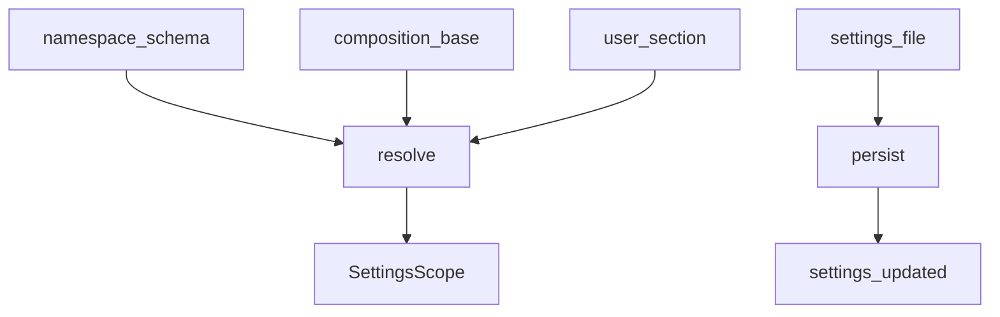
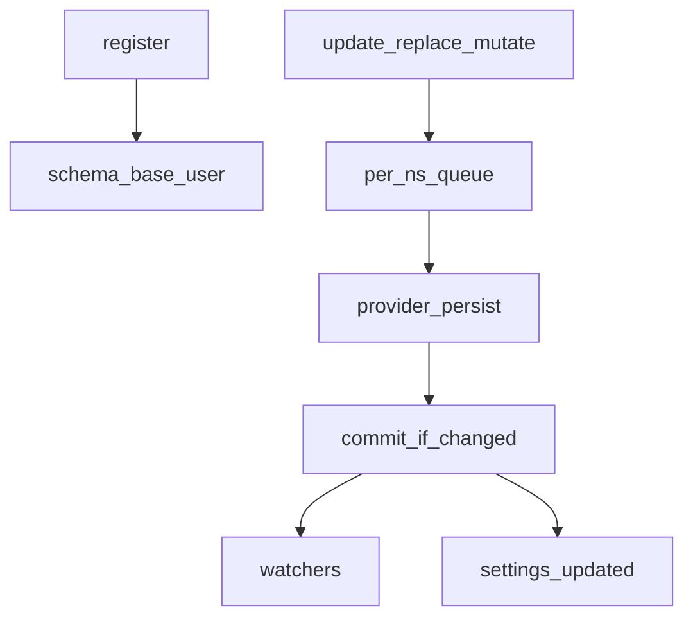
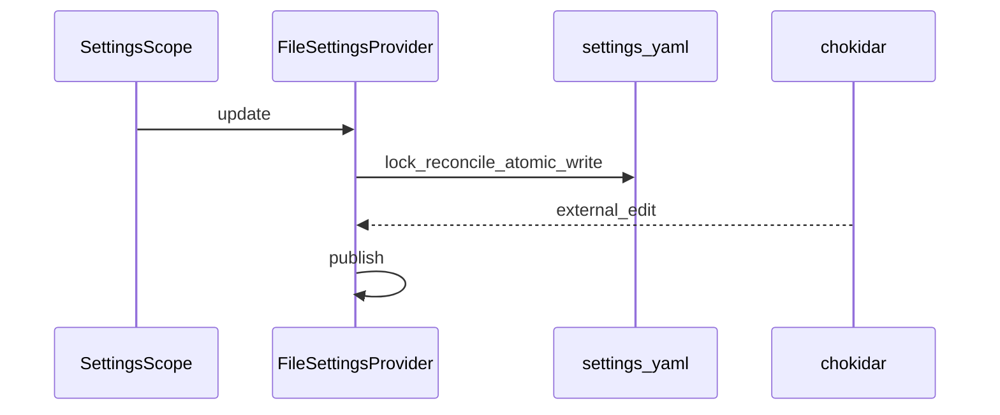

# settings/ — 用户设置

学习笔记，非正式产品文档。类型合同见 [settings.md](../../subsystems/settings.md)。组映射见 [packages/settings/README.md](../../../packages/settings/README.md)。

插件登记命名空间 schema；解析顺序是 schema 默认、composition `base`、用户文档段。

## `@deepseek-ai/dsh-settings` — 命名空间与提交

- 角色：Service Definition
- ctx：`ctx.settings`
- 入口：[packages/settings/settings/src/index.ts](../../../packages/settings/settings/src/index.ts)、[types.ts](../../../packages/settings/settings/src/types.ts)、[redact.ts](../../../packages/settings/settings/src/redact.ts)
- 关键类型：`SettingsProvider`、`SettingsScope`、`SettingsDescriptor`、`SettingsConflictError`、`installSettingsSection`
- 事件：`settings/updated`、`settings/document-updated`

实现逻辑：

1. Provider 实现 `load` / `persist`；基类拥有登记、解析、校验和提交事件。
2. `register` 是调用 fiber 上的 effect；重复命名空间失败；非法已存段在登记时拒绝。
3. 解析是 schema 默认，再 `base`，再用户层；可选 `validate` 拒绝 schema 表达不了的约束。
4. `update` 合并，`replace` 整段替换（`{}` 重置），`mutate` 按路径改（给只看见脱敏描述符的 UI）。
5. 同一命名空间的写串行；`expectedRevision` 在队头检查，过期抛 `SettingsConflictError`。
6. 只有 JSON 兼容数据能持久化；`publish` 时非法段保留该命名空间上次好值并 warn。
7. `installSettingsSection` 在有 settings 服务时登记，服务消失则回落到 composition entry。

源码走读：revision 跟原始用户段走，不是解析值——覆盖写成与 base 相同也会 bump，好让表单重读「已覆盖」。线上面必须 `describe({ redactSecrets: true })`。

## `@deepseek-ai/dsh-settings-file` — YAML/JSON 文件 Provider

- 角色：Service Provider
- ctx：占住 `ctx.settings`
- 入口：[packages/settings/settings-file/src/index.ts](../../../packages/settings/settings-file/src/index.ts)
- Config：`path`（默认 `<DSH_HOME>/settings.yaml`）、`dshHome`、`watch`（默认 true）、`debounceMs`

实现逻辑：

1. 扩展名决定 `yaml` 或 `json`；其他扩展在 resolve 时拒绝。
2. `writable === true`；`documentPath` 是解析后的绝对路径。
3. 启动 `load` 解析失败是 boot 失败：已有但无效的文档不得 silently 忽略。
4. 写走跨进程锁：先 reconcile 盘上文本，再按叶级 diff 打补丁，YAML 评论得以保留。
5. 原子写 `0600`，父目录 `0700`。
6. watcher 在 debounce 后排队 refresh；内容等于缓存（含自写）则 no-op。
7. 热重载解析失败 warn 并保留上次好文档；写路径上不可解析则大声失败。

源码走读：一份文档背所有命名空间，所以不同 ns 的写和 watcher reload 走同一操作链。`prepareDocument` 在打开原生编辑器前物化空文件。
