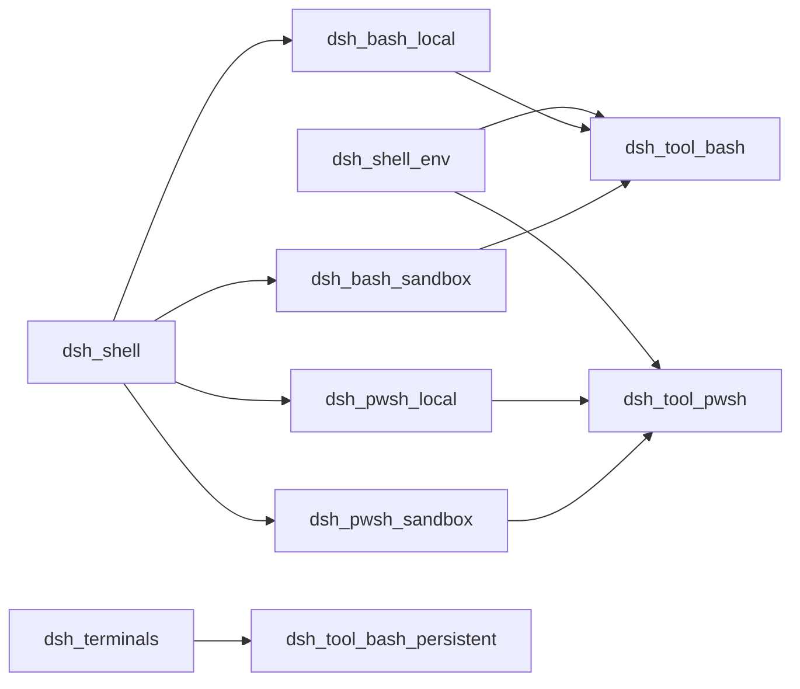
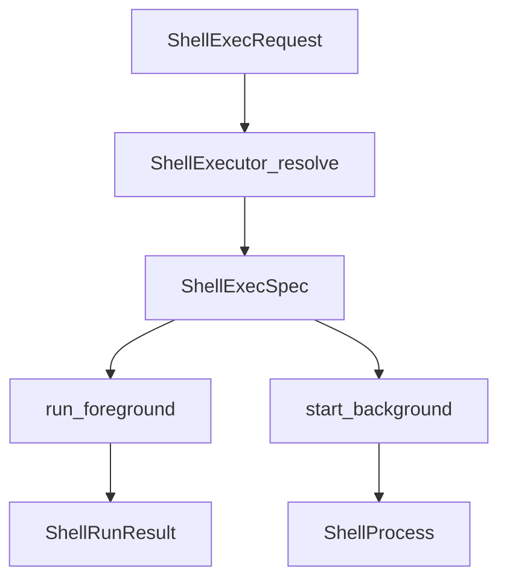
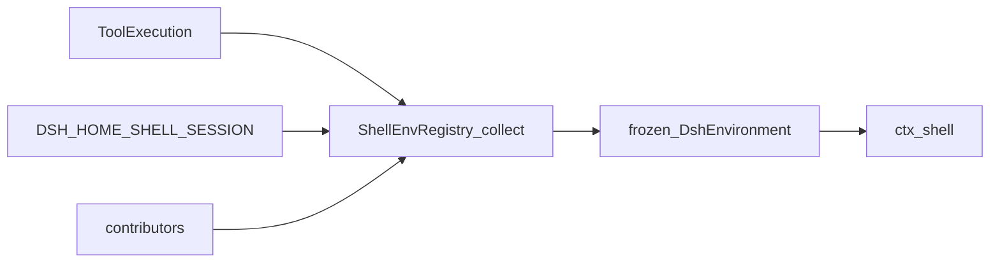
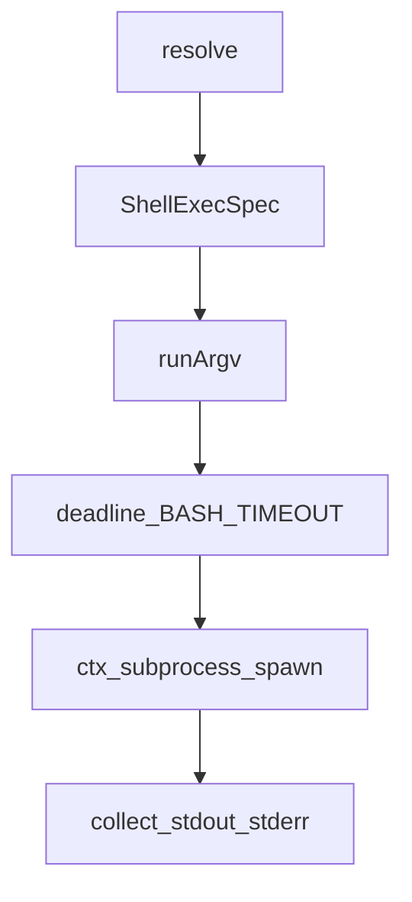
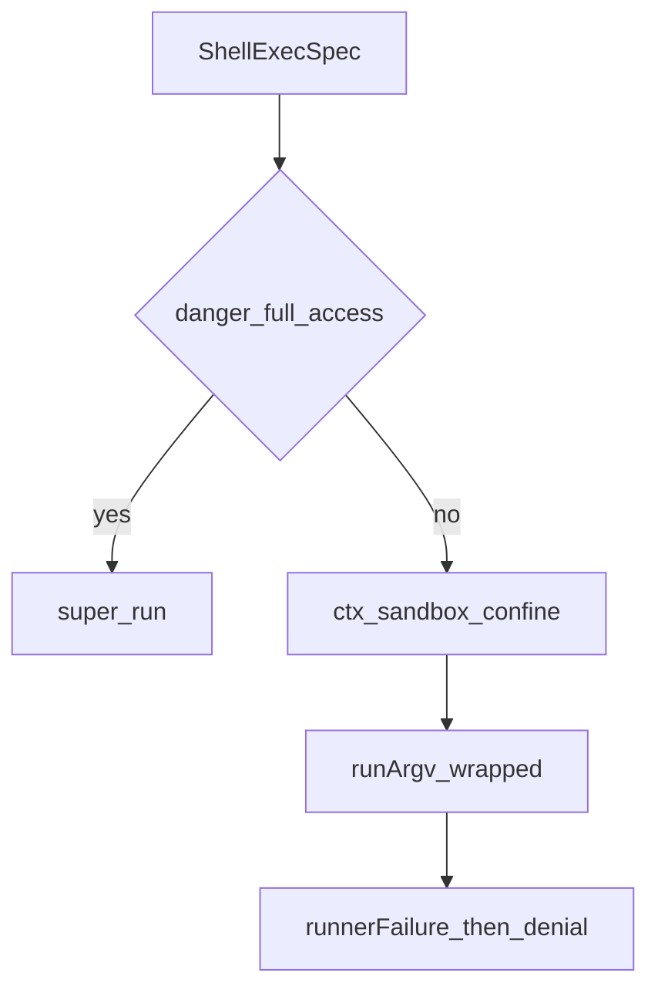
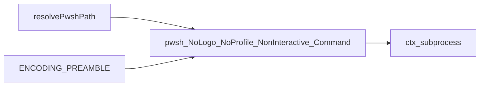
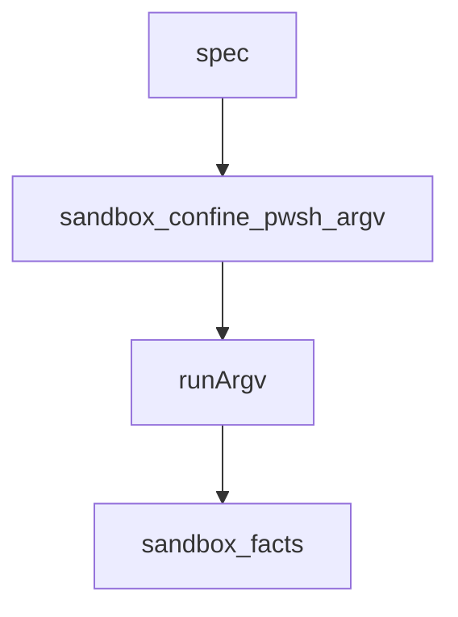
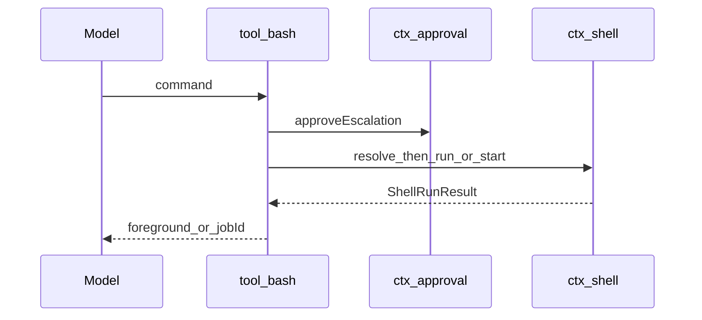
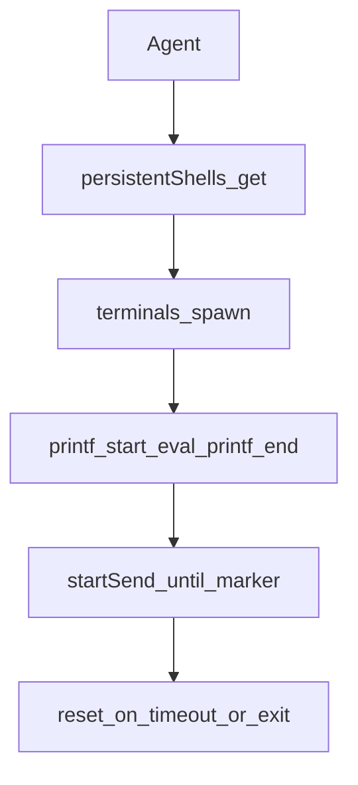
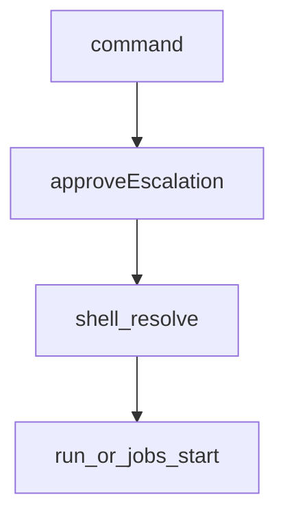

# shell/ — 一次性命令执行

学习笔记，非正式产品文档。权威合同见各包 README 与 [subsystems/shell.md](../../subsystems/shell.md)。组映射见 [packages/shell/README.md](../../../packages/shell/README.md)。沙箱政策见 [sandbox.md](sandbox.md)。

`ctx.shell` 一台 Context 只挂一个实现。win32 组合用 pwsh 行替换 POSIX 行；同时挂两个会重复服务抛错。作业 id 与轮询属于 `dsh-jobs`，不在本缝。

## `@deepseek-ai/dsh-shell` — request/spec 与前后台句柄

- 角色：Service Definition
- ctx：`ctx.shell`
- 入口：[packages/shell/shell/src/index.ts](../../../packages/shell/shell/src/index.ts)、[types.ts](../../../packages/shell/shell/src/types.ts)
- 关键类型：`ShellExecRequest`、`ShellExecSpec`、`ShellRunResult`、`ShellProcess`、`ShellSandboxInfo`
- 设置命名空间：`SHELL_SETTINGS_NAMESPACE`（能力名，不是实现名）

实现逻辑：

1. `resolve` 是显式默认步骤：填 `workdir`/`timeoutMs`/`stdoutMaxBytes`，封顶，再交给 `run`/`start`。`run` 里禁止再 `?? default`。
2. `run` 只对基础设施失败 reject；非零退出、超时杀、abort 杀都 resolve 成 `ShellRunResult`。
3. `timedOut` 与 `aborted` 互斥：一条融合截止期，先到的原因独占。
4. `start` 立即返回；后台无执行器超时。`done` 永不 reject；spawn 失败结算为 `killed`，错误走 stderr 读路径。
5. `readOutput` 消耗式：连续读不重复。丢失标 `lossy` 并指向 spill。
6. `sandboxMode` 基类返回 `undefined`；禁闭执行器覆盖为部署默认，供工具决定是否广告升级字段。
7. 后台进程的拆除边界是 `ctx.subprocess` 卸载，不是执行器重载。

源码走读：`dshEnv` 在普通 `env` 之后合并，调用方不能挤掉托管键。`stdin`/`env`/`dshEnv` 是进程内插件用的，模型工具不暴露这些参数。

## `@deepseek-ai/dsh-shell-env` — 每次调用重建的 `DSH_*` 快照

- 角色：Service（注册表）+ 函数插件
- ctx：`ctx.shellEnv`
- 入口：[packages/shell/shell-env/src/index.ts](../../../packages/shell/shell-env/src/index.ts)
- 关键类型：`BashEnvContributor`、`DshEnvironment`
- 内置键：`DSH_HOME`、`DSH_SHELL=1`、有 agent 时 `DSH_SESSION_ID`；插件贡献 `DSH_SESSION_JSONL`

实现逻辑：

1. `apply` 建 `ShellEnvRegistry` 并登记 `session-persistence` 贡献者。
2. `register` 校验名字、`DSH_` + 大写后缀、非空描述、键不与保留键或他人冲突；`ctx.effect` 卸载时一起撤。
3. `collect(execution)` 先放内置，再按贡献者名排序合并；未声明键或非字符串立即抛。
4. 执行器丢弃环境中的环境 `DSH_*`，再注入这份快照，所以过期事实不会从宿主进程继承。
5. `list()` 只枚举插件贡献，不含内置（源码里有 TODO）。

源码走读：保留键集合含 `DSH_HOME`、`DSH_SHELL`、`DSH_SESSION_ID`。`DSH_SESSION_JSONL` 仅在持久化后端给出 jsonl 路径时出现。

## `@deepseek-ai/dsh-bash-local` — `bash -c` 经 `ctx.subprocess`

- 角色：Service Provider
- ctx：占住 `ctx.shell`；`inject: ['subprocess']`
- 入口：[packages/shell/bash-local/src/index.ts](../../../packages/shell/bash-local/src/index.ts)
- 关键类型：`LocalBashExecutor`、`Config`
- 设置：经 `installSettingsSection(SHELL_SETTINGS_NAMESPACE)` 热更新

实现逻辑：

1. 默认 `timeoutMs=120s`、`maxTimeoutMs=600s`、`maxOutputBytes=64KiB`、`maxSpillBytes=64MiB`、`graceMs=3s`。构造与设置写入都走 `assertServiceableBashConfig`。
2. `resolve` 用 `clampTimeout` 封顶；`stdoutMaxBytes` 默认执行器 cap；`sandboxPolicy` 原样穿过（本执行器不禁闭）。
3. `spawnSpec` 把命令变成 collect 双流 + 可选 stdin data；环境是 `ENV_OVERRIDES`（`NO_COLOR`/`TERM=dumb`/`PAGER=cat`）再叠 `env` 再叠 `dshEnv`。
4. `run` → `runArgv(['bash','-c',command])`：`deadline` 融合超时与上游 abort；`timeoutOf(..., 'BASH_TIMEOUT')` 才算 `timedOut`。
5. `start` → `startArgv`：忽略 `timeoutMs`；`readOutput` 把 stderr 标成 `[stderr]` 段；spawn 失败笔记只读一次。
6. `onProcessDone` 基类为空，给沙箱子类贴 `sandbox` 事实。

源码走读：`runArgv`/`startArgv` 是禁闭子类换 argv 的钩子。后台 `kill` 调 `handle.terminate()`。

## `@deepseek-ai/dsh-bash-sandbox` — 先 `confine` 再走本地力学

- 角色：Service Provider（替换 `bash-local`）
- ctx：占住 `ctx.shell`；`inject: ['subprocess','sandbox','sandboxPolicy']`
- 入口：[packages/shell/bash-sandbox/src/index.ts](../../../packages/shell/bash-sandbox/src/index.ts)、[helpers.ts](../../../packages/shell/bash-sandbox/src/helpers.ts)
- 配置：与 `bash-local` 相同；政策不在本包

实现逻辑：

1. `sandboxMode` 读 `ctx.sandboxPolicy.defaultMode`，给工具广告用。
2. `resolve` 在父类结果上盖 `request.sandboxPolicy ?? ctx.sandboxPolicy.resolve()`。
3. `danger-full-access` 不包 argv，结果仍带 `sandbox: { mode, denied: false }`。
4. 否则 `confine(['bash','-c',command], policy)`，把返回 argv 交给 `runArgv`/`startArgv`。
5. 前台：runner spawn 失败或 `classifyRunnerFailure` 命中则抛 `SandboxUnavailableError`；否则 `denied = classifyDenial(...)`。
6. 后台：每进程在 `processFacts` 里记住该次 wrap 的方言；`onProcessDone` 结算时 runner 失败优先于 denial。信号死不是 denial。

源码走读：重叠调用的 enforcement 可能不同，所以不能用“最近一次 wrap”给所有进程分类。

## `@deepseek-ai/dsh-pwsh-local` — `pwsh -Command` 镜像 bash-local

- 角色：Service Provider
- ctx：占住 `ctx.shell`；`inject: ['subprocess']`
- 入口：[packages/shell/pwsh-local/src/index.ts](../../../packages/shell/pwsh-local/src/index.ts)、[resolve.ts](../../../packages/shell/pwsh-local/src/resolve.ts)
- 关键符号：`PwshLocalExecutor`、`ENCODING_PREAMBLE`、`resolvePwshPath`

实现逻辑：

1. 控制流与 `bash-local` 逐调用镜像：同一 deadline 原因字 `BASH_TIMEOUT`、同一 collect/spill/后台读路径。
2. `argv` 是 `[pwshPath,'-NoLogo','-NoProfile','-NonInteractive','-Command', preamble+command]`。命令是一个 argv 元素，没有中间 shell 引用层。
3. `ENCODING_PREAMBLE` 把控制台与 `$OutputEncoding` 钉成 UTF-8，避免 Windows PowerShell 5.1 的 OEM 码页。
4. `ENV_OVERRIDES` 无 `TERM=dumb`（POSIX 概念）。`pwshPath` 可配置；省略则探常见安装再 PATH，最后回退裸 `pwsh`。
5. 设置变更只在声明路径变时重新探测可执行文件。

源码走读：`runArgv`/`startArgv`/`onProcessDone` 给 `pwsh-sandbox` 用，与 bash 对偶。

## `@deepseek-ai/dsh-pwsh-sandbox` — 包 pwsh argv 的禁闭执行器

- 角色：Service Provider
- ctx：占住 `ctx.shell`；`inject: ['subprocess','sandbox','sandboxPolicy']`
- 入口：[packages/shell/pwsh-sandbox/src/index.ts](../../../packages/shell/pwsh-sandbox/src/index.ts)
- 行为：与 `bash-sandbox` 逐调用镜像；`confine(this.argv(spec), policy)`

实现逻辑：

1. 政策默认与解析同 bash-sandbox。
2. Windows 上 `ctx.sandbox` 落到 ACL restricted-token runner。
3. 前台 runner 失败抛 `SANDBOX_UNAVAILABLE`；后台贴 `runnerFailed`。
4. `processFacts` 按进程记住 denial 方言。

源码走读：工具层拥有升级审批；本执行器只报告 `result.sandbox` 供渲染。

## `@deepseek-ai/dsh-tool-bash` — 模型面对的一次性 bash

- 角色：Consumer
- ctx：无自有键；`inject: ['tools','shell','systemPrompt','shellEnv']`；可选 `jobs`/`approval`/`sandboxPolicy`
- 入口：[packages/shell/tool-bash/src/index.ts](../../../packages/shell/tool-bash/src/index.ts)、[render.ts](../../../packages/shell/tool-bash/src/render.ts)
- 工具名：`bash`
- 监听/写入：注册工具；`systemPrompt.section('tool:bash')`

实现逻辑：

1. 执行器 `sandboxMode` 有值则必须有 `ctx.sandboxPolicy`，否则加载失败。升级字段只在此时广告。
2. `validateEscalationArgs` 要求 `sandbox_permissions` 与 `justification` 成对。升级在任何执行前经 `approveEscalation`。
3. `workdir`：相对路径相对政策工作区根（或会话 cwd）；政策根优先，保证禁闭与 cwd 同一身份。
4. `dshEnv = ctx.shellEnv.collect(exec)` 注入每次调用。
5. 前台：`run` + `exec.signal`；`aborted` 变成 `TOOL_ABORTED`。后台：`jobs.start({ kind:'bash' })`，取消走 `proc.kill()`。
6. 渲染：`[exit code: N]`、`[sandbox: file access denied under <mode> mode]`、截断尾 + spill 路径。前台 UI 是 terminal 卡。

源码走读：未广告的 `sandbox_permissions` 仍可能到达 execute（schema 只检查广告键），所以加载时的组合守卫不能省。

## `@deepseek-ai/dsh-tool-bash-persistent` — 每 agent 一条 PTY bash

- 角色：Consumer（消费 `ctx.terminals`，不消费 `ctx.shell`）
- ctx：无自有键；`inject: ['tools','terminals']`
- 入口：[packages/shell/tool-bash-persistent/src/index.ts](../../../packages/shell/tool-bash-persistent/src/index.ts)
- 工具名：仍是 `bash`（与 `tool-bash` 互斥组合）
- 配置：`backendType`（默认 `shell`）、`timeoutMs=300s`、`maxOutputChars=16000`

实现逻辑：

1. 每 `Agent` 一条会话：`stty -echo` 且 `PS1` 钉成 `__DSH_PERSISTENT_BASH_PROMPT__`。
2. 命令包在单物理行：`printf START; eval -- cmd; printf END $status`，避免交互 bash 打 PS2。
3. 轮询 `startSend` 直到看到 END 标记、提示符、超时或 shell 退出。超时/退出/发送失败会 `reset`，下次从工作区新开。
4. 同一 owner 的调用串行（`WeakMap` 队列），避免两命令抢同一 PTY。
5. 滚动条按页拼回；超 `maxOutputChars` 或丢头会夹 clipped 说明。

源码走读：这是状态持久工具，不是 `ctx.shell` 的后台作业。插件卸载会杀所有活会话。

## `@deepseek-ai/dsh-tool-pwsh` — 模型面对的 PowerShell

- 角色：Consumer
- ctx：无自有键；`inject: ['tools','shell','systemPrompt','shellEnv']`
- 入口：[packages/shell/tool-pwsh/src/index.ts](../../../packages/shell/tool-pwsh/src/index.ts)
- 工具名：`pwsh`；作业 kind：`pwsh`

实现逻辑：

1. 与 `tool-bash` 逐调用镜像：同一升级、同一 `DSH_*`、同一前台/后台分裂、同一结果 schema。
2. 文案是 PowerShell 方言：`C:\...`、`$env:NAME`、Windows 强杀结算为 `[exit code: 1]` 无信号标记。
3. 禁闭组合下额外说明 ConstrainedLanguage 与命名管道 EPERM（restricted token 边界）。
4. `resolveWorkdir` 用会话 header cwd，不用政策根（与 bash 工具的政策根优先不同）。

源码走读：`JobKindMap` 声明合并 `pwsh`。提示词提醒把中断后的裸 exit 1 当成终止，不是命令失败。
