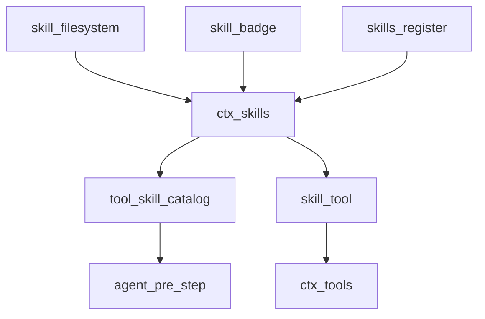
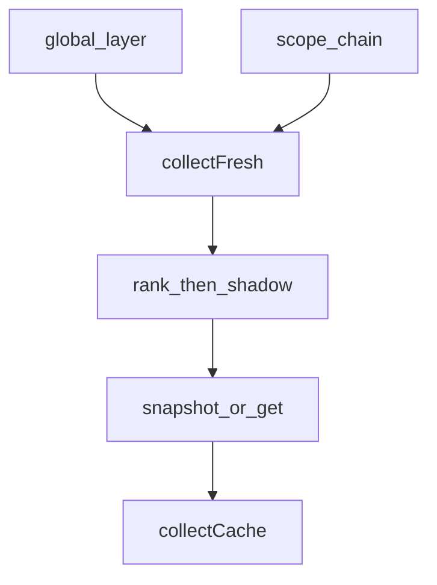
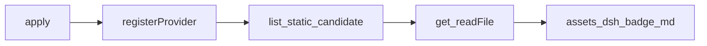
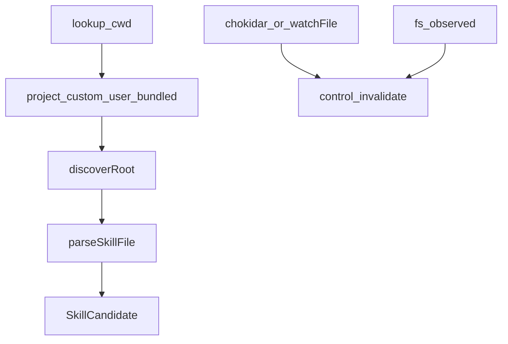
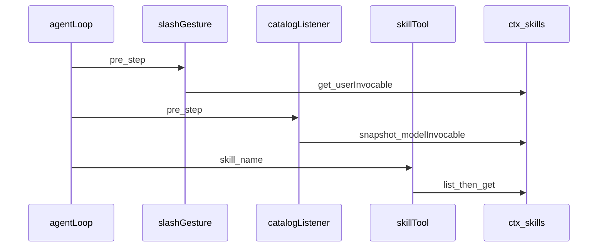

# skill/ — 技能目录与加载

学习笔记，非正式产品文档。类型与发现优先级见 [skills.md](../../subsystems/skills.md)。组映射见 [packages/skill/README.md](../../../packages/skill/README.md)。

Definition 只做分层合并与按名加载；Provider 决定技能从哪来；`tool-skill` 是面向模型的 Consumer。

## `@deepseek-ai/dsh-skill` — 技能注册表

- 角色：Service Definition
- ctx：`ctx.skills`
- 入口：[packages/skill/skill/src/index.ts](../../../packages/skill/skill/src/index.ts)
- 关键类型：`SkillProvider`、`SkillCandidate`、`SkillDefinition`、`SkillSummary`、`SkillCatalogSnapshot`
- emit：`skills/change`

实现逻辑：

1. `SkillRegistry` 用 `ScopedLayers<SkillLayer>`：每个 layer 有 providers + runtime map。
2. `registerProvider` 同步登记到调用 ctx 的 layer；`runtime` 名保留；fiber dispose 时 abort control.signal 并清缓存。
3. `register` 写 runtime skill，同 layer 同名 first-wins，重复只 warning。
4. `list` / `snapshot` / `get` 按 viewing `scope` 合并 global + 祖先链；近层同名直接覆盖，rank 只在一层内比。
5. 层内排序：`rank` → `providerOrder` → `localOrder`。filesystem 默认 rank：project-dsh 100、project-agents 200、runtime 250、custom 300、user-dsh 400、user-agents 500、bundled 600（小的赢）。
6. 完整且 revision 未变的 collect 可缓存；发现中途 revision 变了最多再试一次，否则 `complete: false` 且不缓存。
7. `get` 把 winning candidate 的 locator 交回原 provider；加载后校验，name 漂移则 `invalidateEntry`。
8. `skills/change` 是无过滤失效通知，监听器抛错只打日志，不能 veto。

源码走读：`renderSkillContent` 是 tool 结果和用户 `/name` 注入共用的 `<skill_content>` 形态。`isModelInvocable` / `isUserInvocable` 在 Consumer 边界执行，注册表本身不做过滤。

## `@deepseek-ai/dsh-skill-badge` — 打包徽章技能

- 角色：Service Provider
- ctx：无自有键；`inject: ['skills']`
- 入口：[packages/skill/skill-badge/src/index.ts](../../../packages/skill/skill-badge/src/index.ts)
- 路由名：provider `dsh-badge`，技能 `dsh-badge`，`source: 'bundled'`，`rank: BUNDLED_SKILL_RANK`

实现逻辑：

1. `apply` 把固定 `SkillProvider` 登记到 `ctx.skills`。
2. `list` 同步返回一条 candidate，locator 是 `assets/dsh-badge.md` 的 URL。
3. `get` 读该文件正文，带 `resourceBase.kind === 'directory'` 指向 `assets/`。
4. invocation 默认模型与用户都可调用。

源码走读：这是最小 Provider：无 watch、无 cwd。正文在包内资产，不走 `ctx.fs`。

## `@deepseek-ai/dsh-skill-filesystem` — 本地目录发现

- 角色：Service Provider
- ctx：无自有键；`inject: ['skills']`；发现/读取优先 `ctx.get('fs')`
- 入口：[packages/skill/skill-filesystem/src/index.ts](../../../packages/skill/skill-filesystem/src/index.ts)
- 关键类型：`FileSystemSkillProvider`、`SkillRoot`、`Config`

实现逻辑：

1. `apply` 在 `registerProvider` 里构造 `FileSystemSkillProvider`，并挂 watcher dispose；`fs/observed` 上 `write` / `edit` 同步 invalidate。
2. `roots(cwd)`：项目 `.dsh/skills` 与 `.agents/skills`（沿 `.git` 找根）、`customSkillDirs`、用户 `~/.dsh/skills` 与 `~/.agents/skills`、可选 bundled 目录。
3. 目录包读 `SKILL.md`，扁平 `*.md` 也认；user-dsh 跳过 `.system`。
4. frontmatter 要 `name` + `description`；`disable-model-invocation` / `user-invocable` 收成 invocation；旧 camelCase 键直接拒绝。
5. 非 trusted bundled 根走 `ctx.fs`；bundled / 无 fs 走 Node `fs`。
6. `SkillWatchManager` 按项目根限额 watch；根不存在时 watch 祖先；事件经 microtask 合并后 `invalidate()`。
7. watch 启动失败仍返回已扫到的 candidates，但 `complete: false`。

源码走读：`observeHostMutation` 让模型刚写下的 SKILL.md 不必等 chokidar。`trustedHost` 只给 bundled 根，避免沙箱 fs 挡打包技能。

## `@deepseek-ai/dsh-tool-skill` — 目录与 `skill` 工具

- 角色：Consumer
- ctx：无自有键；`inject: ['agents', 'tools', 'skills']`
- 入口：[packages/skill/tool-skill/src/index.ts](../../../packages/skill/tool-skill/src/index.ts)
- 关键类型：`SkillCatalogSource`、`SkillInvocationSource`
- 监听：两条 `agent/pre-step`

实现逻辑：

1. 注册 `skill` 工具：按 agent scope + cwd 查名，拒绝非 kebab、未知、或 `!modelInvocable`；结果经 `renderSkillContent`。
2. 先登记的 pre-step 扫 claimed **用户**消息里的 `/(^|\s)/name(?=\s|$)` 手势；只注入 `userInvocable` 的正文，跟在其它 injection 后面。
3. 后登记的 pre-step 仅当 `ctx.tools.get('skill', agent)` 仍是本插件那份 definition 时才发目录；restrict / 同名 shadow 会同时拿掉 schema 和目录。
4. `snapshot.complete === false` 本步不改目录，留给下次。
5. 用 entries 的 sha256 digest 对比 surface 上可见的上一份 catalog；相同则去掉本步重复，变化则发 `update: true` 的完整替换。
6. 从未发布且当前为空，不发空目录。

源码走读：`disable-model-invocation` 技能只走 `/name` 手势，不进 catalog、不能被 `skill` 工具加载。`SkillCatalogSource.entries` 是给 UI 的权威列表，不要回解析 `<available_skills>`。
