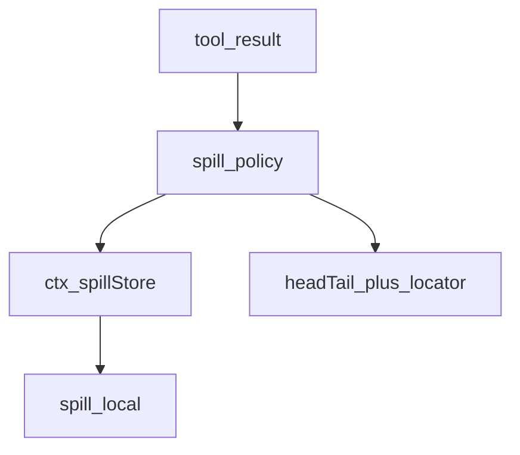
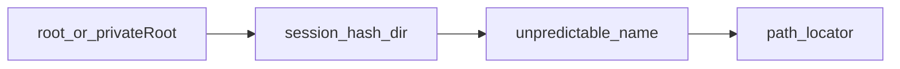
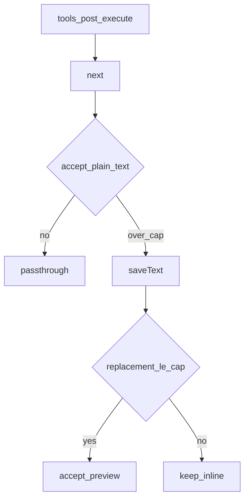

# spill/ — 超大工具输出外溢

学习笔记，非正式产品文档。类型合同见 [spill.md](../../subsystems/spill.md)。组映射见 [packages/spill/README.md](../../../packages/spill/README.md)。

存储、预览截断和「何时外溢」是分开的：本族只做存储与政策；预览机械在 `dsh-output-retention`。

## `@deepseek-ai/dsh-spill` — 外溢存储 seam

- 角色：Service Definition
- ctx：`ctx.spillStore`
- 入口：[packages/spill/spill/src/index.ts](../../../packages/spill/spill/src/index.ts)、[types.ts](../../../packages/spill/spill/src/types.ts)
- 关键类型：`SpillStore`、`SaveTextSpill`、`SpillRef`、`SpillLocator`

实现逻辑：

1. 抽象服务只声明 `saveText`；不拥有保留政策、结果替换或检索 API。
2. 实现必须原样持久化完整 `content`，返回不透明 locator、精确字节数和模型可见的检索提示。
3. 存储按 `owner.sessionId` 分作用域；名字从 `suggestedName` 派生，但不等于它。
4. 真实存储失败必须拒绝；调用方决定如何降级。
5. 一个 context 只能有一个实现；再 load 一个按 Cordis 重复服务规则抛错。

源码走读：seam 故意极小。政策把拒绝当 best-effort，保住内联结果。

## `@deepseek-ai/dsh-spill-local` — 会话作用域本地文件

- 角色：Service Provider
- ctx：占住 `ctx.spillStore`
- 入口：[packages/spill/spill-local/src/index.ts](../../../packages/spill/spill-local/src/index.ts)、[store.ts](../../../packages/spill/spill-local/src/store.ts)
- Config：可选 `root`；省略则用 OS temp 下按进程私有的 `0700` 目录

实现逻辑：

1. 构造时 `resolve(root)` 或 `privateRoot()`，路径固定。
2. 文件落在 `<root>/session-<hash>/…`，独占 `0600` 写，根目录 `0700`。
3. `saveTextFile` 做防遍历命名，拒绝符号链接重定向。
4. 返回的 locator 是绝对路径；`retrievalHint` 指向 `read`/`grep`。
5. 本包不读回、不列目录、不删文件。

源码走读：外溢结果不得被其他本地用户读到。清理不在这个 Provider 里。

## `@deepseek-ai/dsh-spill-policy` — 超限结果替换

- 角色：Consumer
- ctx：无自有键；`inject: ['tools']`，可选 `ctx.spillStore`
- 入口：[packages/spill/spill-policy/src/index.ts](../../../packages/spill/spill-policy/src/index.ts)
- 监听：`tools/post-execute`、`tools/code-dispatch-log`（均 prepend）
- Config：`maxInlineBytes`；省略则完全 no-op

实现逻辑：

1. 省略或非法 `maxInlineBytes`：省略不注册；非负整数以外的值在 load 时抛。
2. post-execute 先 `next()`，再约束下游接受的内容投影。
3. 跳过嵌套分发、`read`、value replacement 和 `block`；只处理全 text 块。
4. 无 session owner、无 backend、或 `saveText` 失败：warn 并保留内联结果。
5. 预览是 head/tail，通知字节算进 cap；替换本身不得超过 cap。
6. 通知单独就超 cap 时保留内联（已写文件成无害孤儿）。
7. `tools/code-dispatch-log` 用同一替换约束 `run_code` 子调用的日志副本；程序返回值不动，`read` 子调用在这边也会外溢。

源码走读：外溢失败不得把成功的工具调用变成 `isError`。模型臂跳过 `read` 是为了避免 `read → spill → 再 read`；日志臂没有这条回路。
