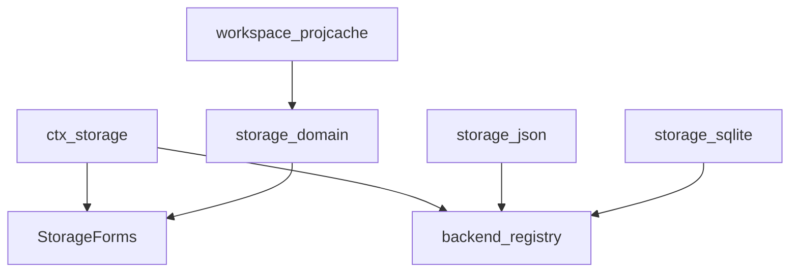
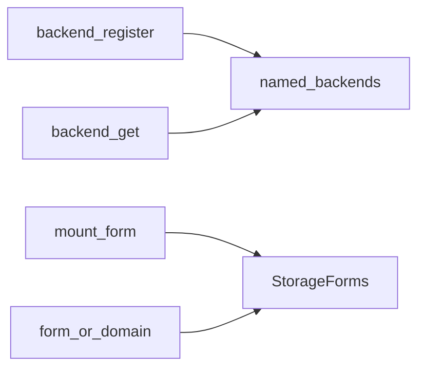
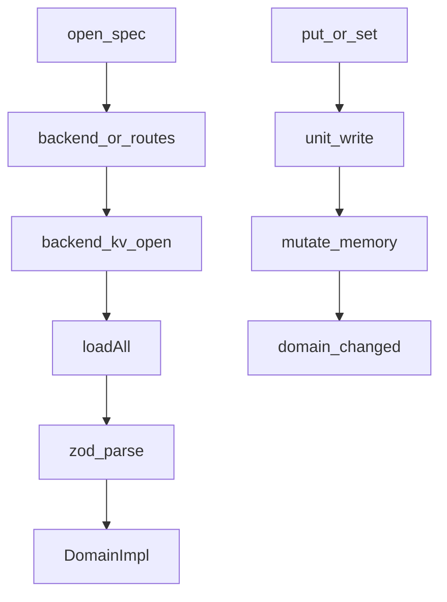
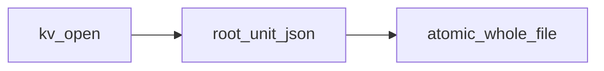
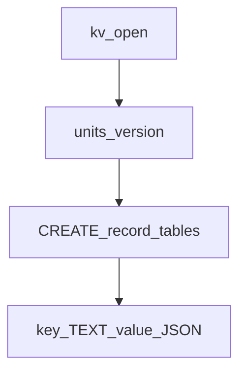

# storage/ — 非会话存储

学习笔记，非正式产品文档。类型合同见 [storage.md](../../subsystems/storage.md)。组映射见 [packages/storage/README.md](../../../packages/storage/README.md)。

Hub 自己不做 IO：后端拥有介质，data form（先是 domain）拥有语义。会话事件日志不走这里，见 [session.md](session.md)。

## `@deepseek-ai/dsh-storage` — 后端注册表与 form 挂载

- 角色：Service Definition
- ctx：`ctx.storage`
- 入口：[packages/storage/storage/src/index.ts](../../../packages/storage/storage/src/index.ts)、[registry.ts](../../../packages/storage/storage/src/registry.ts)、[backend.ts](../../../packages/storage/storage/src/backend.ts)
- 关键类型：`Storage`、`StorageBackend`、`KvFacet`、`KvUnit`、`StorageForms`、`StorageError`

实现逻辑：

1. Hub 服务占住 `ctx.storage`；`backend` 是可并排挂载的命名表。
2. `storageBackendServiceKey(name)` 派生生命周期键，让 domain 的 inject 等得到注册。
3. `mount` 按 `StorageForms` 键挂 facility，重复挂载抛 `duplicate-mount`；disposer 卸下。
4. `form(key)` 在未挂载时抛 `form-not-mounted`；`domain` getter 是 `form('domain')` 的语法糖。
5. 后端合同是 `kv.open(descriptor)` → `KvUnit`（`loadAll` / 按键写 / `close`）。
6. 单元名和表名必须匹配 `UNIT_NAME_RE`。

源码走读：消费者走 data form，不直接碰后端。`StorageForms` 靠 declaration merging 扩展。

## `@deepseek-ai/dsh-storage-domain` — 校验过的 KV domain

- 角色：Service / data form
- ctx：`ctx.storageDomain`，并挂到 `ctx.storage.domain`；`inject: ['storage']` 加路由到的 backend 生命周期键
- 入口：[packages/storage/storage-domain/src/index.ts](../../../packages/storage/storage-domain/src/index.ts)、[domain.ts](../../../packages/storage/storage-domain/src/domain.ts)、[spec.ts](../../../packages/storage/storage-domain/src/spec.ts)
- 关键类型：`DomainSpec`、`Domain`、`KvTable`、`DomainGlobal`、`DomainError`
- Config：`backend`（必填默认路由）、`routes`（按 domain 名覆盖）

实现逻辑：

1. `apply` inject 默认 backend 与每条 route，挂 `DomainFacility`，并 `provide('storageDomain')`。
2. `open(spec)`：拒绝对已打开的名字；解析路由；要求 `kv` facet；打开 unit；按 zod 校验每条已存记录。
3. 未写过的 global 是 `null`，读时给 `initial`，第一次 `set` 才物化。
4. 调用方拥有返回的 handle，用 `Domain.close()` 关掉；facility 卸载时关掉残留。
5. 读同步走内存；写排队，先等后端耐久，再改内存，再 emit `domain/changed`。
6. 后端写失败则内存不动，读与介质不分裂。
7. 关闭后名字才能重开；关闭过程中的写仍发出事件。

源码走读：插件 Config 是 schemastery；记录 schema 是 zod。workspace 与 projection cache 都经 `open(spec)` 进来。

## `@deepseek-ai/dsh-storage-json` — 每 unit 一个 JSON 文件

- 角色：Service Provider
- ctx：无自有键；`inject: ['storage']`，登记 backend `json` 并 provide `storage.backend.json`
- 入口：[packages/storage/storage-json/src/index.ts](../../../packages/storage/storage-json/src/index.ts)、[unit.ts](../../../packages/storage/storage-json/src/unit.ts)
- Config：`root`（必填，无 cwd 默认）

实现逻辑：

1. `apply` 登记 `json` backend；disposer 先注销再 `close`。
2. 每个 unit 一个 `<root>/<name>.json`；打开前 `mkdir` `0700`。
3. 同名 unit 同时只能有一个 live handle；进行中的 open 也占位。
4. 写是原子整文件重写，不是追加。
5. backend `close` 等进行中的 open，再关每个 unit；关后还在飞的 open 丢掉 handle。
6. 非法 unit/table 名在 open 时抛 `malformed-medium`。

源码走读：人可读、适合小文档（workspace、projcache）。`root` 必须由装配写出。

## `@deepseek-ai/dsh-storage-sqlite` — 一库多 unit

- 角色：Service Provider
- ctx：无自有键；`inject: ['storage']`，登记 backend `sqlite` 并 provide `storage.backend.sqlite`
- 入口：[packages/storage/storage-sqlite/src/index.ts](../../../packages/storage/storage-sqlite/src/index.ts)、[unit.ts](../../../packages/storage/storage-sqlite/src/unit.ts)、[schema.ts](../../../packages/storage/storage-sqlite/src/schema.ts)
- Config：`path`（必填，`:memory:` 仅测试）、`journalMode`（默认 `wal`）

实现逻辑：

1. 一份 `DatabaseSync` 服务所有路由到它的 unit。
2. `units` 表钉住每个 unit 的 version；不匹配抛 `version-mismatch`。
3. 每张声明的表是 `key TEXT PRIMARY KEY / value TEXT` 的 STRICT 表。
4. 同名 double-open 是调用方 bug；名字在第一个 await 前同步占住。
5. `close` 幂等；介质从未打开则直接返回。
6. disposer 先注销名字再关 backend。

源码走读：文档仍是每行一条 JSON。适合比整文件重写更大的 KV，会话事件日志仍走 [session-persistence-sqlite](session.md)。
