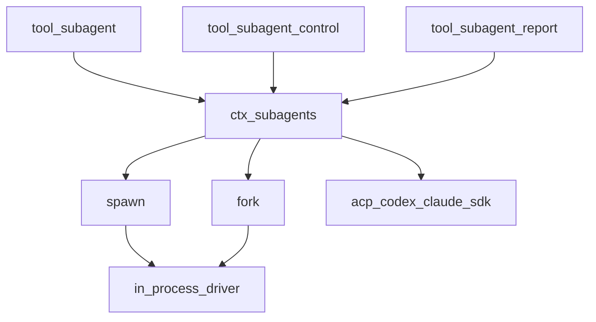
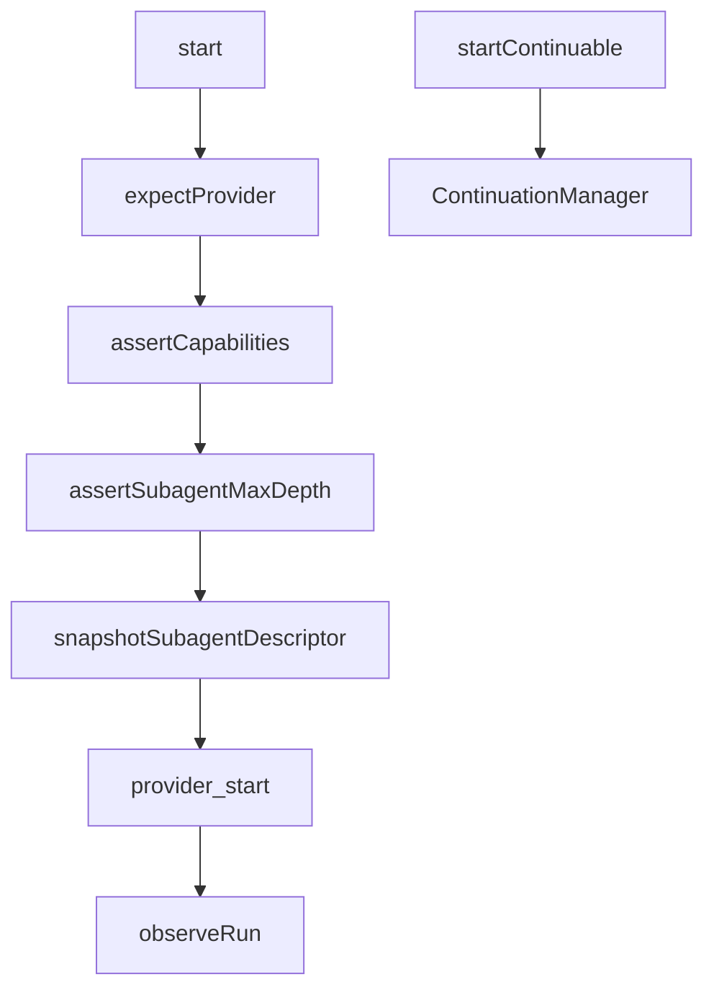
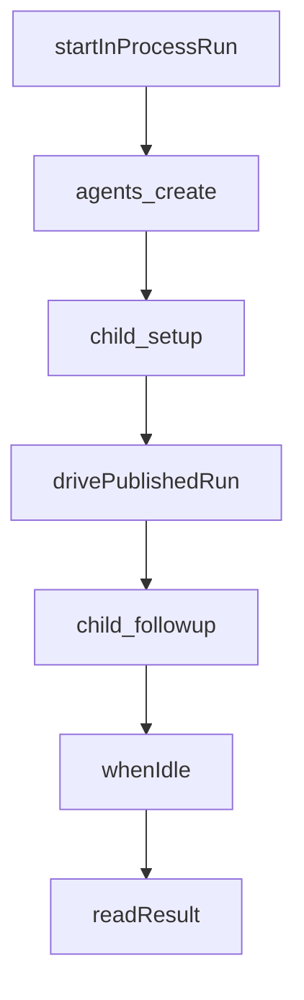
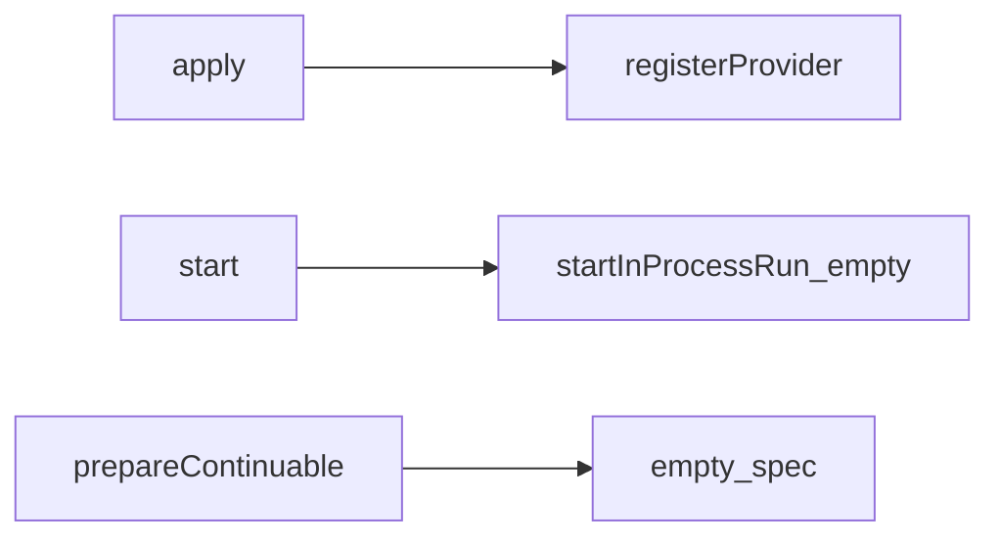
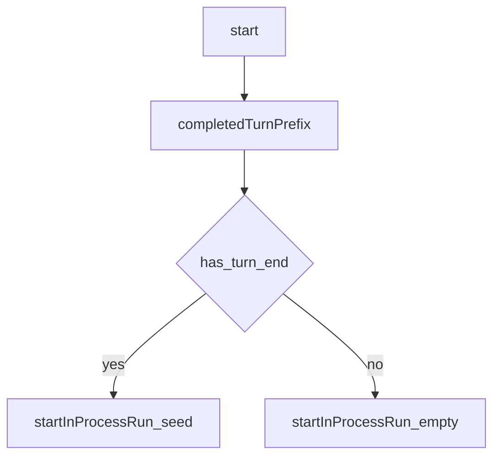
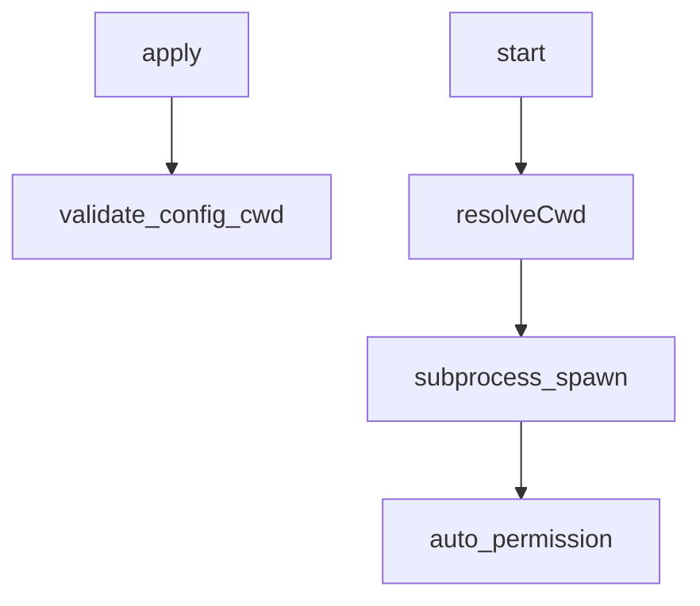
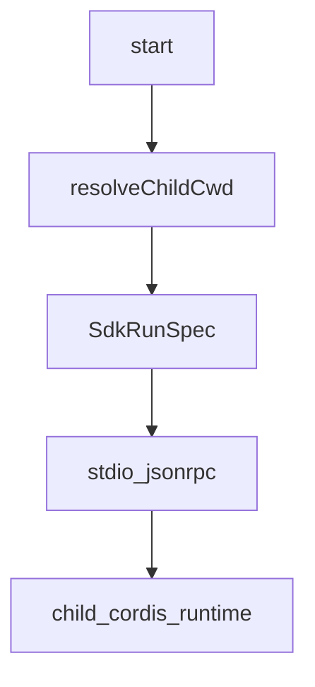
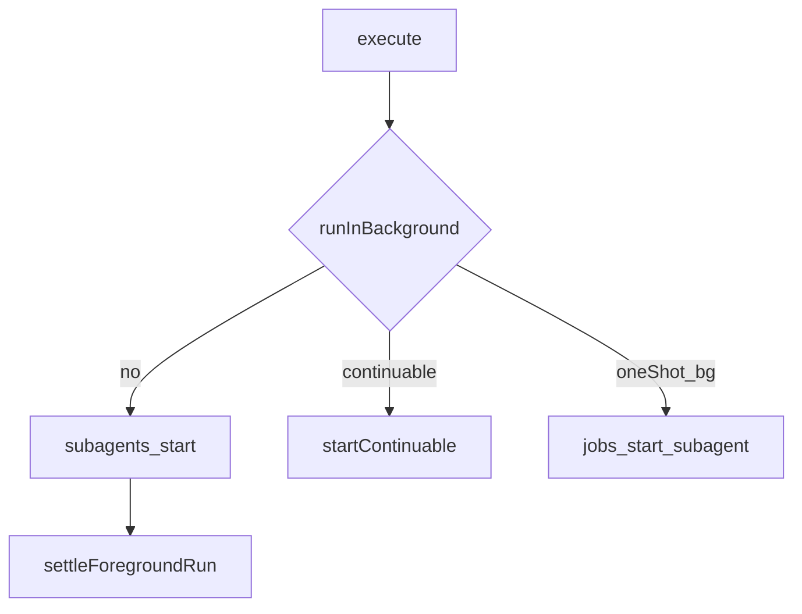
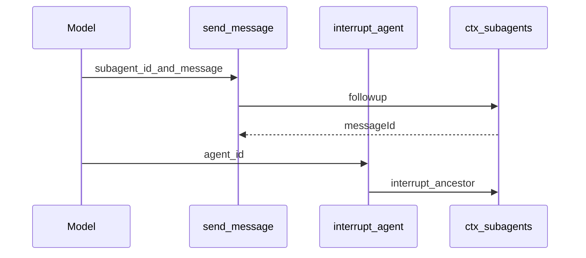
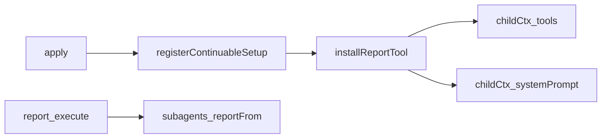

# subagent/ — 委派与可续跑子代理

学习笔记，非正式产品文档。类型合同见 [subagent.md](../../subsystems/subagent.md)。组映射见 [packages/subagent/README.md](../../../packages/subagent/README.md)。

多个 named provider 共存，调用方按名挑选。one-shot 返回 holder-owned `SubagentRun`；continuable 由 continuation manager 握 `AgentHandle`，provider 只贡献创建 spec。

## `@deepseek-ai/dsh-subagent` — 命名 provider 注册表

- 角色：Service Definition
- ctx：`ctx.subagents`
- 入口：[packages/subagent/subagent/src/index.ts](../../../packages/subagent/subagent/src/index.ts)、[types.ts](../../../packages/subagent/subagent/src/types.ts)、[continuation.ts](../../../packages/subagent/subagent/src/continuation.ts)、[lifecycle.ts](../../../packages/subagent/subagent/src/lifecycle.ts)
- 关键类型：`SubagentProvider`、`SubagentStartRequest`、`SubagentRun`、`SubagentCapabilities`、`SubagentError`
- emit：`subagent/provider-added`、`subagent/provider-removed`、`subagent/start`、`subagent/end`

实现逻辑：

1. `SubagentRuntime` 占住 `ctx.subagents`；`registerProvider` 按名唯一，重复抛 `DUPLICATE_PROVIDER`。
2. `start` 先查能力（`outputSchema` / `depthLimit` / `toolFilter` / `persona`），再深度与 schema，再派发。
3. provider 的 promise fulfill 才是发表与所有权移交；拒绝则无 run、无生命周期事件。
4. 有 `agents` 时绑 `SubagentContinuationManager`：`startContinuable` / `followup` / `interrupt` / `reportFrom`。
5. `prepareContinuable` 缺席的 provider 不能开 continuable。
6. `listChildren` / `listDescendants` 读 live store 与可选 persistence，不加载 Agent。
7. `registerContinuableSetup` 把部署能力装进每个 continuable 子的未发表 context。
8. 有 `sessionProjections` 时登记 identity / timing 两条投影。

源码走读：`SubagentRuntime.start`、`assertCapabilities`、`startContinuable`。`subagent/start|end` 按委派 parent 做 scope-filtered dispatch。

## `@deepseek-ai/dsh-subagent-in-process-driver` — 进程内 one-shot 驱动

- 角色：library
- ctx：无
- 入口：[packages/subagent/subagent-in-process-driver/src/index.ts](../../../packages/subagent/subagent-in-process-driver/src/index.ts)、[structured.ts](../../../packages/subagent/subagent-in-process-driver/src/structured.ts)
- 关键类型：`InProcessRunOptions`、`StructuredAttachment`

实现逻辑：

1. 只服务 one-shot：continuable 不走这里。
2. 发表前 abort 抛“未发表”；`agents.create` 的 setup 里写委派策略、persona / toolFilter、可选 structured runtime、descriptor。
3. 发表后 `followup` 用户消息，`whenIdle` 等这一轮。
4. `readResult` 从 activation boundary 之后折 `finalAssistantOutput`，并把 turn 理由映成 `SubagentStopReason`。
5. 取消且未 `completed` 收成 `aborted`；structured 请求完成却没捕获则 `error`。
6. `dispose` 等 `handle.dispose` 与 `result`，只报告释放失败。

源码走读：`startInProcessRun`、`drivePublishedRun`、`toStopReason`。fork 的 seed 经 `InProcessRunOptions.seed` 传入。

## `@deepseek-ai/dsh-subagent-spawn-in-process` — 新鲜进程内子

- 角色：Service Provider
- ctx：无自有键；`inject: ['subagents']`
- 入口：[packages/subagent/subagent-spawn-in-process/src/index.ts](../../../packages/subagent/subagent-spawn-in-process/src/index.ts)
- 路由名：默认 `spawn`
- 能力：`outputSchema` / `depthLimit` / `toolFilter` / `persona` 全开；`inheritsParentContext = false`

实现逻辑：

1. `apply` 登记 `SpawnInProcessProvider`。
2. `start` 调 `startInProcessRun(request, {})`，不传 seed。
3. `prepareContinuable` 返回 `{}`：新鲜子，后续全归 continuation manager。
4. 不 inject `tools`，避免改变本 provider 的 apply 时机与模型可见工具序。

源码走读：`SpawnInProcessProvider`、`inheritsParentContext`。最便宜的运输，复用 agent factory 的静止拆除。

## `@deepseek-ai/dsh-subagent-fork-in-process` — 继承已完成回合

- 角色：Service Provider
- ctx：无自有键；`inject: ['subagents']`
- 入口：[packages/subagent/subagent-fork-in-process/src/index.ts](../../../packages/subagent/subagent-fork-in-process/src/index.ts)
- 路由名：默认 `fork`
- 能力：与 spawn 相同；`inheritsParentContext = true`

实现逻辑：

1. `completedTurnPrefix` 切到最后一次 `turn/end`（含）；进行中的 turn 不平衡，不能当合法 seed。
2. 没有任何已完成 turn 则等价新鲜子，省略 seed。
3. `prepareContinuable` 也只在创建时拍一次前缀，冷恢复重放子自己的转录，不再 fork 父的更新历史。
4. 现网组合把 fork 绑在 `backgroundMode: one-shot`：continuable 的 `report` 段会插到继承历史前面，破坏 fork 要的前缀复用。

源码走读：`completedTurnPrefix`、`ForkInProcessProvider.start`。seq 等于数组下标，切出来仍从 0 开始。

## `@deepseek-ai/dsh-subagent-acp` — 进程外 ACP 子

- 角色：Service Provider
- ctx：无自有键；`inject: ['subagents', 'subprocess']`
- 入口：[packages/subagent/subagent-acp/src/index.ts](../../../packages/subagent/subagent-acp/src/index.ts)、[run.ts](../../../packages/subagent/subagent-acp/src/run.ts)
- 路由名：默认 `acp`
- 能力：全关；`inheritsParentContext = false`

实现逻辑：

1. `command` 必填；相对 `cwd` 在 load 时相对启动目录解析，必须是可进入的绝对目录。
2. 未配 `cwd` 则用父 session 的 workspace cwd；父也没有就抛，绝不回落到进程启动目录。
3. `permission`：`reject`（默认）或 `allow`（挑第一个 `allow_once` / `allow_always`），不把提示给人。
4. `env` 叠在洗过凭证的父环境上。
5. `startAcpRun` 发表后失败压成 stopReason，`result` 不 reject。
6. dispose 先 EOF grace，再信号升级。

源码走读：`resolveCwd`、`AcpProvider.start`、`assertUsableCwd`。从父只读 cwd。

## `@deepseek-ai/dsh-subagent-claude-code` — 官方 Claude Code CLI

- 角色：Service Provider
- ctx：无自有键；`inject: ['subagents', 'subprocess']`
- 入口：[packages/subagent/subagent-claude-code/src/index.ts](../../../packages/subagent/subagent-claude-code/src/index.ts)、[run.ts](../../../packages/subagent/subagent-claude-code/src/run.ts)
- 路由名：固定 `claude-code`
- 能力：`NO_START_CAPABILITIES`；新鲜子

实现逻辑：

1. 父必须有 cwd。
2. `subprocess.resolveExecutable('claude', env, signal)` 找官方 CLI。
3. SDK 拉起的真 CLI 挂到共享 subprocess owner。
4. `env` / `disposeGraceMs` 是部署字段；grace 不得超过 `MAX_TIMER_DELAY_MS`。

源码走读：`ClaudeCodeProvider.start`、`startClaudeCodeRun`。固定产品路由，不配 `providerName`。

## `@deepseek-ai/dsh-subagent-codex` — Codex app-server

- 角色：Service Provider
- ctx：无自有键；`inject: ['subagents', 'subprocess']`
- 入口：[packages/subagent/subagent-codex/src/index.ts](../../../packages/subagent/subagent-codex/src/index.ts)、[run.ts](../../../packages/subagent/subagent-codex/src/run.ts)、[wire.ts](../../../packages/subagent/subagent-codex/src/wire.ts)
- 路由名：固定 `codex`
- 能力：全关；新鲜子

实现逻辑：

1. 每轮在父 workspace 起 `codex app-server --stdio`。
2. 有短暂 thread 之后才发表。
3. 配置面与 claude-code 对称：`env`、`disposeGraceMs`。
4. 子级失败同样压进 stopReason。

源码走读：`CodexProvider.start`、`startCodexRun`。不继承父对话。

## `@deepseek-ai/dsh-subagent-dsh-sdk` — 进程外完整 Harness

- 角色：Service Provider
- ctx：无自有键；`inject: ['subagents']`
- 入口：[packages/subagent/subagent-dsh-sdk/src/index.ts](../../../packages/subagent/subagent-dsh-sdk/src/index.ts)、[run.ts](../../../packages/subagent/subagent-dsh-sdk/src/run.ts)
- 路由名：默认 `dsh-sdk`
- 能力：全关；新鲜子

实现逻辑：

1. `command` 必填（子 runtime bin）；`args` 常是子的 `cordis.yml`。
2. 子自带 composition、session、模型路由、工具；stdio JSON-RPC 驱动。
3. 默认 `provider: deepseek-official`、`model: deepseek-v4-flash`；可选 `maxTokens`。
4. dispose：协议 `shutdown` 超时，再 EOF grace，再信号。
5. 相对 `cwd` 在 load 时校验；从父只读 cwd。
6. 不 inject `subprocess`：spawn 在 `startSdkRun` 内部走共享辅助。

源码走读：`SdkSubagentProvider.start`、`startSdkRun`。这是“再开一份 dsh”，不是同进程 Agent。

## `@deepseek-ai/dsh-tool-subagent` — 模型委派工具

- 角色：Consumer
- ctx：无自有键；`inject: ['tools', 'subagents', 'systemPrompt']`
- 入口：[packages/subagent/tool-subagent/src/index.ts](../../../packages/subagent/tool-subagent/src/index.ts)
- 工具名：默认 `subagent`（可多实例不同名）
- 配置：`provider` 必填；`backgroundMode` 默认 `one-shot`；`maxDepth` 默认 3

实现逻辑：

1. 监听 `subagent/provider-added|removed`：provider 在才挂工具，HMR 安全。
2. 文案按 `inheritsParentContext` 分：fork 说“已看见已完成回合”；spawn / 远程说“独立完整 prompt”。
3. 数值 `maxDepth` 而 provider 无 `depthLimit` 则 mount 即抛；远程用 `'provider-managed'`。
4. `continuable` 要求 `prepareContinuable`；默认后台，返回耐久 `subagentId`。
5. one-shot 后台要 `ctx.jobs`，`kind: 'subagent'`，用 `settleRun` 填 `JobHooks.done`。
6. 前台 `settleForegroundRun`：非 completed 当错误，但带上部分文本；dispose 失败不盖住结果失败。
7. `enableRunInBackground: false` 时执行期仍拒 `run_in_background: true`。
8. continuable 实例登记 prompt 段：默认同批开多个，只有下一步依赖结果才前台等。

源码走读：`resolveDelegationRun`、`settleForegroundRun`、`providerWording`。`isConcurrencySafe` 恒真：子不改父 session。

## `@deepseek-ai/dsh-tool-subagent-control` — 续跑控制

- 角色：Consumer
- ctx：无自有键；`inject: ['tools', 'subagents']`
- 入口：[packages/subagent/tool-subagent-control/src/index.ts](../../../packages/subagent/tool-subagent-control/src/index.ts)
- 工具：`send_message`、`interrupt_agent`

实现逻辑：

1. 与具体 provider 实例分开，多个委派工具共用一套控制 API。
2. `send_message` 调 `followup`，source 为 `{ kind: 'coordinator', form: 'relay' }`；只确认入队，不等子答。
3. 子仍在干活则消息排到当前 turn 之后，不能改正在做的事。
4. `interrupt_agent` 调 `interrupt(..., { kind: 'ancestor', agent: caller })`：停当前 turn，已排队的留下，子孙继续。
5. 已结束或未知 id 是接受的 no-op；未入队前取消才停这次投递。
6. 必须有 `exec.agent`。

源码走读：`followup` 调用、`interrupt` 调用。授权与冷恢复全在服务里。

## `@deepseek-ai/dsh-tool-subagent-report` — 子向父汇报

- 角色：Consumer（continuable 子 scope）
- ctx：无自有键；`inject: ['subagents', 'tools', 'systemPrompt']`
- 入口：[packages/subagent/tool-subagent-report/src/index.ts](../../../packages/subagent/tool-subagent-report/src/index.ts)
- 工具名：`report`（只出现在 continuable 进程内子）
- 配置：`reportDelivery` 默认 `wakeup`

实现逻辑：

1. `apply` 只登记 `registerContinuableSetup`；root、one-shot、远程、无 agent 调用看不见。
2. `installReportTool` 在子 scope 挂 `report` 与 `tool:report` 段。
3. 提示：结束前用自包含答案 `report` 一次；父共享工作区但不会自动拿到转录。
4. `report` 不结束 turn / Activation；只有直接父收到。
5. `wakeup` 给父开一轮；`quiet` 只加上下文，等别的东西叫醒父。
6. 登记失败回滚 prompt 段；撤销时两处失败聚合成 `AggregateError`。

源码走读：`installReportTool`、`reportFrom`。子是权威凭证，调用方不能点名接收者。
