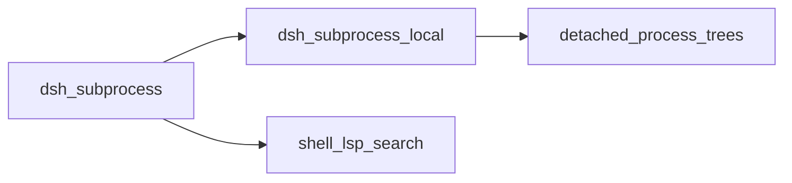
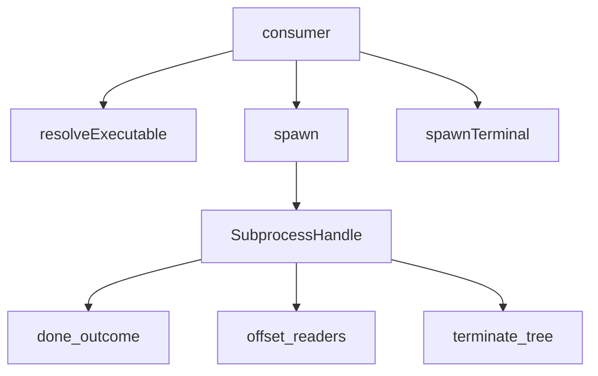
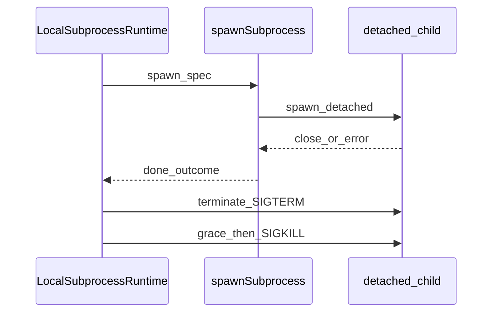

# subprocess/ — 托管进程树

学习笔记，非正式产品文档。权威合同见各包 README 与 [subsystems/subprocess.md](../../subsystems/subprocess.md)。组映射见 [packages/subprocess/README.md](../../../packages/subprocess/README.md)。

本缝只做可执行文件查找、完全指定的托管进程树，以及一条终端进程原语。命令默认值、shell 语义、截止期、协议分帧、终端就绪和展示都属于 Consumer。

## `@deepseek-ai/dsh-subprocess` — 声明 `ctx.subprocess` 与 scrub 规则

- 角色：Service Definition
- ctx：`ctx.subprocess`
- 入口：[packages/subprocess/subprocess/src/index.ts](../../../packages/subprocess/subprocess/src/index.ts)、[types.ts](../../../packages/subprocess/subprocess/src/types.ts)
- 关键类型：`SubprocessSpawnSpec`、`SubprocessHandle`、`SubprocessOutcome`、`SubprocessTerminalHandle`、`CollectedOutput`
- 事件：无自有事件；`DSH_*` 环境词汇在此拥有

实现逻辑：

1. `SubprocessRuntime` 以 `super(ctx, 'subprocess')` 占住 `ctx.subprocess`；同一 Context 再装第二个实现会按 Cordis 重复服务规则抛错。
2. `resolveExecutable` 只接受绝对路径或裸 PATH 名；带分隔符的相对路径必须拒绝，因为解析基未定义。
3. `spawn` 立即返回活句柄；`done` 在进程 close 时以退出事实 resolve，只对 spawn 级失败 reject。
4. collect 模式的读是按整流通量偏移、非消耗的；独立读者互不吞对方输出。超窗读标 `lossy`，完整流在 spill 文件里（若还完整）。
5. `terminate` 是唯一终止动词：POSIX 对进程组 SIGTERM→grace→SIGKILL，Windows 用 `taskkill /T`。`waitForExit` 观察整棵树，不是只看直接子进程。
6. `spawnTerminal` 拥有终端分配、文本传输、前台组、信号和整会话静默；就绪与持久 shell 政策留在 PTY Consumer。
7. `scrubbedParentEnv` 去掉凭证形名字和全部 `DSH_*`（大小写不敏感），再交给每个实现当环境基；调用方显式 `env` 在 scrub 之后合并，所以故意转发的密钥或当前 `DSH_*` 能活下来。

源码走读：`SENSITIVE_ENV_PATTERN` 是全仓唯一的隐式密钥启发式。`SubprocessStdio` 三个流都显式，缝不加默认。`SubprocessOutcome` 故意不带超时/取消分类——调用方读自己拥有的 signal。

## `@deepseek-ai/dsh-subprocess-local` — 本机分离进程树

- 角色：Service Provider
- ctx：占住 `ctx.subprocess`；无自有键
- 入口：[packages/subprocess/subprocess-local/src/index.ts](../../../packages/subprocess/subprocess-local/src/index.ts)、[spawn.ts](../../../packages/subprocess/subprocess-local/src/spawn.ts)、[terminal.ts](../../../packages/subprocess/subprocess-local/src/terminal.ts)
- 关键类型：`LocalSubprocessRuntime`、`LocalSubprocessHandle`、`OutputCollector`、`SpawnInternals`
- 配置：无；每个处置和上限都在 spec 上，部署旋钮留在调用方

实现逻辑：

1. 构造时 `ctx.effect` 登记拆除：正常卸载先 `terminate` 再 `waitForExit` 整棵树；`process.exit` 同步走 `terminateForHostExit`（立即 SIGKILL / taskkill）。
2. `resolveExecutable` 用 `childEnv`（scrub + 显式覆盖）扫 PATH；Windows 无扩展名时再叠 `PATHEXT`。相对路径含 `/` 或 `\` 直接抛。
3. `spawn` 调 `spawnSubprocess`，把句柄放进 `live`；释放要等整棵树消失，不是直接子进程结算——TERM 陷阱的助手必须仍被拥有。
4. `spawnSubprocess` 校验 `graceMs` 能装进一个 Node timer；`detached` 只在非 win32 上开（POSIX 自有进程组）；stdin `{ data }` 写完即关。
5. `OutputCollector` 保内存尾；第一次超 cap 才开 0700 私有 spill 目录下的 `wx`+随机后缀文件。spill 自身超 cap 则丢掉文件，只留尾。
6. `terminate` 先观察树存活，再 SIGTERM，再 ref'd 的 grace 定时器 SIGKILL。`done` 结算不取消这个定时器。继承管道被后代拖住时，同一 `graceMs` 也封 `close` 等待。
7. `spawnTerminal` 用 `node-pty` 分配，`LocalTerminalHandle` 管前台组检查与信号；服务同样跟踪 `terminals` 集合。

源码走读：`childEnv` 在 Windows 上按大小写不敏感键合并，`undefined` 是墓碑。`linuxProcessGroupHasLiveMembers` 在直接子进程已结算后区分僵尸组和真活成员。`internals` 是测试钩子，生产路径不读配置。
