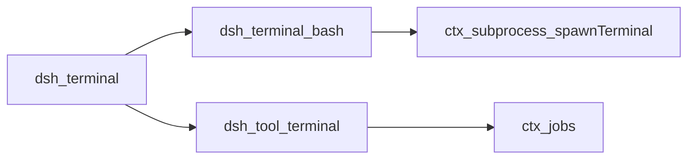
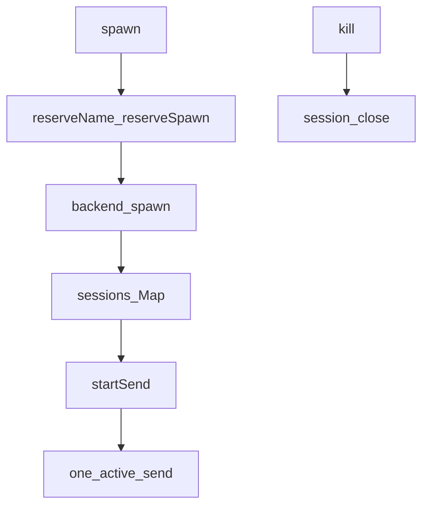
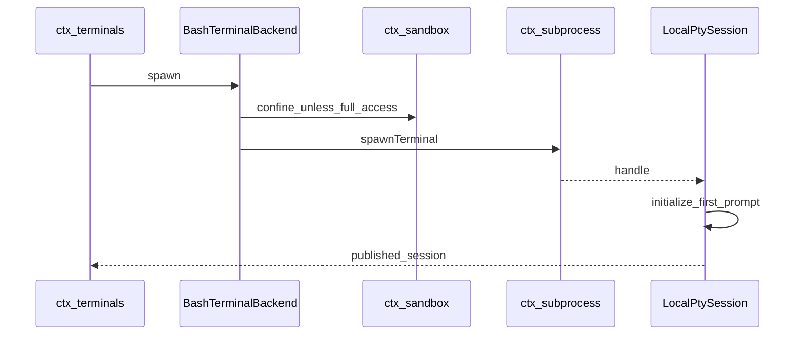
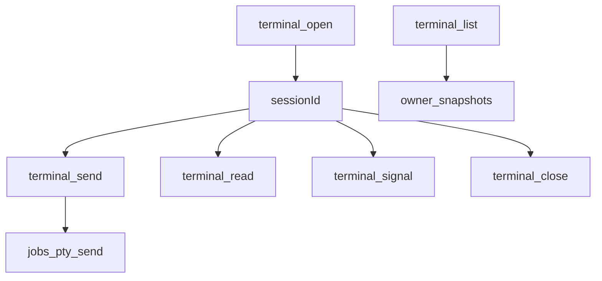

# terminal/ — 属主隔离的持久 PTY

学习笔记，非正式产品文档。权威合同见各包 README 与 [subsystems/terminal.md](../../subsystems/terminal.md)。组映射见 [packages/terminal/README.md](../../../packages/terminal/README.md)。进程原语见 [subprocess.md](subprocess.md)。

注册表拥有 id、发布、授权和等待拆除。后端拥有终端力学。工具把属主钉成当前 `Agent`。

## `@deepseek-ai/dsh-terminal` — `ctx.terminals` 注册表

- 角色：Service Definition
- ctx：`ctx.terminals`
- 入口：[packages/terminal/terminal/src/index.ts](../../../packages/terminal/terminal/src/index.ts)、[types.ts](../../../packages/terminal/terminal/src/types.ts)
- 关键类型：`TerminalSessionId`、`TerminalBackend`、`TerminalBackendSession`、`TerminalSendOperation`、`TerminalError`
- 错误码：`DUPLICATE_BACKEND`、`DUPLICATE_NAME`、`FOREIGN_SESSION`、`NO_BACKEND`、`NO_SESSION`、`OWNER_NOT_LIVE`、`SEND_ACTIVE`、`SERVICE_DISPOSING`

实现逻辑：

1. `registerBackend` 按 `type` 唯一登记，`ctx.effect` 卸载时只撤自己那份。
2. `spawn(owner, request, signal)`：校验属主仍在 `ctx.agents`、预留可选名字、预留未发布 spawn、铸 `pty-N` id，成功后才写入 `sessions`。
3. 未发布失败必须 `session.close`；清理失败包成 `TerminalBackendCleanupError`。服务拆除或属主已死会 abort 进行中的 spawn。
4. `startSend` 每会话同时只允许一个活操作；`done` 结算后清 `active`。
5. `read`/`signal`/`kill`/`list` 都经 `expectOwned`：未知 id 或属主不是精确同一 `Agent` 即拒。
6. 属主 fiber 卸载走 `disposeOwned`；服务卸载 `disposeAll` 先 abort 未发布 spawn，再关已发布会话，最后清注册表。
7. `hasOwnerActivity` 覆盖“正在创建到已关闭”全程，无发布空隙——给沙箱模式栅栏用。

源码走读：`TerminalSessionId` 是 branded 字符串。`TerminalWaitReason` 是 `stdin_read`/`inferred_idle`/`timeout`/`session_exit`，不证明任意子进程已退出。信号集与 `SubprocessTerminalSignal` 成员相同，两边无交叉依赖。

## `@deepseek-ai/dsh-terminal-bash` — 本地 shell PTY 后端

- 角色：Service Provider（登记 backend，不占 `ctx.terminals`）
- ctx：无自有键；`inject: ['terminals','sandboxPolicy','subprocess']`
- 入口：[packages/terminal/terminal-bash/src/index.ts](../../../packages/terminal/terminal-bash/src/index.ts)、[session.ts](../../../packages/terminal/terminal-bash/src/session.ts)、[sanitize.ts](../../../packages/terminal/terminal-bash/src/sanitize.ts)
- 关键类型：`BashTerminalBackend`、`LocalPtySession`
- 插件名：`terminal-bash`

实现逻辑：

1. `apply` 校验配置后 `registerBackend(new BashTerminalBackend(...))`，`type` 来自 `backendType`（常用 `shell`）。
2. `spawn` 先 `ensureSandboxModeFence`：属主会话若已有 PTY 活动，禁止再追加会改变有效模式的 `sandbox/mode`。
3. 政策来自 `sandboxPolicy.resolve({ session: owner.session })`。非 `danger-full-access` 必须有 `ctx.sandbox`，否则加载期不炸、spawn 时炸。
4. `spawnTerminal` 的 cwd 是 `spec.cwd ?? policy.workspaceRoot`；环境叠 `TERM=dumb`、`PS1` 受控提示符、`PROMPT_COMMAND` 写 OSC 133 退出码、`DSH_SHELL`/`DSH_SESSION_ID`/`DSH_PTY_SESSION_ID`。
5. `LocalPtySession.initialize` 用空 send 等到首个就绪；超时或启动期退出则 `close` 并可能包 `TerminalBackendCleanupError`。
6. `startSend` 写文本（可选 `\r`），轮询前台组：受控提示符 + shell pgid → `stdin_read`；精确探测窗口内的 input-wait → `stdin_read`；静默 + handoff grace → `inferred_idle`；绝对超时 → `timeout`。
7. `cancel` 对前台组 SIGINT。`close` 停轮询、`terminal.terminate()`、把未完成 send 结算为 `session_exit`。滚动条按字节与行数封顶。

源码走读：`CONTROLLED_PROMPT` 与 sanitizer 一起剥 OSC/CSI，避免把控制序列当提示符。`acceptsStdinWait` 要求写后离开过等待再回来，避免把写前的旧等待当成完成。

## `@deepseek-ai/dsh-tool-terminal` — 六个模型工具

- 角色：Consumer
- ctx：无自有键；`inject: ['terminals','tools','systemPrompt']`；后台需要 `jobs`
- 入口：[packages/terminal/tool-terminal/src/index.ts](../../../packages/terminal/tool-terminal/src/index.ts)、[render.ts](../../../packages/terminal/tool-terminal/src/render.ts)
- 工具：`terminal_open`、`terminal_send`、`terminal_read`、`terminal_signal`、`terminal_close`、`terminal_list`
- 提示：`systemPrompt.section('tool:pty')`

实现逻辑：

1. 每个 execute 用 `requireAgent(exec.agent)`；无发起 agent 直接拒。
2. `terminal_open` 把 `type`/`name`/`cwd` 交给 `ctx.terminals.spawn(..., exec.signal)`，返回快照 + `motd`。
3. `terminal_send` 默认 `submit: true`。前台 `startSend` 带 `exec.signal`；后台 `jobs.start({ kind:'pty-send' })`，`cancel` 调 `operation.cancel()`（SIGINT）。
4. `terminal_read` 同步读一页滚动条（默认 offset 0、count 500，后端仍封顶）。
5. `terminal_signal` 枚举与缝相同；描述写明对 shell 自己的 SIGKILL 应走 `terminal_close`（后端可再拒）。
6. `terminal_close` → `kill`，区分 `closed` 与 `already-closing`。`terminal_list` 只列当前属主。
7. `finalizeContent` 用 `boundTerminalText` 把整份模型可见结果压到 `maxResultBytes`（默认 256KiB，下限 64）。

源码走读：提示词要求优先一次性 shell/read/write/edit；`inferred_idle`/`timeout` 不证明前台命令已退出。后台 send 的 UI 是 generic 卡，前台是 terminal 卡。
