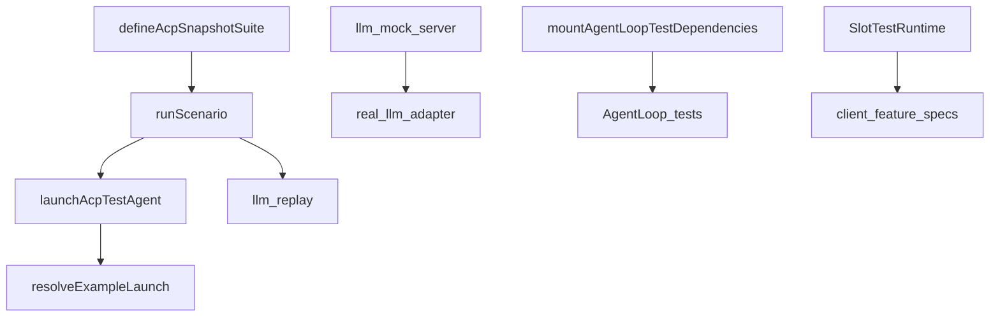
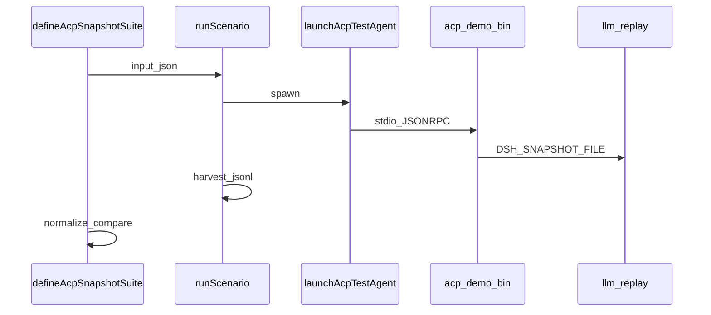
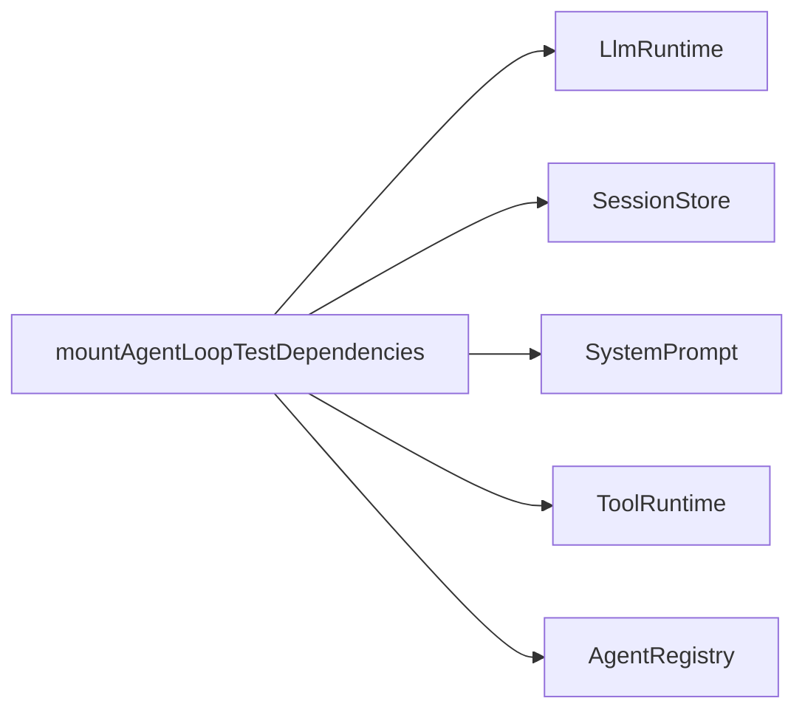
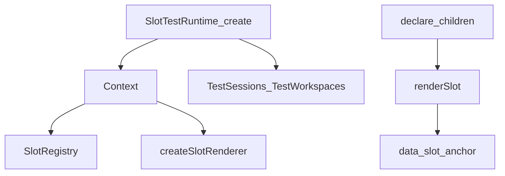
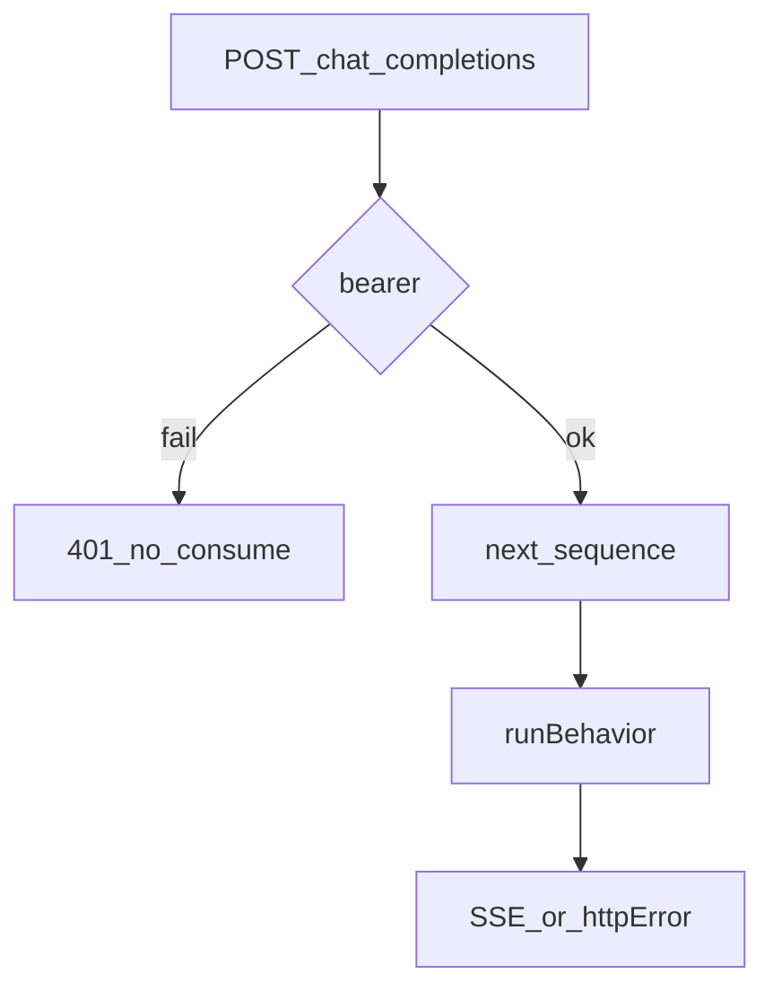
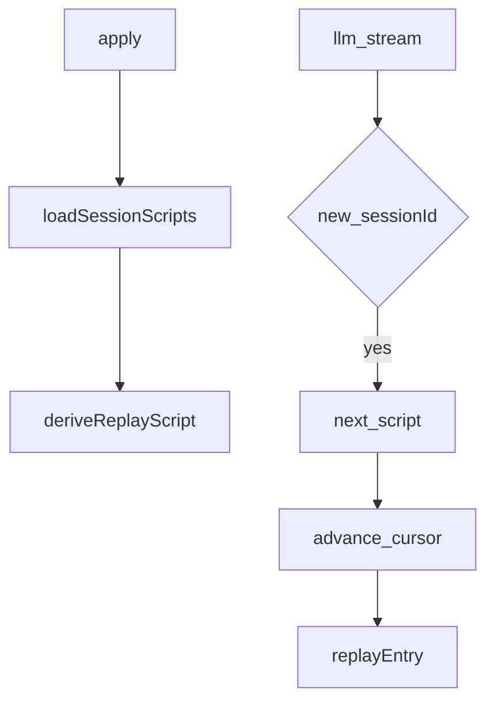
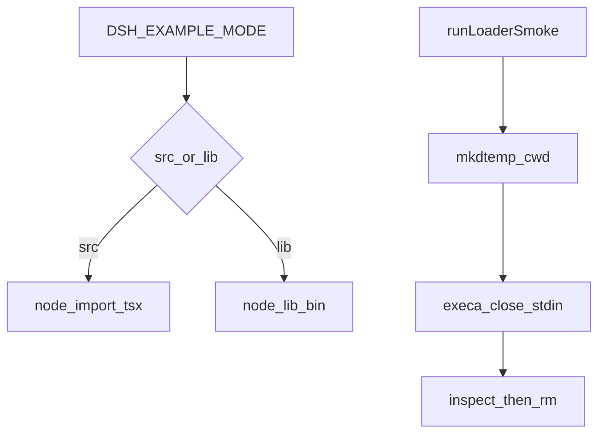

# test-support/ — 开发与测试基础设施

学习笔记，非正式产品文档。本组不是产品 API。组映射见 [packages/test-support/README.md](../../../packages/test-support/README.md)。运行时不变量已迁到 [runtime-diagnostics.md](runtime-diagnostics.md)，合同见 [invariants.md](../../subsystems/invariants.md)。

这些包服务仓库测试与示例：ACP 快照、loop 前置挂载、jsdom slot 台架、可脚本的 mock LLM、无密钥回放、Loader 冒烟。有了产品合同和产品消费者后再迁出本组。

## `@deepseek-ai/dsh-acp-snapshot` — ACP 快照套件

- 角色：library（仅 vitest 内可导入入口）
- ctx：无键
- 入口：[packages/test-support/acp-snapshot/src/index.ts](../../../packages/test-support/acp-snapshot/src/index.ts)、[launcher.ts](../../../packages/test-support/acp-snapshot/src/launcher.ts)、[harness.ts](../../../packages/test-support/acp-snapshot/src/harness.ts)、[normalize.ts](../../../packages/test-support/acp-snapshot/src/normalize.ts)、[suite.ts](../../../packages/test-support/acp-snapshot/src/suite.ts)
- 关键类型：`AgentUnderTest`、`InputScript`、`Scenario`、`SnapshotSuiteOptions`、`NormalizeContext`

实现逻辑：

1. `launchAcpTestAgent` 经 `resolveExampleLaunch` 拉起真实 bin，tee stdout 给 SDK `ClientSideConnection`，收集 update / stderr，关闭时等进程退出、stdio 关、解析器排空。
2. `runScenario` 按 `input.json` 逐步驱动 initialize / newSession / prompt / cancel / 耐久等待；权限答案按 option kind FIFO，队列空则 `cancelled`，点了未提供的 kind 则整次 run 失败。
3. 工作区是临时 cwd，可先拷 `workspace/`；sessions 与 spill 也是隔离根。spill 路径长度固定，避免 preview 预算因 tmpdir 长度抖动。
4. 关闭 stdin 后收获全部 `session.jsonl`（父会话在前，子会话按 `createdAt`），顺序必须与 `llm-replay` 的 bind 顺序一致。
5. 纯函数把 session id、cwd 别名、RPC id、时间洗成 token；每个 header class 恰好一个 pin，prompt / tool-schema 可独立共享 sidecar。
6. `defineAcpSnapshotSuite` 在 collection 时注册 describe/it：replay 并发，record/refresh 串行写回；fixture guard 拒孤儿目录、缺文件、双 pin、未洗 header。
7. `DSH_SNAPSHOT=replay|record|refresh` 由调用方读环境再传入；harness 给子进程设 `DSH_SNAPSHOT_*` 指向 fixture。

源码走读：示例的 `*.snapshot.ts` 只交路径、snapshots 目录和 `Scenario` 表。`suite.ts` / `harness.ts` 依赖 vitest（`vi.waitFor`），所以包入口不能在普通 Node 里 import。收获要求 JSONL `persistenceCompression: 'none'`。

## `@deepseek-ai/dsh-agent-loop-testkit` — AgentLoop 测试前置

- 角色：library
- ctx：调用方拥有的 `Context`；本包不占键
- 入口：[packages/test-support/agent-loop-testkit/src/index.ts](../../../packages/test-support/agent-loop-testkit/src/index.ts)
- 关键类型：`AgentLoopTestDependenciesOptions`、`mountAgentLoopTestDependencies`

实现逻辑：

1. 按依赖顺序挂 llm、session、system-prompt、tools、agent registry，然后返回。
2. 不挂 `AgentLoop`，不注册适配器，好让测试自己控制拓扑和加载顺序。
3. `systemPrompt` / `tools` 原样转发，不另给测试默认值。
4. 中途 `plugin` 失败则 promise reject；已激活的服务仍归调用方 Context，随它一起卸。
5. 测注入失败、残缺拓扑、卸载顺序的套件应直接 `ctx.plugin`，不要走这个 helper。

源码走读：这是 loop 单测的最小脊柱，不是产品 bundle。teardown 永远是调用方的。

## `@deepseek-ai/dsh-client-test-runtime` — jsdom slot 台架

- 角色：library
- ctx：台架自建 `Context`；`provide('sessions')` / `provide('workspaces')`
- 入口：[packages/test-support/client-runtime/src/index.ts](../../../packages/test-support/client-runtime/src/index.ts)、[sessions.ts](../../../packages/test-support/client-runtime/src/sessions.ts)、[workspaces.ts](../../../packages/test-support/client-runtime/src/workspaces.ts)、[remote.ts](../../../packages/test-support/client-runtime/src/remote.ts)
- 关键类型：`SlotTestRuntime`、`SlotView`、`FeatureHandle`、`TestSessions`、`TestWorkspaces`、`TestRemote`、`SessionFixture`

实现逻辑：

1. `SlotTestRuntime.create` 挂生产用 `SlotRegistry`、conversation event/view registry，再 `install` 生产 web-react renderer；不复制 SlotCore。
2. `TestSessions` / `TestWorkspaces` 实现产品向外接口；未 stub 的 session 动词 fail-loud，不半实现。
3. `declare(children)` 注册自动 root frame；`renderSlot(key, owner)` 返回该 key 的 `[data-slot]` 锚点、scoped queries 和 `update`。
4. `mount(plugin)` 先检查 `inject`，缺服务立刻抛，避免 fiber 永远挂起。
5. 公开 mutator 都包在 `act` 里；`dispose` 先卸 React 树，再卸 feature fiber、root、session scope、`localStorage`。
6. `TestRemote` 只做 `$on` / `$dispatch`；`$mount` 拒绝，需要生成命名空间就上真 Remote。
7. DOM snapshot serializer 把 CSS module hash 折成稳定类名。

源码走读：npm 名是 `dsh-client-test-runtime`，目录是 `client-runtime`。不进产品图（无 `dsh.client`）。`lib/` 再导出的 client-runtime 是浏览器 loader，plain Node 不能 import；消费者只走仓库 `paths`。

## `@deepseek-ai/dsh-llm-mock-server` — 可脚本的 OpenAI 兼容故障服务器

- 角色：library + 仓库内 CLI
- ctx：无键
- 入口：[packages/test-support/llm-mock-server/src/index.ts](../../../packages/test-support/llm-mock-server/src/index.ts)、[cli.ts](../../../packages/test-support/llm-mock-server/src/cli.ts)、[bin.ts](../../../packages/test-support/llm-mock-server/src/bin.ts)
- 关键类型：`MockLlmBehavior`、`MockLlmServerOptions`、`MockLlmServer`、`startMockLlmServer`

实现逻辑：

1. 只消费 `POST` 且 path 以 `/chat/completions` 结尾的请求（含 `/v1`）；错方法、错路径、错 JSON、错 bearer 不推进脚本。
2. `sequence` 非空 FIFO；耗尽则结构化 500，除非 `repeatLast`。
3. `random` 按加权种子抽具体行为；默认权重是偏成功的压测画像，不是事故频率。
4. 行为覆盖重置、半截断开、stall、空完成、畸形 SSE、429/5xx、鉴权/配额/上下文溢出、成功/推理/工具调用/`length`。
5. `close()` 幂等，并 `closeAllConnections` 以拆 stall。
6. CLI 另有 `connection_refused`：必须排第一，先延迟 bind 指定非零端口，让听前请求拿到真 TCP 拒绝。
7. 仓库脚本 `pnpm run mock:llm` 往 stdout 写 JSONL（`ready` / request / result）；本包不发布可安装 bin。

源码走读：服务器不重试、不解释 harness 策略；每次接受的请求吃掉一条行为。把 `DEEPSEEK_BASE_URL` 指过来即可练真适配器。

## `@deepseek-ai/dsh-llm-replay` — 无密钥回放适配器

- 角色：Service Provider（测试）
- ctx：无自有键；`inject: ['llm']`
- 入口：[packages/test-support/llm-replay/src/index.ts](../../../packages/test-support/llm-replay/src/index.ts)
- 关键类型：`ReplayEntry`、`ReplayConfig`、`SessionScript`、`ReplayHandle`、`installLlmReplay`

实现逻辑：

1. 从 `session.jsonl` 的 `assistant/chunk` 按 turn/step 收成每次 `stream()` 的 chunk 序列；带 `llmStreamCall: true` 的 `compaction/summary` 用完整 `rawOutput` 合成一次成功流。
2. 没有 `finish` 的一组 chunk 就是当时抛错的指纹，推导拒绝，必须给 `replay.override.json`。
3. sidecar 可以是整表 `ReplayEntry[]`，或 `{ patches: [{ at, entry }] }` 按调用下标补丁；`at == length` 表示追加。
4. 新出现的 live `sessionId` 按首次调用顺序认领下一条已录脚本（父会话 `createdAt` 最早）；无 `sessionId` 的调用共用匿名会话。
5. `{{fromRequest:<regex>}}` 在 yield 前对 live messages 的字符串叶子做替换，用来回写现场才知道的 id。
6. 有 `providers` 就登记可发现的 `ReplayAdapter`；否则 catch-all `llm/stream` waterfall（不调 `next()`）。
7. `assertConsumed` 在拆台时检查每条脚本都已绑定且游标耗尽，少打的模型调用不会 silently 绿。

源码走读：`apply` 从 `Config.file` 或 `$DSH_SNAPSHOT_FILE` 取主 fixture，缺了 fail loud。子会话从 `seedLength` 之后推导，避免把继承的父 chunk 当成子调用。并发子 agent 的绑定仍是 XXX。

## `@deepseek-ai/dsh-loader-smoke` — 真 Loader 冒烟

- 角色：library
- ctx：`runFixtureTurn` 读调用方已 settle 的 `ctx.agents` / `ctx.sessions`
- 入口：[packages/test-support/loader-smoke/src/index.ts](../../../packages/test-support/loader-smoke/src/index.ts)、[agent-turn.ts](../../../packages/test-support/loader-smoke/src/agent-turn.ts)
- 关键类型：`ExampleMode`、`ExampleLaunch`、`LoaderSmokeOptions`、`FixtureTurnResult`

实现逻辑：

1. `resolveExampleMode`：未设或 `src` 走 tsx + `TSX_TSCONFIG_PATH`；`lib` 走 plain Node + 包 `exports`；其它值立刻抛。
2. `src` 必须给 `tsconfigPath`；`lib` 默认把 `/src/*.ts` 换成 `/lib/*.js`。
3. `runLoaderSmoke` 建隔离 cwd，把 `DSH_HOME` / `DSH_AGENTS_HOME` 指进去，`input: ''` 立刻关 stdin，默认 30s `SIGKILL`。
4. 退出码必须等于 `expectedExitCode`（默认 0）；超时或码不对时诊断里带上两路流。
5. `prepare` / `inspect` 在隔离 cwd 里跑；`finally` 无论成败都删临时目录。
6. `runFixtureTurn` 要求恰好一个 root agent：等 idle、`followup` 用户消息、从 inbox 回执起观察、再等 idle、`sessions.flush`，返回最后一段 assistant 文本和累加 usage。

源码走读：ACP launcher 也复用 `resolveExampleLaunch`。`lib` 模式要先 `pnpm run build`，且 config 能沿 `examples/node_modules` 解析到命名包。超时只杀直接子进程。
