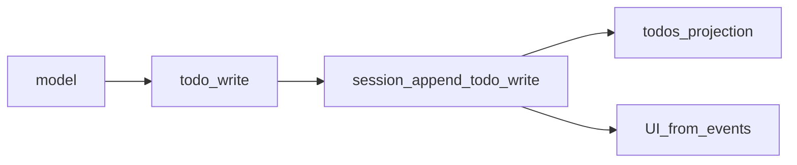
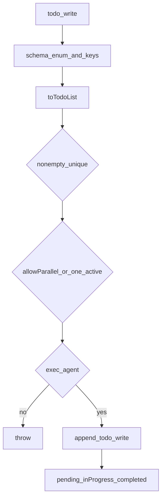

# todo/ — 会话待办

学习笔记，非正式产品文档。`todo/write` 载荷见 [session.md](../../subsystems/session.md)；投影单元见 [session-projection.md](../../subsystems/session-projection.md)。组映射见 [packages/todo/README.md](../../../packages/todo/README.md)。

单包产品能力：一份列表属于一个 agent session，没有可替换 Provider。

## `@deepseek-ai/dsh-tool-todo` — 整表替换

- 角色：Consumer
- ctx：无自有键；`inject: ['tools']`；可选 `ctx.sessionProjections`
- 入口：[packages/todo/tool-todo/src/index.ts](../../../packages/todo/tool-todo/src/index.ts)、[types.ts](../../../packages/todo/tool-todo/src/types.ts)
- 关键类型：`TodoItem`、`Config.allowParallelInProgress`
- 写入：`todo/write`

实现逻辑：

1. `allowParallelInProgress` 是必填部署选择；描述文案的唯一变化是“可否多个 `in_progress`”。
2. 参数 schema `additionalProperties: false`，logged snapshot 必须等于模型以为自己写的东西。
3. `toTodoList` 再收：trim 后非空、content 不重复；非并行时 `in_progress` 不得超过 1。
4. 无 `exec.agent` 抛错——列表是 per-session 状态，无处可写。
5. `session.append('todo/write', { todos })` 整表替换，last-write-wins。
6. 返回规范化列表加 `counts`；`presentCall` 是 generic 卡片。
7. 若组成了 projection 注册表，登记 `todos`：`todo/write` 写入列表，`turn/start` 清成 `null`（`turn/end` 保留已完成清单给 UI）。

源码走读：`toTodoList` 是 schema 之后的值约束。`describe` 把并行策略写进模型可见说明。投影 `stateVersion: 2`；UI 应从事件折，不要另存一份可变表。
