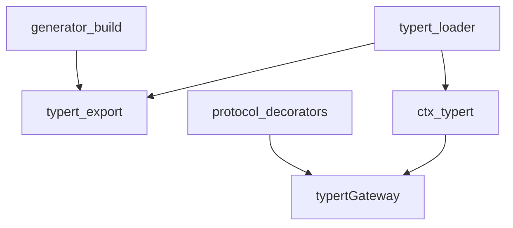
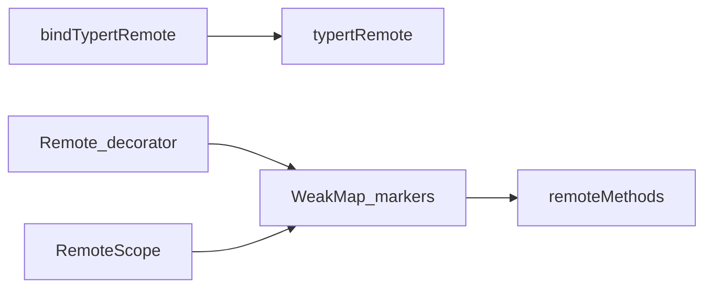
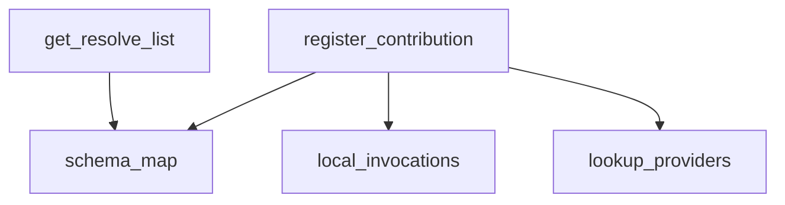
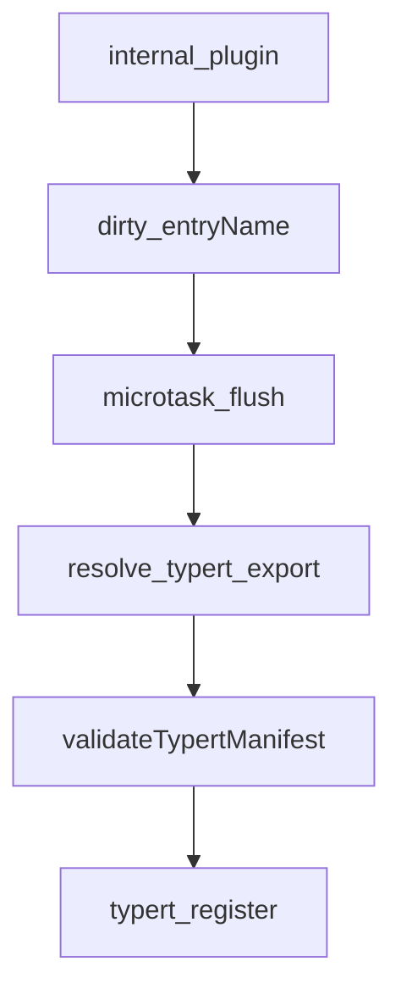
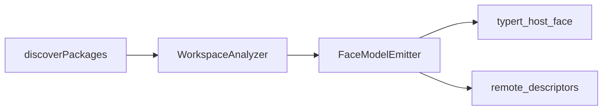

# typert/ — 反射、生成与 Remote 标记

学习笔记，非正式产品文档。类型合同见 [typert.md](../../subsystems/typert.md)。组映射见 [packages/typert/README.md](../../../packages/typert/README.md)。分析、运行时存储、Loader 发现分开。

## `@deepseek-ai/dsh-typert-protocol` — Remote 装饰器与绑定

- 角色：library
- ctx：无；`TypertRemoteService` 占调用方给的 service key
- 入口：[packages/typert/protocol/src/index.ts](../../../packages/typert/protocol/src/index.ts)、[types.ts](../../../packages/typert/protocol/src/types.ts)
- 关键类型：`TypertGatewayBinding`、`InvocationDescriptor`、`TypertLookupFailure`、`TypertClientRemote`

实现逻辑：

1. `bindTypertRemote(service, serviceKey, { namespace? })` 冻结合法 RPC 段名。
2. `TypertRemoteService` 构造时写入 `this.typertRemote`，Gateway SRC 发现读这个字段。
3. `@Remote` / `@Remote('exportName')` / `@RemoteScope(key)` 只往原型 WeakMap 记标记；严格反射仍是编译器的事。
4. `remoteMethods(instance)` 按类声明序回只读快照。
5. 装饰器要求公开实例方法、字符串名；冲突标记抛。
6. `TypertLookupFailure` 带着适配器 typed payload，Gateway 不拆。
7. `isTypertRemoteSegment` 卡 namespace/method/lookup/Context 段，使它们能原样过 Connection endpoint。

源码走读：无编译器注入元数据。Host/Client 生成物与手写 SRC 共用这套标记。

## `@deepseek-ai/dsh-typert-registry` — 运行时反射店

- 角色：Service
- ctx：`ctx.typert`（Host 与 Client 同一实现）
- 入口：[packages/typert/registry/src/index.ts](../../../packages/typert/registry/src/index.ts)、[service.ts](../../../packages/typert/registry/src/service.ts)
- 关键类型：`TypertContribution`、`TypertSchemaRecord`、`TypertPackageRecord`

实现逻辑：

1. `TypertRegistry` 不做 TypeScript 分析，只存生成物与手工贡献。
2. `typertKey` = `<package>#<name>`；`typertPackageKey` = `<package>#<face>`；`typertEndpoint` = `<namespace>/<method>`。
3. `register` 回 disposer；卸贡献时 schema/invocation 走，lookup 的 wire 声明可留，避免 SRC 把 Host 对象当普通 JSON。
4. `get` / `resolve` / `list` / `getPackage` / `toJSONSchema` 是查询面。
5. lookup 与 Context provider 反向依赖：业务包声明 key，运行时 provider 后挂。
6. Client `apply` 只是 `new TypertRegistry(ctx)`，与 Host 同店。

源码走读：Gateway 的严格路径读 `typert.local.get(endpoint)`；`hasSeen` 禁止撤回后的 SRC。

## `@deepseek-ai/dsh-typert-loader` — 从 Loader 行自动登记

- 角色：Consumer
- ctx：无自有键；`inject: ['typert', 'loader']`
- 入口：[packages/typert/loader/src/index.ts](../../../packages/typert/loader/src/index.ts)
- 配置：`packages[]`（嵌在别的 Loader 行后、fiber 上无包名的显式包）

实现逻辑：

1. 解析锚是 `ctx.baseUrl`（cordis.yml 目录）；本包 URL 在 pnpm 隔离 node_modules 下看不到兄弟包。
2. 扫描按条目名增量：`internal/plugin` 标脏，microtask flush；激活时把当前条目与 `config.packages` 塞进同一脏集。
3. 包 verdict（含「不是 typert 包」）按名缓存且不过期；插件集变更要重启。
4. 有 `exports["./typert"]` 则 import `TYPERT`，`validateTypertManifest` 逐字段检查（face=`host`、zod v4、invocation 严格 codec）。
5. 激活期失败聚成 `AggregateError` 打回 fiber；稳态单包失败只打日志。
6. 卸条目撤回登记；飞行中的 import 若条目已走则丢弃。

源码走读：与 client-modules 的增量扫描同构。手写 `ctx.typert.register()` 仍给测试和非 Loader 组合用。

## `@deepseek-ai/dsh-typert-generator` — 构建期分析与发射

- 角色：build-time library
- ctx：无
- 入口：[packages/typert/generator/src/index.ts](../../../packages/typert/generator/src/index.ts)、[workspace.ts](../../../packages/typert/generator/src/workspace.ts)、[analyzer.ts](../../../packages/typert/generator/src/analyzer.ts)、[emitter.ts](../../../packages/typert/generator/src/emitter.ts)
- 关键类型：`WorkspaceTypertGenerator`、`WorkspaceAnalyzer`、`FaceModelEmitter`、`DiscoveredTypertPackage`

实现逻辑：

1. `WorkspaceTypertGenerator` 绑一个含 face 聚合 tsconfig 的仓库根。
2. `discover` 找贡献 Cordis service/event 或显式 Typert 根的公共包 face。
3. `generate` 可收窄包名与 face；每包每 face 一份产物。
4. 严格 codec 带生成 schema；SRC 只保证 JSON-safe，不恢复结构类型。
5. `TypeGraphRenderer` / `cordis-catalog` 给文档生成器用。
6. tsdown 接线在 `./tsdown` 子路径，不在本入口。

源码走读：运行时 registry 从不分析源码。改 Remote 签名要重新生成 `./typert` 与 `./remote`，再经 loader 登记。
