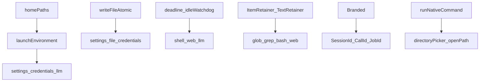
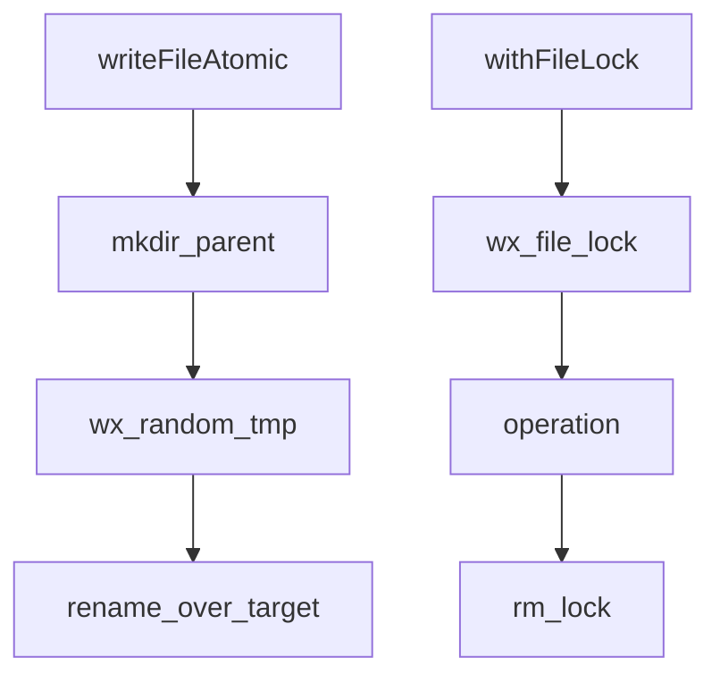
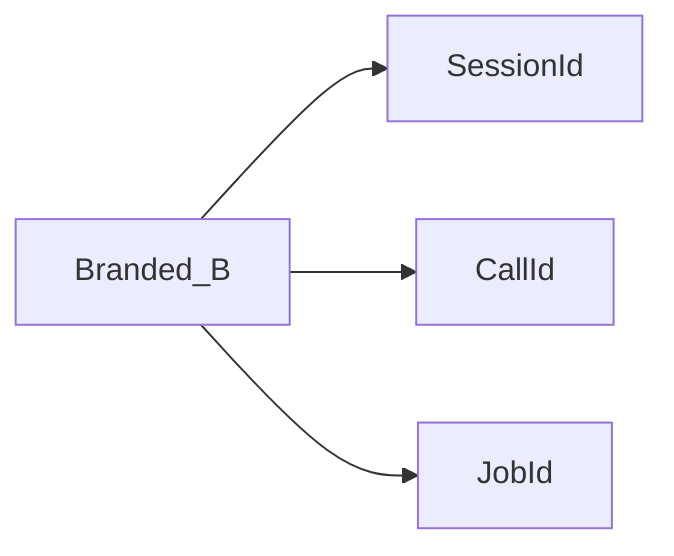
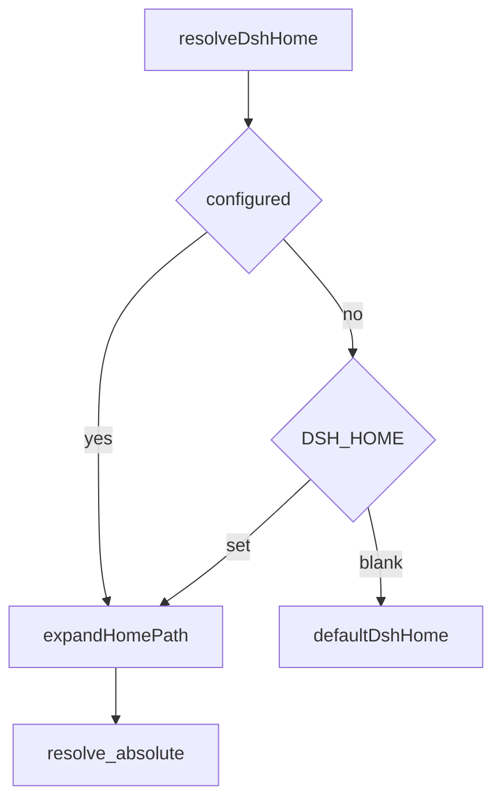
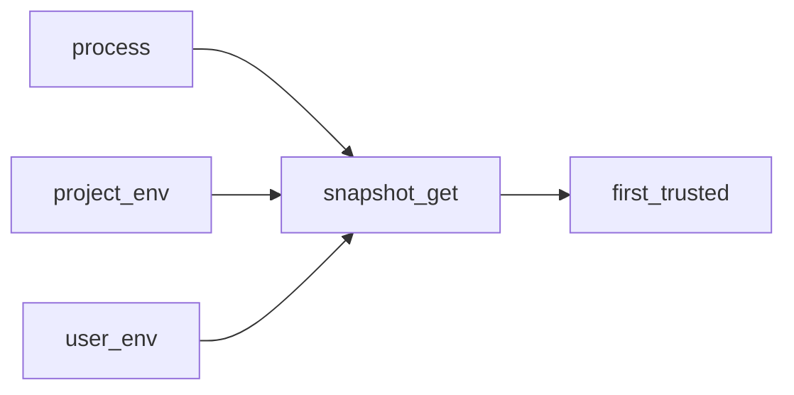
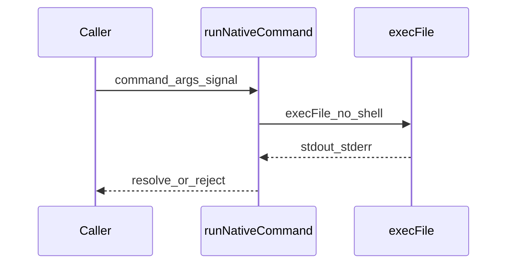
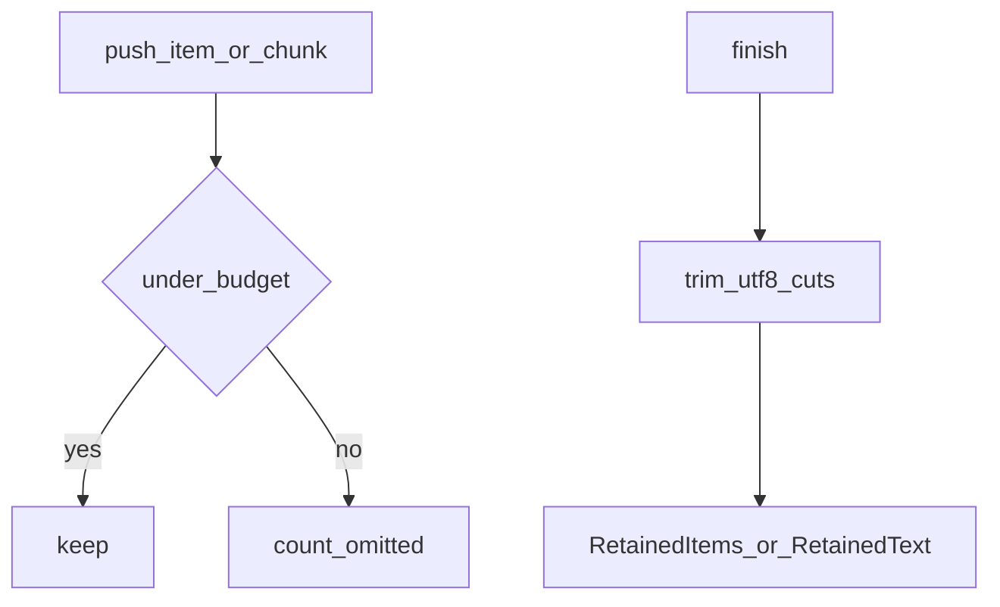
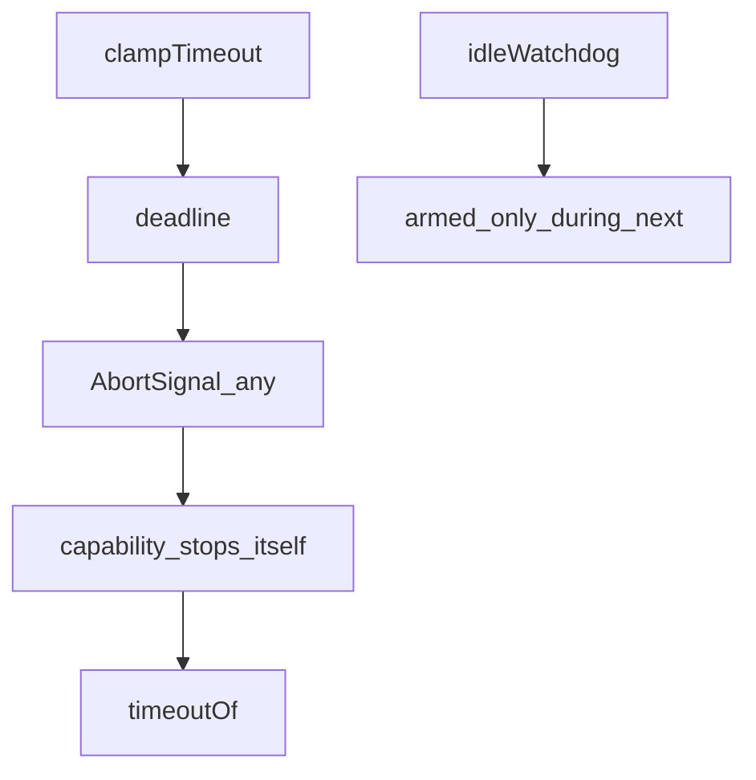

# util/ — 零依赖共享原语

学习笔记，非正式产品文档。本组无独立 subsystem 页；超时与保留的产品用法见各消费能力 README。组映射见 [packages/util/README.md](../../../packages/util/README.md)。

这些包只回答机械问题：原子替换、名义类型、home 路径、启动环境分层、无 shell 的本机命令、输出预算、截止时刻。业务语义仍在消费方。

## `@deepseek-ai/dsh-atomic-write` — 原子整文件替换

- 角色：library
- ctx：无键
- 入口：[packages/util/atomic-write/src/index.ts](../../../packages/util/atomic-write/src/index.ts)
- 关键类型：`WriteFileAtomicOptions`、`writeFileAtomic`、`withFileLock`

实现逻辑：

1. `writeFileAtomic` 先 `mkdir` 父目录；`dirMode` 只作用于新目录，已有目录不改权限。
2. 同目录随机后缀 `.tmp` 用 `wx` 独占创建，拒绝跟随猜得到的 symlink，新 inode 带着调用方必填的 `mode`。
3. `rename` 盖掉目标本身，不写穿 symlink 所指；同文件系统上 rename 对读者是原子的。
4. 失败 `rm` 临时文件再抛出；崩溃耐久（fsync）不在范围内。
5. `withFileLock` 用 `<file>.lock` 的 `wx` 串行化跨进程写者；读者无锁，因为提交已经是 rename。
6. 争用指数退避（20ms → 200ms），2s 超时；争用者从不删别人的锁，孤儿锁要运维手清。

源码走读：settings 文件与 credentials 本地库走这条路径。`mode` 必填是为了让权限决定留在每个调用点。companion 空安装：纯文件系统原语没有事件流。

## `@deepseek-ai/dsh-brand` — 编译期名义类型

- 角色：library（仅类型）
- ctx：无键
- 入口：[packages/util/brand/src/index.ts](../../../packages/util/brand/src/index.ts)
- 关键类型：`Branded<B>`

实现逻辑：

1. `Branded<B>` 是 `string & { readonly [BRAND]: B }`，`BRAND` 是 `unique symbol`，运行时擦掉。
2. 本包不导出任何具体 id，也不含运行时代码；拥有方在自己的包里写工厂（一次 cast）。
3. 比较、日志、JSON、线格式都当普通字符串。
4. 只给跨包、可能混淆的 id 打品牌，不是每个 `string` 都要。

源码走读：`dsh-session` 的 `SessionId`、`dsh-llm` 的 `CallId`、`dsh-jobs` 的 `JobId` 都从这里派生。jobs 不必为了品牌去依赖 session。

## `@deepseek-ai/dsh-home-paths` — 单一 Harness home

- 角色：library
- ctx：无键
- 入口：[packages/util/home-paths/src/index.ts](../../../packages/util/home-paths/src/index.ts)
- 关键类型：`DSH_HOME_ENV`、`resolveDshHome`、`dshHomePath`、`dshHomeDisplay`、`canonicalizeWatchPath`

实现逻辑：

1. 优先级：显式配置 > 非空白 `$DSH_HOME` > `~/.dsh`；空白环境变量当未设置，避免 home 落到 cwd。
2. `expandHomePath` 只认 `~`、`~/`、`~\`；`~user/` 与环境变量字面量原样返回。
3. `dshHomePath(...segments)` 接到解析后的 home；无段则返回 home 本身。
4. `dshHomeDisplay` 只给符号名：默认是 `~/.dsh`，否则 `$DSH_HOME`，从不泄漏机器绝对路径。
5. `canonicalizeWatchPath` 对最深已存在祖先做 `realpath`，再拼回缺失后缀，让尚未创建的路径也能被监视。
6. 缺失后缀时还要 `opendir` 证明祖先是可枚举目录，避免 Windows 把普通文件祖先当成“不存在”。

源码走读：bash 环境、本地 skill 发现、匿名 id 文件都经 `resolveDshHome`。监视路径的规范化是为了不把 8.3 短名和 native watcher 的长路径混在一起。

## `@deepseek-ai/dsh-launch-environment` — 分层启动环境快照

- 角色：library（给 `ctx.launchEnvironment` 填槽）
- ctx：`ctx.launchEnvironment`（可选）；读用 `launchEnvironmentOf(ctx)`
- 入口：[packages/util/launch-environment/src/index.ts](../../../packages/util/launch-environment/src/index.ts)
- 关键类型：`LaunchEnvironmentSource`、`LaunchEnvironmentEntry`、`LaunchEnvironmentSnapshot`、`DSH_LAUNCH_ENVIRONMENT_KEY`

实现逻辑：

1. 三层信任从高到低：`process`（继承环境）、`project-env`（调用 cwd 的 `.env`）、`user-env`（`$DSH_HOME/.env`）。
2. `createLaunchEnvironmentSnapshot` 按层拷贝；之后 `chdir`、换工作区、恢复会话都看见同一快照。
3. `get(name)` 按规范顺序搜全部层；`getFrom(name, sources)` 只搜点名的层，省略等于拒绝，不是降级。
4. Windows 按大写折叠名字，POSIX 精确匹配，避免大小写变体拆开优先级。
5. `launchEnvironmentOf` 有启动器快照就用它，否则把 `process.env` 当成唯一层。
6. 扁平的 `process.env` 仍会物化给第三方库，但 harness 自己解析用户可见值时走快照。

源码走读：产品 CLI 在任何 config 插件挂上之前写入快照。没有 per-workspace 层：Web UI 后来选的工作区不能改本轮环境。

## `@deepseek-ai/dsh-native-command` — 无 shell 的本机命令

- 角色：library
- ctx：无键
- 入口：[packages/util/native-command/src/index.ts](../../../packages/util/native-command/src/index.ts)
- 关键类型：`NativeCommandRunner`、`runNativeCommand`

实现逻辑：

1. `execFile(command, [...args], { encoding: 'utf8', signal, windowsHide: true })`，从不拼 shell 字符串。
2. 退出码 0 返回捕获的 stdout/stderr。
3. 失败 reject 一个带 `code`、`stdout`、`stderr` 和 `cause` 的 `Error`，调用方一次分类。
4. `signal` abort 会终止子进程。
5. `NativeCommandRunner` 是可注入边界，测试替换实现，产品路径不碰 shell。

源码走读：消费者是 host 侧目录选择器和 `host.openPath`。两边流无界缓冲，只适合输出是路径或一行错误的小工具。

## `@deepseek-ai/dsh-output-retention` — 模型可见输出预算

- 角色：library
- ctx：无键
- 入口：[packages/util/output-retention/src/index.ts](../../../packages/util/output-retention/src/index.ts)
- 关键类型：`ItemRetainer`、`TextRetainer`、`Omitted`、`PushDecision`、`RetentionNotice`

实现逻辑：

1. 库只回答“留下了什么、因预算省了什么”；分组、行号、exit、权限失败、spill 文案仍在工具侧。
2. `truncated` 只表示预算省略了本来有的内容，不是上游不完整。
3. `ItemRetainer` 只做 `head`：继续 `push` 全部观察到的单元，这样 `Omitted` 计数精确。
4. `TextRetainer` 按字节做 `head` / `tail` / `headTail`；内存最多是前缀 + 后缀 + 一块。
5. `finish` 在真正有省略间隙时分别修 UTF-8 边界再解码，避免跨缺口拼出替换字符。
6. 省略字节数按实际返回文本算，含边界修剪掉的半个码点。
7. `describeOmitted` / `formatRetentionNotice` 标准化“省了多少”的措辞；恢复建议由工具的 `recovery` 回调写。

源码走读：`glob`/`grep`/`web_search` 用 item head；`bash` 用 tail 或 headTail；`web_fetch` 用 head 或 headTail。`read` 的行窗口不走这个库。

## `@deepseek-ai/dsh-timeout` — 截止与分类

- 角色：library
- ctx：无键
- 入口：[packages/util/timeout/src/index.ts](../../../packages/util/timeout/src/index.ts)
- 关键类型：`TimeoutReason`、`Deadline`、`IdleWatchdog`、`clampTimeout`、`deadline`、`idleWatchdog`、`timeoutOf`

实现逻辑：

1. 库只通知：信号 abort，真正停活仍在各能力（杀进程组、拆 socket）。
2. `clampTimeout(requested, def, max)` 校验正有限 hint，缺省用 `def`，再封顶 `max`；`0` 不是对外的“关超时”。
3. `deadline(upstream, timeoutMs, code)`：`timeoutMs <= 0` 不装定时器，只转发 upstream；否则 `AbortSignal.any` 融合，超时原因是带 `code` 的 `TimeoutReason`。
4. `using` / `[Symbol.dispose]` 清定时器。
5. `idleWatchdog` 的稳定信号贯穿整次调用，定时器只在未完成的 `next(iterator)` 期间武装；`pulse()` 在有传输活动但没有 iterator 值时重装。
6. `timeoutOf(x, code?)` 从 signal 或 `{ reason }` 取出本截止的 `TimeoutReason`；外层 code 当普通取消。
7. 定时器不得超过 `MAX_TIMER_DELAY_MS`（Node 再大就夹成 1ms）。

源码走读：bash、web、DeepSeek/pi-ai 的 idle watchdog 都用这里。本地 `read`/`write`/`edit` 不设 `timeoutMs`：OS 仍会做完的工作不该被截止杀掉。
