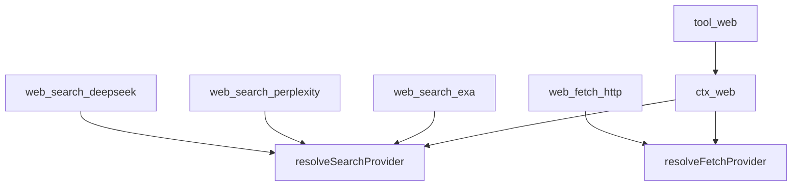
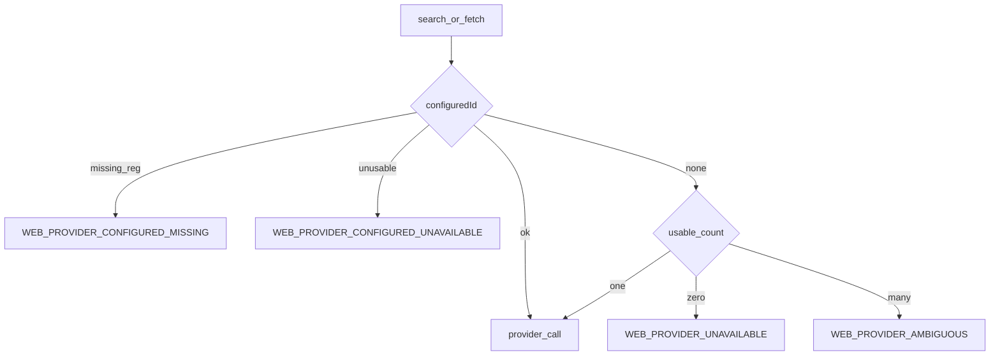
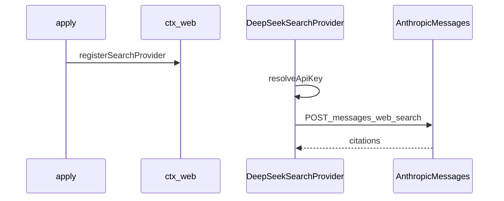
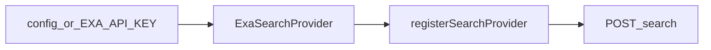
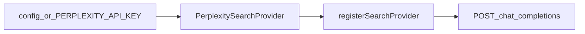
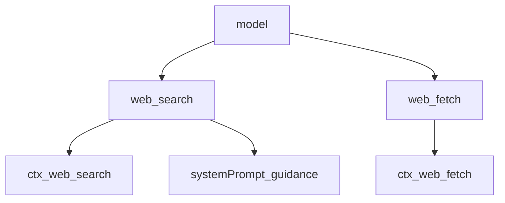

# web/ — 搜索与抓取

学习笔记，非正式产品文档。请求/结果与 `WebError` 见 [web.md](../../subsystems/web.md)。组映射见 [packages/web/README.md](../../../packages/web/README.md)。

search 与 fetch 共用一个 seam，这样选择、取消、错误和产品配置只有一个主人。

## `@deepseek-ai/dsh-web` — 选择与执行

- 角色：Service Definition
- ctx：`ctx.web`
- 入口：[packages/web/web/src/index.ts](../../../packages/web/web/src/index.ts)、[types.ts](../../../packages/web/web/src/types.ts)
- 关键类型：`WebSearchRequest` / `WebSearchResult`、`WebFetchRequest` / `WebFetchResult`、`WebError`
- Config：`searchProvider` / `fetchProvider`，也读 `$DSH_WEB_SEARCH_PROVIDER` / `$DSH_WEB_FETCH_PROVIDER`（同一字段，不是隐藏优先级链）

实现逻辑：

1. `WebRuntime` 占住 `ctx.web`，两张 Map 分存 search / fetch provider。
2. `registerSearchProvider` / `registerFetchProvider` 拒重复 id（`WEB_DUPLICATE_PROVIDER`），disposer 随 fiber 撤回。
3. 执行时 `resolveProvider`：配了 id 必须已登记且 `available()`；没配则恰好一个可用才自动选。
4. `search` 把 provider 结果再按 `request.maxResults` 截断，并置 `truncated`。
5. `fetch` 原样返回；非 2xx 是结果不是抛错。
6. `available()` 必须是本地廉价检查，不能打网。

源码走读：选择不依赖登记顺序。`WebError` 只表示“无法安全检索或表示资源”；HTTP 状态属于抓到的资源状态。

## `@deepseek-ai/dsh-web-fetch-http` — 匿名 HTTP(S)

- 角色：Service Provider
- ctx：无自有键；`inject: ['web']`
- 入口：[packages/web/web-fetch-http/src/index.ts](../../../packages/web/web-fetch-http/src/index.ts)、[provider.ts](../../../packages/web/web-fetch-http/src/provider.ts)
- id：`http`（`LOCAL_FETCH_PROVIDER_ID`）

实现逻辑：

1. `apply` 校验正有限的 URL/字节/字符上限、Node 定时器范围内的 `timeoutMs`、非负整数 `maxRedirects`。
2. 默认 UA 是产品串 `deepseek-harness/0.0.1`，不是浏览器伪装。
3. 登记 `HttpFetchProvider`；`available()` 恒真（无密钥）。
4. 抓取遵守长度、响应字节、解码字符、超时和同 origin 重定向 hop 上限。

源码走读：这是公开资源抓取，不带凭证。重定向策略在 provider 内执行；带凭证的 search provider 另有“拒绝跟随重定向”的组规则。

## `@deepseek-ai/dsh-web-search-deepseek` — DeepSeek 原生搜索

- 角色：Service Provider
- ctx：无自有键；`inject: ['web']`
- 入口：[packages/web/web-search-deepseek/src/index.ts](../../../packages/web/web-search-deepseek/src/index.ts)、[provider.ts](../../../packages/web/web-search-deepseek/src/provider.ts)
- id：`deepseek-official`

实现逻辑：

1. `installSettingsSection('web-search-deepseek')` 热更新 endpoint / model / key ref；每次 search 现投影 options，不重登记。
2. 密钥走 `credentials.resolve` 或 launch env 的 `DEEPSEEK_API_KEY`；字面 `apiKey` 可选。
3. base 是 `$DEEPSEEK_SEARCH_BASE_URL` 或默认 Anthropic 兼容根，**不**复用 `$DEEPSEEK_BASE_URL`（chat completions 是另一条 API）。
4. 请求带 `web_search_20250305` server tool；`maxUses` / `maxTokens` / `model` 有默认。
5. 若存在 initiator，把 LLM 请求追加为 `web/deepseek-search-llm-request`。

源码走读：`available()` 看能否解析出非空 key。这是 Messages API 上的服务端搜索，不是 chat-completions 适配器。

## `@deepseek-ai/dsh-web-search-exa` — Exa

- 角色：Service Provider
- ctx：无自有键；`inject: ['web']`
- 入口：[packages/web/web-search-exa/src/index.ts](../../../packages/web/web-search-exa/src/index.ts)、[provider.ts](../../../packages/web/web-search-exa/src/provider.ts)
- id：`exa`

实现逻辑：

1. `apiKey` 缺省读 launch env `EXA_API_KEY`；空字符串则 `available()` 为假。
2. `searchType` 默认 `auto`，也可 `keyword` / `neural`。
3. `numResults` 是请求层优化；seam 仍会按 `maxResults` 截断。
4. `highlightsPerResult` 默认 1。

源码走读：无 settings 热更新，配置在 load 时冻结进 provider。空 key 保持登记但不可用，避免选择 Ambiguous/Missing 语义混乱。

## `@deepseek-ai/dsh-web-search-perplexity` — Perplexity

- 角色：Service Provider
- ctx：无自有键；`inject: ['web']`
- 入口：[packages/web/web-search-perplexity/src/index.ts](../../../packages/web/web-search-perplexity/src/index.ts)、[provider.ts](../../../packages/web/web-search-perplexity/src/provider.ts)
- id：`perplexity`

实现逻辑：

1. 密钥缺省 `$PERPLEXITY_API_KEY`；空则不可用。
2. 打 `/chat/completions`，默认模型 `sonar`，`maxTokens` 默认 1024。
3. 可选 `searchRecency`：`day` / `week` / `month` / `year`。
4. 结果常带生成 `content` 答案；citation 可能只有 URL。

源码走读：与 Exa 一样是 load-time 冻结的函数插件。`content` 是可选摘要，`sources[]` 才是可引用形状。

## `@deepseek-ai/dsh-tool-web` — 模型工具

- 角色：Consumer
- ctx：无自有键；`inject: ['tools', 'web', 'systemPrompt']`
- 入口：[packages/web/tool-web/src/index.ts](../../../packages/web/tool-web/src/index.ts)、[search.ts](../../../packages/web/tool-web/src/search.ts)、[fetch.ts](../../../packages/web/tool-web/src/fetch.ts)
- 工具：`web_search`、`web_fetch`；默认 `timeoutMs` 30000

实现逻辑：

1. Config 的 `search` / `fetch` 默认都开；产品可关其中一个。
2. `searchMaxResults` 默认 8，正整数；工具把该上限传进 `WebSearchRequest.maxResults`。
3. `timeoutMs` 写在 `ToolDefinition` 上，由 timeout-policy 武装。
4. `web_fetch` 另有 `fetchMaxOutputChars`（默认 200000）限制同步转换和完整输出。
5. enablement 只控制是否注册；provider 不可用时工具仍可见，执行时抛结构化 `WebError`。
6. 本包拥有 schema、校验、prompt、展示，不选具体 provider。

源码走读：`parseSearchArgs` 拒空白 query。`formatSearchOutput` 渲染答案 + markdown 源列表 + 截断提示。展示函数是 `args` 的纯函数。
